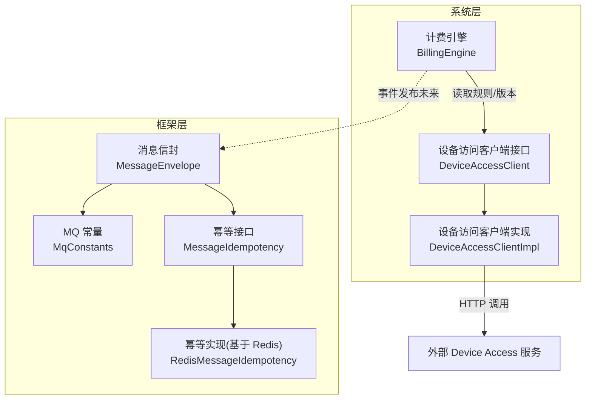
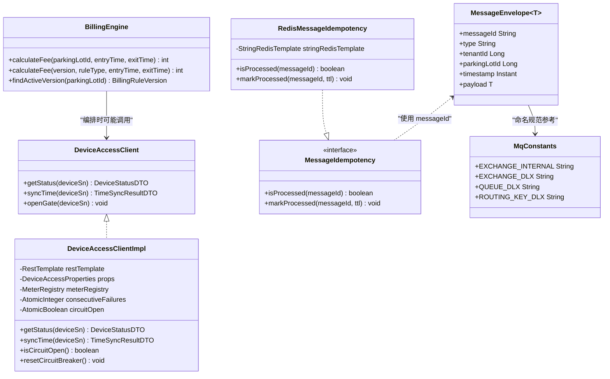
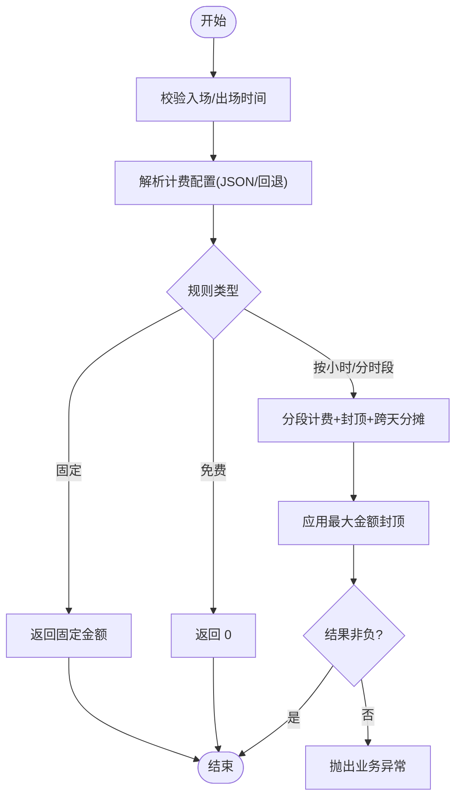
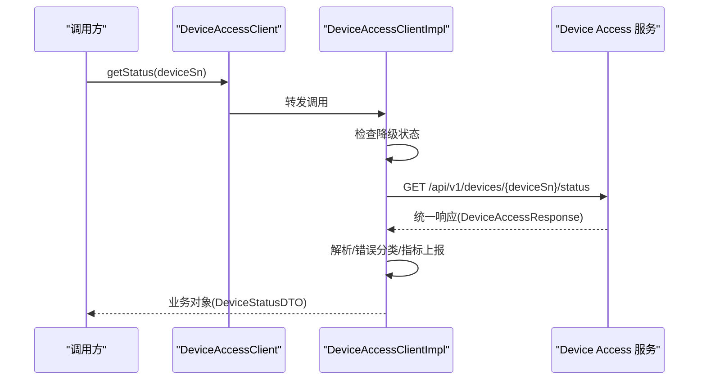
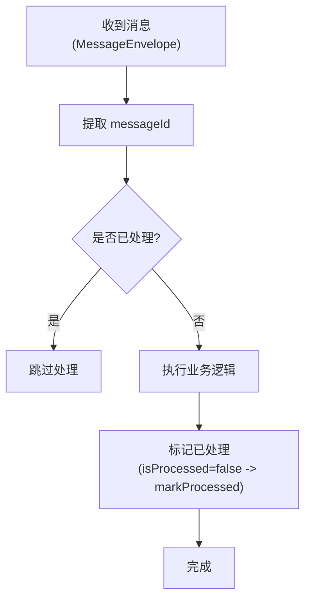
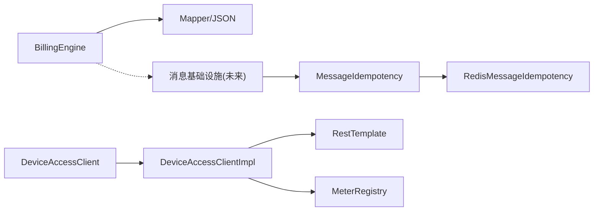

# 扩展点设计

<cite>
**本文引用的文件**   
- [BillingEngine.java](file://parking-system/src/main/java/com/jushan/system/service/BillingEngine.java)
- [DeviceAccessClient.java](file://parking-system/src/main/java/com/jushan/system/client/DeviceAccessClient.java)
- [DeviceAccessClientImpl.java](file://parking-system/src/main/java/com/jushan/system/client/DeviceAccessClientImpl.java)
- [MessageEnvelope.java](file://parking-framework/src/main/java/com/jushan/framework/mq/MessageEnvelope.java)
- [MqConstants.java](file://parking-framework/src/main/java/com/jushan/framework/mq/MqConstants.java)
- [MessageIdempotency.java](file://parking-framework/src/main/java/com/jushan/framework/mq/MessageIdempotency.java)
- [RedisMessageIdempotency.java](file://parking-framework/src/main/java/com/jushan/framework/mq/RedisMessageIdempotency.java)
- [package-info.java](file://parking-framework/src/main/java/com/jushan/framework/mq/package-info.java)
- [DeviceAccessResponse.java](file://parking-system/src/main/java/com/jushan/system/client/dto/DeviceAccessResponse.java)
- [BillingEngineTest.java](file://parking-boot/src/test/java/com/jushan/boot/service/BillingEngineTest.java)
- [DeviceAccessClientRobustnessTest.java](file://parking-boot/src/test/java/com/jushan/boot/client/DeviceAccessClientRobustnessTest.java)
</cite>

## 目录
1. [引言](#引言)
2. [项目结构](#项目结构)
3. [核心组件](#核心组件)
4. [架构总览](#架构总览)
5. [详细组件分析](#详细组件分析)
6. [依赖关系分析](#依赖关系分析)
7. [性能与可观测性](#性能与可观测性)
8. [故障排查指南](#故障排查指南)
9. [结论](#结论)
10. [附录：扩展点使用示例与最佳实践](#附录扩展点使用示例与最佳实践)

## 引言
本文件聚焦“扩展点设计”，围绕以下目标展开：
- 计费引擎的策略模式实现与可扩展性
- 消息队列的事件驱动扩展点（幂等、信封、常量）
- 设备访问客户端的抽象接口设计与默认实现
- 通过接口抽象与默认实现支持功能扩展
- SPI（Service Provider Interface）模式的应用场景与落地方式
- 在不修改现有代码的前提下添加新功能的方法论与实践

## 项目结构
本项目采用分层与模块化组织，关键扩展点分布在如下包中：
- parking-system：业务服务与对外能力封装（计费引擎、设备访问客户端）
- parking-framework：平台级基础设施（RabbitMQ 消息信封、幂等接口与实现、常量）
- parking-boot：启动与测试用例（验证扩展点行为）

图表来源
- [BillingEngine.java:1-128](file://parking-system/src/main/java/com/jushan/system/service/BillingEngine.java#L1-L128)
- [DeviceAccessClient.java:1-65](file://parking-system/src/main/java/com/jushan/system/client/DeviceAccessClient.java#L1-L65)
- [DeviceAccessClientImpl.java:1-120](file://parking-system/src/main/java/com/jushan/system/client/DeviceAccessClientImpl.java#L1-L120)
- [MessageEnvelope.java:1-48](file://parking-framework/src/main/java/com/jushan/framework/mq/MessageEnvelope.java#L1-L48)
- [MqConstants.java:1-44](file://parking-framework/src/main/java/com/jushan/framework/mq/MqConstants.java#L1-L44)
- [MessageIdempotency.java:1-39](file://parking-framework/src/main/java/com/jushan/framework/mq/MessageIdempotency.java#L1-L39)
- [RedisMessageIdempotency.java:1-91](file://parking-framework/src/main/java/com/jushan/framework/mq/RedisMessageIdempotency.java#L1-L91)

章节来源
- [BillingEngine.java:1-128](file://parking-system/src/main/java/com/jushan/system/service/BillingEngine.java#L1-L128)
- [DeviceAccessClient.java:1-65](file://parking-system/src/main/java/com/jushan/system/client/DeviceAccessClient.java#L1-L65)
- [DeviceAccessClientImpl.java:1-120](file://parking-system/src/main/java/com/jushan/system/client/DeviceAccessClientImpl.java#L1-L120)
- [MessageEnvelope.java:1-48](file://parking-framework/src/main/java/com/jushan/framework/mq/MessageEnvelope.java#L1-L48)
- [MqConstants.java:1-44](file://parking-framework/src/main/java/com/jushan/framework/mq/MqConstants.java#L1-L44)
- [MessageIdempotency.java:1-39](file://parking-framework/src/main/java/com/jushan/framework/mq/MessageIdempotency.java#L1-L39)
- [RedisMessageIdempotency.java:1-91](file://parking-framework/src/main/java/com/jushan/framework/mq/RedisMessageIdempotency.java#L1-L91)

## 核心组件
- 计费引擎（策略模式）
  - 通过规则类型分派到不同计费策略（免费、固定金额、按小时/分时段），并支持封顶与跨天分摊。
  - 提供“基于指定版本计算”的入口，便于重算与测试。
- 设备访问客户端（抽象接口 + 默认实现）
  - 以接口隔离外部依赖，默认实现封装 HTTP 调用、错误分类、降级与指标上报。
  - 预留开闸方法占位，待契约冻结后启用。
- 消息队列扩展点（事件驱动）
  - 统一消息信封承载公共元数据；幂等接口定义消费端幂等规范；Redis 实现提供开箱即用能力。
  - 常量集中管理 Exchange/Queue/RoutingKey，避免硬编码。

章节来源
- [BillingEngine.java:1-128](file://parking-system/src/main/java/com/jushan/system/service/BillingEngine.java#L1-L128)
- [DeviceAccessClient.java:1-65](file://parking-system/src/main/java/com/jushan/system/client/DeviceAccessClient.java#L1-L65)
- [DeviceAccessClientImpl.java:1-120](file://parking-system/src/main/java/com/jushan/system/client/DeviceAccessClientImpl.java#L1-L120)
- [MessageEnvelope.java:1-48](file://parking-framework/src/main/java/com/jushan/framework/mq/MessageEnvelope.java#L1-L48)
- [MessageIdempotency.java:1-39](file://parking-framework/src/main/java/com/jushan/framework/mq/MessageIdempotency.java#L1-L39)
- [RedisMessageIdempotency.java:1-91](file://parking-framework/src/main/java/com/jushan/framework/mq/RedisMessageIdempotency.java#L1-L91)
- [MqConstants.java:1-44](file://parking-framework/src/main/java/com/jushan/framework/mq/MqConstants.java#L1-L44)

## 架构总览
下图展示扩展点在系统中的位置与交互：计费引擎通过规则选择策略；设备访问客户端作为外部依赖的抽象；消息基础设施为事件驱动扩展提供基础能力。

图表来源
- [BillingEngine.java:1-128](file://parking-system/src/main/java/com/jushan/system/service/BillingEngine.java#L1-L128)
- [DeviceAccessClient.java:1-65](file://parking-system/src/main/java/com/jushan/system/client/DeviceAccessClient.java#L1-L65)
- [DeviceAccessClientImpl.java:1-120](file://parking-system/src/main/java/com/jushan/system/client/DeviceAccessClientImpl.java#L1-L120)
- [MessageEnvelope.java:1-48](file://parking-framework/src/main/java/com/jushan/framework/mq/MessageEnvelope.java#L1-L48)
- [MessageIdempotency.java:1-39](file://parking-framework/src/main/java/com/jushan/framework/mq/MessageIdempotency.java#L1-L39)
- [RedisMessageIdempotency.java:1-91](file://parking-framework/src/main/java/com/jushan/framework/mq/RedisMessageIdempotency.java#L1-L91)
- [MqConstants.java:1-44](file://parking-framework/src/main/java/com/jushan/framework/mq/MqConstants.java#L1-L44)

## 详细组件分析

### 计费引擎（策略模式）
- 策略分派
  - 根据规则类型（免费、固定、按小时/分时段）进入不同分支计算，天然具备策略模式的扩展点。
- 配置解析与兼容
  - 优先从 JSON 配置解析，若为空则回退到列字段构造，保证向后兼容。
- 安全约束
  - 金额使用整数分；无生效规则或配置异常直接失败关闭；结果非负校验。
- 扩展建议
  - 新增计费模式时，在分派处增加新分支，并通过配置注入新策略参数，无需改动调用方。

图表来源
- [BillingEngine.java:103-128](file://parking-system/src/main/java/com/jushan/system/service/BillingEngine.java#L103-L128)
- [BillingEngine.java:160-180](file://parking-system/src/main/java/com/jushan/system/service/BillingEngine.java#L160-L180)
- [BillingEngine.java:193-250](file://parking-system/src/main/java/com/jushan/system/service/BillingEngine.java#L193-L250)
- [BillingEngine.java:322-335](file://parking-system/src/main/java/com/jushan/system/service/BillingEngine.java#L322-L335)

章节来源
- [BillingEngine.java:1-128](file://parking-system/src/main/java/com/jushan/system/service/BillingEngine.java#L1-L128)
- [BillingEngine.java:160-180](file://parking-system/src/main/java/com/jushan/system/service/BillingEngine.java#L160-L180)
- [BillingEngine.java:193-250](file://parking-system/src/main/java/com/jushan/system/service/BillingEngine.java#L193-L250)
- [BillingEngine.java:322-335](file://parking-system/src/main/java/com/jushan/system/service/BillingEngine.java#L322-L335)
- [BillingEngineTest.java:1-44](file://parking-boot/src/test/java/com/jushan/boot/service/BillingEngineTest.java#L1-L44)

### 设备访问客户端（抽象接口 + 默认实现）
- 接口抽象
  - 暴露状态查询、校时、开闸（占位）等方法，屏蔽外部 URL 拼接细节。
- 默认实现
  - 使用 RestTemplate 发起 HTTP 调用，统一响应结构转换，错误分类清晰。
  - 内置降级（连续失败阈值与恢复窗口）、Micrometer 指标上报。
- 健壮性与可观测性
  - 网络异常标记 UNCERTAIN；响应解析失败、DA 错误码均被捕获并记录。
  - 提供开关重置与状态查询，便于运维干预。

图表来源
- [DeviceAccessClient.java:1-65](file://parking-system/src/main/java/com/jushan/system/client/DeviceAccessClient.java#L1-L65)
- [DeviceAccessClientImpl.java:109-158](file://parking-system/src/main/java/com/jushan/system/client/DeviceAccessClientImpl.java#L109-L158)
- [DeviceAccessResponse.java:1-44](file://parking-system/src/main/java/com/jushan/system/client/dto/DeviceAccessResponse.java#L1-L44)

章节来源
- [DeviceAccessClient.java:1-65](file://parking-system/src/main/java/com/jushan/system/client/DeviceAccessClient.java#L1-L65)
- [DeviceAccessClientImpl.java:1-120](file://parking-system/src/main/java/com/jushan/system/client/DeviceAccessClientImpl.java#L1-L120)
- [DeviceAccessClientImpl.java:248-316](file://parking-system/src/main/java/com/jushan/system/client/DeviceAccessClientImpl.java#L248-L316)
- [DeviceAccessResponse.java:1-44](file://parking-system/src/main/java/com/jushan/system/client/dto/DeviceAccessResponse.java#L1-L44)
- [DeviceAccessClientRobustnessTest.java:29-69](file://parking-boot/src/test/java/com/jushan/boot/client/DeviceAccessClientRobustnessTest.java#L29-L69)

### 消息队列扩展点（事件驱动）
- 统一消息信封
  - 所有内部异步消息必须包装为信封，包含 messageId、type、租户/车场上下文、时间戳与载荷。
- 幂等接口与实现
  - 定义 isProcessed/markProcessed 两个方法；Redis 实现基于 SETNX 原子操作，TTL 控制清理。
  - Redis 不可用时降级为“尽量处理”，由业务层 eventId 最终兜底。
- 常量与边界
  - 集中管理 Exchange/Queue/RoutingKey 命名规范，明确仅用于平台内部，禁止与外部设备协议混用。

图表来源
- [MessageEnvelope.java:1-48](file://parking-framework/src/main/java/com/jushan/framework/mq/MessageEnvelope.java#L1-L48)
- [MessageIdempotency.java:1-39](file://parking-framework/src/main/java/com/jushan/framework/mq/MessageIdempotency.java#L1-L39)
- [RedisMessageIdempotency.java:1-91](file://parking-framework/src/main/java/com/jushan/framework/mq/RedisMessageIdempotency.java#L1-L91)
- [MqConstants.java:1-44](file://parking-framework/src/main/java/com/jushan/framework/mq/MqConstants.java#L1-L44)
- [package-info.java:1-17](file://parking-framework/src/main/java/com/jushan/framework/mq/package-info.java#L1-L17)

章节来源
- [MessageEnvelope.java:1-48](file://parking-framework/src/main/java/com/jushan/framework/mq/MessageEnvelope.java#L1-L48)
- [MessageIdempotency.java:1-39](file://parking-framework/src/main/java/com/jushan/framework/mq/MessageIdempotency.java#L1-L39)
- [RedisMessageIdempotency.java:1-91](file://parking-framework/src/main/java/com/jushan/framework/mq/RedisMessageIdempotency.java#L1-L91)
- [MqConstants.java:1-44](file://parking-framework/src/main/java/com/jushan/framework/mq/MqConstants.java#L1-L44)
- [package-info.java:1-17](file://parking-framework/src/main/java/com/jushan/framework/mq/package-info.java#L1-L17)

## 依赖关系分析
- 低耦合高内聚
  - 计费引擎依赖 Mapper 与 ObjectMapper，不感知外部设备；设备访问客户端将外部依赖完全封装。
- 间接依赖
  - 消息幂等实现依赖 Redis；当 Redis 不可用时，幂等能力降级，不影响主流程。
- 潜在循环依赖
  - 当前未见循环引用；计费引擎与设备访问客户端解耦良好。

图表来源
- [BillingEngine.java:1-128](file://parking-system/src/main/java/com/jushan/system/service/BillingEngine.java#L1-L128)
- [DeviceAccessClient.java:1-65](file://parking-system/src/main/java/com/jushan/system/client/DeviceAccessClient.java#L1-L65)
- [DeviceAccessClientImpl.java:1-120](file://parking-system/src/main/java/com/jushan/system/client/DeviceAccessClientImpl.java#L1-L120)
- [MessageIdempotency.java:1-39](file://parking-framework/src/main/java/com/jushan/framework/mq/MessageIdempotency.java#L1-L39)
- [RedisMessageIdempotency.java:1-91](file://parking-framework/src/main/java/com/jushan/framework/mq/RedisMessageIdempotency.java#L1-L91)

章节来源
- [BillingEngine.java:1-128](file://parking-system/src/main/java/com/jushan/system/service/BillingEngine.java#L1-L128)
- [DeviceAccessClient.java:1-65](file://parking-system/src/main/java/com/jushan/system/client/DeviceAccessClient.java#L1-L65)
- [DeviceAccessClientImpl.java:1-120](file://parking-system/src/main/java/com/jushan/system/client/DeviceAccessClientImpl.java#L1-L120)
- [MessageIdempotency.java:1-39](file://parking-framework/src/main/java/com/jushan/framework/mq/MessageIdempotency.java#L1-L39)
- [RedisMessageIdempotency.java:1-91](file://parking-framework/src/main/java/com/jushan/framework/mq/RedisMessageIdempotency.java#L1-L91)

## 性能与可观测性
- 计费引擎
  - 时间复杂度与 O(n) 分段相关，n 为单位时段数；合理设置单位时段可减少循环次数。
  - 跨天分摊采用线性扫描，整体仍为 O(n)。
- 设备访问客户端
  - 降级策略避免雪崩；Micrometer 指标可用于监控延迟分布与错误率。
- 消息幂等
  - Redis SETNX 原子操作，O(1) 判定与写入；TTL 自动清理防止堆积。

[本节为通用指导，不直接分析具体文件]

## 故障排查指南
- 计费引擎
  - 常见错误：未配置生效规则、规则禁用、配置 JSON 解析失败、分时段冲突、结果为负。
  - 定位要点：确认生效版本、规则主记录状态、JSON 配置合法性与时段边界。
- 设备访问客户端
  - 常见问题：DA 返回错误码、网络超时/连接失败、响应解析失败、降级触发。
  - 定位要点：查看错误分类标签、连续失败计数、降级开关状态；必要时手动重置。
- 消息幂等
  - 常见问题：Redis 不可用导致幂等失效、重复消费。
  - 定位要点：确认 messageId 唯一性、业务层 eventId 幂等键是否存在；观察幂等 Key TTL。

章节来源
- [BillingEngine.java:103-128](file://parking-system/src/main/java/com/jushan/system/service/BillingEngine.java#L103-L128)
- [BillingEngine.java:160-180](file://parking-system/src/main/java/com/jushan/system/service/BillingEngine.java#L160-L180)
- [BillingEngine.java:252-269](file://parking-system/src/main/java/com/jushan/system/service/BillingEngine.java#L252-L269)
- [DeviceAccessClientImpl.java:248-316](file://parking-system/src/main/java/com/jushan/system/client/DeviceAccessClientImpl.java#L248-L316)
- [DeviceAccessClientImpl.java:170-201](file://parking-system/src/main/java/com/jushan/system/client/DeviceAccessClientImpl.java#L170-L201)
- [RedisMessageIdempotency.java:54-89](file://parking-framework/src/main/java/com/jushan/framework/mq/RedisMessageIdempotency.java#L54-L89)

## 结论
- 计费引擎通过规则类型分派形成清晰的策略扩展点，新增计费模式只需扩展配置与分支逻辑。
- 设备访问客户端以接口抽象外部依赖，默认实现提供降级与可观测性，便于替换与增强。
- 消息基础设施提供统一信封与幂等接口，结合 Redis 实现满足高可靠事件处理需求。
- 通过接口抽象与默认实现，配合 Spring DI 与条件装配，可在不修改现有代码的情况下平滑扩展。

[本节为总结性内容，不直接分析具体文件]

## 附录：扩展点使用示例与最佳实践

### 扩展点一：新增计费策略（策略模式）
- 步骤
  - 在计费引擎的分派处增加新规则类型的分支。
  - 在配置模型中新增对应字段，并在解析逻辑中兼容旧配置。
  - 编写单元测试覆盖边界条件（如封顶、跨天、负值）。
- 最佳实践
  - 保持金额单位为整数分，避免浮点误差。
  - 对配置进行严格校验，非法配置应快速失败。
  - 通过“基于指定版本计算”的入口进行回归与重算。

章节来源
- [BillingEngine.java:103-128](file://parking-system/src/main/java/com/jushan/system/service/BillingEngine.java#L103-L128)
- [BillingEngine.java:160-180](file://parking-system/src/main/java/com/jushan/system/service/BillingEngine.java#L160-L180)
- [BillingEngineTest.java:1-44](file://parking-boot/src/test/java/com/jushan/boot/service/BillingEngineTest.java#L1-L44)

### 扩展点二：新增设备访问能力（客户端抽象）
- 步骤
  - 在接口中新增方法（如 openGate），并提供默认实现抛出不支持异常。
  - 在实现类中补充 HTTP 调用、错误分类、指标与降级逻辑。
  - 编写集成测试覆盖成功、失败、超时、降级路径。
- 最佳实践
  - 禁止前端直传 deviceSn，始终从可信设备记录获取。
  - 写请求透明重试需显式控制，避免副作用。
  - 使用 Micrometer 指标持续监控成功率与延迟。

章节来源
- [DeviceAccessClient.java:1-65](file://parking-system/src/main/java/com/jushan/system/client/DeviceAccessClient.java#L1-L65)
- [DeviceAccessClientImpl.java:109-158](file://parking-system/src/main/java/com/jushan/system/client/DeviceAccessClientImpl.java#L109-L158)
- [DeviceAccessClientImpl.java:248-316](file://parking-system/src/main/java/com/jushan/system/client/DeviceAccessClientImpl.java#L248-L316)
- [DeviceAccessClientRobustnessTest.java:29-69](file://parking-boot/src/test/java/com/jushan/boot/client/DeviceAccessClientRobustnessTest.java#L29-L69)

### 扩展点三：新增事件消费者（事件驱动）
- 步骤
  - 定义新的路由键与队列（遵循常量命名规范）。
  - 在消费者中先调用幂等接口判断是否已处理，再执行业务逻辑。
  - 成功后立即标记已处理，并设置合理的 TTL。
- 最佳实践
  - 使用 messageId 做幂等，同时保留业务 eventId 做最终一致性保障。
  - 当 Redis 不可用时，确保业务层幂等键能兜底。
  - 日志中携带 messageId、tenantId、parkingLotId 以便追踪。

章节来源
- [MessageEnvelope.java:1-48](file://parking-framework/src/main/java/com/jushan/framework/mq/MessageEnvelope.java#L1-L48)
- [MessageIdempotency.java:1-39](file://parking-framework/src/main/java/com/jushan/framework/mq/MessageIdempotency.java#L1-L39)
- [RedisMessageIdempotency.java:1-91](file://parking-framework/src/main/java/com/jushan/framework/mq/RedisMessageIdempotency.java#L1-L91)
- [MqConstants.java:1-44](file://parking-framework/src/main/java/com/jushan/framework/mq/MqConstants.java#L1-L44)
- [package-info.java:1-17](file://parking-framework/src/main/java/com/jushan/framework/mq/package-info.java#L1-L17)

### SPI（Service Provider Interface）模式的应用
- 适用场景
  - 计费策略扩展：通过接口抽象不同计费算法，运行时按配置选择实现。
  - 幂等存储扩展：定义幂等接口，默认 Redis 实现，可按需替换为其他存储。
  - 设备访问扩展：通过客户端接口抽象外部服务，按需替换实现（如 Mock、多后端）。
- 落地方式
  - 定义稳定接口与默认实现；通过 Spring DI 注入具体实现。
  - 使用条件装配（如 @ConditionalOnClass）控制可选依赖的实现加载。
  - 通过配置项切换策略或实现，避免修改调用方代码。

章节来源
- [MessageIdempotency.java:1-39](file://parking-framework/src/main/java/com/jushan/framework/mq/MessageIdempotency.java#L1-L39)
- [RedisMessageIdempotency.java:1-91](file://parking-framework/src/main/java/com/jushan/framework/mq/RedisMessageIdempotency.java#L1-L91)
- [DeviceAccessClient.java:1-65](file://parking-system/src/main/java/com/jushan/system/client/DeviceAccessClient.java#L1-L65)
- [DeviceAccessClientImpl.java:1-120](file://parking-system/src/main/java/com/jushan/system/client/DeviceAccessClientImpl.java#L1-L120)
- [BillingEngine.java:103-128](file://parking-system/src/main/java/com/jushan/system/service/BillingEngine.java#L103-L128)