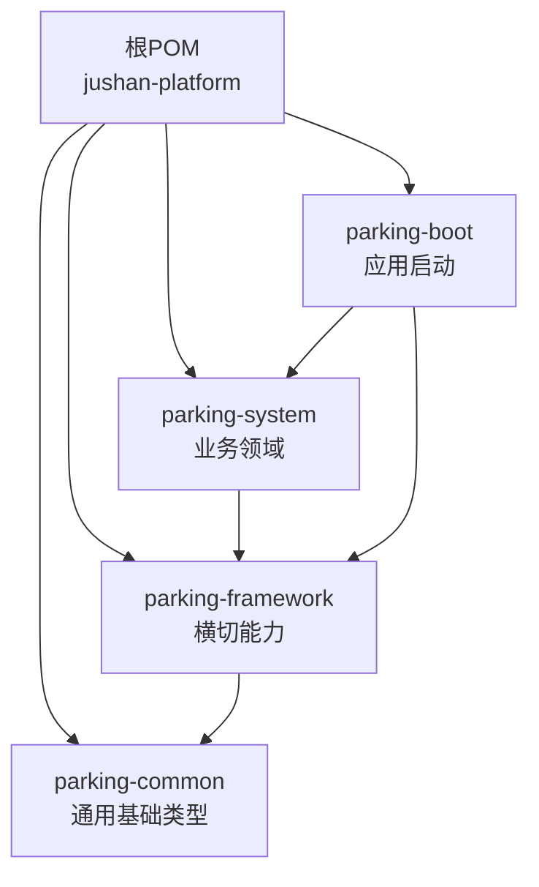
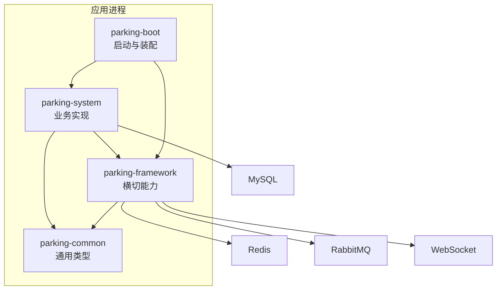
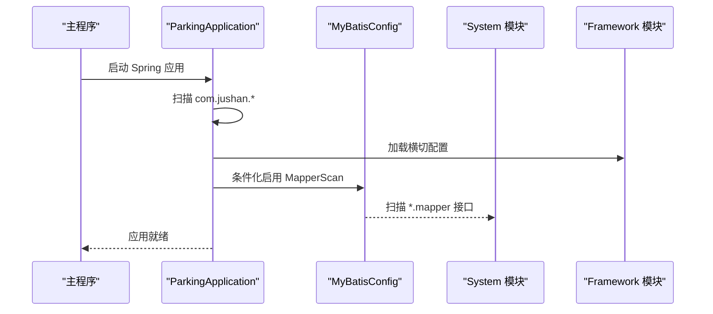
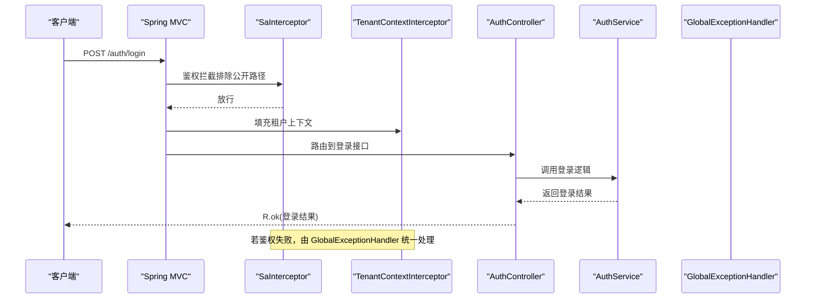
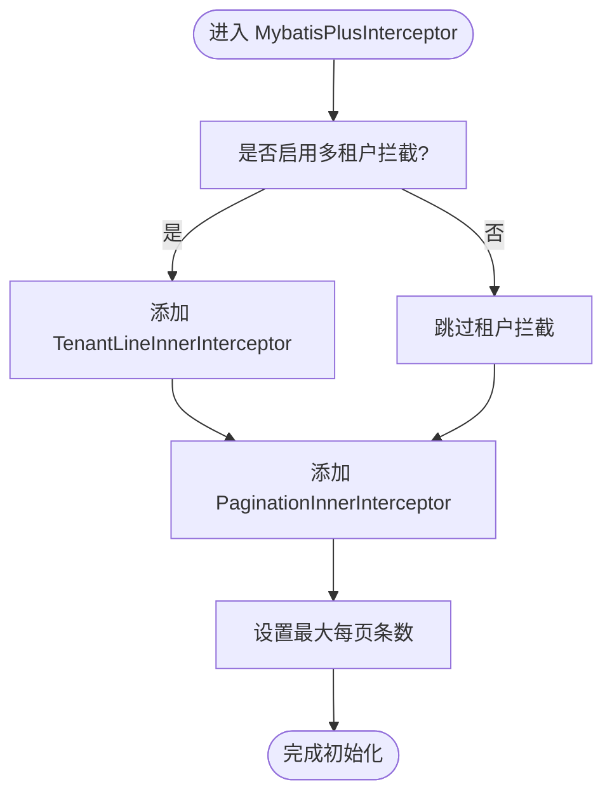
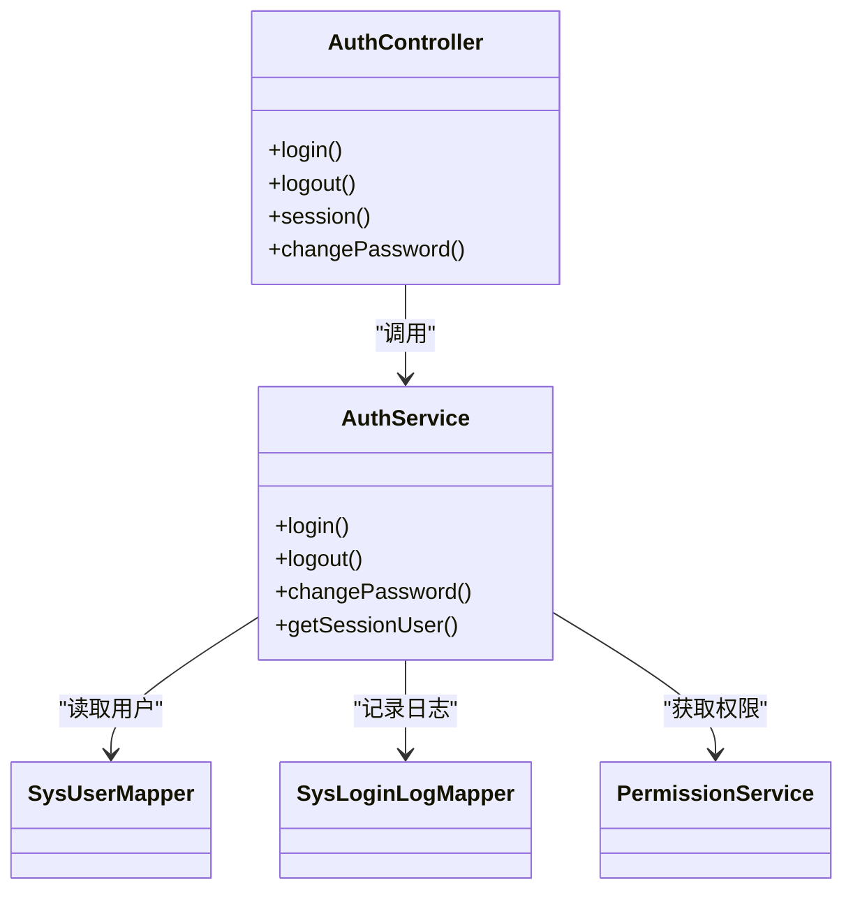
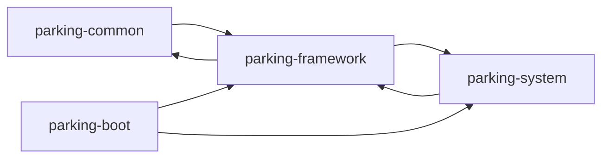

# 模块设计

<cite>
**本文引用的文件**   
- [pom.xml](file://pom.xml)
- [parking-boot/pom.xml](file://parking-boot/pom.xml)
- [parking-system/pom.xml](file://parking-system/pom.xml)
- [parking-framework/pom.xml](file://parking-framework/pom.xml)
- [parking-common/pom.xml](file://parking-common/pom.xml)
- [ParkingApplication.java](file://parking-boot/src/main/java/com/jushan/boot/ParkingApplication.java)
- [MyBatisConfig.java](file://parking-boot/src/main/java/com/jushan/boot/config/MyBatisConfig.java)
- [SaTokenConfig.java](file://parking-framework/src/main/java/com/jushan/framework/auth/SaTokenConfig.java)
- [TenantContextConfig.java](file://parking-framework/src/main/java/com/jushan/framework/auth/TenantContextConfig.java)
- [GlobalExceptionHandler.java](file://parking-framework/src/main/java/com/jushan/framework/web/GlobalExceptionHandler.java)
- [AuthController.java](file://parking-system/src/main/java/com/jushan/system/controller/AuthController.java)
- [AuthService.java](file://parking-system/src/main/java/com/jushan/system/service/AuthService.java)
- [application.yml](file://parking-boot/src/main/resources/application.yml)
</cite>

## 目录
1. [引言](#引言)
2. [项目结构](#项目结构)
3. [核心组件](#核心组件)
4. [架构总览](#架构总览)
5. [详细组件分析](#详细组件分析)
6. [依赖关系分析](#依赖关系分析)
7. [性能与扩展性考虑](#性能与扩展性考虑)
8. [故障排查指南](#故障排查指南)
9. [结论](#结论)
10. [附录](#附录)

## 引言
本文件面向“智慧停车 SaaS 平台”的 Maven 多模块后端工程，系统性阐述以下要点：
- 模块职责划分：parking-boot（启动）、parking-system（业务）、parking-framework（框架）、parking-common（通用）
- 模块间依赖与通信机制
- 包结构与分层组织原则（controller、service、entity、mapper）
- 组件扫描与条件化加载配置
- 模块依赖图与包结构图
- 扩展点设计与插件化支持思路

## 项目结构
顶层 POM 定义了四个子模块及其统一版本管理；boot 为应用入口并聚合 framework 与 system；framework 提供横切能力；system 承载业务；common 提供无 Spring 依赖的基础类型。

图表来源
- [pom.xml:47-52](file://pom.xml#L47-L52)
- [parking-boot/pom.xml:18-27](file://parking-boot/pom.xml#L18-L27)
- [parking-system/pom.xml:17-22](file://parking-system/pom.xml#L17-L22)
- [parking-framework/pom.xml:17-22](file://parking-framework/pom.xml#L17-L22)
- [parking-common/pom.xml:17-22](file://parking-common/pom.xml#L17-L22)

章节来源
- [pom.xml:1-52](file://pom.xml#L1-L52)
- [parking-boot/pom.xml:1-27](file://parking-boot/pom.xml#L1-L27)
- [parking-system/pom.xml:1-22](file://parking-system/pom.xml#L1-L22)
- [parking-framework/pom.xml:1-22](file://parking-framework/pom.xml#L1-L22)
- [parking-common/pom.xml:1-22](file://parking-common/pom.xml#L1-L22)

## 核心组件
- parking-common：不依赖 Spring，提供统一响应体、错误码、业务异常等基础类型，供所有模块安全复用。
- parking-framework：基于 Spring 的横切能力，包括全局异常处理、TraceId、租户上下文、Sa-Token 集成、Redis、WebSocket、消息队列等。
- parking-system：业务实现层，包含控制器、服务、实体、映射器、DTO/VO 等，覆盖认证、设备、计费、租户、监控等域。
- parking-boot：应用装配与启动，负责组件扫描、Mapper 扫描、健康检查、外部依赖驱动与迁移工具等。

章节来源
- [parking-common/pom.xml:13-22](file://parking-common/pom.xml#L13-L22)
- [parking-framework/pom.xml:13-22](file://parking-framework/pom.xml#L13-L22)
- [parking-system/pom.xml:13-22](file://parking-system/pom.xml#L13-L22)
- [parking-boot/pom.xml:13-27](file://parking-boot/pom.xml#L13-L27)

## 架构总览
整体采用“模块化单体”架构：boot 作为唯一可执行单元，通过 Spring 容器将 framework 与 system 组合运行；数据库与缓存由外部中间件提供；系统对外暴露 REST API，并通过 WebSocket 提供实时推送能力。

图表来源
- [parking-boot/pom.xml:18-27](file://parking-boot/pom.xml#L18-L27)
- [parking-system/pom.xml:17-22](file://parking-system/pom.xml#L17-L22)
- [parking-framework/pom.xml:17-22](file://parking-framework/pom.xml#L17-L22)
- [parking-common/pom.xml:17-22](file://parking-common/pom.xml#L17-L22)

## 详细组件分析

### 启动与组件扫描
- 启动类位于 boot 模块，使用统一的包扫描范围，确保 framework、common 以及后续业务模块均可被自动发现。
- MyBatis Mapper 扫描在 boot 中通过条件化配置进行控制，避免在无数据源场景下创建不必要的代理对象。

图表来源
- [ParkingApplication.java:23-29](file://parking-boot/src/main/java/com/jushan/boot/ParkingApplication.java#L23-L29)
- [MyBatisConfig.java:36-39](file://parking-boot/src/main/java/com/jushan/boot/config/MyBatisConfig.java#L36-L39)

章节来源
- [ParkingApplication.java:1-30](file://parking-boot/src/main/java/com/jushan/boot/ParkingApplication.java#L1-L30)
- [MyBatisConfig.java:1-88](file://parking-boot/src/main/java/com/jushan/boot/config/MyBatisConfig.java#L1-L88)

### 认证与安全拦截链
- Sa-Token 以 MVC Interceptor 形式注册，优先于租户上下文拦截器执行，对公开路径放行，其余请求要求登录。
- 租户上下文拦截器在鉴权通过后填充 TenantContext，供后续业务使用。
- 全局异常处理器统一收敛参数校验、业务异常、认证授权异常及未知异常，返回标准响应体。

图表来源
- [SaTokenConfig.java:33-64](file://parking-framework/src/main/java/com/jushan/framework/auth/SaTokenConfig.java#L33-L64)
- [TenantContextConfig.java:23-35](file://parking-framework/src/main/java/com/jushan/framework/auth/TenantContextConfig.java#L23-L35)
- [AuthController.java:40-46](file://parking-system/src/main/java/com/jushan/system/controller/AuthController.java#L40-L46)
- [AuthService.java:90-177](file://parking-system/src/main/java/com/jushan/system/service/AuthService.java#L90-L177)
- [GlobalExceptionHandler.java:44-46](file://parking-framework/src/main/java/com/jushan/framework/web/GlobalExceptionHandler.java#L44-L46)

章节来源
- [SaTokenConfig.java:1-65](file://parking-framework/src/main/java/com/jushan/framework/auth/SaTokenConfig.java#L1-L65)
- [TenantContextConfig.java:1-36](file://parking-framework/src/main/java/com/jushan/framework/auth/TenantContextConfig.java#L1-L36)
- [AuthController.java:1-100](file://parking-system/src/main/java/com/jushan/system/controller/AuthController.java#L1-L100)
- [AuthService.java:1-362](file://parking-system/src/main/java/com/jushan/system/service/AuthService.java#L1-L362)
- [GlobalExceptionHandler.java:1-240](file://parking-framework/src/main/java/com/jushan/framework/web/GlobalExceptionHandler.java#L1-L240)

### 分页与多租户 SQL 拦截
- MyBatis-Plus 分页插件已注册，限制最大页大小防止深度分页。
- 多租户行级隔离可通过配置开关，忽略表名单支持逗号分隔配置。

图表来源
- [MyBatisConfig.java:57-75](file://parking-boot/src/main/java/com/jushan/boot/config/MyBatisConfig.java#L57-L75)

章节来源
- [MyBatisConfig.java:1-88](file://parking-boot/src/main/java/com/jushan/boot/config/MyBatisConfig.java#L1-L88)

### 包结构与分层组织原则
- controller：HTTP 接口定义，仅做参数接收与结果封装，不包含复杂业务逻辑。
- service：业务编排与事务边界，协调 mapper、缓存、消息等基础设施。
- entity：持久化模型，与数据库表一一对应。
- mapper：MyBatis-Plus 数据访问接口，按领域拆分。
- dto/vo：请求/响应视图对象，与前端契约对齐。
- client：跨服务或外部系统客户端（如 DeviceAccessClient）。
- event：事件发布/消费相关实现。
- ws：WebSocket 主题与鉴权相关实现。

图表来源
- [AuthController.java:21-46](file://parking-system/src/main/java/com/jushan/system/controller/AuthController.java#L21-L46)
- [AuthService.java:73-177](file://parking-system/src/main/java/com/jushan/system/service/AuthService.java#L73-L177)

章节来源
- [AuthController.java:1-100](file://parking-system/src/main/java/com/jushan/system/controller/AuthController.java#L1-L100)
- [AuthService.java:1-362](file://parking-system/src/main/java/com/jushan/system/service/AuthService.java#L1-L362)

### 组件扫描与条件化加载
- 组件扫描：统一在启动类指定扫描根包，保证 framework 与 system 均能被发现。
- 条件化加载：
  - Mapper 扫描通过属性开关控制，便于轻量测试禁用数据访问。
  - Sa-Token 拦截器仅在存在 Sa-Token 类时生效。
  - 租户上下文拦截器独立注册，顺序高于普通拦截器。
- 配置中心：application.yml 集中声明 Web、数据源、Flyway、Redis、Sa-Token、Actuator、Device Access 客户端等关键配置项。

章节来源
- [ParkingApplication.java:23-29](file://parking-boot/src/main/java/com/jushan/boot/ParkingApplication.java#L23-L29)
- [MyBatisConfig.java:36-39](file://parking-boot/src/main/java/com/jushan/boot/config/MyBatisConfig.java#L36-L39)
- [SaTokenConfig.java:33-36](file://parking-framework/src/main/java/com/jushan/framework/auth/SaTokenConfig.java#L33-L36)
- [TenantContextConfig.java:23-35](file://parking-framework/src/main/java/com/jushan/framework/auth/TenantContextConfig.java#L23-L35)
- [application.yml:8-108](file://parking-boot/src/main/resources/application.yml#L8-L108)

### 扩展点与插件化支持
- 横切能力抽象在 framework 模块，业务模块通过依赖引入即可获得能力，无需侵入式改动。
- 条件化装配与属性开关使功能可按环境裁剪，例如：
  - 关闭 Mapper 扫描以支持无库测试
  - 关闭多租户 SQL 拦截回退到服务层校验
  - Redis 不可用时限流降级
- 未来可在 framework 中新增 Starter 或 SPI 接口，进一步解耦第三方能力接入。

章节来源
- [MyBatisConfig.java:57-75](file://parking-boot/src/main/java/com/jushan/boot/config/MyBatisConfig.java#L57-L75)
- [AuthService.java:270-314](file://parking-system/src/main/java/com/jushan/system/service/AuthService.java#L270-L314)

## 依赖关系分析
- 模块依赖方向：common ← framework ← system ← boot
- 运行时依赖：MySQL、Redis、RabbitMQ、WebSocket 由 framework 与 system 按需引入
- 构建期依赖：MapStruct、Lombok、Testcontainers 等在父 POM 统一管理

图表来源
- [pom.xml:47-52](file://pom.xml#L47-L52)
- [parking-boot/pom.xml:18-27](file://parking-boot/pom.xml#L18-L27)
- [parking-system/pom.xml:17-22](file://parking-system/pom.xml#L17-L22)
- [parking-framework/pom.xml:17-22](file://parking-framework/pom.xml#L17-L22)
- [parking-common/pom.xml:17-22](file://parking-common/pom.xml#L17-L22)

章节来源
- [pom.xml:54-140](file://pom.xml#L54-L140)
- [parking-boot/pom.xml:18-75](file://parking-boot/pom.xml#L18-L75)
- [parking-system/pom.xml:17-52](file://parking-system/pom.xml#L17-L52)
- [parking-framework/pom.xml:17-75](file://parking-framework/pom.xml#L17-L75)
- [parking-common/pom.xml:17-22](file://parking-common/pom.xml#L17-L22)

## 性能与扩展性考虑
- 分页上限控制：通过分页插件限制最大每页条数，避免深度分页拖垮数据库。
- 连接池与超时：HikariCP 与 Lettuce 连接池参数在配置文件中集中管理，便于调优。
- 会话存储：Sa-Token 默认使用 Redis 存储会话，生产需保障高可用；不可用时自动回退内存模式。
- 异步与实时：RabbitMQ 与 WebSocket 提供异步与实时能力，建议结合消费者并发度与背压策略优化吞吐。
- 指标与健康：Actuator 暴露 health/info，配合 Prometheus 采集指标，支撑可观测性。

[本节为通用指导，不直接分析具体文件]

## 故障排查指南
- 404/405：由全局异常处理器统一返回标准错误码，注意检查路由与 HTTP 方法是否正确。
- 未登录/无权限：Sa-Token 异常被捕获后返回 401/403，确认 Token 传递方式与白名单路径配置。
- 参数校验失败：统一返回字段级错误详情，核对 DTO 注解与前端传参。
- 登录限流：Redis 不可用时自动降级，不影响登录主流程；检查 Redis 连通性与 Key 命名空间。
- 分页 total 恒为 0：确认已注册分页插件且数据库方言正确。

章节来源
- [GlobalExceptionHandler.java:44-240](file://parking-framework/src/main/java/com/jushan/framework/web/GlobalExceptionHandler.java#L44-L240)
- [AuthService.java:270-314](file://parking-system/src/main/java/com/jushan/system/service/AuthService.java#L270-L314)
- [MyBatisConfig.java:57-75](file://parking-boot/src/main/java/com/jushan/boot/config/MyBatisConfig.java#L57-L75)

## 结论
本项目通过清晰的模块分层与条件化装配，实现了“模块化单体”的可维护性与可扩展性。boot 聚焦装配与启动，framework 沉淀横切能力，system 专注业务实现，common 提供无侵入基础类型。配合统一配置与健壮的错误处理，既满足快速交付，也为后续演进预留了良好扩展点。

[本节为总结性内容，不直接分析具体文件]

## 附录
- 关键配置文件位置：application.yml
- 模块清单与版本：根 POM 的 modules 与 dependencyManagement

章节来源
- [application.yml:8-108](file://parking-boot/src/main/resources/application.yml#L8-L108)
- [pom.xml:47-140](file://pom.xml#L47-L140)