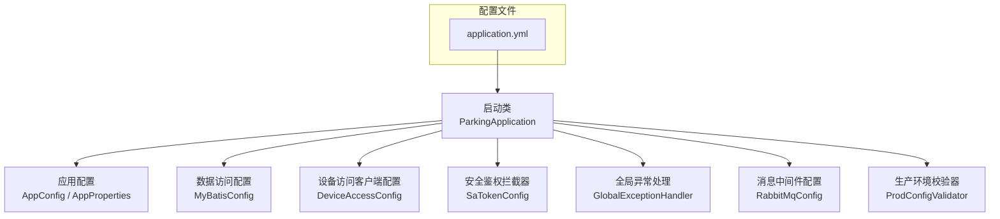
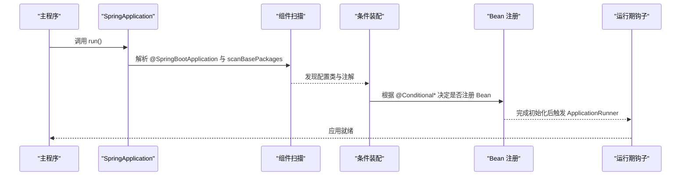
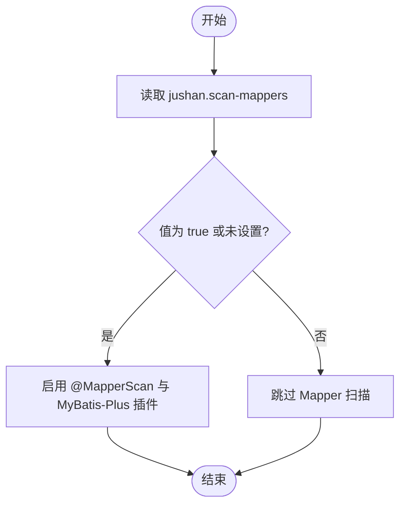
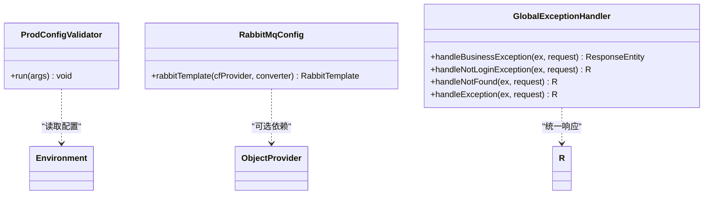

# 组件扫描与装配

<cite>
**本文引用的文件**   
- [ParkingApplication.java](file://parking-boot/src/main/java/com/jushan/boot/ParkingApplication.java)
- [application.yml](file://parking-boot/src/main/resources/application.yml)
- [AppConfig.java](file://parking-boot/src/main/java/com/jushan/boot/config/AppConfig.java)
- [AppProperties.java](file://parking-boot/src/main/java/com/jushan/boot/config/AppProperties.java)
- [MyBatisConfig.java](file://parking-boot/src/main/java/com/jushan/boot/config/MyBatisConfig.java)
- [ProdConfigValidator.java](file://parking-boot/src/main/java/com/jushan/boot/config/ProdConfigValidator.java)
- [LightweightTestConfig.java](file://parking-boot/src/test/java/com/jushan/boot/test/LightweightTestConfig.java)
- [DeviceAccessConfig.java](file://parking-framework/src/main/java/com/jushan/framework/config/DeviceAccessConfig.java)
- [SaTokenConfig.java](file://parking-framework/src/main/java/com/jushan/framework/auth/SaTokenConfig.java)
- [GlobalExceptionHandler.java](file://parking-framework/src/main/java/com/jushan/framework/web/GlobalExceptionHandler.java)
- [RabbitMqConfig.java](file://parking-framework/src/main/java/com/jushan/framework/mq/RabbitMqConfig.java)
</cite>

## 目录
1. [简介](#简介)
2. [项目结构](#项目结构)
3. [核心组件](#核心组件)
4. [架构总览](#架构总览)
5. [详细组件分析](#详细组件分析)
6. [依赖关系分析](#依赖关系分析)
7. [性能考量](#性能考量)
8. [故障排查指南](#故障排查指南)
9. [结论](#结论)
10. [附录](#附录)

## 简介
本文件聚焦 Spring Boot 应用的“组件扫描与装配”，围绕以下主题展开：
- 启动流程与 @SpringBootApplication 的作用
- 自定义配置类的使用与属性绑定
- 条件化加载机制（@ConditionalOnProperty、@Profile、@ConditionalOnMissingBean、@ConditionalOnClass）
- 自动装配的配置方式与自定义 Starter 的设计模式
- Bean 生命周期管理与依赖注入最佳实践
- 配置示例与常见问题排查

## 项目结构
应用采用多模块组织，启动入口位于 parking-boot 模块，横切能力集中在 parking-framework，业务逻辑在 parking-system。组件扫描范围通过启动类统一指定，覆盖 framework、common 及后续业务模块。

图表来源
- [ParkingApplication.java:1-30](file://parking-boot/src/main/java/com/jushan/boot/ParkingApplication.java#L1-L30)
- [application.yml:1-108](file://parking-boot/src/main/resources/application.yml#L1-L108)

章节来源
- [ParkingApplication.java:1-30](file://parking-boot/src/main/java/com/jushan/boot/ParkingApplication.java#L1-L30)
- [application.yml:1-108](file://parking-boot/src/main/resources/application.yml#L1-L108)

## 核心组件
- 启动入口与组件扫描
  - 使用 @SpringBootApplication 并显式设置 scanBasePackages，确保框架层、通用层与业务层均可被扫描到。
- 应用配置与属性绑定
  - 通过 @ConfigurationProperties + @Validated 定义强类型配置，并使用 @EnableConfigurationProperties 启用绑定与校验。
- 条件化装配
  - MyBatis 的 Mapper 扫描通过 @ConditionalOnProperty 控制开关；设备访问 RestTemplate 通过 @ConditionalOnMissingBean 避免重复创建；安全拦截器通过 @ConditionalOnClass 仅在 Sa-Token 存在时生效。
- 运行期校验
  - 使用 @Profile("prod") 与 ApplicationRunner 在生产环境执行关键配置检查，缺失则快速失败。
- 测试隔离
  - 轻量级测试配置限定扫描包范围，排除需要数据库的模块，提升测试速度。

章节来源
- [ParkingApplication.java:1-30](file://parking-boot/src/main/java/com/jushan/boot/ParkingApplication.java#L1-L30)
- [AppConfig.java:1-17](file://parking-boot/src/main/java/com/jushan/boot/config/AppConfig.java#L1-L17)
- [AppProperties.java:1-45](file://parking-boot/src/main/java/com/jushan/boot/config/AppProperties.java#L1-L45)
- [MyBatisConfig.java:1-88](file://parking-boot/src/main/java/com/jushan/boot/config/MyBatisConfig.java#L1-L88)
- [DeviceAccessConfig.java:1-71](file://parking-framework/src/main/java/com/jushan/framework/config/DeviceAccessConfig.java#L1-L71)
- [SaTokenConfig.java:1-65](file://parking-framework/src/main/java/com/jushan/framework/auth/SaTokenConfig.java#L1-L65)
- [ProdConfigValidator.java:1-44](file://parking-boot/src/main/java/com/jushan/boot/config/ProdConfigValidator.java#L1-L44)
- [LightweightTestConfig.java:1-26](file://parking-boot/src/test/java/com/jushan/boot/test/LightweightTestConfig.java#L1-L26)

## 架构总览
下图展示启动阶段的关键装配点与条件化策略，体现“按需启用”和“可插拔”的设计。

图表来源
- [ParkingApplication.java:1-30](file://parking-boot/src/main/java/com/jushan/boot/ParkingApplication.java#L1-L30)
- [MyBatisConfig.java:1-88](file://parking-boot/src/main/java/com/jushan/boot/config/MyBatisConfig.java#L1-L88)
- [DeviceAccessConfig.java:1-71](file://parking-framework/src/main/java/com/jushan/framework/config/DeviceAccessConfig.java#L1-L71)
- [SaTokenConfig.java:1-65](file://parking-framework/src/main/java/com/jushan/framework/auth/SaTokenConfig.java#L1-L65)
- [ProdConfigValidator.java:1-44](file://parking-boot/src/main/java/com/jushan/boot/config/ProdConfigValidator.java#L1-L44)

## 详细组件分析

### 启动入口与组件扫描
- 作用
  - 作为应用入口，组合了自动装配与组件扫描能力。
  - 通过 scanBasePackages 将 com.jushan 下所有子包纳入扫描范围，便于后续扩展新模块。
- 关键点
  - 若需缩小扫描范围以提升启动速度或避免误扫描，可在具体模块中进一步细化。
  - 对于不需要数据库的轻量场景，可通过测试专用配置限定扫描包。

章节来源
- [ParkingApplication.java:1-30](file://parking-boot/src/main/java/com/jushan/boot/ParkingApplication.java#L1-L30)
- [LightweightTestConfig.java:1-26](file://parking-boot/src/test/java/com/jushan/boot/test/LightweightTestConfig.java#L1-L26)

### 应用配置与属性绑定
- 设计要点
  - 使用 @ConfigurationProperties(prefix = "app") 集中管理应用级配置，配合 @Validated 进行约束校验。
  - 通过 @EnableConfigurationProperties 显式启用该属性的绑定与校验。
- 典型用法
  - 在 application.yml 或环境变量中提供 app.* 前缀的属性，即可注入到业务代码中使用。

章节来源
- [AppConfig.java:1-17](file://parking-boot/src/main/java/com/jushan/boot/config/AppConfig.java#L1-L17)
- [AppProperties.java:1-45](file://parking-boot/src/main/java/com/jushan/boot/config/AppProperties.java#L1-L45)

### 条件化加载机制
- @ConditionalOnProperty
  - MyBatis 的 Mapper 扫描默认开启，但可通过 jushan.scan-mappers=false 关闭，用于不依赖数据库的测试或精简部署。
- @Profile
  - 生产环境校验器仅在 prod profile 激活时执行，缺失关键配置时快速失败，保障上线安全。
- @ConditionalOnMissingBean
  - Device Access 的 RestTemplate 仅在未由外部提供同名 Bean 时才创建，支持用户自定义覆盖。
- @ConditionalOnClass
  - 安全拦截器仅在 classpath 中存在 Sa-Token 相关类时生效，保持模块解耦。

图表来源
- [MyBatisConfig.java:1-88](file://parking-boot/src/main/java/com/jushan/boot/config/MyBatisConfig.java#L1-L88)

章节来源
- [MyBatisConfig.java:1-88](file://parking-boot/src/main/java/com/jushan/boot/config/MyBatisConfig.java#L1-L88)
- [ProdConfigValidator.java:1-44](file://parking-boot/src/main/java/com/jushan/boot/config/ProdConfigValidator.java#L1-L44)
- [DeviceAccessConfig.java:1-71](file://parking-framework/src/main/java/com/jushan/framework/config/DeviceAccessConfig.java#L1-L71)
- [SaTokenConfig.java:1-65](file://parking-framework/src/main/java/com/jushan/framework/auth/SaTokenConfig.java#L1-L65)

### 自动装配与自定义 Starter 设计模式
- 自动装配现状
  - 本项目未引入 spring.factories 或 org.springframework.boot.autoconfigure.AutoConfiguration.imports 形式的自动装配清单，而是通过显式的 @Configuration 类与注解驱动装配。
- 自定义 Starter 建议
  - 将一组相关的配置类、条件化 Bean 与属性类打包为 starter 模块。
  - 对外暴露最小化的配置项，内部通过 @ConditionalOnProperty/@ConditionalOnMissingBean 等实现“开箱即用且可覆盖”。
  - 结合 @EnableConfigurationProperties 暴露配置类，便于使用者在配置文件中直接绑定。

章节来源
- [DeviceAccessConfig.java:1-71](file://parking-framework/src/main/java/com/jushan/framework/config/DeviceAccessConfig.java#L1-L71)
- [AppConfig.java:1-17](file://parking-boot/src/main/java/com/jushan/boot/config/AppConfig.java#L1-L17)

### Bean 生命周期管理与依赖注入最佳实践
- 生命周期钩子
  - 使用 ApplicationRunner 在容器启动完成后执行一次性任务（如生产环境配置校验）。
- 依赖注入
  - 优先构造器注入，保证不可变性与易测试性。
  - 对可选依赖使用 ObjectProvider.getIfAvailable() 优雅降级，避免强依赖导致启动失败。
- 错误处理
  - 全局异常处理器统一封装响应体，屏蔽内部堆栈，按协议语义映射 HTTP 状态码。

图表来源
- [ProdConfigValidator.java:1-44](file://parking-boot/src/main/java/com/jushan/boot/config/ProdConfigValidator.java#L1-L44)
- [RabbitMqConfig.java:111-141](file://parking-framework/src/main/java/com/jushan/framework/mq/RabbitMqConfig.java#L111-L141)
- [GlobalExceptionHandler.java:1-240](file://parking-framework/src/main/java/com/jushan/framework/web/GlobalExceptionHandler.java#L1-L240)

章节来源
- [ProdConfigValidator.java:1-44](file://parking-boot/src/main/java/com/jushan/boot/config/ProdConfigValidator.java#L1-L44)
- [RabbitMqConfig.java:111-141](file://parking-framework/src/main/java/com/jushan/framework/mq/RabbitMqConfig.java#L111-L141)
- [GlobalExceptionHandler.java:1-240](file://parking-framework/src/main/java/com/jushan/framework/web/GlobalExceptionHandler.java#L1-L240)

### 安全与 Web 层装配
- 安全拦截器
  - 基于 Sa-Token 的全局登录校验，通过 Interceptor 注册，排除公开路径与静态资源。
- 全局异常处理
  - 统一参数校验、业务异常、认证授权异常与 Spring 内置异常的响应格式。

章节来源
- [SaTokenConfig.java:1-65](file://parking-framework/src/main/java/com/jushan/framework/auth/SaTokenConfig.java#L1-L65)
- [GlobalExceptionHandler.java:1-240](file://parking-framework/src/main/java/com/jushan/framework/web/GlobalExceptionHandler.java#L1-L240)

## 依赖关系分析
- 模块依赖方向
  - parking-common → 无依赖
  - parking-framework → parking-common
  - parking-boot → parking-framework + 按需引入的业务模块
- 运行时依赖
  - 数据库连接池、Redis、Flyway、Sa-Token、RabbitMQ 等通过 application.yml 与条件化装配共同决定是否启用。

图表来源
- [application.yml:1-108](file://parking-boot/src/main/resources/application.yml#L1-L108)

章节来源
- [application.yml:1-108](file://parking-boot/src/main/resources/application.yml#L1-L108)

## 性能考量
- 组件扫描范围
  - 明确 scanBasePackages，避免扫描无关包，缩短启动时间。
- 条件化装配
  - 通过 @ConditionalOnProperty 等减少不必要的 Bean 创建与初始化。
- 分页与查询
  - MyBatis-Plus 分页插件限制最大每页条数，防止深度分页拖垮数据库。
- 外部依赖降级
  - MQ 等可选依赖使用 ObjectProvider 优雅降级，避免启动阻塞。

[本节为通用指导，无需列出具体文件来源]

## 故障排查指南
- 启动时报错：找不到 Mapper 或 DataSource
  - 检查是否设置了 jushan.scan-mappers=false，或在测试环境中排除了数据源自动装配。
  - 参考：[MyBatisConfig.java:1-88](file://parking-boot/src/main/java/com/jushan/boot/config/MyBatisConfig.java#L1-L88)
- 生产环境启动失败
  - 确认 prod profile 下的关键环境变量已正确设置，否则会在 ApplicationRunner 中快速失败。
  - 参考：[ProdConfigValidator.java:1-44](file://parking-boot/src/main/java/com/jushan/boot/config/ProdConfigValidator.java#L1-L44)
- 鉴权拦截器未生效
  - 确认 classpath 包含 Sa-Token 相关类，且请求路径未被 excludePathPatterns 排除。
  - 参考：[SaTokenConfig.java:1-65](file://parking-framework/src/main/java/com/jushan/framework/auth/SaTokenConfig.java#L1-L65)
- 设备访问超时或错误码未抛出
  - Device Access 的 RestTemplate 未配置重试与错误抛异常，需在上层判断 HTTP 状态码与响应体。
  - 参考：[DeviceAccessConfig.java:1-71](file://parking-framework/src/main/java/com/jushan/framework/config/DeviceAccessConfig.java#L1-L71)
- 全局异常返回格式不符合预期
  - 检查是否命中参数校验、业务异常或认证授权异常分支，确认错误码与 HTTP 状态映射。
  - 参考：[GlobalExceptionHandler.java:1-240](file://parking-framework/src/main/java/com/jushan/framework/web/GlobalExceptionHandler.java#L1-L240)

章节来源
- [MyBatisConfig.java:1-88](file://parking-boot/src/main/java/com/jushan/boot/config/MyBatisConfig.java#L1-L88)
- [ProdConfigValidator.java:1-44](file://parking-boot/src/main/java/com/jushan/boot/config/ProdConfigValidator.java#L1-L44)
- [SaTokenConfig.java:1-65](file://parking-framework/src/main/java/com/jushan/framework/auth/SaTokenConfig.java#L1-L65)
- [DeviceAccessConfig.java:1-71](file://parking-framework/src/main/java/com/jushan/framework/config/DeviceAccessConfig.java#L1-L71)
- [GlobalExceptionHandler.java:1-240](file://parking-framework/src/main/java/com/jushan/framework/web/GlobalExceptionHandler.java#L1-L240)

## 结论
本项目通过明确的组件扫描范围、条件化装配与运行期校验，实现了“按需启用、可插拔、可观测”的装配体系。结合统一的异常处理与属性绑定规范，既保证了开发体验，也提升了生产环境的稳定性与可维护性。

[本节为总结性内容，无需列出具体文件来源]

## 附录
- 常用配置键位（节选）
  - jushan.scan-mappers：是否启用 Mapper 扫描（true/false）
  - jushan.tenant.line.enabled：是否启用 SQL 级租户隔离（true/false）
  - jushan.tenant.ignore-tables：忽略租户过滤的表名列表（逗号分隔）
  - sa-token.*：Sa-Token 基础配置（token-name、timeout 等）
  - management.endpoints.web.exposure.include：Actuator 端点暴露集合
  - server.port：服务端口

章节来源
- [application.yml:1-108](file://parking-boot/src/main/resources/application.yml#L1-L108)
- [MyBatisConfig.java:1-88](file://parking-boot/src/main/java/com/jushan/boot/config/MyBatisConfig.java#L1-L88)