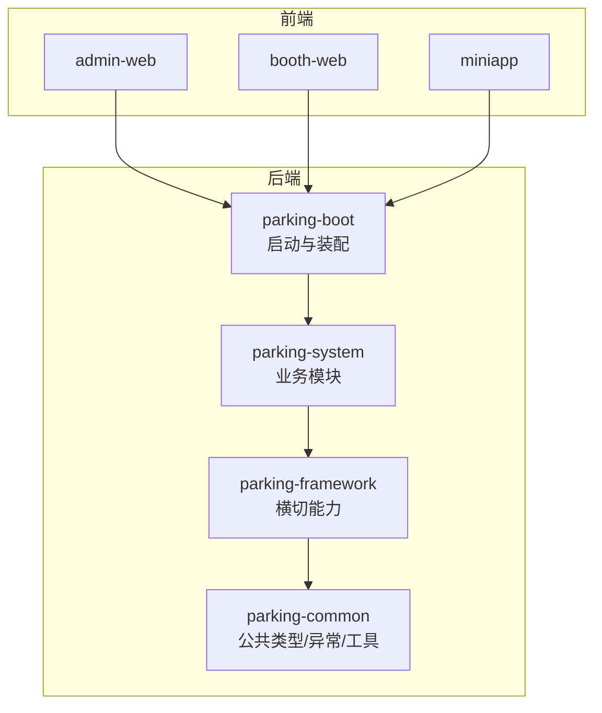
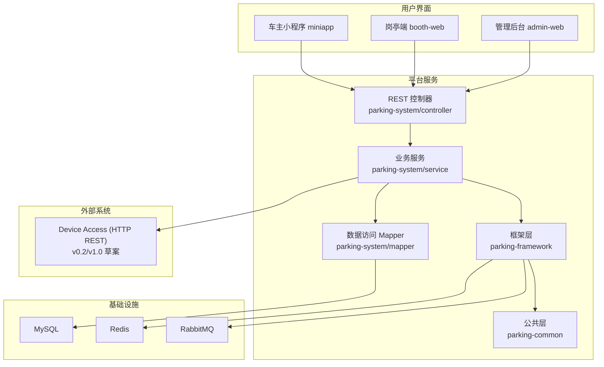
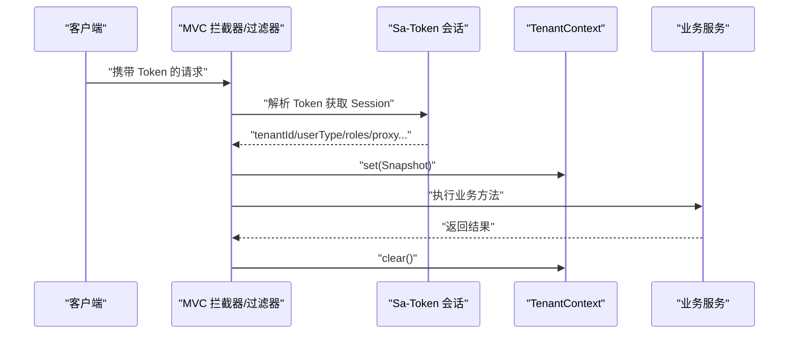
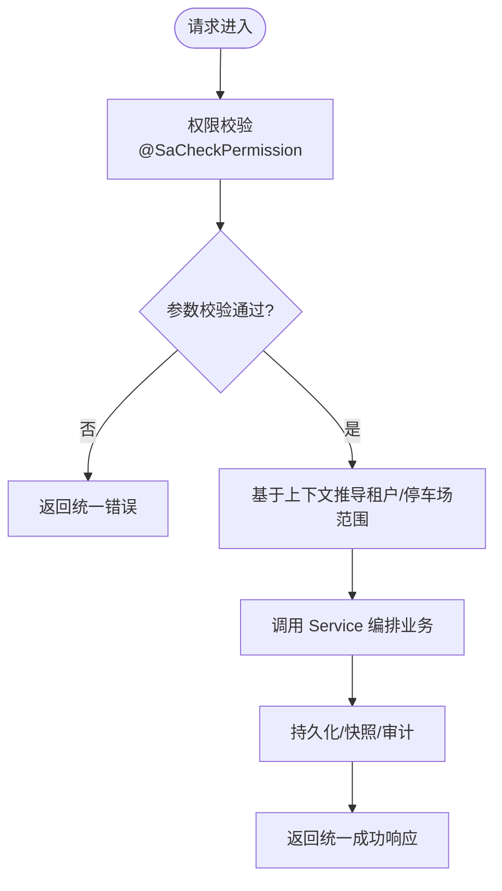
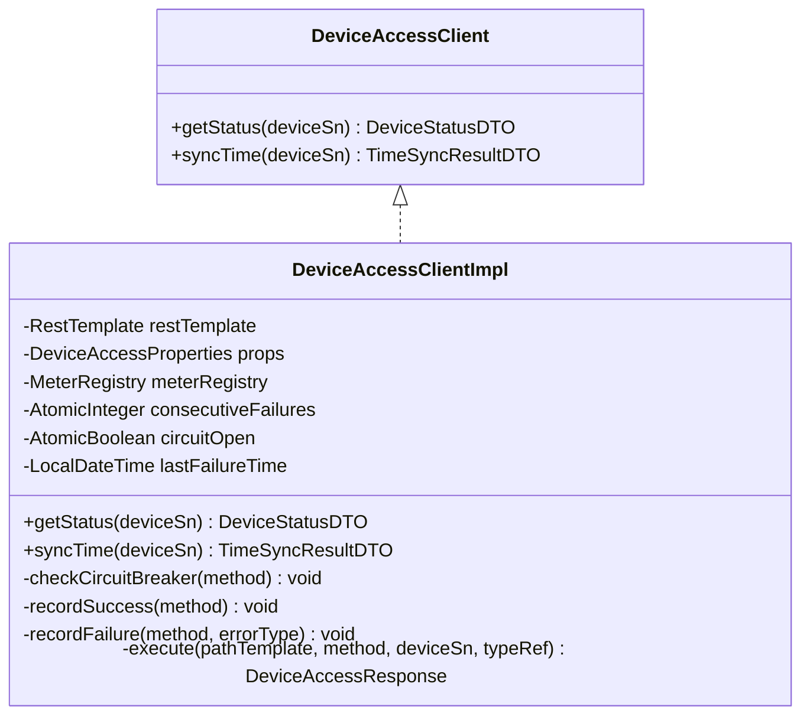
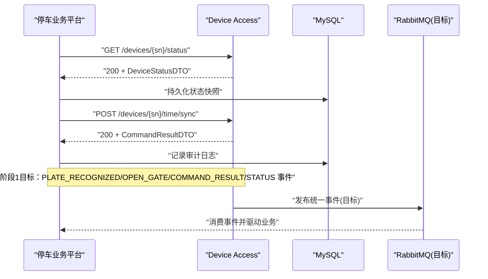
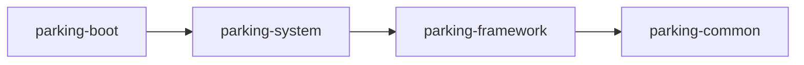
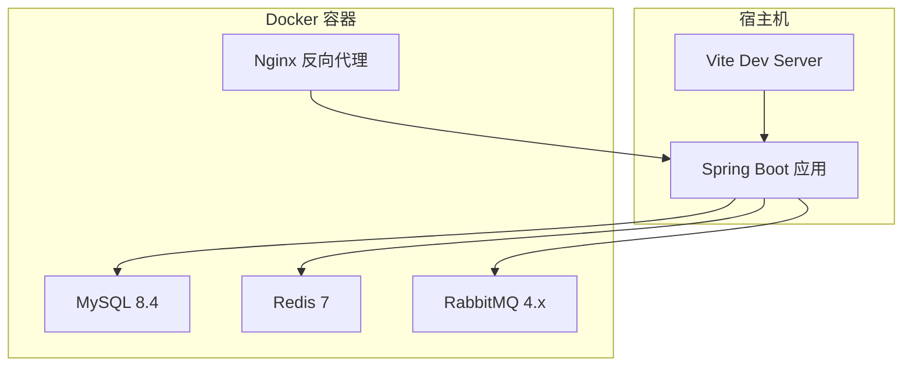

# 系统架构设计

<cite>
**本文引用的文件**   
- [README.md](file://README.md)
- [docker-compose.yml](file://docker-compose.yml)
- [ParkingApplication.java](file://parking-boot/src/main/java/com/jushan/boot/ParkingApplication.java)
- [模块设计.md](file://docs/系统设计/模块设计.md)
- [技术架构.md](file://docs/项目概述/技术架构.md)
- [系统架构.md](file://docs/系统设计/系统架构.md)
- [TenantContext.java](file://parking-framework/src/main/java/com/jushan/framework/auth/TenantContext.java)
- [TenantContextFilter.java](file://parking-framework/src/main/java/com/jushan/framework/auth/TenantContextFilter.java)
- [DeviceAccessClientImpl.java](file://parking-system/src/main/java/com/jushan/system/client/DeviceAccessClientImpl.java)
- [DeviceAccessClient.java](file://parking-system/src/main/java/com/jushan/system/client/DeviceAccessClient.java)
- [DeviceController.java](file://parking-system/src/main/java/com/jushan/system/controller/DeviceController.java)
- [04-当前兼容契约-v0.2.md](file://docs/contracts/platform-device-access/04-当前兼容契约-v0.2.md)
- [device-access-v1-draft.yaml](file://docs/contracts/platform-device-access/openapi/device-access-v1-draft.yaml)
- [02-职责边界与数据所有权.md](file://docs/contracts/platform-device-access/02-职责边界与数据所有权.md)
- [06-集成开发路线.md](file://docs/contracts/platform-device-access/06-集成开发路线.md)
- [07-冲突与决策记录.md](file://docs/contracts/platform-device-access/07-冲突与决策记录.md)
- [停车业务平台与DeviceAccess接口规范-v0.1-历史版.md](file://docs/归档/平台侧/停车业务平台与DeviceAccess接口规范-v0.1-历史版.md)
- [DeviceAccessClientRobustnessTest.java](file://parking-boot/src/test/java/com/jushan/boot/client/DeviceAccessClientRobustnessTest.java)
</cite>

## 目录
1. [引言](#引言)
2. [项目结构](#项目结构)
3. [核心组件](#核心组件)
4. [架构总览](#架构总览)
5. [详细组件分析](#详细组件分析)
6. [依赖关系分析](#依赖关系分析)
7. [性能与扩展性](#性能与扩展性)
8. [安全架构](#安全架构)
9. [监控与可观测性](#监控与可观测性)
10. [故障恢复与容错](#故障恢复与容错)
11. [部署拓扑](#部署拓扑)
12. [结论](#结论)

## 引言
本文件面向智慧停车 SaaS 平台的系统架构设计与实现现状，覆盖整体架构模式、分层职责、多租户上下文传递、外部系统集成（特别是 Device Access HTTP API）、系统边界、关键流程、技术选型、性能与扩展性、安全、监控与故障恢复等。文档同时标注“当前事实”与“目标设计”，以共享契约为准绳，确保读者能准确区分 AS-IS 与 TO-BE。

## 项目结构
后端采用 Maven 多模块工程，当前真实模块为：
- parking-common：统一响应、错误码、通用异常与工具类
- parking-framework：横切能力（多租户上下文、权限、全局异常、TraceId、Redis/MQ/WebSocket、分布式锁、设备访问配置）
- parking-system：业务模块（租户、用户、角色、权限、停车场、车道、设备、识别事件、停车记录、收费规则、微信车主、审计日志等）
- parking-boot：启动入口、自动装配、配置属性校验、Flyway 迁移宿主、集成测试

前端包含管理后台 admin-web、岗亭端 booth-web、小程序 miniapp。

图表来源
- [模块设计.md:1-106](file://docs/系统设计/模块设计.md#L1-L106)
- [技术架构.md:54-78](file://docs/项目概述/技术架构.md#L54-L78)

章节来源
- [模块设计.md:1-106](file://docs/系统设计/模块设计.md#L1-L106)
- [技术架构.md:54-78](file://docs/项目概述/技术架构.md#L54-L78)

## 核心组件
- 应用启动与扫描：Spring Boot 启动类集中扫描 com.jushan 包，覆盖 framework、common 与各业务模块。
- 多租户上下文：基于 Sa-Token 会话推导 tenantId/userId/userType，写入线程级上下文，贯穿请求处理链。
- 设备访问客户端：封装对 Device Access v0.2 的 HTTP 调用，内置降级与指标上报，屏蔽网络异常分类。
- 设备管理控制器：提供设备台账 CRUD、绑定车道、厂商/型号查询、校时、状态查询与快照等能力。

章节来源
- [ParkingApplication.java:1-30](file://parking-boot/src/main/java/com/jushan/boot/ParkingApplication.java#L1-L30)
- [TenantContext.java:1-257](file://parking-framework/src/main/java/com/jushan/framework/auth/TenantContext.java#L1-L257)
- [DeviceAccessClientImpl.java:1-346](file://parking-system/src/main/java/com/jushan/system/client/DeviceAccessClientImpl.java#L1-L346)
- [DeviceController.java:1-315](file://parking-system/src/main/java/com/jushan/system/controller/DeviceController.java#L1-L315)

## 架构总览
系统采用前后端分离 + 分层架构（表现层/业务层/数据访问层），并通过框架层提供横切能力；对外通过共享契约与 Device Access 服务交互。

图表来源
- [系统架构.md:37-80](file://docs/系统设计/系统架构.md#L37-L80)
- [02-职责边界与数据所有权.md:1-55](file://docs/contracts/platform-device-access/02-职责边界与数据所有权.md#L1-L55)

章节来源
- [系统架构.md:37-80](file://docs/系统设计/系统架构.md#L37-L80)
- [02-职责边界与数据所有权.md:1-55](file://docs/contracts/platform-device-access/02-职责边界与数据所有权.md#L1-L55)

## 详细组件分析

### 多租户上下文与权限控制
- 上下文来源：从 Sa-Token 会话中读取 tenantId、userType、roles 及代理信息，构造不可变 Snapshot 并写入 ThreadLocal。
- 生命周期：请求进入 → 填充上下文 → 业务处理 → finally 清理。
- 安全约束：禁止信任前端传入的 tenantId；平台用户无租户范围；代理模式下严格限定在目标租户。
- 强制推导：提供 requireTenantId/requireUserId 等方法，未初始化或越权直接拒绝。

图表来源
- [TenantContext.java:1-257](file://parking-framework/src/main/java/com/jushan/framework/auth/TenantContext.java#L1-L257)
- [TenantContextFilter.java:1-138](file://parking-framework/src/main/java/com/jushan/framework/auth/TenantContextFilter.java#L1-L138)

章节来源
- [TenantContext.java:1-257](file://parking-framework/src/main/java/com/jushan/framework/auth/TenantContext.java#L1-L257)
- [TenantContextFilter.java:1-138](file://parking-framework/src/main/java/com/jushan/framework/auth/TenantContextFilter.java#L1-L138)

### 设备管理控制器与业务流程
- 设备台账：CRUD、绑定/解绑车道、设置执行相机、厂商/型号查询。
- 设备运维：校时、实时状态查询、批量状态查询、最新快照读取。
- 权限控制：使用注解进行细粒度权限校验。
- 数据隔离：所有操作基于租户上下文与停车场归属推导，不信任前端传入的 tenantId。

图表来源
- [DeviceController.java:1-315](file://parking-system/src/main/java/com/jushan/system/controller/DeviceController.java#L1-L315)
- [模块设计.md:46-77](file://docs/系统设计/模块设计.md#L46-L77)

章节来源
- [DeviceController.java:1-315](file://parking-system/src/main/java/com/jushan/system/controller/DeviceController.java#L1-L315)
- [模块设计.md:46-77](file://docs/系统设计/模块设计.md#L46-L77)

### Device Access HTTP 客户端（P002 增强）
- 能力：状态查询、校时；未来开闸接口待契约冻结后启用。
- 健壮性：
  - 降级策略：连续失败阈值触发快速失败，超过恢复窗口尝试恢复。
  - 指标上报：Micrometer 暴露调用次数、失败率、延迟分布。
  - 异常分类：DA 业务错误、网络超时/连接失败（UNCERTAIN）、解析失败。
- 幂等与重试：明确不包含自动重试；写请求透明重试被显式禁止。

图表来源
- [DeviceAccessClient.java:1-37](file://parking-system/src/main/java/com/jushan/system/client/DeviceAccessClient.java#L1-L37)
- [DeviceAccessClientImpl.java:1-346](file://parking-system/src/main/java/com/jushan/system/client/DeviceAccessClientImpl.java#L1-L346)

章节来源
- [DeviceAccessClient.java:1-37](file://parking-system/src/main/java/com/jushan/system/client/DeviceAccessClient.java#L1-L37)
- [DeviceAccessClientImpl.java:1-346](file://parking-system/src/main/java/com/jushan/system/client/DeviceAccessClientImpl.java#L1-L346)

### 与 Device Access 的集成契约
- 当前事实（v0.2）：7 个 HTTP 端点（设备 CRUD、校时、状态查询），无开闸、无事件上报、无 HMAC。
- 目标设计（v1.0 草案）：统一命令入口、设备状态/能力、配置同步、事件通道（RabbitMQ）、签名认证（HMAC-SHA256）。
- 职责边界：Platform 负责主数据与放行决策，Device Access 负责协议适配与设备通信；双方不得直连对方数据库。

图表来源
- [04-当前兼容契约-v0.2.md:28-50](file://docs/contracts/platform-device-access/04-当前兼容契约-v0.2.md#L28-L50)
- [device-access-v1-draft.yaml:1-36](file://docs/contracts/platform-device-access/openapi/device-access-v1-draft.yaml#L1-L36)
- [02-职责边界与数据所有权.md:1-55](file://docs/contracts/platform-device-access/02-职责边界与数据所有权.md#L1-L55)

章节来源
- [04-当前兼容契约-v0.2.md:28-50](file://docs/contracts/platform-device-access/04-当前兼容契约-v0.2.md#L28-L50)
- [device-access-v1-draft.yaml:1-36](file://docs/contracts/platform-device-access/openapi/device-access-v1-draft.yaml#L1-L36)
- [02-职责边界与数据所有权.md:1-55](file://docs/contracts/platform-device-access/02-职责边界与数据所有权.md#L1-L55)

## 依赖关系分析
- 模块依赖层次：boot → system → framework → common，禁止反向依赖与循环依赖。
- 内部分包约束：controller → service → mapper → db；DTO/VO 与 Entity 解耦。
- 跨模块协作：通过公开 Service/Facade 调用，禁止跨模块直接操作 Mapper/Entity。

图表来源
- [模块设计.md:1-106](file://docs/系统设计/模块设计.md#L1-L106)
- [技术架构.md:54-78](file://docs/项目概述/技术架构.md#L54-L78)

章节来源
- [模块设计.md:1-106](file://docs/系统设计/模块设计.md#L1-L106)
- [技术架构.md:54-78](file://docs/项目概述/技术架构.md#L54-L78)

## 性能与扩展性
- 设备状态批量查询：最多并发 5 台设备，单设备失败不影响其他设备。
- 降级与限流：Device Access 连续失败触发快速失败，避免级联阻塞；恢复窗口内自动尝试恢复。
- 指标与可观测：Micrometer 指标暴露调用次数、失败率、延迟分布，便于 Prometheus 采集。
- 水平扩展：无状态服务实例可横向扩展；设备访问客户端为内存级降级状态，生产环境建议结合分布式缓存或网关级熔断。

章节来源
- [DeviceController.java:268-277](file://parking-system/src/main/java/com/jushan/system/controller/DeviceController.java#L268-L277)
- [DeviceAccessClientImpl.java:160-246](file://parking-system/src/main/java/com/jushan/system/client/DeviceAccessClientImpl.java#L160-L246)

## 安全架构
- 用户认证与会话：基于 Sa-Token，Token 名称可配置，统一由框架层解析。
- 多租户隔离：上下文强制推导，平台用户无租户范围，代理模式严格限定目标租户。
- 权限控制：细粒度权限注解校验，禁止前端隐藏按钮代替后端鉴权。
- 服务间认证：目标方案推荐 HMAC-SHA256；当前 v0.2 尚未实现。
- 敏感信息：日志脱敏，不记录密钥、密码、Token 等敏感信息。

章节来源
- [TenantContext.java:1-257](file://parking-framework/src/main/java/com/jushan/framework/auth/TenantContext.java#L1-L257)
- [系统架构.md:181-189](file://docs/系统设计/系统架构.md#L181-L189)
- [停车业务平台与DeviceAccess接口规范-v0.1-历史版.md:2330-2338](file://docs/归档/平台侧/停车业务平台与DeviceAccess接口规范-v0.1-历史版.md#L2330-L2338)

## 监控与可观测性
- 结构化日志：SLF4J + Logback，脱敏输出，记录 Trace ID、业务操作、耗时、HTTP 状态、错误分类。
- 指标体系：Micrometer 暴露设备访问相关指标（调用总数、失败数、延迟、降级状态）。
- 健康检查：Actuator 暴露健康检查；Readiness 检查数据库、Redis、RabbitMQ 等依赖。
- 告警建议：设备离线、开闸失败、MQTT 不可用、大量设备同时离线等场景应告警。

章节来源
- [DeviceAccessClientImpl.java:92-107](file://parking-system/src/main/java/com/jushan/system/client/DeviceAccessClientImpl.java#L92-L107)
- [停车业务平台与DeviceAccess接口规范-v0.1-历史版.md:856-910](file://docs/归档/平台侧/停车业务平台与DeviceAccess接口规范-v0.1-历史版.md#L856-L910)

## 故障恢复与容错
- 降级策略：连续失败达到阈值打开降级，超过恢复窗口自动尝试恢复；期间快速失败避免雪崩。
- 异常分类：DA 业务错误、网络异常（UNCERTAIN）、解析失败分别处理，上层可据此做人工兜底与审计。
- 幂等与重试：当前不包含自动重试；写请求透明重试被显式禁止，避免重复下发命令。
- 测试保障：集成测试覆盖成功、404、503、500、超时、解析失败、降级与恢复、指标验证等路径。

章节来源
- [DeviceAccessClientImpl.java:160-246](file://parking-system/src/main/java/com/jushan/system/client/DeviceAccessClientImpl.java#L160-L246)
- [DeviceAccessClientRobustnessTest.java:29-69](file://parking-boot/src/test/java/com/jushan/boot/client/DeviceAccessClientRobustnessTest.java#L29-L69)

## 部署拓扑
本地开发使用 Docker Compose 提供 MySQL、Redis、RabbitMQ、Nginx；后端 Spring Boot 与前端 Vite dev server 在宿主机运行。

图表来源
- [docker-compose.yml:1-167](file://docker-compose.yml#L1-L167)

章节来源
- [docker-compose.yml:1-167](file://docker-compose.yml#L1-L167)

## 结论
本架构以分层与横切能力为核心，结合多租户上下文与严格的权限控制，确保数据隔离与安全合规；通过 Device Access 共享契约实现与设备层的解耦与演进。当前处于工程骨架阶段，已具备基础框架与关键能力（设备台账、状态查询、校时、降级与指标），后续将按共享契约推进目标能力（事件上报、统一命令入口、服务间认证、Outbox/Inbox 等），并在生产环境完善可观测性与容灾策略。