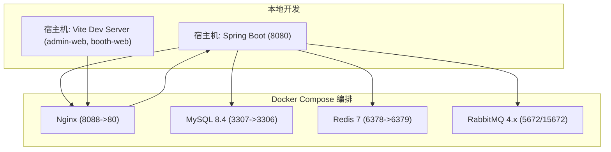
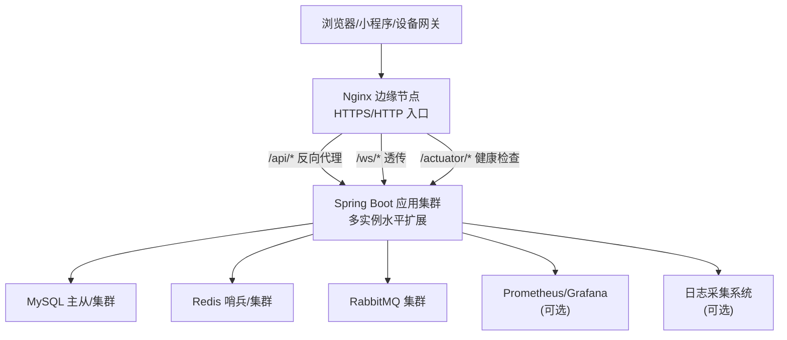
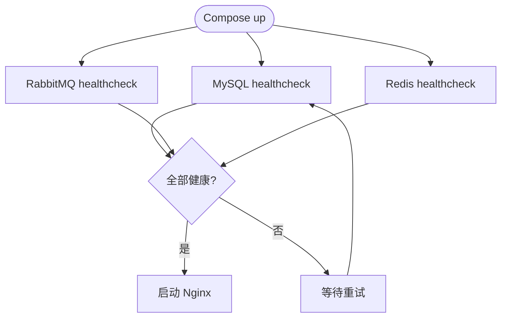
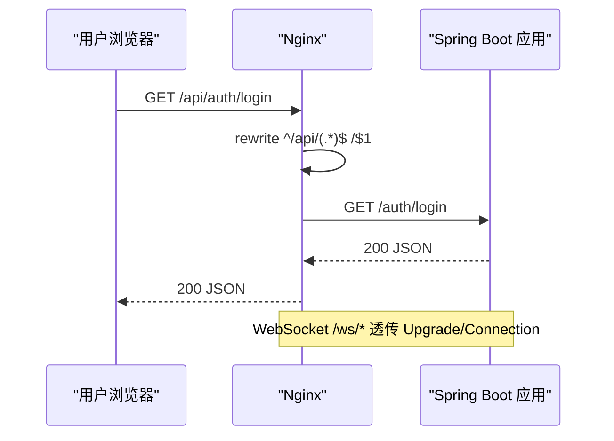
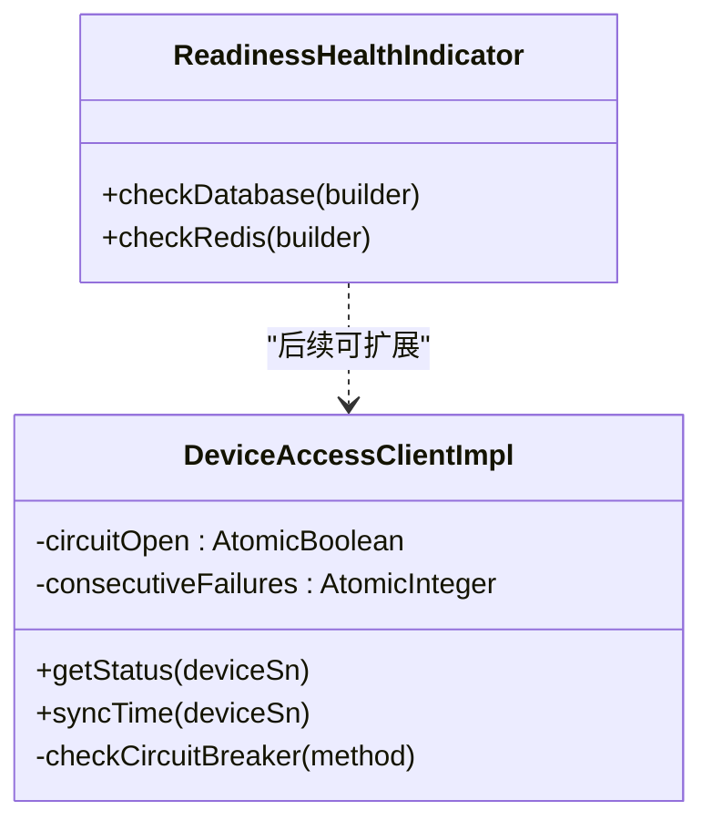
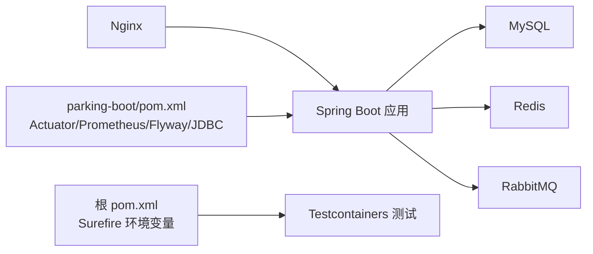
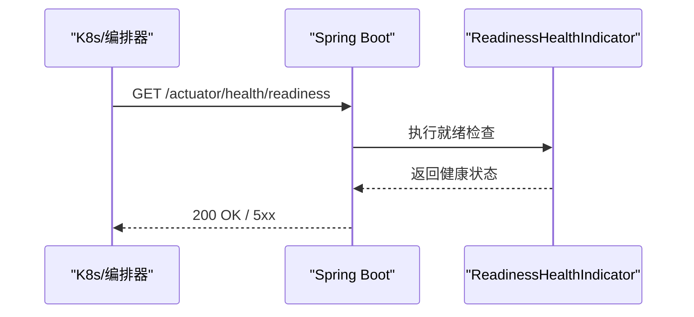
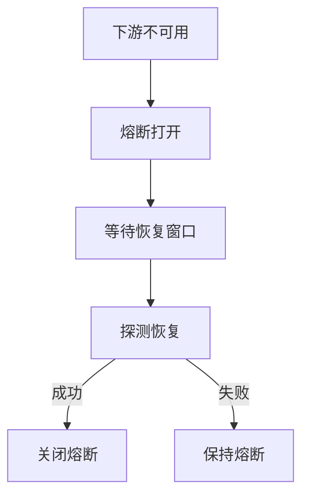
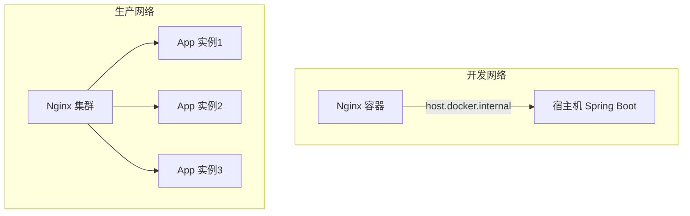
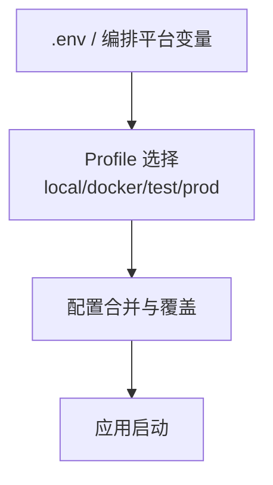

# 部署架构

<cite>
**本文引用的文件**
- [docker-compose.yml](file://docker-compose.yml)
- [nginx.conf](file://docker/nginx/nginx.conf)
- [default.conf](file://docker/nginx/conf.d/default.conf)
- [application.yml](file://parking-boot/src/main/resources/application.yml)
- [application-docker.yml](file://parking-boot/src/main/resources/application-docker.yml)
- [application-test.yml](file://parking-boot/src/main/resources/application-test.yml)
- [application-prod.yml](file://parking-boot/src/main/resources/application-prod.yml)
- [ReadinessHealthIndicator.java](file://parking-boot/src/main/java/com/jushan/boot/health/ReadinessHealthIndicator.java)
- [pom.xml（根）](file://pom.xml)
- [parking-boot/pom.xml](file://parking-boot/pom.xml)
- [部署说明.md](file://docs/部署运维/部署说明.md)
- [配置说明.md](file://docs/部署运维/配置说明.md)
</cite>

## 目录
1. [简介](#简介)
2. [项目结构](#项目结构)
3. [核心组件](#核心组件)
4. [架构总览](#架构总览)
5. [详细组件分析](#详细组件分析)
6. [依赖关系分析](#依赖关系分析)
7. [性能与容量规划](#性能与容量规划)
8. [监控与告警体系](#监控与告警体系)
9. [高可用与故障转移](#高可用与故障转移)
10. [网络与服务发现](#网络与服务发现)
11. [环境配置管理](#环境配置管理)
12. [排障指南](#排障指南)
13. [结论](#结论)

## 简介
本文件面向“智慧停车 SaaS 平台”的容器化部署与生产拓扑，覆盖 Docker Compose 编排、Nginx 反向代理、MySQL/Redis/RabbitMQ 基础设施、后端 Spring Boot 应用、前端静态资源分发策略，以及生产环境的负载均衡、环境差异、监控告警、网络与服务发现、高可用与故障转移等主题。文档同时给出可落地的架构图与流程图，帮助读者快速理解并落地部署。

## 项目结构
仓库采用多模块 Maven 工程，包含：
- parking-boot：应用启动入口、健康检查、Actuator、Micrometer Prometheus 集成
- parking-framework：框架层（认证、租户上下文、分布式锁、消息、WebSocket 等）
- parking-system：业务域（控制器、服务、实体、事件、客户端等）
- admin-web / booth-web：前后端分离的前端工程（Vite）
- docker：Docker Compose 编排与 Nginx 配置
- docs/部署运维：部署与配置说明文档

图表来源
- [docker-compose.yml:1-167](file://docker-compose.yml#L1-L167)
- [default.conf:1-124](file://docker/nginx/conf.d/default.conf#L1-L124)
- [nginx.conf:1-68](file://docker/nginx/nginx.conf#L1-L68)

章节来源
- [docker-compose.yml:1-167](file://docker-compose.yml#L1-L167)
- [部署说明.md:1-111](file://docs/部署运维/部署说明.md#L1-L111)

## 核心组件
- 应用服务（Spring Boot）
  - 暴露 REST API 与 WebSocket，提供 Actuator 健康检查与 Micrometer 指标
  - 通过 Flyway 自动迁移数据库
  - 使用 Sa-Token + Redis 进行会话与鉴权
- 数据库（MySQL 8.4）
  - 持久化业务数据，默认 utf8mb4，时区 +08:00
- 缓存与会话（Redis 7）
  - 存储 Sa-Token 会话、热点缓存、分布式锁、限流等
- 消息队列（RabbitMQ 4.x）
  - 异步事件处理、削峰填谷
- 反向代理（Nginx）
  - 统一入口、路径重写、WebSocket 透传、静态资源托管（生产）

章节来源
- [application.yml:1-108](file://parking-boot/src/main/resources/application.yml#L1-L108)
- [application-docker.yml:1-88](file://parking-boot/src/main/resources/application-docker.yml#L1-L88)
- [application-prod.yml:1-83](file://parking-boot/src/main/resources/application-prod.yml#L1-L83)
- [application-test.yml:1-80](file://parking-boot/src/main/resources/application-test.yml#L1-L80)
- [docker-compose.yml:1-167](file://docker-compose.yml#L1-L167)
- [nginx.conf:1-68](file://docker/nginx/nginx.conf#L1-L68)
- [default.conf:1-124](file://docker/nginx/conf.d/default.conf#L1-L124)

## 架构总览
下图展示本地开发与生产目标拓扑的差异与演进方向。

图表来源
- [default.conf:1-124](file://docker/nginx/conf.d/default.conf#L1-L124)
- [application.yml:1-108](file://parking-boot/src/main/resources/application.yml#L1-L108)
- [application-prod.yml:1-83](file://parking-boot/src/main/resources/application-prod.yml#L1-L83)
- [docker-compose.yml:1-167](file://docker-compose.yml#L1-L167)

## 详细组件分析

### 容器编排（Docker Compose）
- 服务清单
  - MySQL 8.4：端口映射避免冲突，字符集 utf8mb4，时区 Asia/Shanghai，连接池上限 200
  - RabbitMQ 4.x Management：AMQP 与管理后台端口
  - Redis 7：开启 AOF，最大内存 256MB，淘汰策略 allkeys-lru
  - Nginx：反向代理到宿主机 Spring Boot，挂载站点配置
- 健康检查与启动顺序
  - 各服务均配置 healthcheck；Nginx 依赖其他服务健康后再启动
- 数据卷与网络
  - 为 MySQL/Redis/RabbitMQ 创建独立数据卷
  - 自定义 bridge 网络 jushan-net

图表来源
- [docker-compose.yml:33-144](file://docker-compose.yml#L33-L144)

章节来源
- [docker-compose.yml:1-167](file://docker-compose.yml#L1-L167)
- [配置说明.md:151-182](file://docs/部署运维/配置说明.md#L151-L182)

### Nginx 反向代理与静态资源
- 路由规则
  - /api/*：去除前缀后转发至后端
  - /ws/*：WebSocket 透传（Upgrade/Connection 头）
  - /actuator/*：健康检查透传
- 上游与超时
  - upstream backend 指向 host.docker.internal:8080（开发），生产替换为后端集群地址
  - 合理设置连接/读写超时与缓冲
- 静态资源
  - 开发阶段由 Vite dev server 提供服务
  - 生产构建产物挂载至 /usr/share/nginx/html/admin 与 /booth

图表来源
- [default.conf:15-87](file://docker/nginx/conf.d/default.conf#L15-L87)
- [nginx.conf:22-66](file://docker/nginx/nginx.conf#L22-L66)

章节来源
- [default.conf:1-124](file://docker/nginx/conf.d/default.conf#L1-L124)
- [nginx.conf:1-68](file://docker/nginx/nginx.conf#L1-L68)
- [部署说明.md:81-111](file://docs/部署运维/部署说明.md#L81-L111)

### 应用服务（Spring Boot）
- 配置分层
  - application.yml：通用配置（默认 local profile）
  - application-docker.yml：Docker 环境覆盖（连接 Docker 端口映射）
  - application-test.yml：测试环境（Testcontainers 注入真实依赖）
  - application-prod.yml：生产骨架（敏感项强制环境变量注入）
- 关键能力
  - Actuator：健康检查、探针（readiness/liveness）
  - Micrometer + Prometheus Registry：指标暴露
  - Flyway：数据库迁移
  - Sa-Token：基于 Redis 的会话与鉴权
  - Device Access 客户端：带简单熔断与指标埋点

图表来源
- [ReadinessHealthIndicator.java:1-113](file://parking-boot/src/main/java/com/jushan/boot/health/ReadinessHealthIndicator.java#L1-L113)
- [DeviceAccessClientImpl.java:60-194](file://parking-system/src/main/java/com/jushan/system/client/DeviceAccessClientImpl.java#L60-L194)

章节来源
- [application.yml:1-108](file://parking-boot/src/main/resources/application.yml#L1-L108)
- [application-docker.yml:1-88](file://parking-boot/src/main/resources/application-docker.yml#L1-L88)
- [application-test.yml:1-80](file://parking-boot/src/main/resources/application-test.yml#L1-L80)
- [application-prod.yml:1-83](file://parking-boot/src/main/resources/application-prod.yml#L1-L83)
- [ReadinessHealthIndicator.java:1-113](file://parking-boot/src/main/java/com/jushan/boot/health/ReadinessHealthIndicator.java#L1-L113)
- [parking-boot/pom.xml:41-51](file://parking-boot/pom.xml#L41-L51)

### 前端静态资源与构建产物
- 开发模式：Vite dev server 直接运行，Nginx 仅做反向代理
- 生产模式：将 admin-web/dist 与 booth-web/dist 分别挂载至 Nginx 对应目录，实现静态资源直出

章节来源
- [default.conf:90-110](file://docker/nginx/conf.d/default.conf#L90-L110)
- [部署说明.md:81-111](file://docs/部署运维/部署说明.md#L81-L111)

## 依赖关系分析
- 运行时依赖
  - 应用服务依赖 MySQL、Redis、RabbitMQ
  - Nginx 在开发中反向代理到宿主机应用；生产应指向应用集群
- 构建与测试依赖
  - 根 pom 传递 Testcontainers 所需 Docker 环境变量
  - parking-boot 引入 Actuator、Micrometer Prometheus、Flyway、JDBC、MySQL 驱动等

图表来源
- [docker-compose.yml:1-167](file://docker-compose.yml#L1-L167)
- [pom.xml:201-211](file://pom.xml#L201-L211)
- [parking-boot/pom.xml:41-75](file://parking-boot/pom.xml#L41-L75)

章节来源
- [docker-compose.yml:1-167](file://docker-compose.yml#L1-L167)
- [pom.xml:201-211](file://pom.xml#L201-L211)
- [parking-boot/pom.xml:1-127](file://parking-boot/pom.xml#L1-L127)

## 性能与容量规划
- Nginx
  - 启用 gzip、sendfile、tcp_nopush、tcp_nodelay，合理 keepalive 与缓冲
  - 根据并发调整 worker_processes、worker_connections
- MySQL
  - 默认 max-connections=200，结合应用 HikariCP 池大小调优
  - 生产建议主从或集群，读写分离
- Redis
  - 开发限制 maxmemory 256MB，allkeys-lru；生产按热点数据规模评估内存
  - 生产建议哨兵或集群
- RabbitMQ
  - 单节点用于开发；生产建议集群与镜像队列策略
- 应用
  - HikariCP 池大小与数据库连接数匹配
  - WebSocket 长连接超时与 Nginx 保持一致
  - 针对外部调用（Device Access）增加熔断与指标观测

章节来源
- [nginx.conf:34-66](file://docker/nginx/nginx.conf#L34-L66)
- [docker-compose.yml:58-62](file://docker-compose.yml#L58-L62)
- [docker-compose.yml:111-115](file://docker-compose.yml#L111-L115)
- [application.yml:22-31](file://parking-boot/src/main/resources/application.yml#L22-L31)

## 监控与告警体系
- 健康检查
  - Actuator 暴露 health/info，readiness/liveness probes 已启用
  - 自定义就绪检查：数据库连通性、Redis PING
- 指标采集
  - Micrometer + Prometheus Registry 暴露指标（含 Device Access 延迟、错误、熔断状态）
- 日志
  - Nginx 结构化访问日志（含 trace_id）
  - 应用日志输出 traceId，便于链路追踪

图表来源
- [application.yml:75-92](file://parking-boot/src/main/resources/application.yml#L75-L92)
- [ReadinessHealthIndicator.java:1-113](file://parking-boot/src/main/java/com/jushan/boot/health/ReadinessHealthIndicator.java#L1-L113)
- [nginx.conf:22-32](file://docker/nginx/nginx.conf#L22-L32)

章节来源
- [application.yml:75-92](file://parking-boot/src/main/resources/application.yml#L75-L92)
- [ReadinessHealthIndicator.java:1-113](file://parking-boot/src/main/java/com/jushan/boot/health/ReadinessHealthIndicator.java#L1-L113)
- [parking-boot/pom.xml:47-51](file://parking-boot/pom.xml#L47-L51)
- [nginx.conf:22-32](file://docker/nginx/nginx.conf#L22-L32)

## 高可用与故障转移
- 应用层
  - 多实例部署于不同节点，Nginx 作为入口进行轮询或加权负载
  - 对下游外部服务（Device Access）内置简单熔断与恢复窗口
- 数据层
  - MySQL：生产建议主从/集群，配合读写分离与备份策略
  - Redis：哨兵或集群，避免单点
  - RabbitMQ：集群与持久化策略
- 健康与自愈
  - 编排层 healthcheck 保证依赖就绪
  - 应用 readiness 探针控制流量接入

图表来源
- [DeviceAccessClientImpl.java:160-194](file://parking-system/src/main/java/com/jushan/system/client/DeviceAccessClientImpl.java#L160-L194)

章节来源
- [DeviceAccessClientImpl.java:60-194](file://parking-system/src/main/java/com/jushan/system/client/DeviceAccessClientImpl.java#L60-L194)
- [docker-compose.yml:52-90](file://docker-compose.yml#L52-L90)

## 网络与服务发现
- 本地开发
  - Nginx 通过 extra_hosts 将 host.docker.internal 解析到宿主网关，从而访问宿主机上的 Spring Boot
- 生产环境
  - 建议使用内部 DNS 或服务注册中心（如 Consul/K8s Service）替代硬编码地址
  - Nginx upstream 指向多个后端实例，实现负载均衡与健康剔除

图表来源
- [docker-compose.yml:135-137](file://docker-compose.yml#L135-L137)
- [default.conf:15-19](file://docker/nginx/conf.d/default.conf#L15-L19)

章节来源
- [docker-compose.yml:135-137](file://docker-compose.yml#L135-L137)
- [default.conf:15-19](file://docker/nginx/conf.d/default.conf#L15-L19)

## 环境配置管理
- 配置文件分层
  - application.yml：通用配置（默认 local）
  - application-docker.yml：Docker 环境覆盖（连接 Docker 端口映射）
  - application-test.yml：测试环境（Testcontainers 动态注入）
  - application-prod.yml：生产骨架（敏感项强制环境变量注入）
- 环境变量
  - Docker Compose 通过 .env 注入数据库、Redis、RabbitMQ、Nginx 端口等
  - 生产环境通过容器编排平台注入环境变量，禁止写入代码库
- 安全红线
  - 密钥、密码、证书私钥等敏感信息不得入库，统一通过环境变量或密钥管理服务注入

图表来源
- [application.yml:8-12](file://parking-boot/src/main/resources/application.yml#L8-L12)
- [application-docker.yml:1-11](file://parking-boot/src/main/resources/application-docker.yml#L1-L11)
- [application-test.yml:1-8](file://parking-boot/src/main/resources/application-test.yml#L1-L8)
- [application-prod.yml:1-8](file://parking-boot/src/main/resources/application-prod.yml#L1-L8)
- [配置说明.md:9-18](file://docs/部署运维/配置说明.md#L9-L18)
- [配置说明.md:170-182](file://docs/部署运维/配置说明.md#L170-L182)

章节来源
- [application.yml:1-108](file://parking-boot/src/main/resources/application.yml#L1-L108)
- [application-docker.yml:1-88](file://parking-boot/src/main/resources/application-docker.yml#L1-L88)
- [application-test.yml:1-80](file://parking-boot/src/main/resources/application-test.yml#L1-L80)
- [application-prod.yml:1-83](file://parking-boot/src/main/resources/application-prod.yml#L1-L83)
- [配置说明.md:1-182](file://docs/部署运维/配置说明.md#L1-L182)

## 排障指南
- 常见端口冲突
  - 若宿主机已有 MySQL/Redis/Nginx，修改 .env 中的端口映射
- 健康检查失败
  - 检查 MySQL/Redis/RabbitMQ 的 healthcheck 命令与凭据
  - 查看 Nginx 是否等待依赖服务健康
- 反向代理异常
  - 确认 /api 前缀重写规则与 upstream 地址
  - 检查 WebSocket 的 Upgrade/Connection 头透传
- 应用启动失败
  - 核对 application-prod.yml 的环境变量是否完整注入
  - 查看 Actuator 健康与自定义就绪检查详情

章节来源
- [docker-compose.yml:37-57](file://docker-compose.yml#L37-L57)
- [docker-compose.yml:84-90](file://docker-compose.yml#L84-L90)
- [docker-compose.yml:105-110](file://docker-compose.yml#L105-L110)
- [default.conf:28-51](file://docker/nginx/conf.d/default.conf#L28-L51)
- [application-prod.yml:10-26](file://parking-boot/src/main/resources/application-prod.yml#L10-L26)

## 结论
本项目以 Docker Compose 完成本地基础设施编排，Nginx 作为统一入口提供反向代理与静态资源托管；应用侧通过 Actuator 与自定义就绪检查保障可观测性与自愈能力，并通过 Micrometer 暴露指标。生产环境应在 Nginx 层实现多实例负载均衡，数据层采用高可用方案（MySQL 主从/集群、Redis 哨兵/集群、RabbitMQ 集群），并通过环境变量集中管理敏感配置。在此基础上，逐步完善监控告警与日志采集体系，形成完整的可观测闭环。