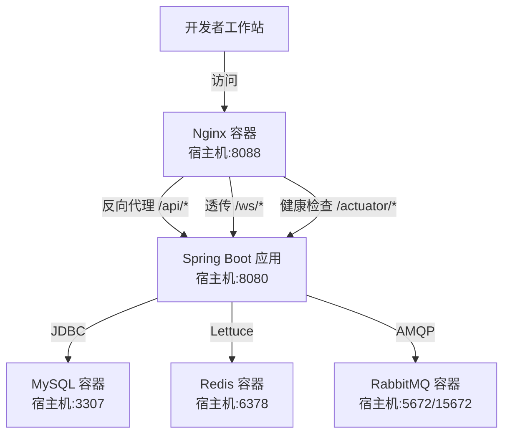
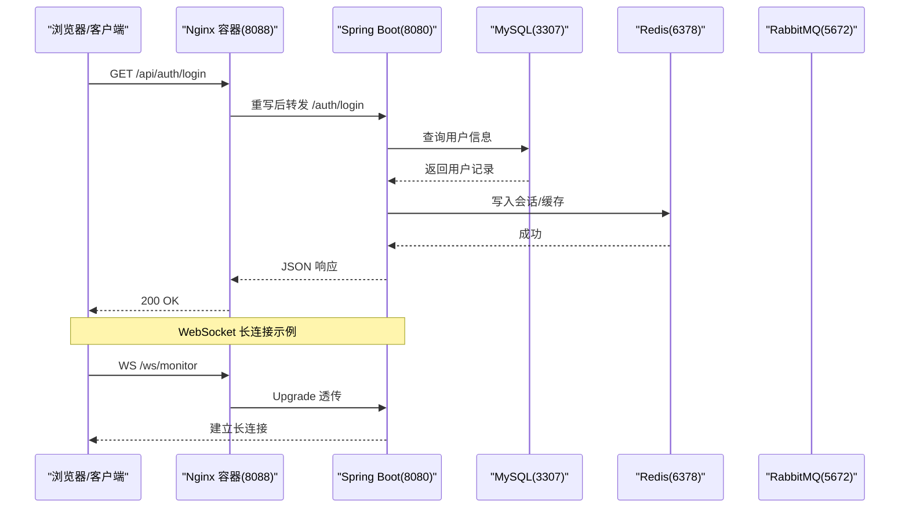
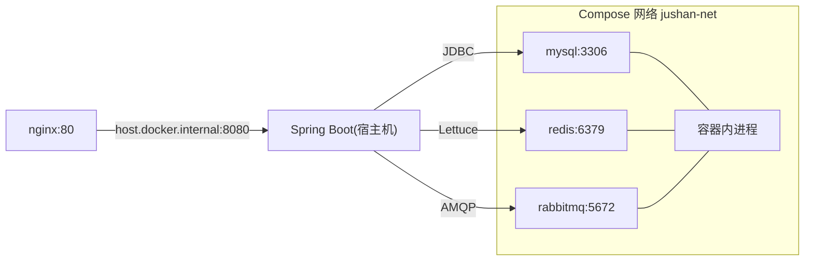

# 开发环境部署

<cite>
**本文引用的文件**   
- [docker-compose.yml](file://docker-compose.yml)
- [nginx.conf](file://docker/nginx/nginx.conf)
- [default.conf](file://docker/nginx/conf.d/default.conf)
- [application.yml](file://parking-boot/src/main/resources/application.yml)
- [application-docker.yml](file://parking-boot/src/main/resources/application-docker.yml)
- [配置说明.md](file://docs/部署运维/配置说明.md)
</cite>

## 目录
1. [简介](#简介)
2. [项目结构](#项目结构)
3. [核心组件](#核心组件)
4. [架构总览](#架构总览)
5. [详细组件分析](#详细组件分析)
6. [依赖关系与网络](#依赖关系与网络)
7. [性能与容量建议](#性能与容量建议)
8. [启动、停止与日志](#启动停止与日志)
9. [常见问题排查](#常见问题排查)
10. [结论](#结论)

## 简介
本指南面向本地开发，使用 Docker Compose 快速搭建 MySQL、Redis、RabbitMQ 和 Nginx 基础设施，并通过 Nginx 反向代理将请求转发到宿主机上运行的 Spring Boot 后端。前端在开发阶段通过 Vite 开发服务器运行，生产构建后可由 Nginx 静态托管。文档涵盖环境变量、端口映射、数据卷管理、服务依赖、前后端分离网络配置以及常见问题的排查方法。

## 项目结构
仓库中与开发环境部署相关的核心位置：
- docker-compose.yml：定义 MySQL、Redis、RabbitMQ、Nginx 四个容器及其网络、端口、健康检查与数据卷。
- docker/nginx：Nginx 主配置与站点配置，负责 API 反向代理、WebSocket 透传与健康检查路由。
- parking-boot/src/main/resources/application*.yml：Spring Boot 应用在不同环境的覆盖配置（local/docker/test/prod）。
- docs/部署运维/配置说明.md：环境变量清单与配置分层说明。

图表来源
- [docker-compose.yml:27-145](file://docker-compose.yml#L27-L145)
- [default.conf:15-87](file://docker/nginx/conf.d/default.conf#L15-L87)
- [application-docker.yml:13-55](file://parking-boot/src/main/resources/application-docker.yml#L13-L55)

章节来源
- [docker-compose.yml:1-25](file://docker-compose.yml#L1-L25)
- [配置说明.md:151-167](file://docs/部署运维/配置说明.md#L151-L167)

## 核心组件
- MySQL 8.4：持久化业务数据，默认字符集 utf8mb4，时区 +08:00，最大连接数 200；首次启动可执行初始化 SQL。
- Redis 7：缓存与会话存储，开启 AOF，限制内存 256MB，淘汰策略 allkeys-lru。
- RabbitMQ 4.x Management：消息队列与管理后台，提供 AMQP 与管理界面。
- Nginx：统一入口，反向代理 API、WebSocket 与 Actuator 健康检查，支持 Gzip 压缩与结构化日志。

章节来源
- [docker-compose.yml:33-63](file://docker-compose.yml#L33-L63)
- [docker-compose.yml:94-116](file://docker-compose.yml#L94-L116)
- [docker-compose.yml:67-90](file://docker-compose.yml#L67-L90)
- [docker-compose.yml:120-145](file://docker-compose.yml#L120-L145)
- [nginx.conf:18-67](file://docker/nginx/nginx.conf#L18-L67)
- [default.conf:15-87](file://docker/nginx/conf.d/default.conf#L15-L87)

## 架构总览
下图展示了本地开发环境下各组件的交互关系与关键路径：

图表来源
- [default.conf:28-72](file://docker/nginx/conf.d/default.conf#L28-L72)
- [application-docker.yml:13-55](file://parking-boot/src/main/resources/application-docker.yml#L13-L55)
- [docker-compose.yml:33-116](file://docker-compose.yml#L33-L116)

## 详细组件分析

### MySQL 容器
- 镜像与版本：mysql:8.4
- 端口映射：宿主机 ${DB_PORT:-3307} -> 容器 3306
- 环境变量：
  - MYSQL_ROOT_PASSWORD=${DB_ROOT_PASSWORD:-root}
  - MYSQL_DATABASE=${DB_NAME:-jushan_platform}
  - MYSQL_USER=${DB_USERNAME:-jushan}
  - MYSQL_PASSWORD=${DB_PASSWORD:-jushan_dev}
  - TZ=Asia/Shanghai
- 数据卷：mysql-data:/var/lib/mysql；可选挂载 ./docker/mysql/init 用于首次初始化脚本
- 健康检查：mysqladmin ping
- 启动参数：utf8mb4 字符集、+08:00 时区、max-connections=200

章节来源
- [docker-compose.yml:33-63](file://docker-compose.yml#L33-L63)

### Redis 容器
- 镜像与版本：redis:7-alpine
- 端口映射：宿主机 ${REDIS_PORT:-6378} -> 容器 6379
- 数据卷：redis-data:/data
- 健康检查：redis-cli ping
- 启动参数：AOF 开启、maxmemory 256mb、allkeys-lru 淘汰策略

章节来源
- [docker-compose.yml:94-116](file://docker-compose.yml#L94-L116)

### RabbitMQ 容器
- 镜像与版本：rabbitmq:4-management-alpine
- 端口映射：
  - AMQP: 宿主机 ${RABBITMQ_AMQP_PORT:-5672} -> 容器 5672
  - 管理后台: 宿主机 ${RABBITMQ_MGMT_PORT:-15672} -> 容器 15672
- 环境变量：
  - RABBITMQ_DEFAULT_USER=${RABBITMQ_USERNAME:-guest}
  - RABBITMQ_DEFAULT_PASS=${RABBITMQ_PASSWORD:-guest}
  - RABBITMQ_DEFAULT_VHOST=${RABBITMQ_VHOST:-/}
- 数据卷：rabbitmq-data:/var/lib/rabbitmq
- 健康检查：rabbitmq-diagnostics check_port_connectivity

章节来源
- [docker-compose.yml:67-90](file://docker-compose.yml#L67-L90)

### Nginx 容器
- 镜像：nginx:alpine
- 端口映射：宿主机 ${NGINX_PORT:-8088} -> 容器 80
- 配置文件挂载：
  - ./docker/nginx/nginx.conf -> /etc/nginx/nginx.conf
  - ./docker/nginx/conf.d -> /etc/nginx/conf.d
- 额外 hosts：extra_hosts host.docker.internal:host-gateway，使容器能访问宿主机
- 站点职责：
  - /api/* 反向代理至 Spring Boot，并去除 /api 前缀
  - /ws/* WebSocket 透传
  - /actuator/* 健康检查透传
  - 预留 /admin 与 /booth 静态资源位（开发阶段不启用）

章节来源
- [docker-compose.yml:120-145](file://docker-compose.yml#L120-L145)
- [default.conf:15-87](file://docker/nginx/conf.d/default.conf#L15-L87)
- [nginx.conf:18-67](file://docker/nginx/nginx.conf#L18-L67)

### Spring Boot 应用（宿主机运行）
- 监听端口：8080
- Profile 选择：
  - 本地开发：local（默认）
  - Docker 环境：docker（通过 -Dspring-boot.run.profiles=docker 或 IDE 设置）
- 数据库连接（docker profile）：
  - jdbc:mysql://localhost:${DB_PORT:3307}/jushan_platform
  - 用户名/密码来自 ${DB_USERNAME}/${DB_PASSWORD}
- Redis 连接（docker profile）：
  - host=${REDIS_HOST:localhost}, port=${REDIS_PORT:6378}
- RabbitMQ 连接（docker profile）：
  - host=${RABBITMQ_HOST:localhost}, port=${RABBITMQ_PORT:5672}
  - username/password/virtual-host 来自对应变量
- Sa-Token 独立 Redis 会话库：database=1（docker profile）
- Actuator：暴露 health/info，基础路径 /actuator

章节来源
- [application.yml:54-86](file://parking-boot/src/main/resources/application.yml#L54-L86)
- [application-docker.yml:13-55](file://parking-boot/src/main/resources/application-docker.yml#L13-L55)
- [application-docker.yml:56-72](file://parking-boot/src/main/resources/application-docker.yml#L56-L72)

## 依赖关系与网络
- 容器网络：所有服务加入 jushan-net 桥接网络，容器间可通过服务名互通（如 mysql、redis、rabbitmq）。
- 宿主机访问：Nginx 通过 extra_hosts 注入 host.docker.internal 指向宿主网关，以便反向代理到宿主机上的 Spring Boot（8080）。
- 服务健康检查：
  - MySQL：mysqladmin ping
  - Redis：redis-cli ping
  - RabbitMQ：rabbitmq-diagnostics check_port_connectivity
- Nginx 依赖：depends_on 指定等待三个服务健康后再启动。

图表来源
- [docker-compose.yml:146-167](file://docker-compose.yml#L146-L167)
- [docker-compose.yml:135-145](file://docker-compose.yml#L135-L145)
- [default.conf:15-19](file://docker/nginx/conf.d/default.conf#L15-L19)

章节来源
- [docker-compose.yml:146-167](file://docker-compose.yml#L146-L167)
- [docker-compose.yml:135-145](file://docker-compose.yml#L135-L145)

## 性能与容量建议
- MySQL：
  - 已设置 max-connections=200，适合本地开发；可根据并发需求调整 Hikari 池大小。
  - 字符集与时区已按国内常用配置设定。
- Redis：
  - 限制内存 256MB，避免占用过多宿主机内存；AOF 保证一定持久性。
- RabbitMQ：
  - 使用 management 镜像便于本地调试；注意管理后台端口不要与宿主机冲突。
- Nginx：
  - 已开启 gzip 压缩，提升传输效率；access_log 包含上游耗时与 trace_id，便于定位问题。

章节来源
- [docker-compose.yml:58-63](file://docker-compose.yml#L58-L63)
- [docker-compose.yml:111-116](file://docker-compose.yml#L111-L116)
- [nginx.conf:44-61](file://docker/nginx/nginx.conf#L44-L61)

## 启动、停止与日志
- 前置准备
  - 复制并编辑环境变量文件（参考配置说明中的环境变量表），确保端口不与宿主机已有服务冲突。
- 启动基础设施
  - 仅启动数据库与缓存：docker compose up -d mysql redis
  - 启动全部服务（含 Nginx）：docker compose up -d
- 启动后端（宿主机）
  - Maven：./mvnw spring-boot:run -Dspring-boot.run.profiles=docker
  - IDE：设置 Active profiles 为 docker，并确保 application-docker.yml 生效
- 启动前端（宿主机）
  - admin-web：pnpm dev（Vite 开发服务器）
  - booth-web：pnpm dev（Vite 开发服务器）
- 访问地址
  - API：http://localhost:8088/api/*
  - WebSocket：ws://localhost:8088/ws/*
  - 健康检查：http://localhost:8088/actuator/health
- 查看日志
  - 容器日志：docker compose logs -f
  - Nginx 访问日志：docker compose logs nginx
- 停止与清理
  - 停止服务：docker compose down
  - 停止并删除数据卷（重置数据库等）：docker compose down -v

章节来源
- [docker-compose.yml:7-25](file://docker-compose.yml#L7-L25)
- [application-docker.yml:4-11](file://parking-boot/src/main/resources/application-docker.yml#L4-L11)
- [配置说明.md:151-167](file://docs/部署运维/配置说明.md#L151-L167)

## 常见问题排查
- 端口冲突
  - 现象：容器无法启动或外部无法访问
  - 处理：修改 .env 中 DB_PORT、REDIS_PORT、RABBITMQ_*_PORT、NGINX_PORT 为非冲突端口
- 数据库连接失败
  - 现象：应用启动时报 JDBC 连接错误
  - 处理：确认 application-docker.yml 使用的 DB_PORT/用户名/密码与 .env 一致；检查 MySQL 健康状态
- Redis 连接失败
  - 现象：会话或缓存相关异常
  - 处理：确认 REDIS_PORT 与 application-docker.yml 一致；检查 Redis 健康状态
- RabbitMQ 连接失败
  - 现象：消息发送/消费异常
  - 处理：确认 RABBITMQ_* 变量与端口映射一致；登录管理后台验证虚拟主机与账号权限
- Nginx 无法代理到后端
  - 现象：/api/* 返回 502/504
  - 处理：确认 Spring Boot 已在宿主机 8080 启动；检查 Nginx upstream 配置与 host.docker.internal 解析
- WebSocket 连接失败
  - 现象：ws://localhost:8088/ws/* 无法建立连接
  - 处理：检查 Nginx 是否透传 Upgrade 头；确认后端 WebSocket 处理器可用
- 健康检查不可用
  - 现象：/actuator/health 无响应
  - 处理：确认后端暴露了 health/info 端点且未被安全拦截；检查 Nginx 代理规则

章节来源
- [default.conf:28-87](file://docker/nginx/conf.d/default.conf#L28-L87)
- [application-docker.yml:13-55](file://parking-boot/src/main/resources/application-docker.yml#L13-L55)
- [docker-compose.yml:52-57](file://docker-compose.yml#L52-L57)
- [docker-compose.yml:105-110](file://docker-compose.yml#L105-L110)
- [docker-compose.yml:84-89](file://docker-compose.yml#L84-L89)

## 结论
通过 Docker Compose 提供的 MySQL、Redis、RabbitMQ 与 Nginx 基础设施，结合 Spring Boot 的 docker profile 与环境变量注入，可在本地快速搭建前后端分离的开发环境。Nginx 作为统一入口，简化了跨域与路径重写，同时保留了对 WebSocket 与 Actuator 的支持。遵循本文的环境变量与端口约定，即可高效完成服务的启动、联调与排障。