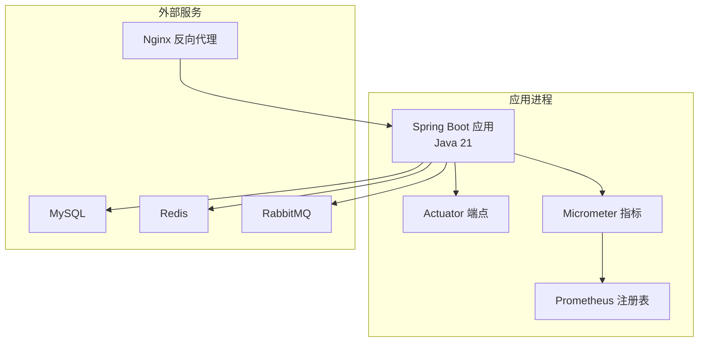
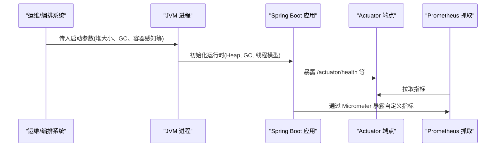
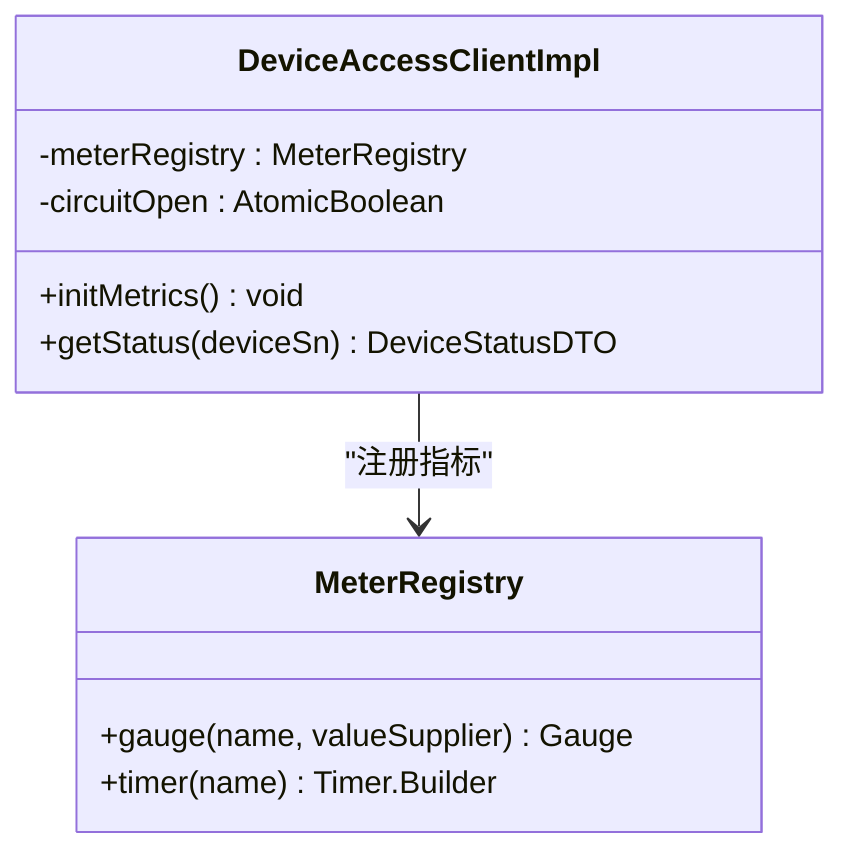
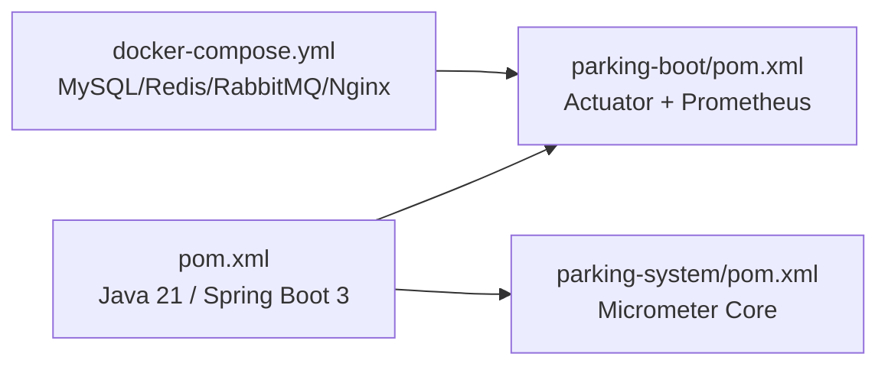

# JVM调优

<cite>
**本文引用的文件**   
- [pom.xml](file://pom.xml)
- [ParkingApplication.java](file://parking-boot/src/main/java/com/jushan/boot/ParkingApplication.java)
- [application-docker.yml](file://parking-boot/src/main/resources/application-docker.yml)
- [application-prod.yml](file://parking-boot/src/main/resources/application-prod.yml)
- [docker-compose.yml](file://docker-compose.yml)
- [DeviceAccessClientImpl.java](file://parking-system/src/main/java/com/jushan/system/client/DeviceAccessClientImpl.java)
- [parking-boot/pom.xml](file://parking-boot/pom.xml)
- [parking-system/pom.xml](file://parking-system/pom.xml)
</cite>

## 目录
1. [简介](#简介)
2. [项目结构](#项目结构)
3. [核心组件](#核心组件)
4. [架构总览](#架构总览)
5. [详细组件分析](#详细组件分析)
6. [依赖分析](#依赖分析)
7. [性能考虑](#性能考虑)
8. [故障排查指南](#故障排查指南)
9. [结论](#结论)
10. [附录](#附录)

## 简介
本指南面向在本仓库基础上进行生产部署与运维的工程师，聚焦JVM性能调优实践。内容覆盖：
- JVM启动参数配置（堆内存、新生代/老年代比例）
- 垃圾回收器选择策略（G1、ZGC）及适用场景
- 容器环境下的JVM参数优化（内存限制感知、CPU核心数检测）
- 不同负载场景的参数模板与监控指标
- 常见JVM问题诊断方法与性能分析工具使用建议

说明：本项目未内置JVM启动参数或GC日志开关，因此本节提供通用最佳实践与可操作清单，并结合项目中已集成的Actuator与Micrometer能力给出监控落地方案。

## 项目结构
后端采用Spring Boot 3 + Java 21的多模块单体架构，关键与JVM相关的基础设施包括：
- Spring Boot Actuator：暴露健康检查等端点
- Micrometer + Prometheus Registry：采集并暴露应用指标
- Docker Compose：编排MySQL、Redis、RabbitMQ、Nginx等基础设施

图表来源
- [ParkingApplication.java:1-30](file://parking-boot/src/main/java/com/jushan/boot/ParkingApplication.java#L1-L30)
- [parking-boot/pom.xml:41-51](file://parking-boot/pom.xml#L41-L51)
- [parking-system/pom.xml:41-45](file://parking-system/pom.xml#L41-L45)

章节来源
- [pom.xml:15-44](file://pom.xml#L15-L44)
- [ParkingApplication.java:1-30](file://parking-boot/src/main/java/com/jushan/boot/ParkingApplication.java#L1-L30)
- [parking-boot/pom.xml:41-51](file://parking-boot/pom.xml#L41-L51)
- [parking-system/pom.xml:41-45](file://parking-system/pom.xml#L41-L45)

## 核心组件
- 应用入口：Spring Boot主类负责扫描包与启动上下文
- 运行期配置：按profile加载数据库、缓存、消息队列等连接信息
- 监控能力：Actuator健康检查；Micrometer指标采集与Prometheus导出

章节来源
- [ParkingApplication.java:1-30](file://parking-boot/src/main/java/com/jushan/boot/ParkingApplication.java#L1-L30)
- [application-docker.yml:1-88](file://parking-boot/src/main/resources/application-docker.yml#L1-L88)
- [application-prod.yml:1-83](file://parking-boot/src/main/resources/application-prod.yml#L1-L83)
- [parking-boot/pom.xml:41-51](file://parking-boot/pom.xml#L41-L51)
- [parking-system/pom.xml:41-45](file://parking-system/pom.xml#L41-L45)

## 架构总览
从JVM视角看，应用进程承载业务逻辑、中间件客户端与监控采集器。容器化部署时，JVM需正确识别容器资源限制，避免过度分配导致抖动或OOM。

图表来源
- [ParkingApplication.java:1-30](file://parking-boot/src/main/java/com/jushan/boot/ParkingApplication.java#L1-L30)
- [parking-boot/pom.xml:41-51](file://parking-boot/pom.xml#L41-L51)
- [parking-system/pom.xml:41-45](file://parking-system/pom.xml#L41-L45)

## 详细组件分析

### JVM启动参数与堆内存设置
- 初始堆与最大堆
  - 建议将初始堆与最大堆设置为相同值，减少运行时堆扩容带来的停顿与碎片风险
  - 参考路径：[JVM启动参数建议](file://README.md)（概念性说明，非代码引用）
- 新生代与老年代比例
  - 默认比例通常适用于多数Web应用；若出现频繁Minor GC或晋升失败，可结合压测调整
  - 注意：在G1中更关注Region划分与目标停顿时间，而非显式设置新旧代比例
- 元空间（Metaspace）
  - 动态类加载较多的应用可适当增大，避免频繁Full GC触发元空间回收
- 其他常用参数
  - 启用容器感知（见下一节）
  - 合理设置线程栈大小、GC日志输出位置与轮转策略

章节来源
- [pom.xml:24-44](file://pom.xml#L24-L44)

### 垃圾回收器选择策略（G1、ZGC）
- G1
  - 适用：大多数企业级应用，尤其是延迟敏感且堆较大（数十GB级别）的场景
  - 特点：分代+Region，可通过目标停顿时间控制，吞吐与延迟平衡较好
- ZGC
  - 适用：超低延迟要求、大堆（数百GB）场景，对STW停顿极其敏感
  - 特点：并发标记、并发转移，停顿时间稳定在亚毫秒级
- 选择建议
  - 优先以G1作为默认选择；当压测发现不可接受的停顿抖动且硬件具备多核优势时，评估ZGC
  - 切换GC后需配合压测验证吞吐、延迟与GC日志变化

章节来源
- [pom.xml:24-44](file://pom.xml#L24-L44)

### 容器环境下的JVM参数优化
- 内存限制感知
  - 使用容器感知参数使JVM自动识别cgroup内存上限，避免超出容器限制导致被OOMKilled
  - 参考路径：[容器化部署说明](file://docker-compose.yml)
- CPU核心数检测
  - 确保JVM可见到正确的CPU核心数，避免线程池过大导致上下文切换开销
- 推荐组合
  - 启用容器感知
  - 设置合理的堆大小（通常为容器内存限制的约60%-75%，视应用特征而定）
  - 开启GC日志并定期归档，便于离线分析

章节来源
- [docker-compose.yml:1-167](file://docker-compose.yml#L1-L167)

### 监控指标与Actuator集成
- Actuator健康检查
  - 生产环境建议仅暴露必要端点，隐藏详细信息
  - 参考路径：[生产配置中的Actuator设置](file://parking-boot/src/main/resources/application-prod.yml)
- Micrometer指标
  - 项目已引入Micrometer Core与Prometheus Registry，支持自定义指标采集与Prometheus抓取
  - 示例：设备访问客户端中注册了调用次数、错误次数、延迟计时器与断路器状态Gauge
  - 参考路径：
    - [Micrometer依赖（boot模块）](file://parking-boot/pom.xml)
    - [Micrometer依赖（system模块）](file://parking-system/pom.xml)
    - [指标注册与采样实现](file://parking-system/src/main/java/com/jushan/system/client/DeviceAccessClientImpl.java)

图表来源
- [DeviceAccessClientImpl.java:92-126](file://parking-system/src/main/java/com/jushan/system/client/DeviceAccessClientImpl.java#L92-L126)
- [parking-system/pom.xml:41-45](file://parking-system/pom.xml#L41-L45)
- [parking-boot/pom.xml:41-51](file://parking-boot/pom.xml#L41-L51)

章节来源
- [application-prod.yml:67-76](file://parking-boot/src/main/resources/application-prod.yml#L67-L76)
- [parking-boot/pom.xml:41-51](file://parking-boot/pom.xml#L41-L51)
- [parking-system/pom.xml:41-45](file://parking-system/pom.xml#L41-L45)
- [DeviceAccessClientImpl.java:92-126](file://parking-system/src/main/java/com/jushan/system/client/DeviceAccessClientImpl.java#L92-L126)

### 不同负载场景的JVM参数模板（概念性）
以下为通用模板思路，请结合实际压测结果调整：
- 低延迟高吞吐（G1）
  - 启用容器感知
  - 设置初始堆=最大堆
  - 配置目标停顿时间与GC日志
- 超大堆极低停顿（ZGC）
  - 启用容器感知
  - 设置足够大的堆以满足对象驻留需求
  - 关注CPU占用与吞吐权衡
- 批处理/计算密集型
  - 适当增大线程栈与工作线程数
  - 关注I/O与CPU瓶颈，避免过度并行

章节来源
- [pom.xml:24-44](file://pom.xml#L24-L44)

## 依赖分析
- 构建与运行时版本
  - Java 21、Spring Boot 3.x
- 监控与可观测性
  - Micrometer Core + Prometheus Registry
- 外部依赖
  - MySQL、Redis、RabbitMQ由Docker Compose编排

图表来源
- [pom.xml:15-44](file://pom.xml#L15-L44)
- [parking-boot/pom.xml:41-51](file://parking-boot/pom.xml#L41-L51)
- [parking-system/pom.xml:41-45](file://parking-system/pom.xml#L41-L45)
- [docker-compose.yml:1-167](file://docker-compose.yml#L1-L167)

章节来源
- [pom.xml:15-44](file://pom.xml#L15-L44)
- [parking-boot/pom.xml:41-51](file://parking-boot/pom.xml#L41-L51)
- [parking-system/pom.xml:41-45](file://parking-system/pom.xml#L41-L45)
- [docker-compose.yml:1-167](file://docker-compose.yml#L1-L167)

## 性能考虑
- 堆与GC
  - 统一初始堆与最大堆，减少扩容抖动
  - 根据负载类型选择G1或ZGC，并以压测验证
- 容器感知
  - 启用容器感知，避免JVM误判可用内存与CPU
- 线程与连接池
  - 根据CPU核心数与外部服务容量合理设置线程池与连接池大小
- 监控与告警
  - 基于Actuator与Micrometer建立关键指标看板与阈值告警

## 故障排查指南
- 常见问题定位
  - OOM：检查堆大小、对象生命周期、是否存在内存泄漏
  - 频繁GC：观察GC日志，确认是否因堆过小或对象晋升过快
  - 高延迟：结合Micrometer延迟指标与链路追踪定位热点接口
- 工具建议
  - jstat、jmap、jstack用于在线诊断
  - GC日志分析与可视化工具用于离线复盘
  - 结合Prometheus/Grafana查看应用指标趋势

章节来源
- [application-prod.yml:67-76](file://parking-boot/src/main/resources/application-prod.yml#L67-L76)
- [parking-boot/pom.xml:41-51](file://parking-boot/pom.xml#L41-L51)
- [parking-system/pom.xml:41-45](file://parking-system/pom.xml#L41-L45)

## 结论
- 以容器感知为基础，合理设置堆大小与GC策略
- 以G1为默认选择，必要时评估ZGC
- 借助Actuator与Micrometer建立完善的监控体系，持续压测与回归验证
- 针对具体负载特征微调参数，形成环境与场景化的参数基线

## 附录
- 配置文件参考
  - 开发环境配置（含数据源、Redis、RabbitMQ、Actuator）：[application-docker.yml](file://parking-boot/src/main/resources/application-docker.yml)
  - 生产环境配置（安全模式Actuator、连接池与环境变量注入）：[application-prod.yml](file://parking-boot/src/main/resources/application-prod.yml)
- 指标实现参考
  - 设备访问客户端指标注册与采样：[DeviceAccessClientImpl.java](file://parking-system/src/main/java/com/jushan/system/client/DeviceAccessClientImpl.java)