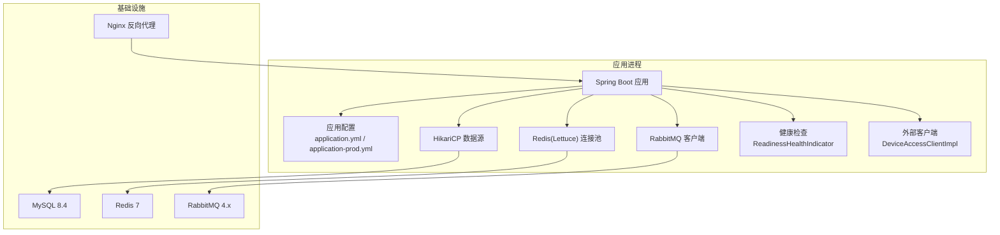
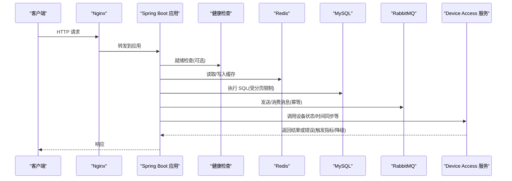
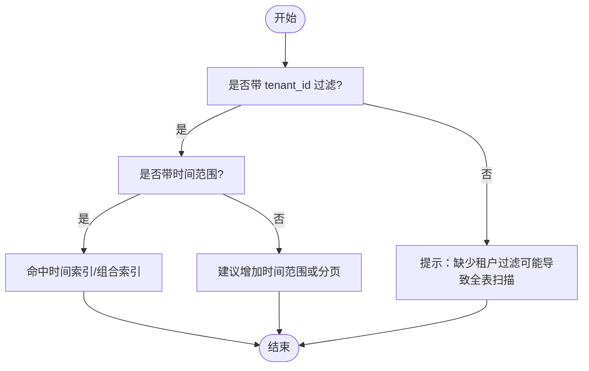
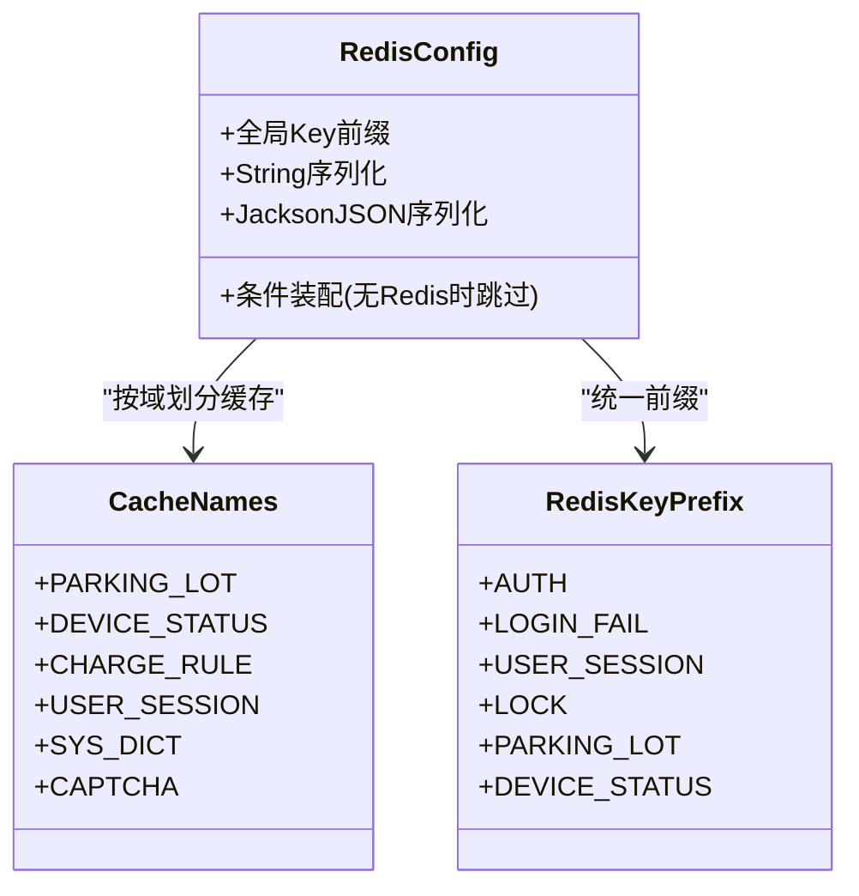
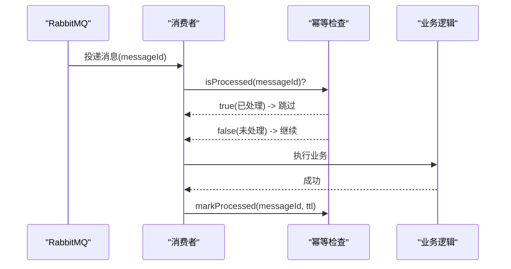
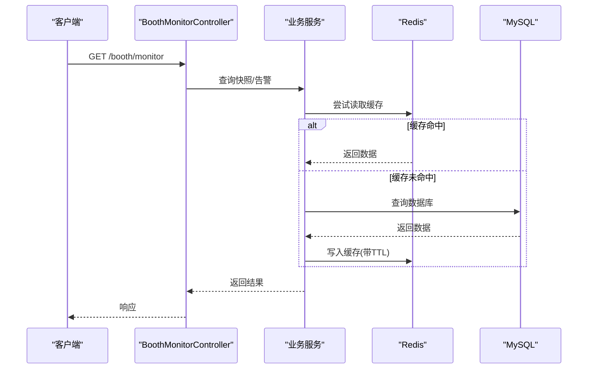
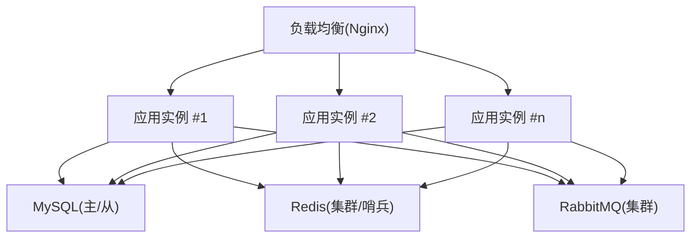
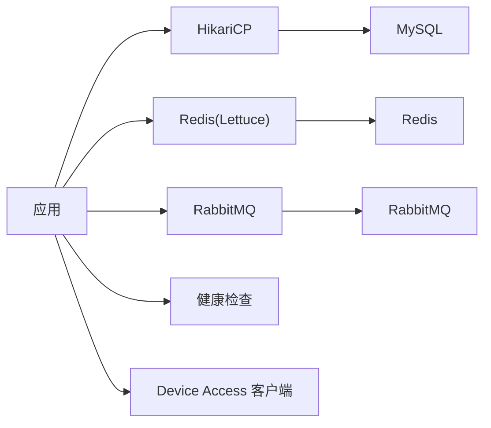

# 性能优化

<cite>
**本文引用的文件**   
- [application.yml](file://parking-boot/src/main/resources/application.yml)
- [application-prod.yml](file://parking-boot/src/main/resources/application-prod.yml)
- [docker-compose.yml](file://docker-compose.yml)
- [MyBatisConfig.java](file://parking-boot/src/main/java/com/jushan/boot/config/MyBatisConfig.java)
- [ReadinessHealthIndicator.java](file://parking-boot/src/main/java/com/jushan/boot/health/ReadinessHealthIndicator.java)
- [RedisConfig.java](file://parking-framework/src/main/java/com/jushan/framework/redis/RedisConfig.java)
- [CacheNames.java](file://parking-framework/src/main/java/com/jushan/framework/redis/CacheNames.java)
- [RedisKeyPrefix.java](file://parking-framework/src/main/java/com/jushan/framework/redis/RedisKeyPrefix.java)
- [MessageIdempotency.java](file://parking-framework/src/main/java/com/jushan/framework/mq/MessageIdempotency.java)
- [DeviceAccessClientImpl.java](file://parking-system/src/main/java/com/jushan/system/client/DeviceAccessClientImpl.java)
- [BoothMonitorController.java](file://parking-system/src/main/java/com/jushan/system/controller/BoothMonitorController.java)
- [section_03_ddl.md](file://docs/开发计划/section_03_ddl.md)
- [V20260711011__device_status_snapshot.sql](file://parking-boot/src/main/resources/db/migration/V20260711011__device_status_snapshot.sql)
</cite>

## 目录
1. [引言](#引言)
2. [项目结构](#项目结构)
3. [核心组件](#核心组件)
4. [架构总览](#架构总览)
5. [详细组件分析](#详细组件分析)
6. [依赖分析](#依赖分析)
7. [性能考虑](#性能考虑)
8. [故障排查指南](#故障排查指南)
9. [结论](#结论)
10. [附录](#附录)

## 引言
本指南聚焦于系统级性能优化，覆盖 JVM 与内存、垃圾回收策略、数据库连接池与查询优化、索引设计、Redis 缓存策略与热点处理、消息队列消费与背压、API 接口性能与监控、以及容器资源限制与水平扩展。内容基于仓库中现有配置与实现进行提炼，并提供可落地的调优建议与可视化图示，帮助读者快速定位瓶颈并实施改进。

## 项目结构
本项目采用多模块 Maven 工程，后端基于 Spring Boot 3，集成 MyBatis-Plus、Sa-Token、RabbitMQ、Redis（Lettuce）、Flyway 迁移与健康检查等能力；前端包含管理端与岗亭端，Nginx 作为反向代理。关键性能相关配置集中在应用配置文件、框架层 Redis/MQ 配置、健康检查与客户端容错实现中。

图表来源
- [application.yml:22-52](file://parking-boot/src/main/resources/application.yml#L22-L52)
- [application-prod.yml:17-46](file://parking-boot/src/main/resources/application-prod.yml#L17-L46)
- [docker-compose.yml:33-116](file://docker-compose.yml#L33-L116)
- [ReadinessHealthIndicator.java:72-113](file://parking-boot/src/main/java/com/jushan/boot/health/ReadinessHealthIndicator.java#L72-L113)
- [DeviceAccessClientImpl.java:196-230](file://parking-system/src/main/java/com/jushan/system/client/DeviceAccessClientImpl.java#L196-L230)

章节来源
- [application.yml:1-108](file://parking-boot/src/main/resources/application.yml#L1-L108)
- [application-prod.yml:1-83](file://parking-boot/src/main/resources/application-prod.yml#L1-L83)
- [docker-compose.yml:1-167](file://docker-compose.yml#L1-L167)

## 核心组件
- 数据源与分页：使用 HikariCP 连接池与 MyBatis-Plus 分页插件，内置最大页大小限制，防止深度分页拖垮数据库。
- Redis 缓存：统一 Key 前缀与序列化策略，按业务域划分缓存名称空间，支持安全降级（无 Redis 时不阻塞启动）。
- 消息幂等：提供 messageId 级别的幂等接口，结合 TTL 自动清理，避免重复消费导致的数据不一致与存储膨胀。
- 外部服务容错：对 Device Access 调用实现连续失败计数与指标上报，具备熔断降级的基础能力。
- 健康检查：自定义 Readiness 探针，校验 MySQL 与 Redis 连通性，便于编排平台进行滚动发布与流量切换。

章节来源
- [MyBatisConfig.java:70-87](file://parking-boot/src/main/java/com/jushan/boot/config/MyBatisConfig.java#L70-L87)
- [RedisConfig.java:1-35](file://parking-framework/src/main/java/com/jushan/framework/redis/RedisConfig.java#L1-L35)
- [CacheNames.java:1-39](file://parking-framework/src/main/java/com/jushan/framework/redis/CacheNames.java#L1-L39)
- [MessageIdempotency.java:1-38](file://parking-framework/src/main/java/com/jushan/framework/mq/MessageIdempotency.java#L1-L38)
- [DeviceAccessClientImpl.java:196-230](file://parking-system/src/main/java/com/jushan/system/client/DeviceAccessClientImpl.java#L196-L230)
- [ReadinessHealthIndicator.java:72-113](file://parking-boot/src/main/java/com/jushan/boot/health/ReadinessHealthIndicator.java#L72-L113)

## 架构总览
下图展示请求在网关、应用、缓存、数据库与消息中间件之间的流转路径，以及健康检查与外部客户端的交互点。

图表来源
- [docker-compose.yml:118-145](file://docker-compose.yml#L118-L145)
- [application.yml:75-92](file://parking-boot/src/main/resources/application.yml#L75-L92)
- [ReadinessHealthIndicator.java:72-113](file://parking-boot/src/main/java/com/jushan/boot/health/ReadinessHealthIndicator.java#L72-L113)
- [DeviceAccessClientImpl.java:196-230](file://parking-system/src/main/java/com/jushan/system/client/DeviceAccessClientImpl.java#L196-L230)

## 详细组件分析

### 数据库连接池与查询优化
- 连接池参数
  - 默认环境：maximum-pool-size=10，minimum-idle=2，idle-timeout=300s，connection-timeout=10s。
  - 生产环境：通过环境变量注入 DB_POOL_MAX、DB_POOL_MIN，默认值分别为 20、5。
  - 建议：根据 CPU 核数与 IO 特性设置 pool size，通常 2×CPU + 磁盘旋转因子；在高并发读场景可适当提高 minimum-idle 以降低冷启动延迟。
- 分页与深度查询防护
  - 分页插件最大每页 200 条，避免大偏移量导致的慢查询与全表扫描。
  - 建议：列表接口强制分页，禁止无界查询；复杂统计走离线聚合或物化视图。
- 事务与锁
  - 短事务、最小锁定范围；写多读少场景关注行锁竞争，必要时引入读写分离或分库分表。

章节来源
- [application.yml:22-31](file://parking-boot/src/main/resources/application.yml#L22-L31)
- [application-prod.yml:17-26](file://parking-boot/src/main/resources/application-prod.yml#L17-L26)
- [MyBatisConfig.java:70-75](file://parking-boot/src/main/java/com/jushan/boot/config/MyBatisConfig.java#L70-L75)

### 索引设计与查询性能
- 通用要求
  - 所有业务表需包含 tenant_id 与 deleted_at 索引。
  - 高频字段建立组合索引，如 (tenant_id, lot_id, recognize_time)、(tenant_id, lot_id, order_status, created_at)、(tenant_id, lot_id, plate_number)。
  - 车牌统一大写存储，模糊搜索使用前缀匹配或搜索引擎。
  - 时间字段建索引，必要时分区；大表按租户或时间规划分表/分区。
  - 乐观锁 version 配合更新条件，防止并发覆盖。
- 快照表索引示例
  - device_status_snapshot 已定义设备 ID、采集时间、查询成功标志等索引，利于最新快照与筛选查询。

图表来源
- [section_03_ddl.md:2014-2028](file://docs/开发计划/section_03_ddl.md#L2014-L2028)
- [V20260711011__device_status_snapshot.sql:27-31](file://parking-boot/src/main/resources/db/migration/V20260711011__device_status_snapshot.sql#L27-L31)

章节来源
- [section_03_ddl.md:2014-2028](file://docs/开发计划/section_03_ddl.md#L2014-L2028)
- [V20260711011__device_status_snapshot.sql:27-31](file://parking-boot/src/main/resources/db/migration/V20260711011__device_status_snapshot.sql#L27-L31)

### Redis 缓存策略与热点处理
- 命名空间与 Key 前缀
  - 全局前缀 jushan: 由 RedisTemplate 统一附加；业务 Key 按领域分层，如 auth:、biz: 等。
  - 缓存名称常量集中管理，避免硬编码与跨域混用。
- 序列化与安全降级
  - Key 使用 String 序列化，Value 使用 Jackson JSON；当未启用 Redis 时自动跳过配置，不影响测试与非 Redis 场景。
- 热点与穿透防护
  - 热点 Key 加互斥重建与短 TTL 防雪崩；空值缓存短 TTL 防穿透；布隆过滤器用于不存在 Key 的快速否定。
  - 针对高并发读，优先本地缓存+分布式缓存二级架构，注意一致性策略。

图表来源
- [RedisConfig.java:1-35](file://parking-framework/src/main/java/com/jushan/framework/redis/RedisConfig.java#L1-L35)
- [CacheNames.java:1-39](file://parking-framework/src/main/java/com/jushan/framework/redis/CacheNames.java#L1-L39)
- [RedisKeyPrefix.java:1-46](file://parking-framework/src/main/java/com/jushan/framework/redis/RedisKeyPrefix.java#L1-L46)

章节来源
- [RedisConfig.java:1-35](file://parking-framework/src/main/java/com/jushan/framework/redis/RedisConfig.java#L1-L35)
- [CacheNames.java:1-39](file://parking-framework/src/main/java/com/jushan/framework/redis/CacheNames.java#L1-L39)
- [RedisKeyPrefix.java:1-46](file://parking-framework/src/main/java/com/jushan/framework/redis/RedisKeyPrefix.java#L1-L46)

### 消息队列消费优化与幂等
- 幂等机制
  - 消费者在处理前检查 messageId 是否已处理，成功后标记并设置 TTL，避免堆积与重复消费。
  - 与业务 eventId 幂等互补，分别应对“消息重复投递”和“相同业务事件重复创建”。
- 消费吞吐与背压
  - 合理设置并发消费者数量与 prefetch 数量，避免内存暴涨；对慢消费者进行限流与重试退避。
  - 将耗时操作异步化，主流程只落盘/发事件，后续再批量处理。

图表来源
- [MessageIdempotency.java:1-38](file://parking-framework/src/main/java/com/jushan/framework/mq/MessageIdempotency.java#L1-L38)

章节来源
- [MessageIdempotency.java:1-38](file://parking-framework/src/main/java/com/jushan/framework/mq/MessageIdempotency.java#L1-L38)

### API 接口性能与监控
- 控制器与监控
  - 典型接口如岗亭监控控制器，面向实时快照与告警查询，建议结合缓存与分页控制。
- 外部服务容错与指标
  - Device Access 客户端记录调用总数、错误类型、延迟指标，并在连续失败后抛出降级异常，为观测与自愈提供依据。
- 健康检查
  - 自定义 Readiness 探针检查数据库与 Redis 连通性，输出详细诊断信息，便于编排平台决策。

图表来源
- [BoothMonitorController.java:1-34](file://parking-system/src/main/java/com/jushan/system/controller/BoothMonitorController.java#L1-L34)
- [ReadinessHealthIndicator.java:72-113](file://parking-boot/src/main/java/com/jushan/boot/health/ReadinessHealthIndicator.java#L72-L113)
- [DeviceAccessClientImpl.java:196-230](file://parking-system/src/main/java/com/jushan/system/client/DeviceAccessClientImpl.java#L196-L230)

章节来源
- [BoothMonitorController.java:1-34](file://parking-system/src/main/java/com/jushan/system/controller/BoothMonitorController.java#L1-L34)
- [DeviceAccessClientImpl.java:196-230](file://parking-system/src/main/java/com/jushan/system/client/DeviceAccessClientImpl.java#L196-L230)
- [ReadinessHealthIndicator.java:72-113](file://parking-boot/src/main/java/com/jushan/boot/health/ReadinessHealthIndicator.java#L72-L113)

### 容器资源限制与水平扩展
- 容器镜像与服务
  - Docker Compose 提供 MySQL 8.4、Redis 7、RabbitMQ 4.x、Nginx 反向代理，端口映射与数据卷持久化。
  - Redis 开启 AOF 与 LRU 淘汰策略，限制最大内存，避免 OOM。
- 水平扩展
  - 应用无状态化，通过多实例部署与负载均衡提升吞吐；会话与共享状态下沉至 Redis。
  - 数据库侧可通过只读副本分担读压力；消息队列横向扩容消费者实例。

图表来源
- [docker-compose.yml:33-116](file://docker-compose.yml#L33-L116)
- [docker-compose.yml:118-145](file://docker-compose.yml#L118-L145)

章节来源
- [docker-compose.yml:1-167](file://docker-compose.yml#L1-L167)

## 依赖分析
- 组件耦合
  - 应用层依赖数据源、Redis、RabbitMQ 与外部 Device Access 服务；健康检查与客户端容错增强可观测性与稳定性。
- 外部依赖
  - MySQL、Redis、RabbitMQ 版本与参数在 Compose 中明确；Nginx 作为入口反向代理。
- 潜在风险
  - 连接池过大导致数据库连接耗尽；Redis 内存不足引发淘汰风暴；消息积压导致消费延迟。

图表来源
- [application.yml:22-52](file://parking-boot/src/main/resources/application.yml#L22-L52)
- [application-prod.yml:17-46](file://parking-boot/src/main/resources/application-prod.yml#L17-L46)
- [docker-compose.yml:33-116](file://docker-compose.yml#L33-L116)

章节来源
- [application.yml:22-52](file://parking-boot/src/main/resources/application.yml#L22-L52)
- [application-prod.yml:17-46](file://parking-boot/src/main/resources/application-prod.yml#L17-L46)
- [docker-compose.yml:33-116](file://docker-compose.yml#L33-L116)

## 性能考虑
- JVM 与 GC
  - 建议启用 ZGC 或 G1，根据堆大小与停顿目标选择；开启 GC 日志与 JFR，结合 Prometheus/Grafana 观测。
  - 调整新生代/老年代比例与晋升阈值，减少 Full GC 频率；避免大对象直接入老年代。
- 连接池与线程池
  - 根据 CPU 与 IO 特征设置 HikariCP 与 Tomcat 线程池；避免线程饥饿与上下文切换开销。
- 缓存与热点
  - 热点 Key 加互斥重建与短 TTL；空值缓存防穿透；布隆过滤器快速否定；多级缓存降低远端压力。
- 消息与背压
  - 控制消费者并发与预取数量；慢消费者限流与重试退避；死信队列与监控告警。
- API 与监控
  - 接口限流、分页与字段裁剪；链路追踪与指标埋点；健康检查与就绪探针保障滚动发布安全。
- 容器与编排
  - 合理设置 CPU/内存限制与请求/上限；多实例水平扩展；数据库与缓存高可用与弹性伸缩。

[本节为通用指导，无需具体文件引用]

## 故障排查指南
- 健康检查
  - 查看 readiness/liveness 探针输出，确认数据库与 Redis 连通性；异常时关注错误详情与诊断信息。
- 外部服务容错
  - 观察 Device Access 客户端指标（调用总数、错误类型、延迟），连续失败触发降级时及时告警与回滚。
- 数据库与索引
  - 使用 EXPLAIN 分析慢查询，确保必要索引存在；避免深度分页与大事务。
- 缓存与消息
  - 检查 Redis 内存与淘汰策略；监控消息积压与消费延迟，及时处理死信与异常分支。

章节来源
- [ReadinessHealthIndicator.java:72-113](file://parking-boot/src/main/java/com/jushan/boot/health/ReadinessHealthIndicator.java#L72-L113)
- [DeviceAccessClientImpl.java:196-230](file://parking-system/src/main/java/com/jushan/system/client/DeviceAccessClientImpl.java#L196-L230)

## 结论
通过合理的 JVM/GC 调优、连接池与索引设计、缓存与消息策略、API 监控与容器编排，可在保证稳定性的前提下显著提升吞吐与响应速度。建议以指标驱动持续优化，结合压测与线上观测不断迭代。

[本节为总结，无需具体文件引用]

## 附录
- 配置与环境变量
  - 生产敏感配置通过环境变量注入，缺失则启动失败，避免误配上线。
  - 参考生产配置骨架中的默认值与占位符，结合 .env.example 完善部署清单。

章节来源
- [application-prod.yml:1-83](file://parking-boot/src/main/resources/application-prod.yml#L1-L83)