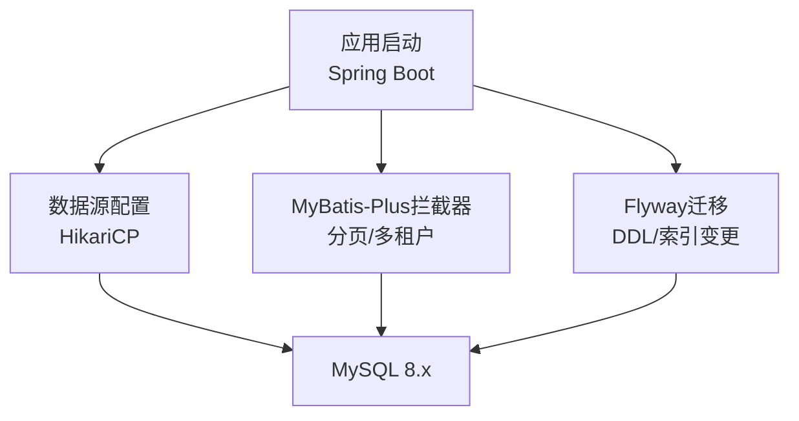
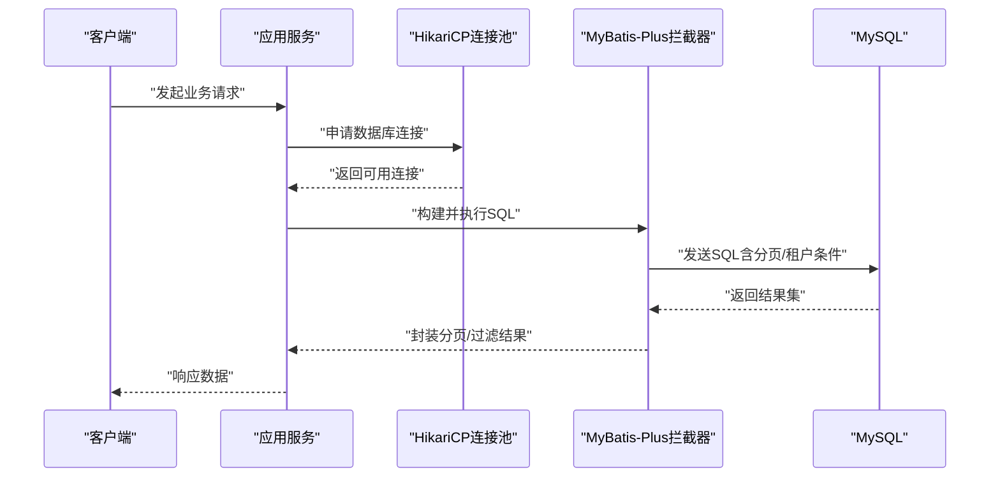
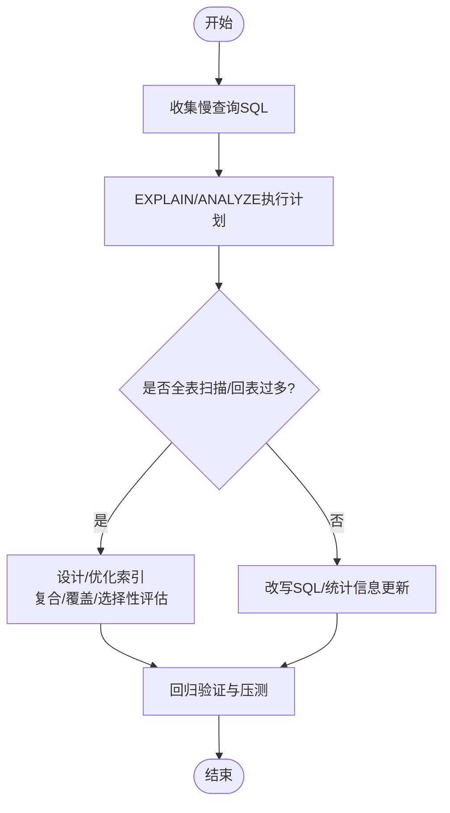
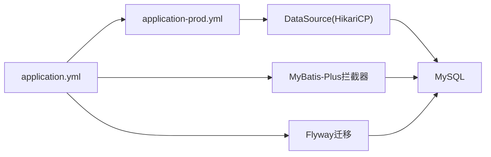

# 数据库优化

<cite>
**本文引用的文件**
- [application.yml](file://parking-boot/src/main/resources/application.yml)
- [application-prod.yml](file://parking-boot/src/main/resources/application-prod.yml)
- [MyBatisConfig.java](file://parking-boot/src/main/java/com/jushan/boot/config/MyBatisConfig.java)
- [V20260711011__device_status_snapshot.sql](file://parking-boot/src/main/resources/db/migration/V20260711011__device_status_snapshot.sql)
- [TestcontainersBaseTest.java](file://parking-boot/src/test/java/com/jushan/boot/test/TestcontainersBaseTest.java)
</cite>

## 目录
1. [简介](#简介)
2. [项目结构](#项目结构)
3. [核心组件](#核心组件)
4. [架构总览](#架构总览)
5. [详细组件分析](#详细组件分析)
6. [依赖分析](#依赖分析)
7. [性能考虑](#性能考虑)
8. [故障排查指南](#故障排查指南)
9. [结论](#结论)
10. [附录](#附录)

## 简介
本指南面向MySQL数据库的性能优化，结合仓库中Spring Boot应用的数据源与MyBatis-Plus配置、Flyway迁移脚本以及测试容器参数，给出连接池调优、慢查询分析与索引设计、分页与批量操作、事务管理、执行计划分析、表结构优化与分库分表策略、监控指标与容量规划等系统性建议。文档中的实践均与代码和配置保持一致，便于落地实施。

## 项目结构
本项目采用多模块结构，数据库相关能力集中在以下位置：
- 数据源与连接池：通过Spring Boot的HikariCP在通用配置与生产配置中定义
- 持久层框架：MyBatis-Plus拦截器（分页、多租户）在启动时注册
- 数据库版本管理：Flyway按版本号驱动SQL迁移
- 表结构与索引：以SQL迁移脚本形式维护，包含设备状态快照等高频查询表的索引设计
- 测试环境：使用Testcontainers拉起MySQL实例，并设置最大连接数用于测试稳定性

图表来源
- [application.yml:21-37](file://parking-boot/src/main/resources/application.yml#L21-L37)
- [application-prod.yml:14-32](file://parking-boot/src/main/resources/application-prod.yml#L14-L32)
- [MyBatisConfig.java:57-75](file://parking-boot/src/main/java/com/jushan/boot/config/MyBatisConfig.java#L57-L75)
- [V20260711011__device_status_snapshot.sql:27-31](file://parking-boot/src/main/resources/db/migration/V20260711011__device_status_snapshot.sql#L27-L31)

章节来源
- [application.yml:21-37](file://parking-boot/src/main/resources/application.yml#L21-L37)
- [application-prod.yml:14-32](file://parking-boot/src/main/resources/application-prod.yml#L14-L32)
- [MyBatisConfig.java:57-75](file://parking-boot/src/main/java/com/jushan/boot/config/MyBatisConfig.java#L57-L75)
- [V20260711011__device_status_snapshot.sql:27-31](file://parking-boot/src/main/resources/db/migration/V20260711011__device_status_snapshot.sql#L27-L31)

## 核心组件
- 数据源与连接池（HikariCP）
  - 默认与生产环境分别定义了最大连接数、最小空闲、空闲超时与连接超时等关键参数
  - 生产环境支持通过环境变量覆盖，便于不同集群规模动态调整
- MyBatis-Plus拦截器
  - 分页插件：限制最大每页条数，避免深度分页对数据库造成压力
  - 多租户拦截：可按需开启或关闭，并提供忽略表名单
- Flyway迁移
  - 启用自动迁移，禁止清理，确保DDL变更可追溯
- 表结构与索引
  - 典型高频查询场景（如设备最新快照）已建立复合索引，提升范围查询与排序性能

章节来源
- [application.yml:21-37](file://parking-boot/src/main/resources/application.yml#L21-L37)
- [application-prod.yml:14-32](file://parking-boot/src/main/resources/application-prod.yml#L14-L32)
- [MyBatisConfig.java:57-75](file://parking-boot/src/main/java/com/jushan/boot/config/MyBatisConfig.java#L57-L75)
- [V20260711011__device_status_snapshot.sql:27-31](file://parking-boot/src/main/resources/db/migration/V20260711011__device_status_snapshot.sql#L27-L31)

## 架构总览
下图展示从请求到数据库的关键路径，包括连接池获取连接、MyBatis-Plus拦截处理、最终执行SQL并返回结果。

图表来源
- [application.yml:21-37](file://parking-boot/src/main/resources/application.yml#L21-L37)
- [application-prod.yml:14-32](file://parking-boot/src/main/resources/application-prod.yml#L14-L32)
- [MyBatisConfig.java:57-75](file://parking-boot/src/main/java/com/jushan/boot/config/MyBatisConfig.java#L57-L75)

## 详细组件分析

### MySQL连接池配置优化（HikariCP）
- 关键参数说明
  - maximum-pool-size：最大连接数，决定并发上限，需结合CPU核数、磁盘I/O与业务QPS评估
  - minimum-idle：最小空闲连接，降低突发流量下的连接创建开销
  - idle-timeout：空闲连接回收时间，避免长期占用资源
  - connection-timeout：获取连接的等待超时，防止线程长时间阻塞
- 环境与覆盖
  - 默认配置适用于本地开发；生产通过环境变量注入，便于按集群规模差异化调优
- 调优建议
  - 根据“活跃连接=并发度×平均耗时”估算最大连接数，避免过大导致上下文切换与锁竞争
  - 将idle-timeout设置为小于数据库侧wait_timeout，避免连接失效
  - 合理设置connection-timeout，配合重试与熔断策略，避免雪崩

章节来源
- [application.yml:21-37](file://parking-boot/src/main/resources/application.yml#L21-L37)
- [application-prod.yml:14-32](file://parking-boot/src/main/resources/application-prod.yml#L14-L32)

### 慢查询分析与索引设计最佳实践
- 慢查询定位
  - 开启慢查询日志，结合阈值与采样比例，收集热点SQL
  - 使用EXPLAIN/EXPLAIN ANALYZE分析执行计划，关注全表扫描、临时表、文件排序、回表次数
- 索引设计原则
  - 优先为高选择性列建单列索引；对等值+范围组合选择复合索引，注意最左前缀匹配
  - 覆盖索引：尽量让索引包含查询所需字段，减少回表
  - 避免过度索引：写放大与空间占用需权衡
- 选择性评估
  - 计算列的选择性（唯一值数量/总行数），选择性越高越适合建索引
  - 区分大小写与字符集会影响索引效率，统一使用utf8mb4与合适的collation
- 实战参考
  - 设备状态快照表针对“按设备最新快照”“按采集时间范围”等查询建立了复合索引，显著提升常见查询路径

章节来源
- [V20260711011__device_status_snapshot.sql:27-31](file://parking-boot/src/main/resources/db/migration/V20260711011__device_status_snapshot.sql#L27-L31)

### 分页查询优化
- 框架层面
  - 通过MyBatis-Plus分页插件限制最大每页条数，避免深度分页拖垮数据库
- 查询层面
  - 使用基于主键或唯一索引的分页（游标分页）替代大偏移量分页
  - 仅选择必要字段，必要时使用覆盖索引减少回表
- 缓存与预聚合
  - 对热点列表数据引入Redis缓存，降低数据库压力

章节来源
- [MyBatisConfig.java:70-74](file://parking-boot/src/main/java/com/jushan/boot/config/MyBatisConfig.java#L70-L74)

### 批量操作与事务管理策略
- 批量写入
  - 使用批量插入/更新接口，控制批次大小，避免单次事务过大导致锁竞争与Undo增长
- 事务边界
  - 明确事务粒度，避免长事务；将非关键逻辑移出事务
- 幂等与去重
  - 结合业务唯一键与幂等表，保证重复提交安全

[本节为通用实践指导，不直接分析具体文件]

### SQL执行计划分析方法
- 常用命令
  - EXPLAIN SELECT ... / EXPLAIN ANALYZE SELECT ...
- 关注点
  - type（ALL/index/range/ref/eq_ref/const）、rows、Extra（Using filesort/Using temporary/Using index）
- 优化方向
  - 利用覆盖索引消除回表；调整复合索引顺序；避免函数包裹列导致索引失效

[本节为通用实践指导，不直接分析具体文件]

### 表结构优化建议
- 数据类型
  - 使用合适的数据类型与长度，减少存储与索引成本
- 字符集与排序规则
  - 统一使用utf8mb4与合理的collation，兼顾中文排序与性能
- 分区与归档
  - 对超大历史表采用分区或冷热分离策略，定期归档旧数据

[本节为通用实践指导，不直接分析具体文件]

### 分库分表方案
- 水平拆分
  - 按租户ID或时间维度进行分片，路由规则清晰且可扩展
- 全局唯一ID
  - 使用雪花算法或分布式ID生成器，避免跨分片自增冲突
- 跨分片查询
  - 尽量避免跨分片JOIN，采用冗余字段或离线聚合
- 运维与治理
  - 迁移工具链、灰度发布、回滚预案与一致性校验

[本节为通用实践指导，不直接分析具体文件]

### 数据库监控指标、瓶颈识别与容量规划
- 监控指标
  - 连接数（当前/峰值/最大）、活跃连接、等待队列、慢查询数、锁等待、缓冲池命中率、磁盘I/O、CPU使用率
- 瓶颈识别
  - 连接池耗尽：检查maximum-pool-size与慢查询
  - 锁竞争：观察锁等待与长事务
  - I/O瓶颈：关注磁盘吞吐与延迟
- 容量规划
  - 基于QPS、P99延迟与数据增长率，预估CPU、内存、磁盘与连接数需求，预留扩容空间

[本节为通用实践指导，不直接分析具体文件]

## 依赖分析
- 配置依赖
  - 应用启动加载application.yml与对应profile（如application-prod.yml），合并后生效
- 运行时依赖
  - HikariCP作为默认连接池实现；MyBatis-Plus拦截器在SQL执行前后介入
- 迁移依赖
  - Flyway在启动阶段执行未应用的迁移脚本，确保DDL与索引一致

图表来源
- [application.yml:21-37](file://parking-boot/src/main/resources/application.yml#L21-L37)
- [application-prod.yml:14-32](file://parking-boot/src/main/resources/application-prod.yml#L14-L32)
- [MyBatisConfig.java:57-75](file://parking-boot/src/main/java/com/jushan/boot/config/MyBatisConfig.java#L57-L75)

章节来源
- [application.yml:21-37](file://parking-boot/src/main/resources/application.yml#L21-L37)
- [application-prod.yml:14-32](file://parking-boot/src/main/resources/application-prod.yml#L14-L32)
- [MyBatisConfig.java:57-75](file://parking-boot/src/main/java/com/jushan/boot/config/MyBatisConfig.java#L57-L75)

## 性能考虑
- 连接池与并发
  - 根据业务并发与延迟目标设定maximum-pool-size，避免过小导致排队、过大导致抖动
- 索引与查询
  - 优先覆盖索引与复合索引，减少回表与排序；避免在索引列上使用函数或隐式转换
- 分页与缓存
  - 限制最大页大小，热点数据缓存至Redis，降低数据库压力
- 事务与批量
  - 缩小事务范围，批量写入分批提交，避免长事务与锁竞争
- 监控与压测
  - 持续监控关键指标，结合压测验证优化效果

[本节为通用实践指导，不直接分析具体文件]

## 故障排查指南
- 连接池相关问题
  - 症状：连接耗尽、获取连接超时
  - 排查：查看连接池参数、慢查询、锁等待；适当提高maximum-pool-size或优化SQL
- 分页异常
  - 症状：total恒为0或分页结果不正确
  - 排查：确认分页插件已注册且DbType正确；检查SQL是否符合分页要求
- 迁移失败
  - 症状：启动时报迁移错误
  - 排查：核对flyway_schema_history记录与脚本版本；确保clean-disabled=true

章节来源
- [application.yml:33-37](file://parking-boot/src/main/resources/application.yml#L33-L37)
- [application-prod.yml:28-32](file://parking-boot/src/main/resources/application-prod.yml#L28-L32)
- [MyBatisConfig.java:70-74](file://parking-boot/src/main/java/com/jushan/boot/config/MyBatisConfig.java#L70-L74)

## 结论
通过合理的连接池配置、完善的索引设计与分页控制、严格的迁移管理与监控体系，可以显著提升MySQL在高并发场景下的稳定性与性能。建议在生产环境中持续观测关键指标，结合压测与慢查询分析，迭代优化数据库访问路径与数据结构。

## 附录
- 测试环境最大连接数示例（用于测试稳定性）
  - 在测试容器中设置max_connections，确保集成测试在高并发下稳定运行

章节来源
- [TestcontainersBaseTest.java:44-48](file://parking-boot/src/test/java/com/jushan/boot/test/TestcontainersBaseTest.java#L44-L48)