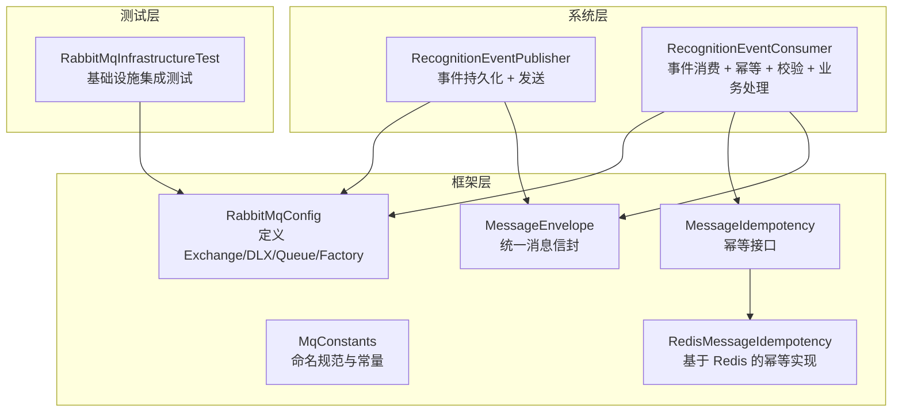
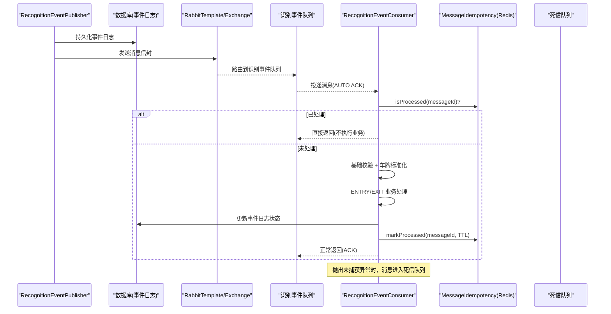
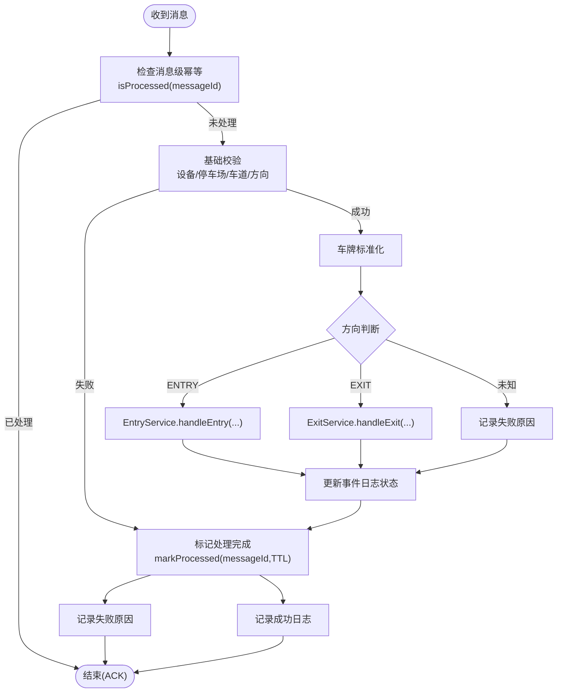
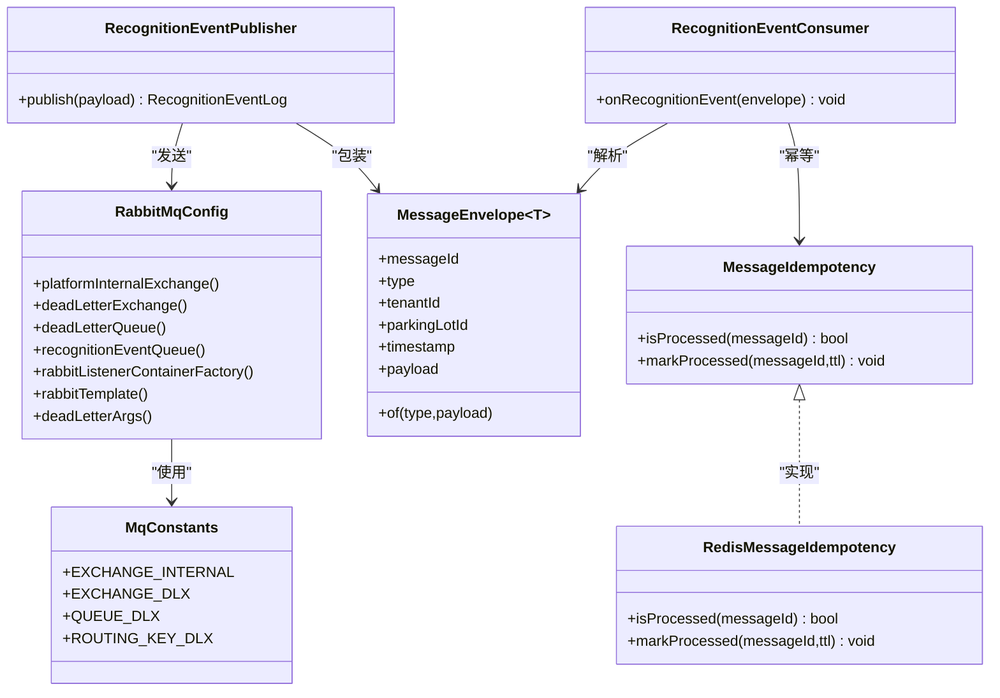

# 消息队列优化

<cite>
**本文引用的文件**   
- [RabbitMqConfig.java](file://parking-framework/src/main/java/com/jushan/framework/mq/RabbitMqConfig.java)
- [MqConstants.java](file://parking-framework/src/main/java/com/jushan/framework/mq/MqConstants.java)
- [MessageEnvelope.java](file://parking-framework/src/main/java/com/jushan/framework/mq/MessageEnvelope.java)
- [MessageIdempotency.java](file://parking-framework/src/main/java/com/jushan/framework/mq/MessageIdempotency.java)
- [RedisMessageIdempotency.java](file://parking-framework/src/main/java/com/jushan/framework/mq/RedisMessageIdempotency.java)
- [RecognitionEventConsumer.java](file://parking-system/src/main/java/com/jushan/system/event/RecognitionEventConsumer.java)
- [RecognitionEventPublisher.java](file://parking-system/src/main/java/com/jushan/system/event/RecognitionEventPublisher.java)
- [RabbitMqInfrastructureTest.java](file://parking-boot/src/test/java/com/jushan/boot/mq/RabbitMqInfrastructureTest.java)
</cite>

## 目录
1. [引言](#引言)
2. [项目结构](#项目结构)
3. [核心组件](#核心组件)
4. [架构总览](#架构总览)
5. [详细组件分析](#详细组件分析)
6. [依赖关系分析](#依赖关系分析)
7. [性能与容量规划](#性能与容量规划)
8. [故障排查指南](#故障排查指南)
9. [结论](#结论)
10. [附录](#附录)

## 引言
本指南聚焦于本项目中基于 RabbitMQ 的异步消息基础设施，围绕连接池与消费者并发、预取策略、持久化、幂等与重复消费防护、死信与重试、积压处理、高吞吐设计模式、监控指标与容量规划、异步最佳实践与故障恢复等方面，给出可落地的优化建议与实践路径。文档中的实现细节均来源于仓库源码，并在需要处提供“章节来源”和“图示来源”。

## 项目结构
本项目在框架层提供了统一的 MQ 基础能力（Exchange、DLX、消息信封、幂等接口及 Redis 实现），业务层通过发布器与消费者完成识别事件的持久化与处理流程。测试模块包含对基础设施的集成验证。

**图示来源**
- [RabbitMqConfig.java:63-101](file://parking-framework/src/main/java/com/jushan/framework/mq/RabbitMqConfig.java#L63-L101)
- [MqConstants.java:24-44](file://parking-framework/src/main/java/com/jushan/framework/mq/MqConstants.java#L24-L44)
- [MessageEnvelope.java:27-67](file://parking-framework/src/main/java/com/jushan/framework/mq/MessageEnvelope.java#L27-L67)
- [MessageIdempotency.java:21-38](file://parking-framework/src/main/java/com/jushan/framework/mq/MessageIdempotency.java#L21-L38)
- [RedisMessageIdempotency.java:35-90](file://parking-framework/src/main/java/com/jushan/framework/mq/RedisMessageIdempotency.java#L35-L90)
- [RecognitionEventPublisher.java:38-102](file://parking-system/src/main/java/com/jushan/system/event/RecognitionEventPublisher.java#L38-L102)
- [RecognitionEventConsumer.java:57-176](file://parking-system/src/main/java/com/jushan/system/event/RecognitionEventConsumer.java#L57-L176)
- [RabbitMqInfrastructureTest.java:26-43](file://parking-boot/src/test/java/com/jushan/boot/mq/RabbitMqInfrastructureTest.java#L26-L43)

**章节来源**
- [RabbitMqConfig.java:53-175](file://parking-framework/src/main/java/com/jushan/framework/mq/RabbitMqConfig.java#L53-L175)
- [MqConstants.java:1-44](file://parking-framework/src/main/java/com/jushan/framework/mq/MqConstants.java#L1-L44)
- [MessageEnvelope.java:1-137](file://parking-framework/src/main/java/com/jushan/framework/mq/MessageEnvelope.java#L1-L137)
- [MessageIdempotency.java:1-38](file://parking-framework/src/main/java/com/jushan/framework/mq/MessageIdempotency.java#L1-L38)
- [RedisMessageIdempotency.java:1-91](file://parking-framework/src/main/java/com/jushan/framework/mq/RedisMessageIdempotency.java#L1-L91)
- [RecognitionEventPublisher.java:1-127](file://parking-system/src/main/java/com/jushan/system/event/RecognitionEventPublisher.java#L1-L127)
- [RecognitionEventConsumer.java:1-344](file://parking-system/src/main/java/com/jushan/system/event/RecognitionEventConsumer.java#L1-L344)
- [RabbitMqInfrastructureTest.java:1-125](file://parking-boot/src/test/java/com/jushan/boot/mq/RabbitMqInfrastructureTest.java#L1-L125)

## 核心组件
- 平台内部 Topic Exchange 与 DLX：集中声明，便于统一管理失败消息与路由规则。
- 消息信封 MessageEnvelope：统一封装 messageId、type、租户上下文、时间戳与 payload，确保跨服务一致性。
- 幂等机制：消息级幂等（messageId）+ 业务级幂等（eventId 唯一约束），双重保障。
- 消费者工厂：默认 JSON 反序列化、自动 ACK、预取与并发参数集中配置。
- 发布器：先持久化事件日志，再投递 MQ；MQ 不可用或失败不影响已持久化的审计记录。
- 消费者：消息级幂等检查 → 基础校验 → 车牌标准化 → 入场/出场业务处理 → 状态回写 → 标记处理完成。

**章节来源**
- [RabbitMqConfig.java:63-101](file://parking-framework/src/main/java/com/jushan/framework/mq/RabbitMqConfig.java#L63-L101)
- [MessageEnvelope.java:27-67](file://parking-framework/src/main/java/com/jushan/framework/mq/MessageEnvelope.java#L27-L67)
- [MessageIdempotency.java:21-38](file://parking-framework/src/main/java/com/jushan/framework/mq/MessageIdempotency.java#L21-L38)
- [RedisMessageIdempotency.java:35-90](file://parking-framework/src/main/java/com/jushan/framework/mq/RedisMessageIdempotency.java#L35-L90)
- [RecognitionEventPublisher.java:64-102](file://parking-system/src/main/java/com/jushan/system/event/RecognitionEventPublisher.java#L64-L102)
- [RecognitionEventConsumer.java:97-176](file://parking-system/src/main/java/com/jushan/system/event/RecognitionEventConsumer.java#L97-L176)

## 架构总览
下图展示了识别事件从发布到消费的完整链路，包括持久化、幂等、校验、业务处理与异常分流至死信队列的流程。

**图示来源**
- [RecognitionEventPublisher.java:64-102](file://parking-system/src/main/java/com/jushan/system/event/RecognitionEventPublisher.java#L64-L102)
- [RabbitMqConfig.java:89-101](file://parking-framework/src/main/java/com/jushan/framework/mq/RabbitMqConfig.java#L89-L101)
- [RecognitionEventConsumer.java:97-176](file://parking-system/src/main/java/com/jushan/system/event/RecognitionEventConsumer.java#L97-L176)
- [MessageIdempotency.java:21-38](file://parking-framework/src/main/java/com/jushan/framework/mq/MessageIdempotency.java#L21-L38)
- [RedisMessageIdempotency.java:53-90](file://parking-framework/src/main/java/com/jushan/framework/mq/RedisMessageIdempotency.java#L53-L90)

## 详细组件分析

### RabbitMQ 配置与连接/并发/预取
- Exchange 与 DLX：平台内部 Topic Exchange 与 Direct DLX 均已声明，DLX 队列与绑定关系明确。
- 监听容器工厂：
  - 确认模式：AUTO（由框架根据方法返回值/异常决定是否 ACK）。
  - 预取数量：10。
  - 初始消费者数：1。
  - 最大消费者数：5。
- 降级策略：当 ConnectionFactory 不可用时，RabbitTemplate 与 ListenerContainerFactory 不会阻塞应用启动，仅记录警告并降级为无 MQ 行为。

优化建议（结合现有参数）：
- 预取与并发：在高吞吐场景下，可将 prefetchCount 提升至 20~50，并根据 CPU/IO 特征将 concurrentConsumers 与 maxConcurrentConsumers 分别调整为 2~4 与 8~16，观察延迟与吞吐变化后固化。
- 连接池：若使用 Spring AMQP 默认连接工厂，建议开启连接复用与心跳，避免频繁创建连接导致抖动；同时关注网络分区时的重连策略。
- 序列化：当前使用 Jackson2JsonMessageConverter，建议在大型负载场景下评估二进制序列化（如 Protobuf）以降低序列化开销。

**章节来源**
- [RabbitMqConfig.java:63-101](file://parking-framework/src/main/java/com/jushan/framework/mq/RabbitMqConfig.java#L63-L101)
- [RabbitMqConfig.java:147-162](file://parking-framework/src/main/java/com/jushan/framework/mq/RabbitMqConfig.java#L147-L162)
- [RabbitMqConfig.java:117-139](file://parking-framework/src/main/java/com/jushan/framework/mq/RabbitMqConfig.java#L117-L139)

### 消息持久化与可靠性
- 发布侧：先持久化事件日志，再投递 MQ；MQ 失败不影响已持久化的审计记录，具备补偿重发基础。
- 队列持久化：识别事件队列与 DLX 队列均为持久化队列，保证服务重启后消息不丢失。
- 发送回调：RabbitTemplate 设置了 confirm/return 回调，用于记录发送未确认与无法路由的情况，便于定位问题。

优化建议：
- 对于关键业务，可在发送前启用 publisher confirms 与 returns，并结合本地事务表进行最终一致性补偿。
- 针对热点队列，考虑设置合理的 max-length 与 TTL，防止无限堆积。

**章节来源**
- [RecognitionEventPublisher.java:64-102](file://parking-system/src/main/java/com/jushan/system/event/RecognitionEventPublisher.java#L64-L102)
- [RabbitMqConfig.java:89-101](file://parking-framework/src/main/java/com/jushan/framework/mq/RabbitMqConfig.java#L89-L101)
- [RabbitMqConfig.java:128-137](file://parking-framework/src/main/java/com/jushan/framework/mq/RabbitMqConfig.java#L128-L137)

### 幂等与重复消费防护
- 消息级幂等：消费者在处理前调用 isProcessed(messageId)，成功后调用 markProcessed(messageId, TTL)。
- 存储实现：基于 Redis SETNX 原子操作，Key 带 TTL（默认 72 小时），避免 Key 堆积。
- 业务级幂等：eventId 唯一约束，即使跳过消息级幂等也能保证数据不重复。
- 降级策略：Redis 不可用时，幂等检查返回 false（不过滤），但会记录警告日志；业务层 eventId 唯一约束兜底。

优化建议：
- 合理设置幂等 TTL，平衡内存占用与重复窗口。
- 在极高并发下，可使用 Redis Cluster 分片提升幂等写入吞吐。

**章节来源**
- [MessageIdempotency.java:21-38](file://parking-framework/src/main/java/com/jushan/framework/mq/MessageIdempotency.java#L21-L38)
- [RedisMessageIdempotency.java:35-90](file://parking-framework/src/main/java/com/jushan/framework/mq/RedisMessageIdempotency.java#L35-L90)
- [RecognitionEventConsumer.java:108-176](file://parking-system/src/main/java/com/jushan/system/event/RecognitionEventConsumer.java#L108-L176)

### 死信队列与重试策略
- 死信策略：消费失败（抛出异常）的消息转入 DLX，保留原始 messageId，支持人工重放。
- 消费者异常处理：
  - 业务异常（校验失败、重复 eventId、入场/出场失败）：记录失败原因，不重试，正常 ACK。
  - 系统异常（如 DB 不可用）：重新抛出，触发死信。
- 测试覆盖：基础设施测试验证了 DLX 队列存在性与重复投递场景。

优化建议：
- 引入指数退避与最大重试次数，避免瞬时故障导致的快速重试风暴。
- 对 DLX 建立告警与巡检任务，定期清理过期消息并人工介入重放。

**章节来源**
- [RabbitMqConfig.java:69-85](file://parking-framework/src/main/java/com/jushan/framework/mq/RabbitMqConfig.java#L69-L85)
- [RecognitionEventConsumer.java:162-176](file://parking-system/src/main/java/com/jushan/system/event/RecognitionEventConsumer.java#L162-L176)
- [RabbitMqInfrastructureTest.java:116-125](file://parking-boot/src/test/java/com/jushan/boot/mq/RabbitMqInfrastructureTest.java#L116-L125)

### 消费者处理流程与复杂逻辑
识别事件消费者的核心流程如下：

**图示来源**
- [RecognitionEventConsumer.java:97-176](file://parking-system/src/main/java/com/jushan/system/event/RecognitionEventConsumer.java#L97-L176)
- [RecognitionEventConsumer.java:183-276](file://parking-system/src/main/java/com/jushan/system/event/RecognitionEventConsumer.java#L183-L276)

**章节来源**
- [RecognitionEventConsumer.java:97-176](file://parking-system/src/main/java/com/jushan/system/event/RecognitionEventConsumer.java#L97-L176)
- [RecognitionEventConsumer.java:183-276](file://parking-system/src/main/java/com/jushan/system/event/RecognitionEventConsumer.java#L183-L276)

### 高吞吐场景下的队列设计与负载均衡
- 队列拆分：按租户或停车场维度拆分队列，降低单队列竞争，提升并行度。
- 分区策略：使用 topic 路由键按租户/停车场前缀匹配，使不同分区独立消费。
- 负载均衡：通过增加消费者实例与调整并发上限，配合预取控制，达到稳定吞吐。
- 背压控制：合理设置 prefetchCount，避免消费者过载；必要时引入限流与熔断。

说明：以上为通用优化思路，需结合业务流量模型与资源情况进行压测与调优。

[本节为概念性内容，无需“章节来源”]

## 依赖关系分析

**图示来源**
- [RabbitMqConfig.java:63-101](file://parking-framework/src/main/java/com/jushan/framework/mq/RabbitMqConfig.java#L63-L101)
- [MqConstants.java:24-44](file://parking-framework/src/main/java/com/jushan/framework/mq/MqConstants.java#L24-L44)
- [MessageEnvelope.java:27-67](file://parking-framework/src/main/java/com/jushan/framework/mq/MessageEnvelope.java#L27-L67)
- [MessageIdempotency.java:21-38](file://parking-framework/src/main/java/com/jushan/framework/mq/MessageIdempotency.java#L21-L38)
- [RedisMessageIdempotency.java:35-90](file://parking-framework/src/main/java/com/jushan/framework/mq/RedisMessageIdempotency.java#L35-L90)
- [RecognitionEventPublisher.java:64-102](file://parking-system/src/main/java/com/jushan/system/event/RecognitionEventPublisher.java#L64-L102)
- [RecognitionEventConsumer.java:97-176](file://parking-system/src/main/java/com/jushan/system/event/RecognitionEventConsumer.java#L97-L176)

**章节来源**
- [RabbitMqConfig.java:53-175](file://parking-framework/src/main/java/com/jushan/framework/mq/RabbitMqConfig.java#L53-L175)
- [MqConstants.java:1-44](file://parking-framework/src/main/java/com/jushan/framework/mq/MqConstants.java#L1-L44)
- [MessageEnvelope.java:1-137](file://parking-framework/src/main/java/com/jushan/framework/mq/MessageEnvelope.java#L1-L137)
- [MessageIdempotency.java:1-38](file://parking-framework/src/main/java/com/jushan/framework/mq/MessageIdempotency.java#L1-L38)
- [RedisMessageIdempotency.java:1-91](file://parking-framework/src/main/java/com/jushan/framework/mq/RedisMessageIdempotency.java#L1-L91)
- [RecognitionEventPublisher.java:1-127](file://parking-system/src/main/java/com/jushan/system/event/RecognitionEventPublisher.java#L1-L127)
- [RecognitionEventConsumer.java:1-344](file://parking-system/src/main/java/com/jushan/system/event/RecognitionEventConsumer.java#L1-L344)

## 性能与容量规划
- 吞吐与延迟：
  - 调整 prefetchCount 与并发上限，观察 P99 延迟与吞吐曲线，选择拐点。
  - 批量处理：若业务允许，可合并小消息成批处理，减少 IO 次数。
- 资源与容量：
  - 预估峰值 QPS × 平均处理时长 = 所需并发度；结合 JVM GC 与线程池大小规划。
  - 磁盘与内存：持久化队列与幂等 Key 的 TTL 需评估磁盘与内存占用。
- 监控指标（建议采集）：
  - 生产端：发送成功率、confirm 失败率、路由失败率。
  - 消费端：入队速率、出队速率、消费耗时分布、死信入队速率。
  - 系统：CPU/内存/GC、线程池活跃数、连接池空闲/活跃连接数。
- 容量规划：
  - 以 30 分钟峰值为基准，预留 2x 冗余；对热点租户/停车场单独扩容队列与消费者。
  - 对 DLQ 设置长度限制与告警阈值，避免无限增长。

[本节为通用指导，无需“章节来源”]

## 故障排查指南
- 常见问题定位：
  - 发送未确认：查看 RabbitTemplate confirm 回调日志，检查网络与 Broker 状态。
  - 路由失败：查看 return 回调日志，核对 exchange/routingKey 是否一致。
  - 重复消费：检查幂等 Key 是否存在且未过期；确认 Redis 可用性。
  - 死信堆积：检查消费者异常堆栈与业务日志，优先修复可恢复错误。
- 诊断步骤：
  - 复现最小用例，隔离外部依赖（DB/Redis）影响。
  - 对比不同并发与预取参数的表现，定位瓶颈点。
  - 对 DLQ 消息进行抽样重放，验证修复效果。

**章节来源**
- [RabbitMqConfig.java:128-137](file://parking-framework/src/main/java/com/jushan/framework/mq/RabbitMqConfig.java#L128-L137)
- [RedisMessageIdempotency.java:53-90](file://parking-framework/src/main/java/com/jushan/framework/mq/RedisMessageIdempotency.java#L53-L90)
- [RabbitMqInfrastructureTest.java:100-125](file://parking-boot/src/test/java/com/jushan/boot/mq/RabbitMqInfrastructureTest.java#L100-L125)

## 结论
本项目在框架层提供了稳健的 MQ 基础设施：统一的 Exchange/DLX、消息信封、幂等接口与 Redis 实现、以及发布器的持久化优先策略。消费者采用 AUTO ACK 与明确的异常分流，结合消息级与业务级双重幂等，有效应对重复投递与部分失败场景。在高吞吐场景下，可通过预取与并发调优、队列拆分与分区路由、以及完善的监控与容量规划进一步提升稳定性与效率。

[本节为总结性内容，无需“章节来源”]

## 附录
- 命名规范参考：平台内部 Exchange/Queue/RoutingKey 命名规范见常量类。
- 测试用例参考：基础设施测试覆盖了幂等、重复投递与 DLX 声明验证。

**章节来源**
- [MqConstants.java:1-44](file://parking-framework/src/main/java/com/jushan/framework/mq/MqConstants.java#L1-L44)
- [RabbitMqInfrastructureTest.java:80-125](file://parking-boot/src/test/java/com/jushan/boot/mq/RabbitMqInfrastructureTest.java#L80-L125)