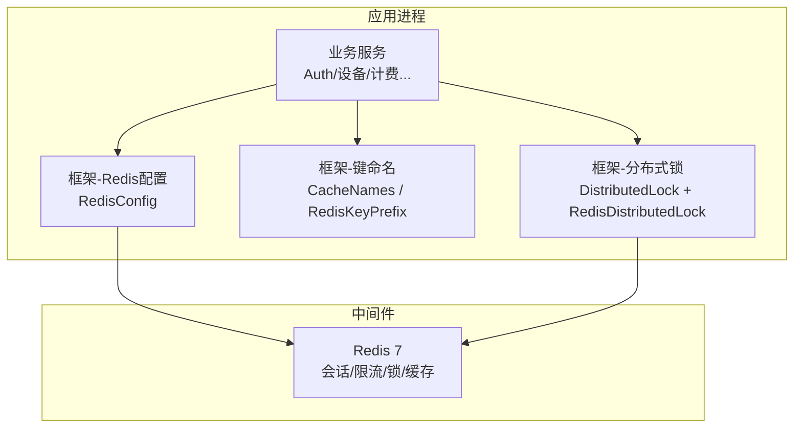
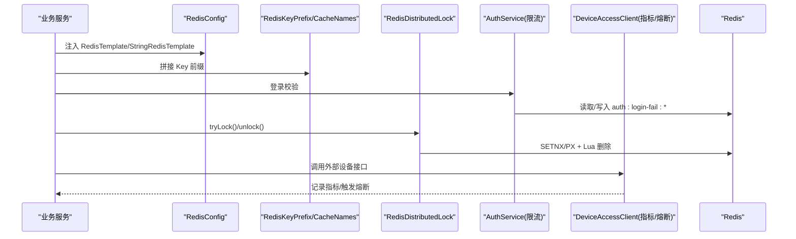
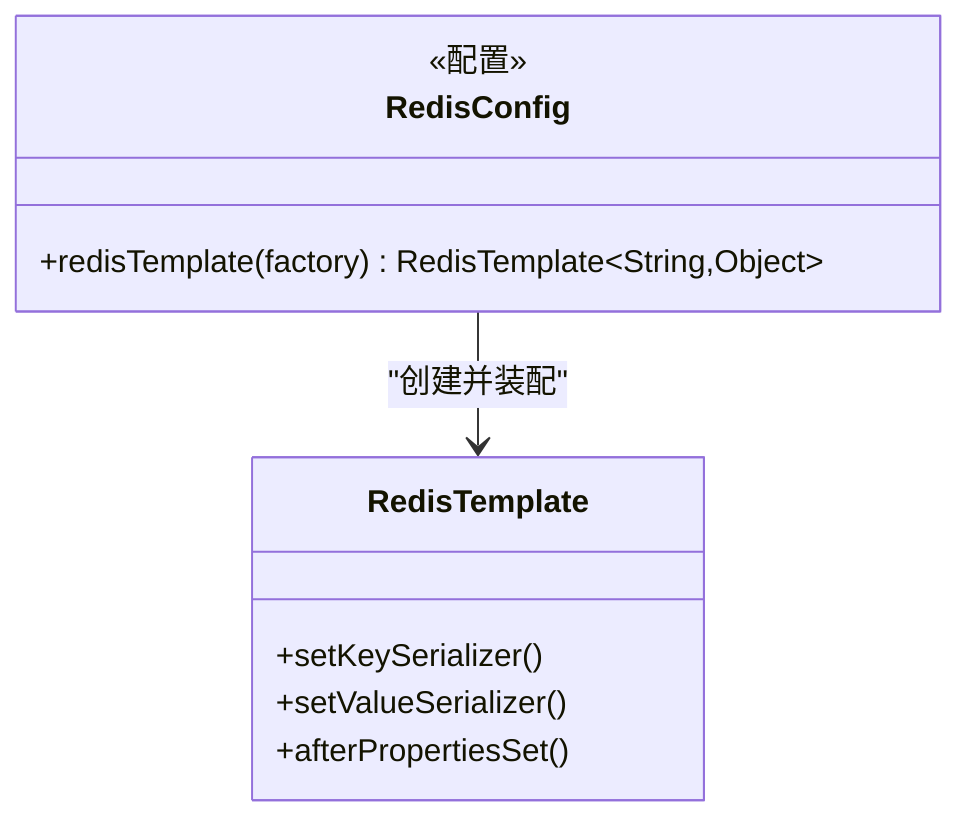
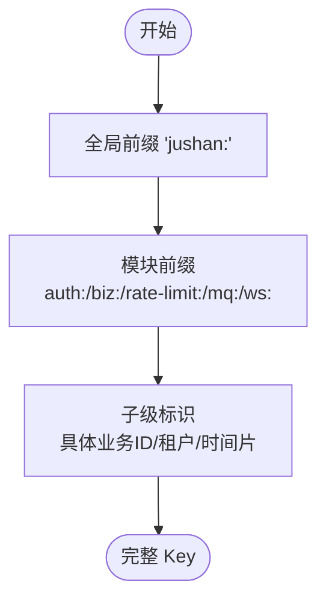
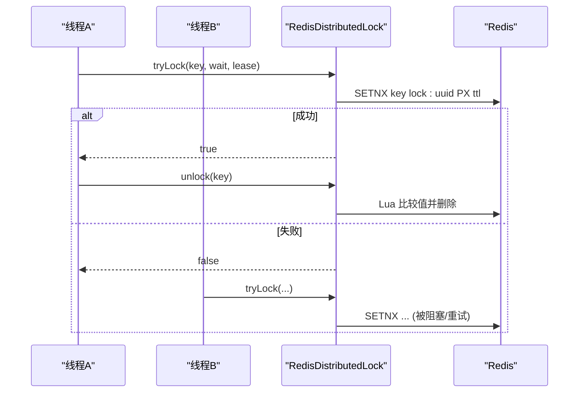
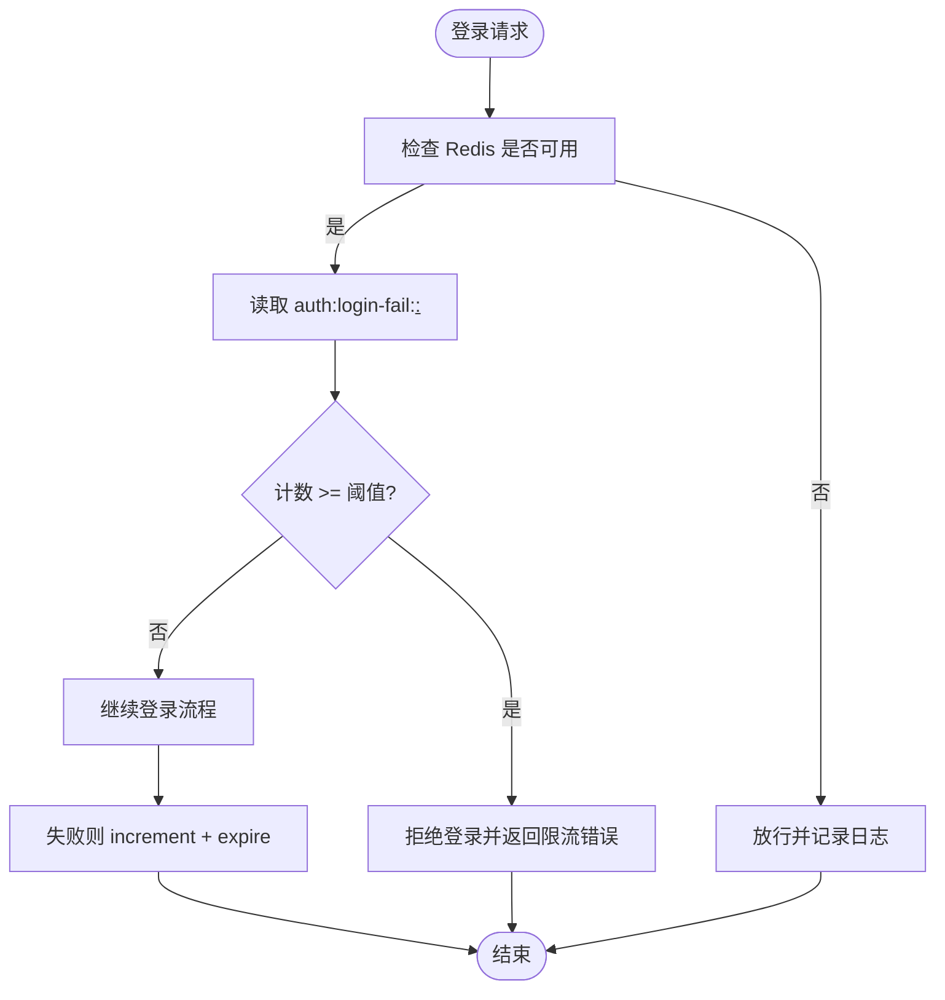
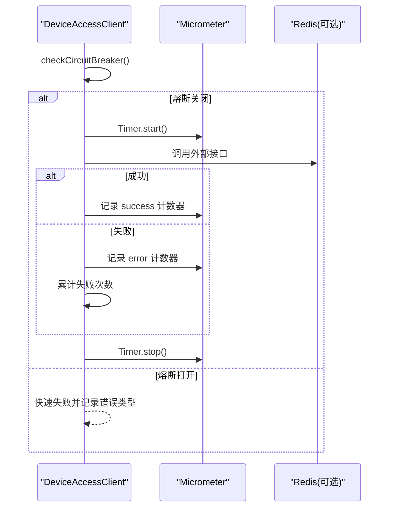
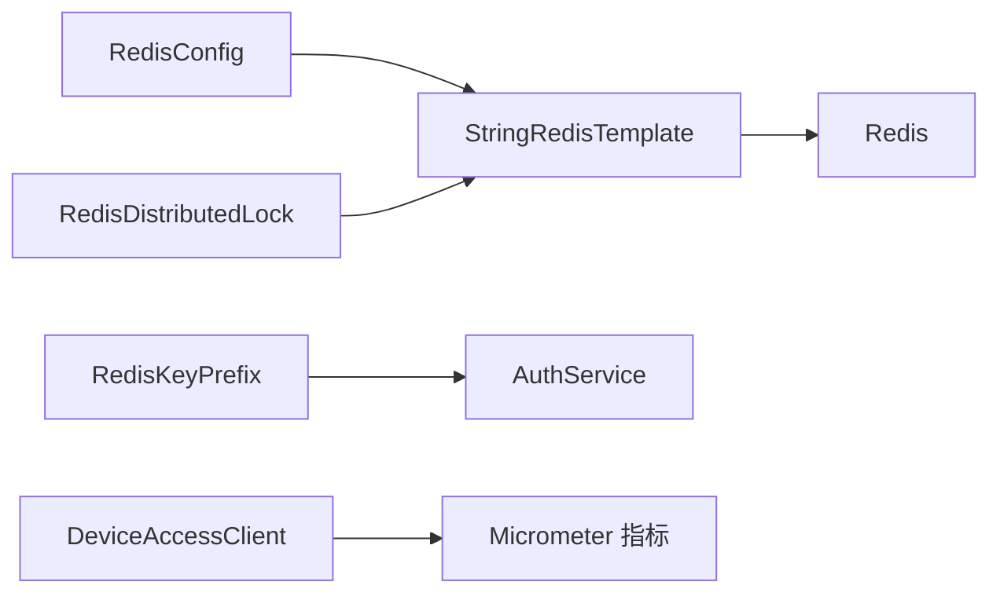

# 缓存策略

<cite>
**本文引用的文件**   
- [RedisConfig.java](file://parking-framework/src/main/java/com/jushan/framework/redis/RedisConfig.java)
- [CacheNames.java](file://parking-framework/src/main/java/com/jushan/framework/redis/CacheNames.java)
- [RedisKeyPrefix.java](file://parking-framework/src/main/java/com/jushan/framework/redis/RedisKeyPrefix.java)
- [DistributedLock.java](file://parking-framework/src/main/java/com/jushan/framework/lock/DistributedLock.java)
- [RedisDistributedLock.java](file://parking-framework/src/main/java/com/jushan/framework/lock/RedisDistributedLock.java)
- [配置说明.md](file://docs/部署运维/配置说明.md)
- [docker-compose.yml](file://docker-compose.yml)
- [AuthService.java](file://parking-system/src/main/java/com/jushan/system/service/AuthService.java)
- [DeviceAccessClientImpl.java](file://parking-system/src/main/java/com/jushan/system/client/DeviceAccessClientImpl.java)
- [RedisInfrastructureTest.java](file://parking-boot/src/test/java/com/jushan/boot/redis/RedisInfrastructureTest.java)
</cite>

## 目录
1. [引言](#引言)
2. [项目结构](#项目结构)
3. [核心组件](#核心组件)
4. [架构总览](#架构总览)
5. [详细组件分析](#详细组件分析)
6. [依赖关系分析](#依赖关系分析)
7. [性能与容量规划](#性能与容量规划)
8. [故障排查指南](#故障排查指南)
9. [结论](#结论)
10. [附录：最佳实践清单](#附录最佳实践清单)

## 引言
本指南围绕 Redis 缓存体系，结合仓库中现有实现，系统化阐述缓存分层、数据一致性、更新机制、穿透/雪崩/热点防护、序列化与键空间管理、内存淘汰、预热与批量操作、分布式锁、监控指标、性能调优与故障恢复等主题。文档既面向一线开发，也便于运维与测试人员理解与落地。

## 项目结构
本项目在框架层提供统一的 Redis 配置、键前缀规范与分布式锁能力；业务层在认证、限流、外部调用等场景中使用 Redis；基础设施通过 docker-compose 提供 Redis 容器化运行环境。

图表来源
- [RedisConfig.java:1-70](file://parking-framework/src/main/java/com/jushan/framework/redis/RedisConfig.java#L1-L70)
- [CacheNames.java:1-40](file://parking-framework/src/main/java/com/jushan/framework/redis/CacheNames.java#L1-L40)
- [RedisKeyPrefix.java:1-67](file://parking-framework/src/main/java/com/jushan/framework/redis/RedisKeyPrefix.java#L1-L67)
- [DistributedLock.java:1-53](file://parking-framework/src/main/java/com/jushan/framework/lock/DistributedLock.java#L1-L53)
- [RedisDistributedLock.java:1-130](file://parking-framework/src/main/java/com/jushan/framework/lock/RedisDistributedLock.java#L1-L130)

章节来源
- [配置说明.md:42-68](file://docs/部署运维/配置说明.md#L42-L68)
- [docker-compose.yml:90-116](file://docker-compose.yml#L90-L116)

## 核心组件
- Redis 通用配置：统一 Key/Value 序列化，安全降级（无连接时不创建 Bean）。
- 键空间管理：全局前缀与领域前缀分离，避免跨域冲突。
- Spring Cache 名称常量：按业务域划分缓存区域。
- 分布式锁：基于 SETNX+Lua 的轻量实现，支持超时自动释放与误删保护。
- 业务使用示例：登录失败次数限流、外部客户端熔断与指标上报。

章节来源
- [RedisConfig.java:1-70](file://parking-framework/src/main/java/com/jushan/framework/redis/RedisConfig.java#L1-L70)
- [CacheNames.java:1-40](file://parking-framework/src/main/java/com/jushan/framework/redis/CacheNames.java#L1-L40)
- [RedisKeyPrefix.java:1-67](file://parking-framework/src/main/java/com/jushan/framework/redis/RedisKeyPrefix.java#L1-L67)
- [RedisDistributedLock.java:1-130](file://parking-framework/src/main/java/com/jushan/framework/lock/RedisDistributedLock.java#L1-L130)
- [AuthService.java:262-315](file://parking-system/src/main/java/com/jushan/system/service/AuthService.java#L262-L315)

## 架构总览
下图展示“应用—框架—Redis”的交互路径，以及关键能力点：序列化、键空间、锁、限流与指标。

图表来源
- [RedisConfig.java:1-70](file://parking-framework/src/main/java/com/jushan/framework/redis/RedisConfig.java#L1-L70)
- [RedisKeyPrefix.java:1-67](file://parking-framework/src/main/java/com/jushan/framework/redis/RedisKeyPrefix.java#L1-L67)
- [CacheNames.java:1-40](file://parking-framework/src/main/java/com/jushan/framework/redis/CacheNames.java#L1-L40)
- [RedisDistributedLock.java:1-130](file://parking-framework/src/main/java/com/jushan/framework/lock/RedisDistributedLock.java#L1-L130)
- [AuthService.java:262-315](file://parking-system/src/main/java/com/jushan/system/service/AuthService.java#L262-L315)
- [DeviceAccessClientImpl.java:92-230](file://parking-system/src/main/java/com/jushan/system/client/DeviceAccessClientImpl.java#L92-L230)

## 详细组件分析

### 组件一：Redis 通用配置与序列化
- 目标：统一 Key/HashKey 为 String 序列化，Value/HashValue 为 Jackson JSON 序列化；当无 RedisConnectionFactory 时跳过配置，保障测试与非 Redis 场景可用。
- 要点：
  - 全局 Key 前缀常量用于约定式命名（实际拼接由业务或工具类完成）。
  - 仅在有连接工厂时创建 Bean，避免启动期强依赖。

图表来源
- [RedisConfig.java:1-70](file://parking-framework/src/main/java/com/jushan/framework/redis/RedisConfig.java#L1-L70)

章节来源
- [RedisConfig.java:1-70](file://parking-framework/src/main/java/com/jushan/framework/redis/RedisConfig.java#L1-L70)

### 组件二：键空间管理与命名规范
- 目标：通过“全局前缀 + 模块前缀 + 子级标识”的层级命名，隔离不同业务域与环境。
- 要点：
  - 全局前缀 jushan: 由配置层约定；业务侧使用 RedisKeyPrefix 中的相对前缀进行组合。
  - CacheNames 定义 Spring Cache 的缓存名，按领域拆分缓存空间。

图表来源
- [RedisKeyPrefix.java:1-67](file://parking-framework/src/main/java/com/jushan/framework/redis/RedisKeyPrefix.java#L1-L67)
- [CacheNames.java:1-40](file://parking-framework/src/main/java/com/jushan/framework/redis/CacheNames.java#L1-L40)

章节来源
- [RedisKeyPrefix.java:1-67](file://parking-framework/src/main/java/com/jushan/framework/redis/RedisKeyPrefix.java#L1-L67)
- [CacheNames.java:1-40](file://parking-framework/src/main/java/com/jushan/framework/redis/CacheNames.java#L1-L40)

### 组件三：分布式锁（SETNX + Lua）
- 目标：跨实例互斥控制，支持等待、过期释放与误删保护。
- 要点：
  - 获取：SET key value NX PX ttl，value 带唯一标识，防止误删。
  - 释放：Lua 脚本原子比较并删除。
  - 降级：ObjectProvider 注入，不可用时返回 false，不影响主流程。

图表来源
- [RedisDistributedLock.java:1-130](file://parking-framework/src/main/java/com/jushan/framework/lock/RedisDistributedLock.java#L1-L130)
- [DistributedLock.java:1-53](file://parking-framework/src/main/java/com/jushan/framework/lock/DistributedLock.java#L1-L53)

章节来源
- [RedisDistributedLock.java:1-130](file://parking-framework/src/main/java/com/jushan/framework/lock/RedisDistributedLock.java#L1-L130)
- [DistributedLock.java:1-53](file://parking-framework/src/main/java/com/jushan/framework/lock/DistributedLock.java#L1-L53)
- [RedisInfrastructureTest.java:66-144](file://parking-boot/src/test/java/com/jushan/boot/redis/RedisInfrastructureTest.java#L66-L144)

### 组件四：业务使用——登录失败限流
- 目标：对同一用户名+IP 的登录失败次数进行窗口内计数与拦截。
- 要点：
  - Key 采用 RedisKeyPrefix.LOGIN_FAIL + username + ":" + ip。
  - 读/写/过期设置均做异常捕获，Redis 不可用时降级放行并告警。

图表来源
- [AuthService.java:262-315](file://parking-system/src/main/java/com/jushan/system/service/AuthService.java#L262-L315)
- [RedisKeyPrefix.java:1-67](file://parking-framework/src/main/java/com/jushan/framework/redis/RedisKeyPrefix.java#L1-L67)

章节来源
- [AuthService.java:262-315](file://parking-system/src/main/java/com/jushan/system/service/AuthService.java#L262-L315)

### 组件五：外部调用熔断与指标
- 目标：对设备访问客户端进行连续失败统计、熔断与指标上报，辅助观测与告警。
- 要点：
  - 注册计数器、计时器与 Gauge 指标。
  - 超过阈值打开熔断，进入恢复窗口后尝试半开探测。

图表来源
- [DeviceAccessClientImpl.java:92-230](file://parking-system/src/main/java/com/jushan/system/client/DeviceAccessClientImpl.java#L92-L230)

章节来源
- [DeviceAccessClientImpl.java:92-230](file://parking-system/src/main/java/com/jushan/system/client/DeviceAccessClientImpl.java#L92-L230)

## 依赖关系分析
- 配置层：RedisConfig 仅在存在连接工厂时生效，降低耦合。
- 业务层：AuthService 直接依赖 StringRedisTemplate 与 RedisKeyPrefix；DeviceAccessClient 依赖 Micrometer 指标。
- 基础设施：docker-compose 提供 Redis 容器，默认开启 AOF、最大内存与 LRU 淘汰策略。

图表来源
- [RedisConfig.java:1-70](file://parking-framework/src/main/java/com/jushan/framework/redis/RedisConfig.java#L1-L70)
- [RedisKeyPrefix.java:1-67](file://parking-framework/src/main/java/com/jushan/framework/redis/RedisKeyPrefix.java#L1-L67)
- [RedisDistributedLock.java:1-130](file://parking-framework/src/main/java/com/jushan/framework/lock/RedisDistributedLock.java#L1-L130)
- [AuthService.java:262-315](file://parking-system/src/main/java/com/jushan/system/service/AuthService.java#L262-L315)
- [DeviceAccessClientImpl.java:92-230](file://parking-system/src/main/java/com/jushan/system/client/DeviceAccessClientImpl.java#L92-L230)
- [docker-compose.yml:90-116](file://docker-compose.yml#L90-L116)

章节来源
- [docker-compose.yml:90-116](file://docker-compose.yml#L90-L116)

## 性能与容量规划
- 连接池与超时
  - 参考配置说明中的 Lettuce 连接池参数与超时设置，结合 QPS 与 RT 调整 max-active/max-idle/max-wait。
- 内存与淘汰
  - 容器默认启用 AOF、maxmemory=256mb、allkeys-lru。生产建议根据热点数据大小与命中率评估内存上限，必要时切换更合适的淘汰策略（如 volatile-ttl 配合合理 TTL）。
- 序列化开销
  - Value 使用 Jackson JSON，注意对象字段精简与版本兼容；大对象建议分片或改用 Hash 结构。
- 批量与管道
  - 高吞吐场景优先使用 Pipeline/批量命令减少网络往返；谨慎使用 KEYS，改用 SCAN。
- 热点与雪崩
  - 热点加本地缓存（如 Caffeine）二级缓存；随机化 TTL 避免集中过期；对热点 Key 设置较短但稳定的过期时间。
- 穿透防护
  - 空值缓存短 TTL；布隆过滤器前置拦截非法 Key；对不存在结果落库前先落缓存。
- 预热与初始化
  - 启动阶段异步加载字典/规则/热点实体至缓存；分批写入，避免瞬时压力。
- 分布式锁优化
  - 合理设置 leaseTime，确保临界区耗时远小于锁租约；长任务可考虑续期或改为分段处理。

章节来源
- [配置说明.md:42-68](file://docs/部署运维/配置说明.md#L42-L68)
- [docker-compose.yml:90-116](file://docker-compose.yml#L90-L116)

## 故障排查指南
- Redis 不可用
  - 现象：分布式锁获取失败、限流失效、缓存读写异常。
  - 定位：查看 ObjectProvider 注入是否为 null；检查健康检查与端口映射；确认连接池耗尽。
  - 处置：临时降级（锁返回 false、限流放行）、扩容连接池、重启 Redis 或切换备用节点。
- 键冲突与污染
  - 现象：不同环境/租户数据互相影响。
  - 定位：核对全局前缀与模块前缀拼接是否正确；避免硬编码 Key。
  - 处置：统一使用 RedisKeyPrefix；清理污染 Key。
- 锁未释放/死锁
  - 现象：长时间持有锁导致后续请求阻塞。
  - 定位：检查临界区耗时与 leaseTime 比例；观察锁 Lua 删除日志。
  - 处置：缩短临界区、增大 leaseTime 或引入看门狗续期方案。
- 内存不足/OOM
  - 现象：频繁淘汰、命中率下降。
  - 定位：查看 maxmemory 与淘汰策略；分析热点 Key 体积。
  - 处置：扩容内存、优化数据结构、调整 TTL、引入二级缓存。
- 指标异常
  - 现象：外部调用错误率飙升、延迟升高。
  - 定位：查看 Micrometer 指标（calls.total/calls.errors/latency/circuit_breaker.state）。
  - 处置：依据熔断状态与错误类型定位下游问题，必要时回滚或降级。

章节来源
- [RedisDistributedLock.java:1-130](file://parking-framework/src/main/java/com/jushan/framework/lock/RedisDistributedLock.java#L1-L130)
- [AuthService.java:262-315](file://parking-system/src/main/java/com/jushan/system/service/AuthService.java#L262-L315)
- [DeviceAccessClientImpl.java:92-230](file://parking-system/src/main/java/com/jushan/system/client/DeviceAccessClientImpl.java#L92-L230)

## 结论
本项目在框架层提供了统一的 Redis 配置、键空间规范与分布式锁能力，并在业务侧落地了限流、熔断与指标观测。结合合理的容量规划与防护策略（穿透/雪崩/热点），可在保证一致性的前提下显著提升系统性能与稳定性。建议在生产环境持续完善二级缓存、预热与精细化监控告警体系。

## 附录：最佳实践清单
- 缓存分层
  - 本地缓存（热点小对象）+ Redis（共享热点/会话/限流）+ DB（持久化）。
- 数据一致性
  - 先更新 DB，再删除缓存；或采用延迟双删；对强一致场景使用分布式锁保护关键路径。
- 更新机制
  - 事件驱动（MQ）异步刷新；或定时全量/增量同步。
- 穿透/雪崩/热点
  - 空值缓存短 TTL、布隆过滤、随机 TTL、热点 Key 独立分区与本地缓存。
- 序列化与键空间
  - Key 使用 String，Value 使用 JSON；严格遵循全局前缀+模块前缀+子级标识。
- 内存淘汰
  - 根据业务选择 allkeys-lru/volatile-ttl 等；定期评估内存占用与命中率。
- 预热与批量
  - 启动预热字典/规则/热点；批量/管道写入，避免 KEYS。
- 分布式锁
  - 短临界区+合理租约；Lua 原子释放；必要时引入可重入/续期方案。
- 监控与调优
  - 关注命中率、QPS、RT、内存使用、淘汰率、锁竞争；结合 Micrometer 指标与链路追踪。
- 故障恢复
  - 熔断+重试+退避；降级开关；多活/主从切换预案。