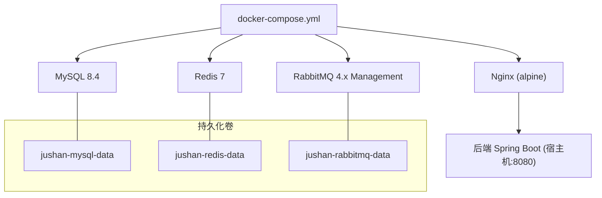
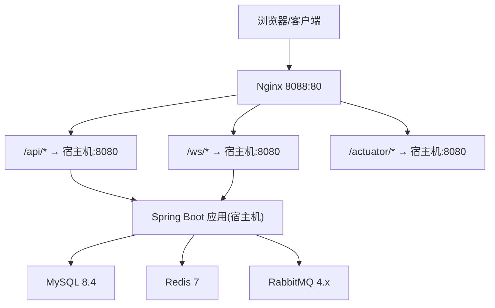
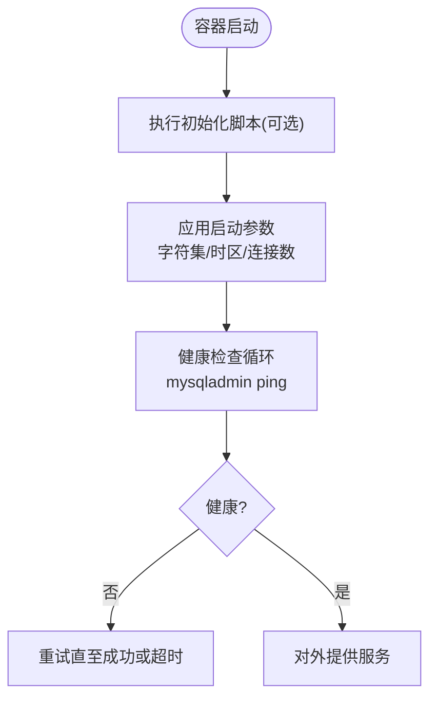
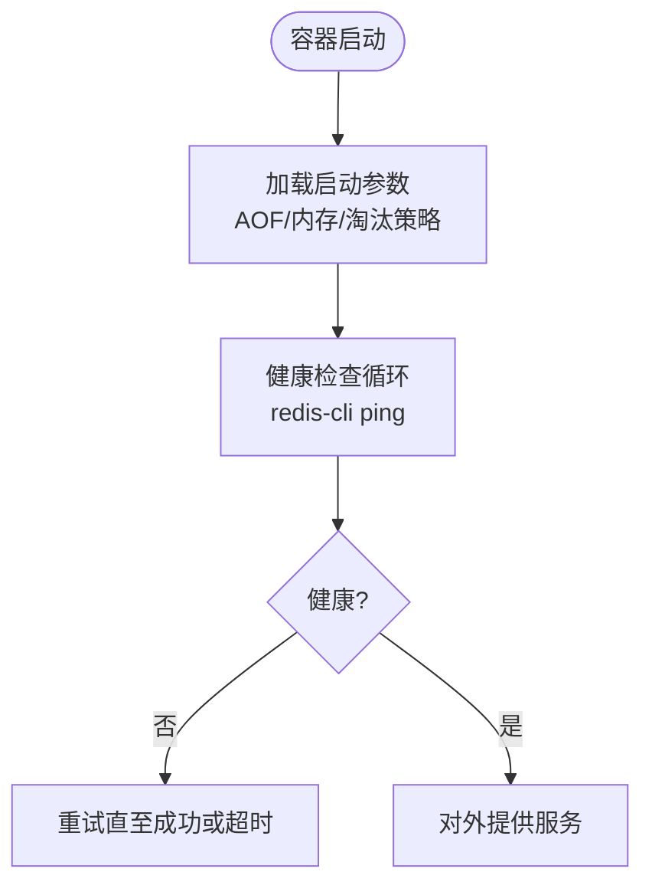
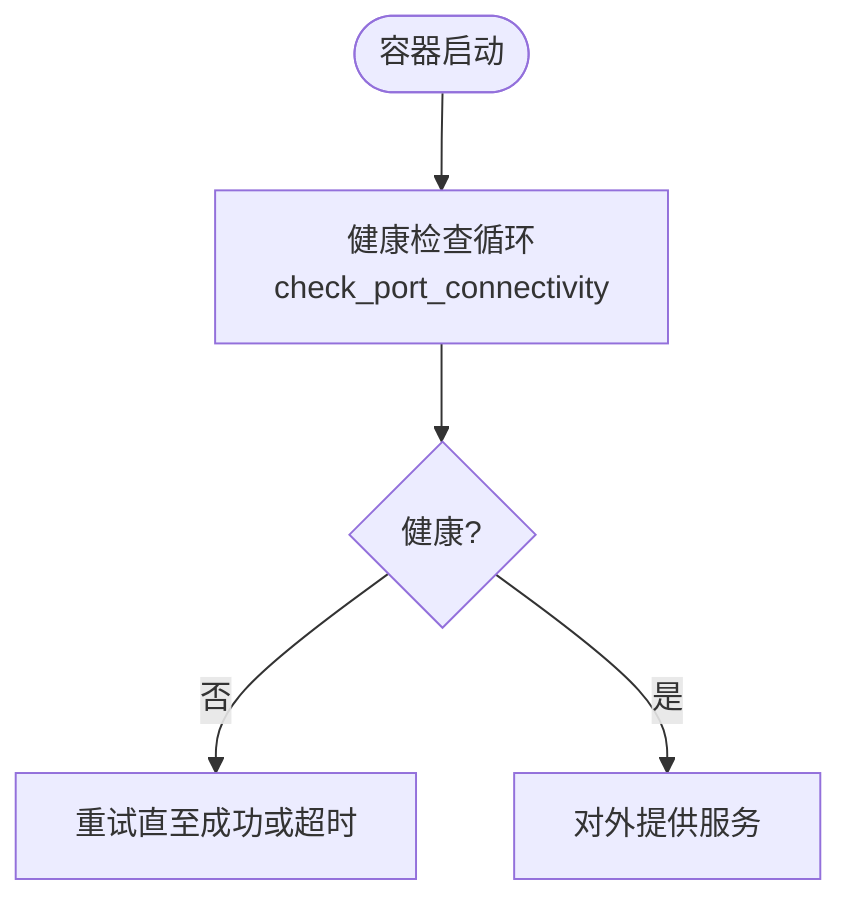
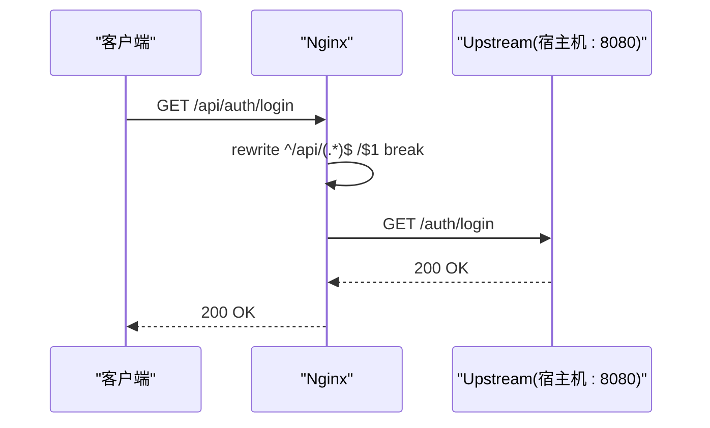
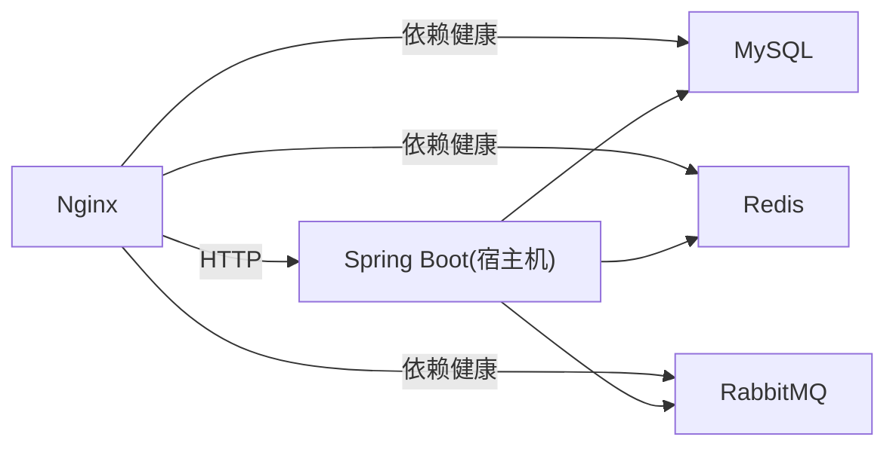

# 容器编排与集群部署

<cite>
**本文引用的文件列表**
- [docker-compose.yml](file://docker-compose.yml)
- [nginx.conf](file://docker/nginx/nginx.conf)
- [default.conf](file://docker/nginx/conf.d/default.conf)
- [部署说明.md](file://docs/部署运维/部署说明.md)
- [README.md](file://README.md)
</cite>

## 目录
1. [简介](#简介)
2. [项目结构](#项目结构)
3. [核心组件](#核心组件)
4. [架构总览](#架构总览)
5. [详细组件分析](#详细组件分析)
6. [依赖关系分析](#依赖关系分析)
7. [性能与资源限制](#性能与资源限制)
8. [故障排查指南](#故障排查指南)
9. [结论](#结论)
10. [附录：Kubernetes 部署清单示例](#附录kubernetes-部署清单示例)

## 简介
本指南面向“智慧停车 SaaS 平台”的容器化与集群部署，基于仓库中的 Docker Compose 配置，系统阐述多服务容器的编排策略（MySQL、Redis、RabbitMQ、Nginx），并补充生产级 Kubernetes 部署清单示例。内容覆盖网络配置、数据卷管理、健康检查机制、启动顺序依赖、服务发现、镜像构建优化与安全扫描等实践建议。

## 项目结构
仓库采用多模块工程组织，基础设施编排集中在 docker 目录与根级 docker-compose.yml；Nginx 反向代理配置位于 docker/nginx 下；部署说明文档位于 docs/部署运维。

图表来源
- [docker-compose.yml:27-166](file://docker-compose.yml#L27-L166)

章节来源
- [docker-compose.yml:27-166](file://docker-compose.yml#L27-L166)
- [部署说明.md:1-111](file://docs/部署运维/部署说明.md#L1-L111)

## 核心组件
- MySQL 8.4：主数据库，启用 utf8mb4 字符集与时区 +08:00，最大连接数 200，提供健康检查与初始化脚本挂载点。
- Redis 7：缓存与会话存储，开启 AOF 持久化，设置内存上限与淘汰策略，提供健康检查。
- RabbitMQ 4.x Management：消息中间件，暴露 AMQP 与管理后台端口，提供健康检查。
- Nginx：反向代理与静态资源入口，开发阶段将 /api、/ws、/actuator 转发到宿主机后端，支持结构化日志与 Gzip 压缩，通过 depends_on 等待依赖服务健康后启动。

章节来源
- [docker-compose.yml:31-145](file://docker-compose.yml#L31-L145)
- [nginx.conf:1-68](file://docker/nginx/nginx.conf#L1-L68)
- [default.conf:1-124](file://docker/nginx/conf.d/default.conf#L1-L124)
- [部署说明.md:1-111](file://docs/部署运维/部署说明.md#L1-L111)

## 架构总览
本地开发环境由 Docker Compose 编排基础服务，后端应用与前端在宿主机运行，Nginx 作为统一入口进行反向代理与健康检查透传。

图表来源
- [default.conf:15-87](file://docker/nginx/conf.d/default.conf#L15-L87)
- [docker-compose.yml:31-145](file://docker-compose.yml#L31-L145)

章节来源
- [default.conf:1-124](file://docker/nginx/conf.d/default.conf#L1-L124)
- [docker-compose.yml:27-166](file://docker-compose.yml#L27-L166)

## 详细组件分析

### MySQL 8.4
- 镜像与版本：mysql:8.4
- 环境变量：数据库名、用户、密码、时区
- 端口映射：默认 3307:3306（避免冲突）
- 数据卷：jushan-mysql-data 持久化
- 初始化：挂载 ./docker/mysql/init 到 /docker-entrypoint-initdb.d（可选）
- 健康检查：使用 mysqladmin ping
- 启动参数：utf8mb4 字符集、collation、时区、最大连接数

图表来源
- [docker-compose.yml:31-63](file://docker-compose.yml#L31-L63)

章节来源
- [docker-compose.yml:31-63](file://docker-compose.yml#L31-L63)

### Redis 7
- 镜像与版本：redis:7-alpine
- 端口映射：默认 6378:6379（避免冲突）
- 数据卷：jushan-redis-data 持久化
- 健康检查：redis-cli ping
- 启动参数：AOF 持久化、最大内存 256MB、allkeys-lru 淘汰策略

图表来源
- [docker-compose.yml:91-116](file://docker-compose.yml#L91-L116)

章节来源
- [docker-compose.yml:91-116](file://docker-compose.yml#L91-L116)

### RabbitMQ 4.x Management
- 镜像与版本：rabbitmq:4-management-alpine
- 端口映射：AMQP 5672、Management 15672
- 数据卷：jushan-rabbitmq-data 持久化
- 健康检查：rabbitmq-diagnostics check_port_connectivity

图表来源
- [docker-compose.yml:64-90](file://docker-compose.yml#L64-L90)

章节来源
- [docker-compose.yml:64-90](file://docker-compose.yml#L64-L90)

### Nginx 反向代理
- 镜像与版本：nginx:alpine
- 端口映射：默认 8088:80（避免冲突）
- 配置文件挂载：nginx.conf 与 conf.d 只读挂载
- 额外主机：extra_hosts 注入 host.docker.internal 指向宿主网关
- 启动顺序：depends_on 等待 MySQL、Redis、RabbitMQ 全部健康
- 路由规则：
  - /api/* 去除前缀后转发至后端
  - /ws/* WebSocket 长连接转发
  - /actuator/* 健康检查转发
  - 预留 /admin、/booth 静态资源路径（生产挂载 dist）

图表来源
- [default.conf:21-51](file://docker/nginx/conf.d/default.conf#L21-L51)
- [docker-compose.yml:117-145](file://docker-compose.yml#L117-L145)

章节来源
- [default.conf:1-124](file://docker/nginx/conf.d/default.conf#L1-L124)
- [nginx.conf:1-68](file://docker/nginx/nginx.conf#L1-L68)
- [docker-compose.yml:117-145](file://docker-compose.yml#L117-L145)

## 依赖关系分析
- 网络：所有服务加入自定义桥接网络 jushan-net，服务间通过容器名解析。
- 启动顺序：Nginx 依赖 MySQL、Redis、RabbitMQ 的健康状态，确保上游可用后再接受请求。
- 端口隔离：各服务映射到非标准宿主机端口，避免与本机已有服务冲突。
- 数据持久化：MySQL、Redis、RabbitMQ 均使用命名卷，重启不丢数据。

图表来源
- [docker-compose.yml:117-145](file://docker-compose.yml#L117-L145)

章节来源
- [docker-compose.yml:27-166](file://docker-compose.yml#L27-L166)
- [部署说明.md:1-111](file://docs/部署运维/部署说明.md#L1-L111)

## 性能与资源限制
- Nginx 性能优化：epoll、sendfile/tcp_nopush/tcp_nodelay、keepalive、Gzip 压缩、缓冲与超时参数。
- Redis 内存控制：maxmemory 256MB 与 allkeys-lru 策略，适合开发环境。
- MySQL 连接池：max-connections=200，结合应用侧连接池调优。
- 健康检查间隔与超时：合理设置 interval、timeout、retries、start_period，避免误判。

章节来源
- [nginx.conf:18-68](file://docker/nginx/nginx.conf#L18-L68)
- [default.conf:15-87](file://docker/nginx/conf.d/default.conf#L15-L87)
- [docker-compose.yml:52-116](file://docker-compose.yml#L52-L116)

## 故障排查指南
- 查看服务状态与日志：
  - docker compose ps
  - docker compose logs -f
- 健康检查失败：
  - 确认依赖服务端口是否被占用或防火墙拦截
  - 检查 healthcheck 命令与 start_period 是否足够
- Nginx 无法访问后端：
  - 确认 extra_hosts 已注入 host.docker.internal
  - 确认后端在宿主机 8080 监听且未被安全组/防火墙阻断
- 数据丢失风险：
  - 确认命名卷存在且未被清理（docker compose down -v 会删除卷）

章节来源
- [部署说明.md:1-111](file://docs/部署运维/部署说明.md#L1-L111)
- [docker-compose.yml:117-166](file://docker-compose.yml#L117-L166)

## 结论
当前仓库提供了完善的本地开发编排方案，涵盖关键基础设施与服务间的健康检查与启动顺序。生产环境需在此基础上引入 K8s 编排、外部化配置、高可用与可观测性增强，并完善镜像构建与安全扫描流程。

[本节为总结性内容，无需列出具体文件来源]

## 附录：Kubernetes 部署清单示例
以下清单为概念性示例，用于指导在生产环境中将现有 Compose 服务迁移到 Kubernetes。请根据实际集群与业务需求调整资源限制、探针、存储类与网络策略。

- Deployment（以 Nginx 为例）
  - 副本数：按流量与可用性要求设定
  - 资源限制：requests/limits CPU 与内存
  - 探针：liveness/readiness 使用 HTTP 探测 /actuator/health 或自定义端点
  - 配置挂载：ConfigMap 挂载 nginx.conf 与站点配置
  - 镜像：建议使用私有镜像仓库与最小化基础镜像

- Service（以 Nginx 为例）
  - 类型：LoadBalancer 或 Ingress 控制器暴露
  - 端口：80/443 映射到容器 80
  - 会话亲和：按需开启

- ConfigMap
  - 存放 Nginx 主配置与站点配置
  - 动态更新可通过滚动升级或热重载实现

- Secret
  - 存储敏感信息（数据库密码、RabbitMQ 凭据、TLS 私钥等）
  - 通过环境变量或卷挂载注入

- 启动顺序与服务发现
  - 使用 K8s Service 名称进行服务发现
  - 通过 readinessProbe 保证流量仅在 Pod 就绪后进入
  - 对于有强依赖的服务，可在应用层实现重试与退避

- 镜像构建优化与安全扫描
  - 多阶段构建：先构建前端产物与后端 Jar，再复制到精简运行时镜像
  - 镜像瘦身：使用 alpine/distroless 基础镜像，仅安装必要依赖
  - 安全扫描：CI 集成 Trivy/Clair 等工具，阻断高危漏洞镜像发布

注意：以上清单为通用模板与最佳实践建议，未直接对应仓库中具体源码文件，因此不提供“图表来源”。

[本节为概念性内容，无需列出具体文件来源]