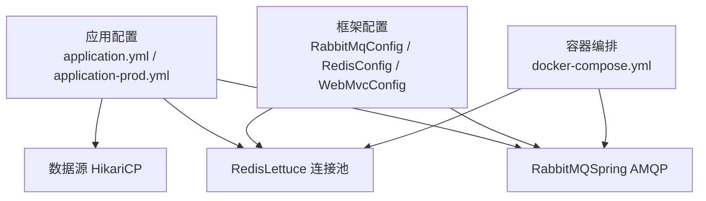
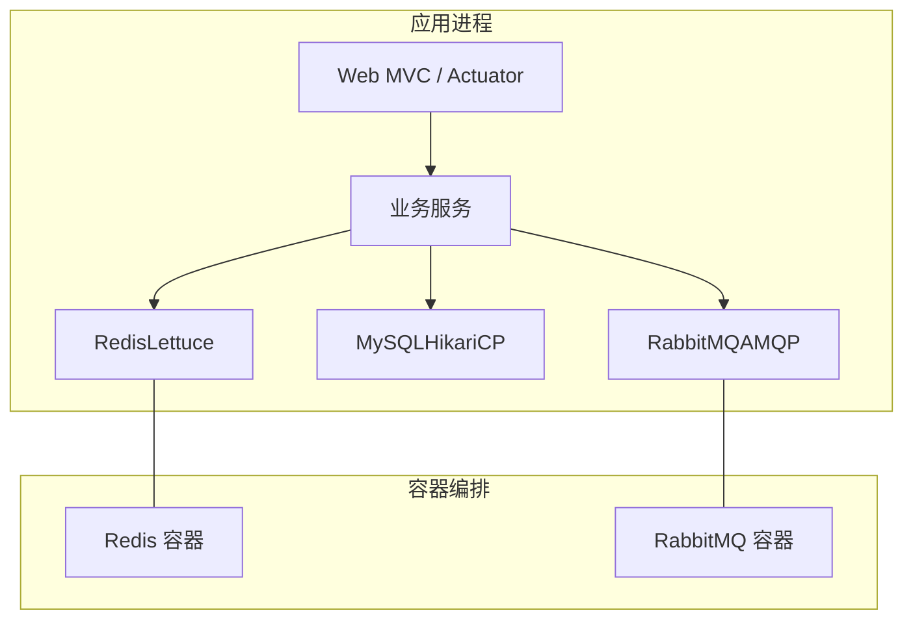
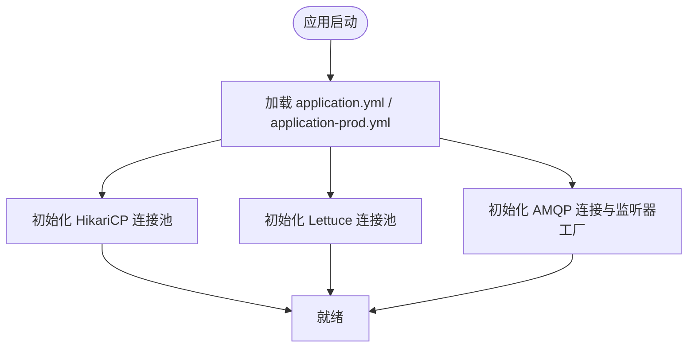
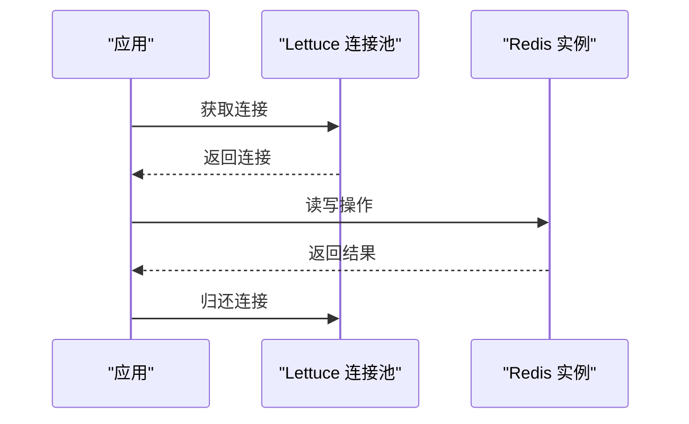
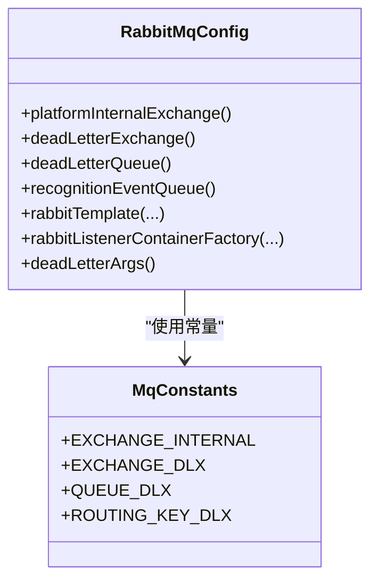
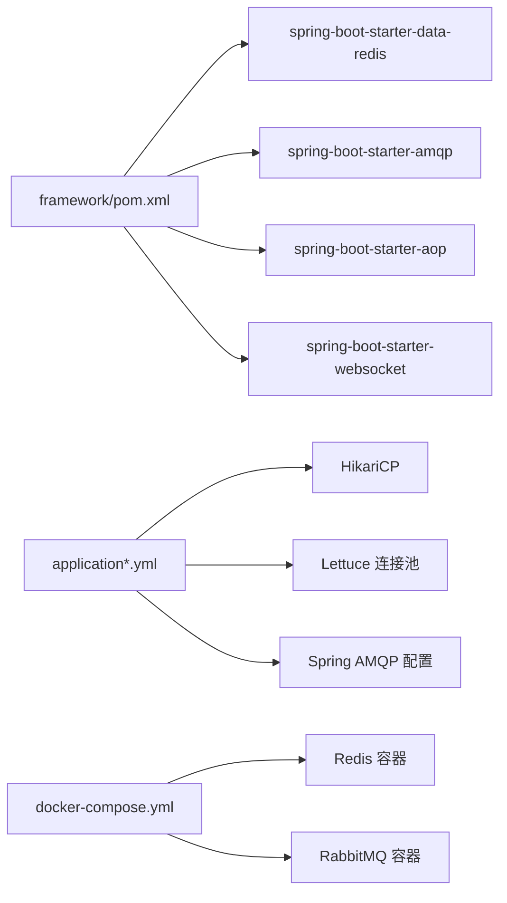

# 应用性能调优

<cite>
**本文引用的文件**   
- [application.yml](file://parking-boot/src/main/resources/application.yml)
- [application-prod.yml](file://parking-boot/src/main/resources/application-prod.yml)
- [docker-compose.yml](file://docker-compose.yml)
- [RabbitMqConfig.java](file://parking-framework/src/main/java/com/jushan/framework/mq/RabbitMqConfig.java)
- [RedisConfig.java](file://parking-framework/src/main/java/com/jushan/framework/redis/RedisConfig.java)
- [CacheNames.java](file://parking-framework/src/main/java/com/jushan/framework/redis/CacheNames.java)
- [pom.xml（框架依赖）](file://parking-framework/pom.xml)
- [WebMvcConfig.java](file://parking-framework/src/main/java/com/jushan/framework/config/WebMvcConfig.java)
- [ProdConfigValidator.java](file://parking-boot/src/main/java/com/jushan/boot/config/ProdConfigValidator.java)
</cite>

## 目录
1. [引言](#引言)
2. [项目结构](#项目结构)
3. [核心组件](#核心组件)
4. [架构总览](#架构总览)
5. [详细组件分析](#详细组件分析)
6. [依赖关系分析](#依赖关系分析)
7. [性能考虑](#性能考虑)
8. [故障排查指南](#故障排查指南)
9. [结论](#结论)
10. [附录](#附录)

## 引言
本指南面向智慧停车 SaaS 平台的生产与测试环境，聚焦可落地的性能调优实践。内容覆盖：
- JVM 参数调优（堆内存、GC 选择、GC 日志）
- Spring Boot 应用优化（线程池、缓存策略、数据库连接池）
- Redis 缓存优化（内存策略、持久化、集群建议）
- RabbitMQ 消息队列调优（队列深度、消费者并发、确认机制）
- 监控指标配置、瓶颈分析与容量规划建议

说明：
- 本项目未内嵌 JVM 启动脚本或 GC 日志配置；JVM 参数应在部署层（容器编排/进程管理器）注入。
- 当前仓库已包含 Redis、RabbitMQ、HikariCP、Sa-Token、Micrometer 等关键能力的基础配置与扩展点，可作为调优基线。

## 项目结构
从性能视角关注以下位置：
- 应用通用与生产配置：application.yml、application-prod.yml
- 中间件运行环境与默认参数：docker-compose.yml
- 框架层集成：RabbitMqConfig、RedisConfig、WebMvcConfig
- 依赖声明：framework 模块 pom.xml（引入 Redis、AMQP、AOP、WebSocket 等）

图表来源
- [application.yml:21-52](file://parking-boot/src/main/resources/application.yml#L21-L52)
- [application-prod.yml:16-54](file://parking-boot/src/main/resources/application-prod.yml#L16-L54)
- [RabbitMqConfig.java:117-162](file://parking-framework/src/main/java/com/jushan/framework/mq/RabbitMqConfig.java#L117-L162)
- [RedisConfig.java:45-63](file://parking-framework/src/main/java/com/jushan/framework/redis/RedisConfig.java#L45-L63)
- [docker-compose.yml:94-115](file://docker-compose.yml#L94-L115)

章节来源
- [application.yml:21-52](file://parking-boot/src/main/resources/application.yml#L21-L52)
- [application-prod.yml:16-54](file://parking-boot/src/main/resources/application-prod.yml#L16-L54)
- [docker-compose.yml:94-115](file://docker-compose.yml#L94-L115)

## 核心组件
- 数据源与连接池：基于 HikariCP，提供最大连接数、最小空闲、超时等可调项。
- Redis 客户端：使用 Lettuce + Commons Pool2，支持连接池大小、等待时间等。
- 消息队列：Spring AMQP + RabbitMQ，内置 DLX、JSON 序列化、消费者并发与预取控制。
- 安全与会话：Sa-Token 集成 Redis 存储会话，影响缓存命中率与过期策略。
- 监控与健康检查：Actuator 暴露 health/info，Micrometer 用于自定义指标埋点。

章节来源
- [application.yml:21-52](file://parking-boot/src/main/resources/application.yml#L21-L52)
- [application-prod.yml:16-54](file://parking-boot/src/main/resources/application-prod.yml#L16-L54)
- [RabbitMqConfig.java:117-162](file://parking-framework/src/main/java/com/jushan/framework/mq/RabbitMqConfig.java#L117-L162)
- [RedisConfig.java:45-63](file://parking-framework/src/main/java/com/jushan/framework/redis/RedisConfig.java#L45-L63)
- [pom.xml（框架依赖）:42-69](file://parking-framework/pom.xml#L42-L69)

## 架构总览
下图展示运行时关键路径：HTTP 请求经 Web 层进入业务服务，访问数据库与缓存，必要时通过 MQ 异步处理；容器编排为 Redis 与 RabbitMQ 提供运行环境。

图表来源
- [application.yml:21-52](file://parking-boot/src/main/resources/application.yml#L21-L52)
- [application-prod.yml:16-54](file://parking-boot/src/main/resources/application-prod.yml#L16-L54)
- [docker-compose.yml:94-115](file://docker-compose.yml#L94-L115)

## 详细组件分析

### JVM 参数调优（堆内存、GC、GC 日志）
现状与建议
- 当前仓库未内嵌 JVM 启动参数与 GC 日志配置。建议在部署层统一注入，例如容器编排的启动命令或进程管理器的环境变量。
- 推荐方向（按场景给出范围，具体值需压测确定）：
  - 堆大小：根据可用内存与服务规模设置初始与最大堆，保持相等以减少动态扩容开销。
  - GC 选择：优先 G1GC；对低延迟要求极高且堆较大时可评估 ZGC。
  - GC 日志：启用并输出到独立文件，便于离线分析停顿与吞吐。
  - 元空间：避免频繁 Full GC，合理设置上限与回收策略。
  - 线程栈：结合业务线程模型调整线程栈大小。
- 验证方法：在压测中观察 GC 日志、Prometheus/Grafana 指标、以及业务 SLA（P95/P99 延迟）。

章节来源
- [application.yml:1-108](file://parking-boot/src/main/resources/application.yml#L1-L108)
- [application-prod.yml:1-83](file://parking-boot/src/main/resources/application-prod.yml#L1-L83)

### Spring Boot 应用优化（线程池、缓存、连接池）
- 线程池
  - 当前未显式定义业务线程池，可在需要异步处理的场景按需创建专用线程池，隔离热点任务与 IO 密集型任务。
  - 参考注册全局 Filter 的模式进行 Bean 注册与优先级控制，确保链路追踪与上下文传递。
- 缓存策略
  - 使用 Redis 作为分布式缓存，Key 前缀与序列化已在框架层统一配置。
  - 建议按领域划分缓存名称空间，避免热点键冲突与跨域污染。
- 数据库连接池（HikariCP）
  - 本地与生产分别配置了最大连接数、最小空闲、超时等参数。
  - 调优要点：根据 CPU 核数、磁盘 I/O、SQL 平均耗时估算合适连接数；避免过大导致上下文切换与锁竞争。
- 安全与会话
  - Sa-Token 将会话存入 Redis，注意会话大小与过期时间对缓存压力与命中率的影响。

图表来源
- [application.yml:21-52](file://parking-boot/src/main/resources/application.yml#L21-L52)
- [application-prod.yml:16-54](file://parking-boot/src/main/resources/application-prod.yml#L16-L54)
- [RabbitMqConfig.java:147-162](file://parking-framework/src/main/java/com/jushan/framework/mq/RabbitMqConfig.java#L147-L162)

章节来源
- [WebMvcConfig.java:22-36](file://parking-framework/src/main/java/com/jushan/framework/config/WebMvcConfig.java#L22-L36)
- [RedisConfig.java:45-63](file://parking-framework/src/main/java/com/jushan/framework/redis/RedisConfig.java#L45-L63)
- [CacheNames.java:18-39](file://parking-framework/src/main/java/com/jushan/framework/redis/CacheNames.java#L18-L39)
- [application.yml:21-52](file://parking-boot/src/main/resources/application.yml#L21-L52)
- [application-prod.yml:16-54](file://parking-boot/src/main/resources/application-prod.yml#L16-L54)

### Redis 缓存优化（内存策略、持久化、集群）
现状
- 容器编排中 Redis 启用了 AOF 持久化、最大内存限制与 allkeys-lru 淘汰策略。
- 应用侧使用 Lettuce 连接池，Key/Value 序列化由框架统一配置。

建议
- 内存策略
  - 仅缓存热数据与读多写少数据；大对象拆分或压缩；合理设置 TTL。
  - 热点 Key 防抖与本地二级缓存（谨慎使用，注意一致性）。
- 持久化
  - AOF 适合数据安全优先场景；RDB 适合快速恢复。可按业务权衡。
- 集群与高可用
  - 生产建议采用主从+哨兵或集群模式；分片键设计避免倾斜；跨机房容灾需评估网络分区与脑裂风险。
- 连接池
  - 根据 QPS 与 RT 调整 max-active/max-idle/min-idle/max-wait，避免连接耗尽与排队。

图表来源
- [docker-compose.yml:111-115](file://docker-compose.yml#L111-L115)
- [application.yml:39-52](file://parking-boot/src/main/resources/application.yml#L39-L52)
- [application-prod.yml:34-46](file://parking-boot/src/main/resources/application-prod.yml#L34-L46)
- [RedisConfig.java:45-63](file://parking-framework/src/main/java/com/jushan/framework/redis/RedisConfig.java#L45-L63)

章节来源
- [docker-compose.yml:94-115](file://docker-compose.yml#L94-L115)
- [application.yml:39-52](file://parking-boot/src/main/resources/application.yml#L39-L52)
- [application-prod.yml:34-46](file://parking-boot/src/main/resources/application-prod.yml#L34-L46)
- [RedisConfig.java:45-63](file://parking-framework/src/main/java/com/jushan/framework/redis/RedisConfig.java#L45-L63)
- [CacheNames.java:18-39](file://parking-framework/src/main/java/com/jushan/framework/redis/CacheNames.java#L18-L39)

### RabbitMQ 消息队列调优（队列深度、消费者并发、确认机制）
现状
- 框架定义了内部 Topic Exchange、DLX 与死信队列，识别事件队列绑定至内部 Exchange。
- 消费者工厂默认开启 AUTO 确认、prefetch=10、并发 1~5 的动态伸缩。
- 发送端提供 confirm 与 return 回调，便于观测路由失败与未确认情况。

建议
- 队列深度与持久化
  - 关键业务队列开启持久化；根据峰值与消费速率设定合理长度与 TTL，避免无限堆积。
- 消费者并发
  - 根据 CPU 与下游依赖（DB/外部 API）调整 concurrentConsumers 与 maxConcurrentConsumers；热点通道可单独扩缩容。
- 确认机制
  - 默认 AUTO 确认适用于幂等处理；若需强一致，可改为手动确认并在异常时重投或入死信。
- 背压与限流
  - 利用 prefetch 控制单消费者未确认消息数；结合业务侧限流与熔断保护下游。

图表来源
- [RabbitMqConfig.java:63-101](file://parking-framework/src/main/java/com/jushan/framework/mq/RabbitMqConfig.java#L63-L101)
- [RabbitMqConfig.java:117-162](file://parking-framework/src/main/java/com/jushan/framework/mq/RabbitMqConfig.java#L117-L162)
- [MqConstants.java:24-44](file://parking-framework/src/main/java/com/jushan/framework/mq/MqConstants.java#L24-L44)

章节来源
- [RabbitMqConfig.java:63-101](file://parking-framework/src/main/java/com/jushan/framework/mq/RabbitMqConfig.java#L63-L101)
- [RabbitMqConfig.java:117-162](file://parking-framework/src/main/java/com/jushan/framework/mq/RabbitMqConfig.java#L117-L162)
- [MqConstants.java:24-44](file://parking-framework/src/main/java/com/jushan/framework/mq/MqConstants.java#L24-L44)

### 应用监控指标配置与可观测性
现状
- Actuator 暴露 health/info，健康探针开关已启用；生产模式隐藏详情。
- Micrometer Core 已引入，可用于记录延迟、错误率、Gauge/Timer/Histogram 等指标。
- 测试用例展示了延迟 Timer 与断路器状态 Gauge 的断言方式，可作为埋点参考。

建议
- 暴露必要端点：在生产环境中仅暴露最小集合，并通过网关/防火墙限制访问。
- 指标体系：围绕可用性、性能、资源、业务 KPI 四类构建；统一命名规范与标签维度。
- 告警规则：基于阈值与趋势双轨告警，避免误报与漏报。

章节来源
- [application.yml:75-91](file://parking-boot/src/main/resources/application.yml#L75-L91)
- [application-prod.yml:67-75](file://parking-boot/src/main/resources/application-prod.yml#L67-L75)
- [pom.xml（框架依赖）:42-45](file://parking-framework/pom.xml#L42-L45)

## 依赖关系分析
- 框架层引入 Redis、AMQP、AOP、WebSocket 等 Starter，支撑缓存、消息、实时推送与切面能力。
- 应用配置集中管理数据源、Redis、RabbitMQ 的连接与池化参数。
- 容器编排为 Redis 与 RabbitMQ 提供默认运行参数（如内存上限、持久化开关）。

图表来源
- [pom.xml（框架依赖）:42-69](file://parking-framework/pom.xml#L42-L69)
- [application.yml:21-52](file://parking-boot/src/main/resources/application.yml#L21-L52)
- [application-prod.yml:16-54](file://parking-boot/src/main/resources/application-prod.yml#L16-L54)
- [docker-compose.yml:94-115](file://docker-compose.yml#L94-L115)

章节来源
- [pom.xml（框架依赖）:42-69](file://parking-framework/pom.xml#L42-L69)
- [application.yml:21-52](file://parking-boot/src/main/resources/application.yml#L21-L52)
- [application-prod.yml:16-54](file://parking-boot/src/main/resources/application-prod.yml#L16-L54)
- [docker-compose.yml:94-115](file://docker-compose.yml#L94-L115)

## 性能考虑
- 数据库
  - 连接池大小与 SQL 执行计划是首要瓶颈；配合慢查询日志与索引优化。
  - 事务边界尽量短小，避免长事务占用连接。
- 缓存
  - 命中率优先于一致性；对热点键做本地缓存需谨慎评估失效风暴。
  - 序列化体积与网络往返次数直接影响吞吐。
- 消息队列
  - 消费者并发与 prefetch 决定吞吐上限；死信与重试策略保障可靠性。
  - 批量消费可降低网络与序列化开销。
- 线程模型
  - 区分同步阻塞与异步非阻塞路径；IO 密集与 CPU 密集分离线程池。
- 前端与网关
  - 静态资源缓存、CDN、Gzip 压缩、Keep-Alive 等基础优化不可忽视。

[本节为通用指导，不直接分析具体文件]

## 故障排查指南
- 启动期配置校验
  - 生产环境存在关键配置校验器，缺失必填项会阻止启动，便于尽早发现问题。
- 健康检查
  - 通过 Actuator 的 health 端点查看各组件状态；生产模式隐藏细节，避免泄露敏感信息。
- 日志与追踪
  - 全局 TraceId 过滤器确保链路追踪贯穿请求；结合日志级别与采样策略降低噪音。
- 常见症状定位
  - 连接池耗尽：观察 Hikari/Lettuce 等待时间与拒绝率，适当提升池大小或优化 SQL/缓存命中。
  - 消息堆积：检查消费者并发、prefetch、下游依赖 RT 与错误率；必要时扩容或降级。
  - Redis 内存抖动：关注淘汰策略与热点键分布，必要时拆分 Key 或引入本地缓存。

章节来源
- [ProdConfigValidator.java:25-40](file://parking-boot/src/main/java/com/jushan/boot/config/ProdConfigValidator.java#L25-L40)
- [application.yml:75-91](file://parking-boot/src/main/resources/application.yml#L75-L91)
- [application-prod.yml:67-75](file://parking-boot/src/main/resources/application-prod.yml#L67-L75)
- [WebMvcConfig.java:22-36](file://parking-framework/src/main/java/com/jushan/framework/config/WebMvcConfig.java#L22-L36)

## 结论
- 本项目已具备完善的中间件集成与可扩展的配置点，适合作为性能调优基线。
- 建议以“压测驱动”的方式逐步调整 JVM、连接池、缓存与 MQ 参数，并结合监控与日志闭环验证。
- 生产上线前务必完成容量规划与回滚预案，确保变更可控、问题可溯。

[本节为总结性内容，不直接分析具体文件]

## 附录
- 常用调优清单
  - JVM：堆大小、GC 类型、GC 日志、元空间、线程栈
  - 数据库：连接池大小、超时、慢查询、索引
  - 缓存：Key 设计、TTL、序列化、热点键
  - MQ：队列持久化、消费者并发、prefetch、重试与死信
  - 监控：指标采集、告警规则、日志采样
- 参考配置位置
  - 数据源与 Redis：application.yml、application-prod.yml
  - RabbitMQ：application-prod.yml + RabbitMqConfig
  - Redis 容器参数：docker-compose.yml

[本节为补充信息，不直接分析具体文件]