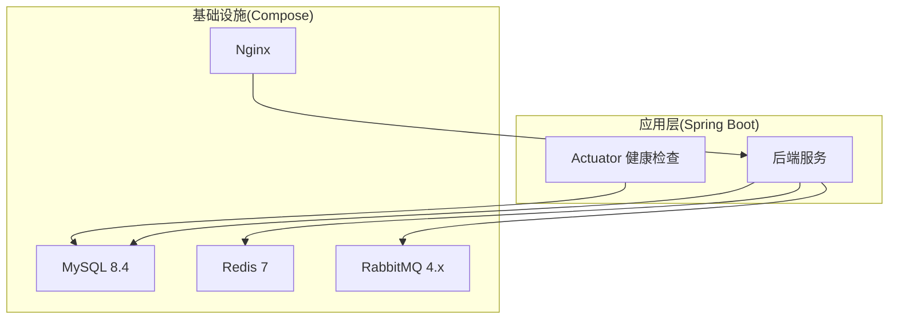
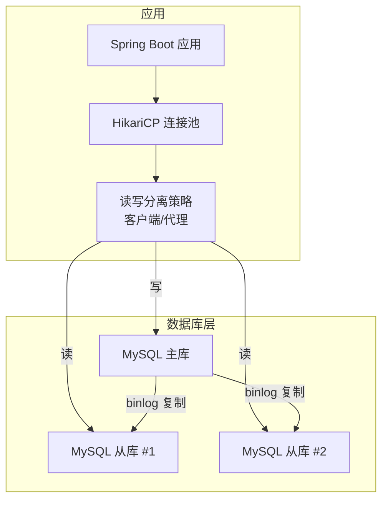
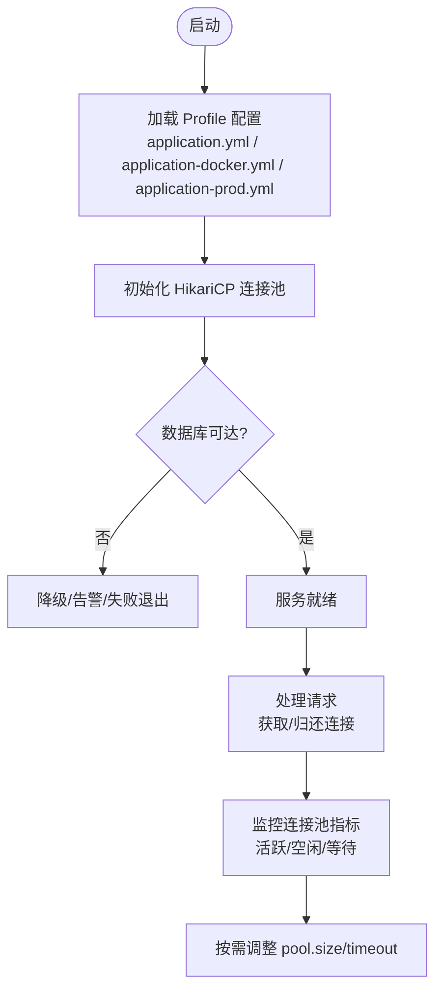
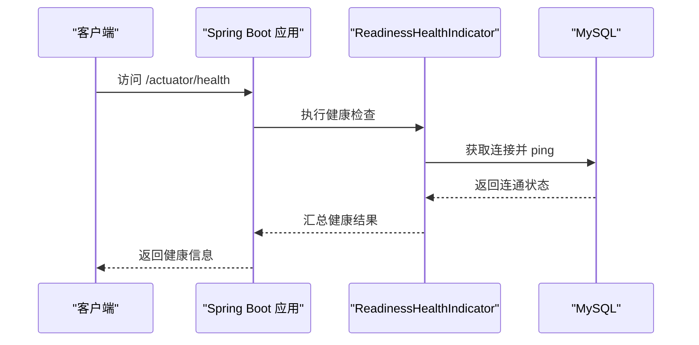
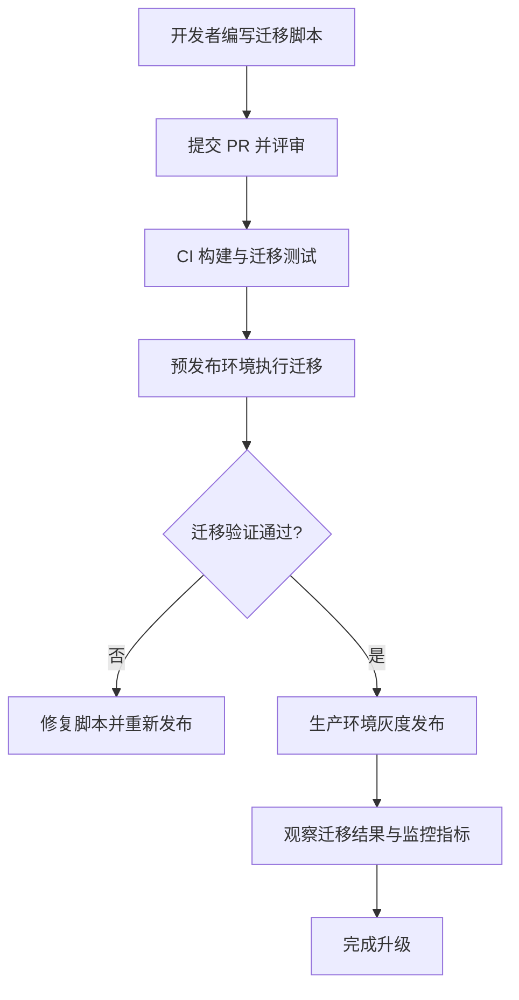
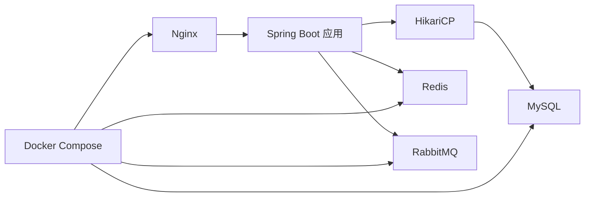

# 数据库高可用部署

<cite>
**本文引用的文件**
- [docker-compose.yml](file://docker-compose.yml)
- [application.yml](file://parking-boot/src/main/resources/application.yml)
- [application-docker.yml](file://parking-boot/src/main/resources/application-docker.yml)
- [application-prod.yml](file://parking-boot/src/main/resources/application-prod.yml)
- [配置说明.md](file://docs/部署运维/配置说明.md)
- [部署说明.md](file://docs/部署运维/部署说明.md)
- [V20260710001__baseline.sql](file://parking-boot/src/main/resources/db/migration/V20260710001__baseline.sql)
- [V20260711011__device_status_snapshot.sql](file://parking-boot/src/main/resources/db/migration/V20260711011__device_status_snapshot.sql)
- [ReadinessHealthIndicator.java](file://parking-boot/src/main/java/com/jushan/boot/health/ReadinessHealthIndicator.java)
- [FlywayMigrationTest.java](file://parking-boot/src/test/java/com/jushan/boot/migration/FlywayMigrationTest.java)
- [section_03_ddl.md](file://docs/开发计划/section_03_ddl.md)
</cite>

## 目录
1. [引言](#引言)
2. [项目结构](#项目结构)
3. [核心组件](#核心组件)
4. [架构总览](#架构总览)
5. [详细组件分析](#详细组件分析)
6. [依赖关系分析](#依赖关系分析)
7. [性能考虑](#性能考虑)
8. [故障诊断指南](#故障诊断指南)
9. [结论](#结论)
10. [附录](#附录)

## 引言
本方案面向智慧停车 SaaS 平台的数据库高可用与可运维性，围绕 MySQL 主从复制、读写分离策略、连接池与最大连接数调优、慢查询优化、备份恢复与定时任务、监控指标与性能分析、数据迁移与版本升级回滚等主题给出落地建议。文档同时结合仓库现有配置（Docker Compose、Spring Boot 多环境配置、Flyway 迁移、健康检查）提供可直接落地的步骤与参考路径。

## 项目结构
当前仓库已包含本地开发所需的基础设施编排与运行配置：
- Docker Compose 编排 MySQL 8.4、Redis 7、RabbitMQ 4.x、Nginx，并定义端口映射、数据卷与健康检查。
- Spring Boot 多环境配置文件覆盖数据源、连接池、Flyway、Redis、RabbitMQ、Actuator 暴露端点等。
- Flyway 迁移脚本管理数据库版本演进，测试用例验证迁移幂等性与表结构正确性。
- 健康检查组件对外暴露应用就绪状态，包含数据库连通性探测。

图表来源
- [docker-compose.yml:30-63](file://docker-compose.yml#L30-L63)
- [application.yml:21-37](file://parking-boot/src/main/resources/application.yml#L21-L37)
- [application-docker.yml:13-46](file://parking-boot/src/main/resources/application-docker.yml#L13-L46)
- [application-prod.yml:14-54](file://parking-boot/src/main/resources/application-prod.yml#L14-L54)
- [ReadinessHealthIndicator.java:72-86](file://parking-boot/src/main/java/com/jushan/boot/health/ReadinessHealthIndicator.java#L72-L86)

章节来源
- [docker-compose.yml:1-167](file://docker-compose.yml#L1-L167)
- [application.yml:1-37](file://parking-boot/src/main/resources/application.yml#L1-L37)
- [application-docker.yml:1-88](file://parking-boot/src/main/resources/application-docker.yml#L1-L88)
- [application-prod.yml:1-83](file://parking-boot/src/main/resources/application-prod.yml#L1-L83)
- [部署说明.md:1-111](file://docs/部署运维/部署说明.md#L1-L111)
- [配置说明.md:1-182](file://docs/部署运维/配置说明.md#L1-L182)

## 核心组件
- 数据源与连接池
  - 使用 HikariCP 作为默认连接池，通过 application.yml 与 profile 覆盖进行参数化配置。
  - 生产环境通过环境变量注入敏感信息，避免硬编码。
- 数据库迁移
  - 使用 Flyway 管理 DDL 变更，clean-disabled 防止误删库；基线迁移与后续业务迁移按版本号顺序执行。
- 健康检查
  - Actuator 暴露 health/info；自定义 ReadinessHealthIndicator 校验数据库连通性并输出详细信息。
- 容器编排
  - Docker Compose 统一启动 MySQL、Redis、RabbitMQ、Nginx，设置健康检查与依赖启动顺序。

章节来源
- [application.yml:21-37](file://parking-boot/src/main/resources/application.yml#L21-L37)
- [application-docker.yml:13-46](file://parking-boot/src/main/resources/application-docker.yml#L13-L46)
- [application-prod.yml:14-54](file://parking-boot/src/main/resources/application-prod.yml#L14-L54)
- [V20260710001__baseline.sql:1-22](file://parking-boot/src/main/resources/db/migration/V20260710001__baseline.sql#L1-L22)
- [ReadinessHealthIndicator.java:72-86](file://parking-boot/src/main/java/com/jushan/boot/health/ReadinessHealthIndicator.java#L72-L86)
- [docker-compose.yml:30-63](file://docker-compose.yml#L30-L63)

## 架构总览
下图展示“单实例 → 主从复制 → 读写分离”的演进目标与当前实现的关系。当前仓库为单实例 MySQL，读写分离需引入中间件或客户端路由；主从复制需在 MySQL 层启用 binlog 与复制拓扑。

图表来源
- [application.yml:21-37](file://parking-boot/src/main/resources/application.yml#L21-L37)
- [application-prod.yml:14-54](file://parking-boot/src/main/resources/application-prod.yml#L14-L54)
- [docker-compose.yml:30-63](file://docker-compose.yml#L30-L63)

## 详细组件分析

### MySQL 主从复制与读写分离
- 主库写入
  - 所有写操作指向主库；确保事务一致性与时区一致。
- 从库读取
  - 将只读查询路由至从库，提升读吞吐与可用性。
- 读写分离策略
  - 推荐在应用侧采用多数据源 + 动态路由（如基于注解或 AOP），或在网关/代理层（如 ProxySQL、ShardingSphere-Proxy）实现透明读写分离。
  - 注意主从延迟导致的最终一致性问题，关键写后读应强制走主库或增加重试/等待逻辑。
- 当前仓库现状
  - 仅单实例 MySQL，未内置读写分离；可在不改动业务代码的前提下通过外部代理实现。

章节来源
- [docker-compose.yml:30-63](file://docker-compose.yml#L30-L63)
- [application.yml:21-37](file://parking-boot/src/main/resources/application.yml#L21-L37)
- [application-prod.yml:14-54](file://parking-boot/src/main/resources/application-prod.yml#L14-L54)

### 连接池与最大连接数调优
- HikariCP 关键参数
  - maximum-pool-size：根据并发与数据库 max_connections 综合评估，避免耗尽数据库连接。
  - minimum-idle：保持最小空闲连接，降低冷启动抖动。
  - idle-timeout/connection-timeout：控制空闲回收与获取超时，保障稳定性。
- 最大连接数规划
  - 数据库 max_connections ≥ 应用实例数 × 每实例 pool.max + 预留余量。
  - 若引入读写分离，需分别评估主库与从库的连接上限。
- 当前配置位置
  - 通用默认值位于 application.yml；Docker 与生产环境通过 profile 与环境变量覆盖。

图表来源
- [application.yml:21-37](file://parking-boot/src/main/resources/application.yml#L21-L37)
- [application-docker.yml:13-46](file://parking-boot/src/main/resources/application-docker.yml#L13-L46)
- [application-prod.yml:14-54](file://parking-boot/src/main/resources/application-prod.yml#L14-L54)

章节来源
- [application.yml:21-37](file://parking-boot/src/main/resources/application.yml#L21-L37)
- [application-docker.yml:13-46](file://parking-boot/src/main/resources/application-docker.yml#L13-L46)
- [application-prod.yml:14-54](file://parking-boot/src/main/resources/application-prod.yml#L14-L54)
- [配置说明.md:22-38](file://docs/部署运维/配置说明.md#L22-L38)

### 慢查询优化
- 开启与分析
  - 建议在 MySQL 开启 slow_query_log，并结合 pt-query-digest 或 Percona Monitoring 工具进行分析。
- 索引与 SQL 规范
  - 针对热点查询建立合适索引，避免全表扫描；限制 SELECT *，减少网络与内存开销。
  - 对大结果集分页查询采用游标式分页或基于时间戳的分页，避免深分页。
- 事务与锁
  - 缩短事务范围，避免长事务导致锁竞争与复制延迟。
- 快照表与归档
  - 对于高频快照类数据（如设备状态快照），合理设计索引与分区/归档策略，保证查询性能与存储成本平衡。

章节来源
- [V20260711011__device_status_snapshot.sql:1-31](file://parking-boot/src/main/resources/db/migration/V20260711011__device_status_snapshot.sql#L1-L31)
- [section_03_ddl.md:2029-2042](file://docs/开发计划/section_03_ddl.md#L2029-L2042)

### 备份与恢复策略
- 全量备份
  - 建议使用 mysqldump 或物理备份工具（如 XtraBackup）定期执行全量备份，保留多份历史副本。
- 增量备份
  - 基于 binlog 的增量备份，配合时间点恢复（PITR）能力，满足更细粒度的恢复需求。
- 定时任务
  - 通过系统 cron 或容器编排任务触发备份脚本；备份文件落盘到对象存储或独立备份服务器。
- 恢复演练
  - 定期在隔离环境进行恢复演练，验证备份有效性与恢复时长。

章节来源
- [docker-compose.yml:30-63](file://docker-compose.yml#L30-L63)
- [部署说明.md:45-52](file://docs/部署运维/部署说明.md#L45-L52)

### 监控指标收集与性能分析
- 应用层
  - 通过 Actuator 暴露 health/info；自定义健康检查输出数据库与 Redis 连通详情。
- 数据库层
  - 采集连接数、QPS/TPS、慢查询、复制延迟、锁等待、缓冲命中率等指标。
- 日志与追踪
  - 结合 TraceId 与结构化日志，定位跨服务调用链问题。

图表来源
- [ReadinessHealthIndicator.java:72-86](file://parking-boot/src/main/java/com/jushan/boot/health/ReadinessHealthIndicator.java#L72-L86)
- [application-docker.yml:73-82](file://parking-boot/src/main/resources/application-docker.yml#L73-L82)
- [application-prod.yml:67-76](file://parking-boot/src/main/resources/application-prod.yml#L67-L76)

章节来源
- [ReadinessHealthIndicator.java:72-86](file://parking-boot/src/main/java/com/jushan/boot/health/ReadinessHealthIndicator.java#L72-L86)
- [application-docker.yml:73-82](file://parking-boot/src/main/resources/application-docker.yml#L73-L82)
- [application-prod.yml:67-76](file://parking-boot/src/main/resources/application-prod.yml#L67-L76)

### 数据迁移工具与版本升级流程
- 迁移工具
  - 使用 Flyway 管理 DDL 变更，基线迁移与后续版本按命名规则递增。
- 升级流程
  - 预发布环境验证迁移脚本；灰度发布时观察迁移是否成功与表结构是否符合预期。
- 回滚策略
  - 禁止修改已发布迁移；如需回滚，新增反向迁移脚本并在发布流水线中控制执行顺序。
- 验证与回归
  - 通过单元测试验证迁移结果与约束（例如唯一键、列数量）。

图表来源
- [V20260710001__baseline.sql:1-22](file://parking-boot/src/main/resources/db/migration/V20260710001__baseline.sql#L1-L22)
- [FlywayMigrationTest.java:41-118](file://parking-boot/src/test/java/com/jushan/boot/migration/FlywayMigrationTest.java#L41-L118)
- [application.yml:33-37](file://parking-boot/src/main/resources/application.yml#L33-L37)
- [application-prod.yml:28-32](file://parking-boot/src/main/resources/application-prod.yml#L28-L32)

章节来源
- [V20260710001__baseline.sql:1-22](file://parking-boot/src/main/resources/db/migration/V20260710001__baseline.sql#L1-L22)
- [FlywayMigrationTest.java:1-119](file://parking-boot/src/test/java/com/jushan/boot/migration/FlywayMigrationTest.java#L1-L119)
- [application.yml:33-37](file://parking-boot/src/main/resources/application.yml#L33-L37)
- [application-prod.yml:28-32](file://parking-boot/src/main/resources/application-prod.yml#L28-L32)

## 依赖关系分析
- 应用与数据库
  - 应用通过 HikariCP 连接池访问 MySQL；健康检查组件直接探测数据库连通性。
- 应用与缓存/消息
  - 应用连接 Redis 与 RabbitMQ，用于会话、限流、分布式锁与异步消息。
- 编排与依赖
  - Docker Compose 定义服务间健康检查与启动顺序，Nginx 依赖其他服务健康后再启动。

图表来源
- [docker-compose.yml:30-145](file://docker-compose.yml#L30-L145)
- [application.yml:21-37](file://parking-boot/src/main/resources/application.yml#L21-L37)
- [application-docker.yml:13-54](file://parking-boot/src/main/resources/application-docker.yml#L13-L54)
- [application-prod.yml:14-54](file://parking-boot/src/main/resources/application-prod.yml#L14-L54)

章节来源
- [docker-compose.yml:1-167](file://docker-compose.yml#L1-L167)
- [application.yml:1-37](file://parking-boot/src/main/resources/application.yml#L1-L37)
- [application-docker.yml:1-88](file://parking-boot/src/main/resources/application-docker.yml#L1-L88)
- [application-prod.yml:1-83](file://parking-boot/src/main/resources/application-prod.yml#L1-L83)

## 性能考虑
- 连接池容量与超时
  - 依据峰值 QPS 与平均响应时间估算连接占用，设置合适的 maximum-pool-size 与 connection-timeout。
- 索引与查询
  - 针对热点查询建立复合索引，避免函数索引与隐式类型转换导致的索引失效。
- 事务与锁
  - 控制事务粒度，避免长事务；关注死锁与锁等待，必要时拆分事务。
- 主从延迟
  - 对强一致场景采用强制主库读或引入一致性读策略；对最终一致场景接受短暂延迟。
- 资源隔离
  - 读写分离下，为主库与从库分配独立资源，避免相互影响。

[本节为通用指导，无需源码引用]

## 故障诊断指南
- 数据库不可达
  - 检查健康检查输出与错误详情；确认网络、账号权限与防火墙策略。
- 连接池耗尽
  - 观察 HikariCP 指标（活跃/空闲/等待），排查慢查询与长事务；适当扩容连接池或优化 SQL。
- 迁移失败
  - 查看 Flyway 迁移历史与错误日志；在预发布环境复现并修复脚本。
- 主从延迟
  - 监控复制延迟与慢查询；必要时临时将关键读路由切回主库。

章节来源
- [ReadinessHealthIndicator.java:72-86](file://parking-boot/src/main/java/com/jushan/boot/health/ReadinessHealthIndicator.java#L72-L86)
- [FlywayMigrationTest.java:41-118](file://parking-boot/src/test/java/com/jushan/boot/migration/FlywayMigrationTest.java#L41-L118)

## 结论
本方案在当前单实例 MySQL 的基础上，给出了主从复制与读写分离的演进路径，明确了连接池与最大连接数的调优要点、慢查询优化方法、备份恢复与定时任务策略、监控指标与性能分析方法，以及基于 Flyway 的数据迁移与版本升级回滚流程。建议在生产环境优先完善主从复制与读写分离，并配套完善的监控与演练机制，持续提升数据库的高可用与可观测性。

## 附录
- 常用命令与参考
  - 启动/停止基础设施：参见部署说明中的快速开始步骤。
  - 环境变量与敏感配置：参见配置说明中的环境变量与红线要求。
  - 数据卷与持久化：参见部署说明中的数据卷说明。

章节来源
- [部署说明.md:1-111](file://docs/部署运维/部署说明.md#L1-L111)
- [配置说明.md:151-182](file://docs/部署运维/配置说明.md#L151-L182)