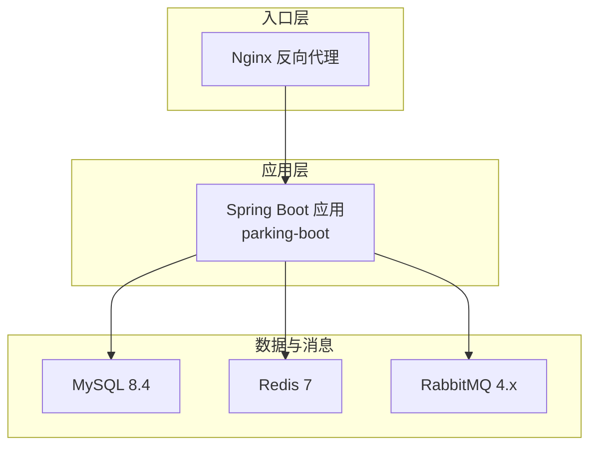
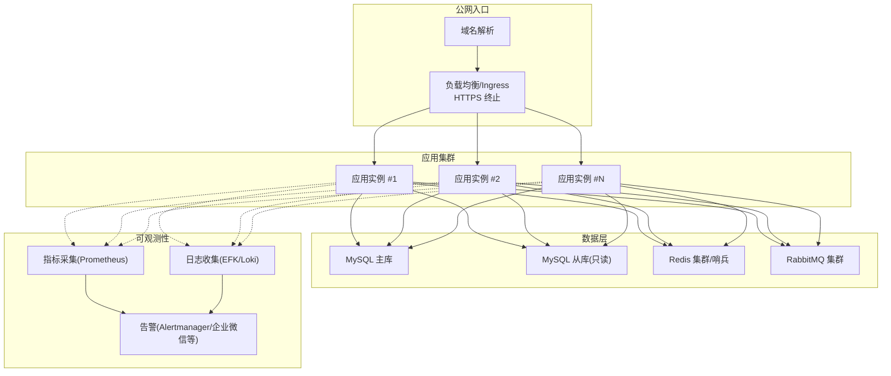
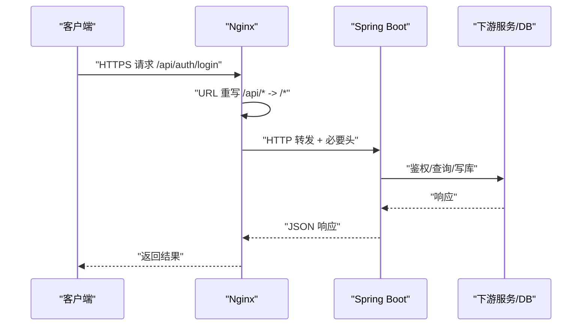
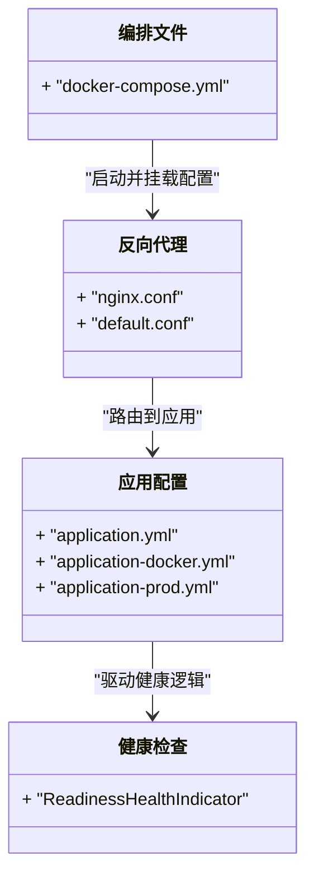

# 生产环境部署

<cite>
**本文引用的文件**   
- [README.md](file://README.md)
- [docker-compose.yml](file://docker-compose.yml)
- [application.yml](file://parking-boot/src/main/resources/application.yml)
- [application-docker.yml](file://parking-boot/src/main/resources/application-docker.yml)
- [application-prod.yml](file://parking-boot/src/main/resources/application-prod.yml)
- [nginx.conf](file://docker/nginx/nginx.conf)
- [default.conf](file://docker/nginx/conf.d/default.conf)
- [部署说明.md](file://docs/部署运维/部署说明.md)
- [配置说明.md](file://docs/部署运维/配置说明.md)
- [ProdConfigValidator.java](file://parking-boot/src/main/java/com/jushan/boot/config/ProdConfigValidator.java)
- [ReadinessHealthIndicator.java](file://parking-boot/src/main/java/com/jushan/boot/health/ReadinessHealthIndicator.java)
</cite>

## 目录
1. [简介](#简介)
2. [项目结构](#项目结构)
3. [核心组件](#核心组件)
4. [架构总览](#架构总览)
5. [详细组件分析](#详细组件分析)
6. [依赖关系分析](#依赖关系分析)
7. [性能与资源调优](#性能与资源调优)
8. [CI/CD 与自动化发布](#cicd-与自动化发布)
9. [监控、日志与告警](#监控日志与告警)
10. [故障排查指南](#故障排查指南)
11. [结论](#结论)

## 简介
本指南面向生产环境，围绕容器化应用的多实例部署、负载均衡与高可用设计，SSL 证书与域名绑定、安全访问控制、数据库主从复制与备份恢复、JVM 与中间件参数调优、CI/CD 流水线集成与回滚、以及监控指标与日志聚合告警等方面提供系统化落地方案。仓库已提供本地开发编排（Docker Compose）与 Nginx 反向代理配置，生产部署需在此基础上进行扩展与加固。

## 项目结构
- 后端：Spring Boot 多模块工程，包含通用框架、系统业务与启动模块。
- 前端：管理端与岗亭端静态站点，生产由 Nginx 服务构建产物。
- 基础设施：MySQL、Redis、RabbitMQ、Nginx 通过 Docker Compose 编排用于本地开发；生产建议采用托管或集群化部署。
- 配置分层：application.yml 为公共配置，local/docker/test/prod 覆盖不同运行环境。

图示来源
- [docker-compose.yml:120-145](file://docker-compose.yml#L120-L145)
- [default.conf:15-51](file://docker/nginx/conf.d/default.conf#L15-L51)
- [application.yml:22-31](file://parking-boot/src/main/resources/application.yml#L22-L31)

章节来源
- [README.md:1-30](file://README.md#L1-L30)
- [部署说明.md:1-111](file://docs/部署运维/部署说明.md#L1-L111)

## 核心组件
- 应用配置与环境变量
  - 生产敏感项通过环境变量注入，禁止写入配置文件。
  - Actuator 暴露 health/info，生产默认隐藏详情。
- 健康检查与就绪探针
  - 自定义 Readiness 检查数据库与 Redis 连通性。
- 反向代理与 WebSocket
  - Nginx 统一 /api、/ws、/actuator 转发，支持长连接与结构化日志。
- 迁移与初始化
  - Flyway 自动执行 db/migration 脚本，生产禁用 clean。

章节来源
- [application-prod.yml:1-83](file://parking-boot/src/main/resources/application-prod.yml#L1-L83)
- [application.yml:75-92](file://parking-boot/src/main/resources/application.yml#L75-L92)
- [ReadinessHealthIndicator.java:72-113](file://parking-boot/src/main/java/com/jushan/boot/health/ReadinessHealthIndicator.java#L72-L113)
- [default.conf:15-87](file://docker/nginx/conf.d/default.conf#L15-L87)
- [application.yml:33-37](file://parking-boot/src/main/resources/application.yml#L33-L37)

## 架构总览
生产推荐架构要点：
- 多实例无状态应用，置于 Kubernetes 或容器编排平台，配合水平扩缩容。
- 外部流量经 Ingress/Nginx 进入，启用 HTTPS 与 TLS 终止。
- 数据库使用主从复制与只读副本，读写分离；缓存与消息使用高可用集群。
- 配置中心与密钥管理集中化，环境变量与 Secret 注入。
- 可观测性：指标、日志、链路追踪统一采集与告警。

[此图为概念架构图，不直接映射具体源码文件]

## 详细组件分析

### 容器编排与多实例部署
- 本地开发使用 docker-compose 编排 MySQL、Redis、RabbitMQ、Nginx，并定义健康检查与依赖顺序。
- 生产建议迁移至 Kubernetes：
  - Deployment 管理应用多副本，设置 readiness/liveness 探针。
  - Service/Ingress 暴露 HTTP/HTTPS，开启会话亲和按需配置。
  - ConfigMap/Secret 管理非敏感与敏感配置。
  - HorizontalPodAutoscaler 基于 CPU/内存或自定义指标扩缩容。
  - PodDisruptionBudget 保障滚动更新可用性。
  - 持久卷 PVC 挂载到数据库与缓存（若自建）。

章节来源
- [docker-compose.yml:27-167](file://docker-compose.yml#L27-L167)
- [部署说明.md:9-56](file://docs/部署运维/部署说明.md#L9-L56)

### 负载均衡与反向代理
- Nginx 作为统一入口，负责：
  - /api 前缀重写并转发至后端
  - /ws 长连接升级
  - /actuator 健康检查
  - 结构化日志输出（含 TraceId）
- 生产应：
  - 在 Ingress/Nginx 层启用 HTTPS 与 HSTS
  - 配置上游 keepalive 与超时策略
  - 限制请求体大小与速率

图示来源
- [default.conf:21-51](file://docker/nginx/conf.d/default.conf#L21-L51)
- [nginx.conf:22-32](file://docker/nginx/nginx.conf#L22-L32)

章节来源
- [default.conf:15-87](file://docker/nginx/conf.d/default.conf#L15-L87)
- [nginx.conf:18-67](file://docker/nginx/nginx.conf#L18-L67)

### SSL 证书与域名绑定
- 在 Ingress/Nginx 层完成 TLS 终止，证书由证书管理器自动签发与续期。
- 域名解析指向负载均衡器 IP，启用 HSTS 与强加密套件。
- 内部服务间通信建议使用 mTLS 或可信内网通道。

[本节为通用实践说明，未直接分析具体源码文件]

### 安全访问控制
- Sa-Token 仅从 Header 读取 Token，关闭 Cookie/Body 来源，避免 Token 来源混乱。
- Actuator 在生产模式隐藏健康详情，仅暴露 health/info。
- 生产前置校验器在 prod profile 下强制校验关键环境变量，缺失则拒绝启动。

章节来源
- [application.yml:58-74](file://parking-boot/src/main/resources/application.yml#L58-L74)
- [application-prod.yml:67-76](file://parking-boot/src/main/resources/application-prod.yml#L67-L76)
- [ProdConfigValidator.java:25-44](file://parking-boot/src/main/java/com/jushan/boot/config/ProdConfigValidator.java#L25-L44)

### 数据库主从复制、备份恢复与灾难恢复
- 主从复制
  - 主库写入，从库只读；应用侧按租户/场景选择读写路径。
  - 网络隔离与最小权限账号，跨机房延迟监控。
- 备份策略
  - 全量+增量结合，异地多副本，定期演练恢复。
  - 对 Flyway 迁移版本不可变，确保可回溯。
- 灾难恢复
  - 明确 RPO/RTO 目标，制定切换流程与灰度验证步骤。
  - 跨可用区部署，故障自动转移与人工兜底预案。

[本节为通用实践说明，未直接分析具体源码文件]

### 应用性能调优与 JVM 优化
- 连接池与超时
  - HikariCP 最大连接数、空闲超时、连接超时根据 QPS 与 DB 容量评估。
  - Lettuce 连接池与等待时间合理设置，避免阻塞。
- 日志级别
  - 生产 root 降低至 WARN，业务包 INFO，减少 I/O 开销。
- JVM 参数（示例方向）
  - 堆大小与 GC 选型（G1/ZGC），元空间、线程栈大小、OOM 转储开关。
  - 容器环境下设置 -XX:+UseContainerSupport 与资源限制匹配。
- 中间件
  - RabbitMQ 队列分区与消费者并发度；Redis 内存淘汰策略与持久化开关。

章节来源
- [application-prod.yml:17-27](file://parking-boot/src/main/resources/application-prod.yml#L17-L27)
- [application-prod.yml:34-47](file://parking-boot/src/main/resources/application-prod.yml#L34-L47)
- [application-prod.yml:77-83](file://parking-boot/src/main/resources/application-prod.yml#L77-L83)
- [application-docker.yml:21-26](file://parking-boot/src/main/resources/application-docker.yml#L21-L26)
- [application-docker.yml:41-46](file://parking-boot/src/main/resources/application-docker.yml#L41-L46)

### CI/CD 流水线与自动化部署
- 构建阶段
  - Maven 编译打包，前端静态资源构建，镜像构建与签名。
- 测试阶段
  - 单元测试、集成测试、契约测试；Device Access 使用 Mock。
- 发布阶段
  - 推送镜像至镜像仓库，Kubernetes 滚动更新，健康检查通过后切流。
- 回滚机制
  - 保留上一版本镜像，失败时快速回滚；数据库变更通过 Flyway 版本管理，必要时准备逆向脚本。

[本节为通用实践说明，未直接分析具体源码文件]

### 监控指标、日志聚合与告警
- 指标
  - Actuator health/info 暴露基础健康；可扩展 Micrometer 指标（如断路器状态 Gauge）。
- 日志
  - Nginx 结构化日志（含 TraceId），应用日志统一输出到文件/标准输出，由日志采集器收集。
- 告警
  - 基于指标阈值与错误率建立告警规则，联动通知渠道。

章节来源
- [application.yml:75-92](file://parking-boot/src/main/resources/application.yml#L75-L92)
- [nginx.conf:22-32](file://docker/nginx/nginx.conf#L22-L32)

## 依赖关系分析
- 应用对外部依赖：MySQL、Redis、RabbitMQ、Device Access（HTTP）。
- 配置优先级：application.yml → 对应 profile → 环境变量覆盖。
- 健康检查：Readiness 探针检查数据库与 Redis 连通性。

图示来源
- [application.yml:1-108](file://parking-boot/src/main/resources/application.yml#L1-L108)
- [application-docker.yml:1-88](file://parking-boot/src/main/resources/application-docker.yml#L1-L88)
- [application-prod.yml:1-83](file://parking-boot/src/main/resources/application-prod.yml#L1-L83)
- [ReadinessHealthIndicator.java:72-113](file://parking-boot/src/main/java/com/jushan/boot/health/ReadinessHealthIndicator.java#L72-L113)
- [nginx.conf:18-67](file://docker/nginx/nginx.conf#L18-L67)
- [default.conf:15-87](file://docker/nginx/conf.d/default.conf#L15-L87)
- [docker-compose.yml:27-167](file://docker-compose.yml#L27-L167)

章节来源
- [配置说明.md:1-182](file://docs/部署运维/配置说明.md#L1-L182)

## 性能与资源调优
- 连接池与超时
  - 根据峰值 QPS 与平均响应时间估算连接池大小，避免过度占用数据库连接。
  - 调整 Redis 连接池与等待时间，防止雪崩。
- 日志与缓冲
  - 生产降低日志级别，Nginx 开启缓冲与压缩，减少带宽与 CPU 消耗。
- 中间件
  - RabbitMQ 合理设置队列与消费者并发，避免积压。
  - Redis 持久化与内存淘汰策略平衡一致性与性能。
- 容器资源
  - 设置 requests/limits，避免资源争用；JVM 堆与容器限制对齐。

章节来源
- [application-prod.yml:17-27](file://parking-boot/src/main/resources/application-prod.yml#L17-L27)
- [application-prod.yml:34-47](file://parking-boot/src/main/resources/application-prod.yml#L34-L47)
- [application-prod.yml:77-83](file://parking-boot/src/main/resources/application-prod.yml#L77-L83)
- [nginx.conf:34-61](file://docker/nginx/nginx.conf#L34-L61)

## CI/CD 与自动化发布
- 构建与测试
  - 编译、单测、集成测试、契约测试与迁移校验。
- 镜像与制品
  - 构建镜像并签名，推送到私有仓库。
- 发布与回滚
  - 滚动更新，健康检查通过后切流；失败自动回滚或手动回滚。
- 配置与密钥
  - 使用 ConfigMap/Secret 注入，禁止硬编码。

[本节为通用实践说明，未直接分析具体源码文件]

## 监控、日志与告警
- 指标采集
  - 暴露健康端点，扩展业务指标（如断路器状态 Gauge）。
- 日志聚合
  - Nginx 与应用日志统一格式，TraceId 贯穿链路。
- 告警策略
  - 基于健康状态、错误率、延迟分位、资源使用率设定阈值。

章节来源
- [application.yml:75-92](file://parking-boot/src/main/resources/application.yml#L75-L92)
- [nginx.conf:22-32](file://docker/nginx/nginx.conf#L22-L32)

## 故障排查指南
- 启动失败
  - 检查生产环境必需环境变量是否注入，缺失将导致启动失败。
- 健康检查异常
  - 查看 Readiness 中数据库与 Redis 的详细信息，定位连接问题。
- 接口超时
  - 核对 Nginx 与应用的超时配置，确认下游依赖延迟。
- 日志定位
  - 通过 TraceId 串联 Nginx 与应用日志，快速定位根因。

章节来源
- [ProdConfigValidator.java:25-44](file://parking-boot/src/main/java/com/jushan/boot/config/ProdConfigValidator.java#L25-L44)
- [ReadinessHealthIndicator.java:72-113](file://parking-boot/src/main/java/com/jushan/boot/health/ReadinessHealthIndicator.java#L72-L113)
- [default.conf:41-51](file://docker/nginx/conf.d/default.conf#L41-L51)
- [nginx.conf:22-32](file://docker/nginx/nginx.conf#L22-L32)

## 结论
本指南基于仓库现有配置与文档，给出了生产环境的容器化部署、负载均衡、高可用、安全、数据库与备份、性能调优、CI/CD、监控与告警的系统化方案。建议在真实生产环境中逐步落地，并结合业务规模与合规要求进行持续优化与演练。