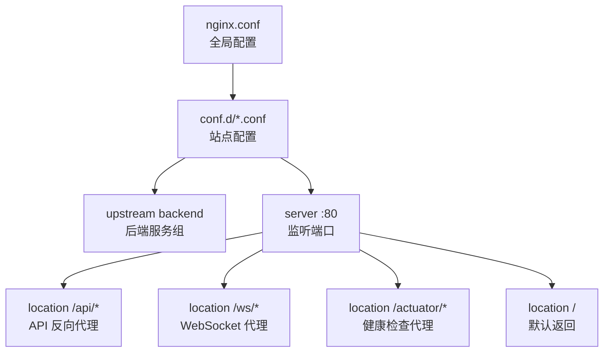
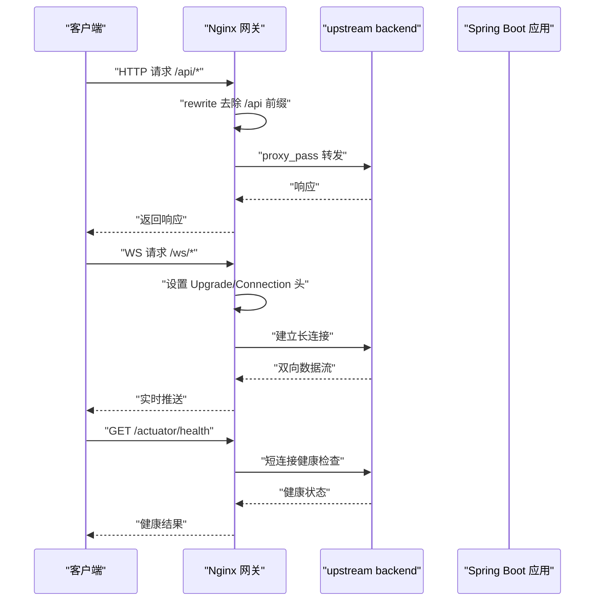
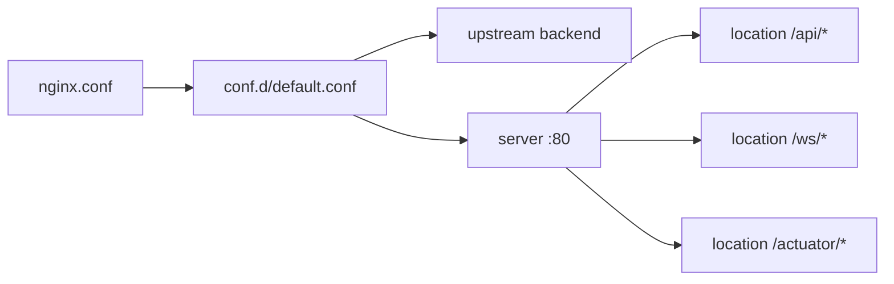

# 负载均衡与反向代理

<cite>
**本文引用的文件**
- [docker/nginx/nginx.conf](file://docker/nginx/nginx.conf)
- [docker/nginx/conf.d/default.conf](file://docker/nginx/conf.d/default.conf)
</cite>

## 目录
1. [简介](#简介)
2. [项目结构](#项目结构)
3. [核心组件](#核心组件)
4. [架构总览](#架构总览)
5. [详细组件分析](#详细组件分析)
6. [依赖关系分析](#依赖关系分析)
7. [性能考虑](#性能考虑)
8. [故障排查指南](#故障排查指南)
9. [结论](#结论)
10. [附录](#附录)

## 简介
本指南围绕 Nginx 作为反向代理与负载均衡的落地实践，结合仓库中现有的 Nginx 配置进行说明。内容涵盖：
- 上游服务器组定义与负载均衡算法选择（轮询、加权、IP 哈希等）
- SSL/TLS 证书配置与 HTTPS 强制跳转
- 安全响应头设置
- 会话保持、请求路由与 URL 重写
- 静态资源缓存策略、Gzip 压缩与浏览器缓存优化
- 访问日志格式定制、错误页面自定义与限流防护

当前仓库提供了开发环境的 Nginx 基础配置，包括 API 反向代理、WebSocket 代理、健康检查代理、Gzip 压缩与结构化访问日志。生产环境可在此基础上扩展为高可用与安全的网关层。

## 项目结构
Nginx 相关配置位于 docker/nginx 目录下，采用“主配置 + 站点配置”的分层组织方式：
- 主配置：定义全局事件模型、HTTP 块、日志格式、性能参数、Gzip 压缩以及站点引入路径
- 站点配置：定义 upstream、server、location 等具体转发规则

图示来源
- [docker/nginx/nginx.conf:18-67](file://docker/nginx/nginx.conf#L18-L67)
- [docker/nginx/conf.d/default.conf:15-123](file://docker/nginx/conf.d/default.conf#L15-L123)

章节来源
- [docker/nginx/nginx.conf:1-67](file://docker/nginx/nginx.conf#L1-L67)
- [docker/nginx/conf.d/default.conf:1-123](file://docker/nginx/conf.d/default.conf#L1-L123)

## 核心组件
- 全局 HTTP 层
  - 结构化访问日志：包含客户端地址、请求时间、状态码、请求耗时、上游连接/响应时间、TraceId 等字段
  - 性能优化：sendfile、tcp_nopush、tcp_nodelay、keepalive_timeout、types_hash_max_size、client_max_body_size
  - Gzip 压缩：启用并指定多种 MIME 类型
  - 站点引入：include conf.d/*.conf
- 站点 server
  - 监听 80 端口，server_name 为 localhost
  - location /api/*：去除 /api 前缀后转发到后端，设置必要代理头与超时、缓冲
  - location /ws/*：支持 WebSocket 升级，长连接超时
  - location /actuator/*：健康检查代理
  - location /：默认返回文本信息（开发环境）

章节来源
- [docker/nginx/nginx.conf:22-67](file://docker/nginx/nginx.conf#L22-L67)
- [docker/nginx/conf.d/default.conf:21-123](file://docker/nginx/conf.d/default.conf#L21-L123)

## 架构总览
下图展示了从客户端到 Nginx 再到 Spring Boot 后端的请求流程，包括 API、WebSocket 与健康检查三种场景。

图示来源
- [docker/nginx/conf.d/default.conf:28-87](file://docker/nginx/conf.d/default.conf#L28-L87)

## 详细组件分析

### 上游服务器组与负载均衡
- 现有实现
  - upstream backend 仅包含一个后端节点，适用于单实例开发环境
  - keepalive 已开启，减少频繁握手开销
- 推荐扩展（生产环境）
  - 多节点定义：添加多个 server 条目以构成集群
  - 健康检查：通过 max_fails 与 fail_timeout 控制失败重试与剔除
  - 负载均衡算法
    - 轮询（默认）：按顺序分配请求
    - 加权轮询：为不同节点设置 weight，适合异构机器或灰度发布
    - IP 哈希：使用 ip_hash 指令基于客户端 IP 做一致性哈希，满足会话亲和需求
  - 示例思路（概念性说明）
    - 在 upstream 块内增加多个 server，并为需要更高权重的节点设置权重
    - 若需会话保持，可在 upstream 块启用 ip_hash；注意该模式会限制动态扩缩容时的均匀性

章节来源
- [docker/nginx/conf.d/default.conf:15-19](file://docker/nginx/conf.d/default.conf#L15-L19)

### 反向代理与请求路由
- API 路由
  - 使用 rewrite 去除 /api 前缀，使后端无需感知前端路径前缀
  - 设置 Host、X-Real-IP、X-Forwarded-For、X-Forwarded-Proto、X-Trace-Id 等关键头部
  - 合理配置 proxy_connect_timeout、proxy_read_timeout、proxy_send_timeout 与缓冲参数
- WebSocket 路由
  - 设置 http_version 1.1 与 Upgrade/Connection 头，确保协议升级成功
  - 延长读写超时以满足长连接场景
- Actuator 健康检查
  - 独立 location 暴露健康端点，便于编排平台探测

章节来源
- [docker/nginx/conf.d/default.conf:28-87](file://docker/nginx/conf.d/default.conf#L28-L87)

### SSL/TLS 与 HTTPS 强制跳转
- 建议步骤（概念性说明）
  - 新增监听 443 的 server，配置 ssl_certificate 与 ssl_certificate_key
  - 启用现代 TLS 协议与密码套件，关闭不安全的旧版本
  - 将 HTTP 80 的请求 301 重定向至 HTTPS，保证全站加密
  - 可选：启用 HSTS 提升安全性
- 注意事项
  - 证书路径与权限需正确
  - 若存在内部自签证书，需在客户端侧信任或使用受信任 CA

[本节为通用指导，不涉及具体代码片段]

### 安全响应头
- 建议设置（概念性说明）
  - Strict-Transport-Security：强制浏览器走 HTTPS
  - X-Content-Type-Options：防止 MIME 嗅探
  - X-Frame-Options 或 Content-Security-Policy：防点击劫持与 XSS
  - Referrer-Policy：控制 Referer 泄露范围
  - Permissions-Policy：限制浏览器能力
- 实施位置
  - 在对应 server/location 中使用 add_header 指令统一注入

[本节为通用指导，不涉及具体代码片段]

### 会话保持与请求路由
- 会话保持
  - 使用 ip_hash 实现基于客户端 IP 的亲和性
  - 对于无状态服务，优先避免会话绑定，利用外部会话存储（如 Redis）
- 请求路由
  - 基于路径：/api、/ws、/admin、/booth 等分别指向不同 upstream
  - 基于域名：为不同业务域创建独立 server 块
  - 基于 Header：根据特定请求头进行分流（例如灰度发布）

章节来源
- [docker/nginx/conf.d/default.conf:28-110](file://docker/nginx/conf.d/default.conf#L28-L110)

### URL 重写与条件匹配
- 现有实现
  - 对 /api/* 使用正则重写去除前缀，简化后端路由
- 扩展建议（概念性说明）
  - 使用 if 与 return 组合实现条件跳转（如维护页、鉴权拦截）
  - 使用 map 指令将复杂映射逻辑前置，提高可读性与性能

章节来源
- [docker/nginx/conf.d/default.conf:28-32](file://docker/nginx/conf.d/default.conf#L28-L32)

### 静态资源缓存与浏览器缓存优化
- 现状
  - 开发阶段未启用静态资源服务，生产构建后可启用 alias 与 try_files
- 建议策略（概念性说明）
  - HTML 文件设置较短缓存或 no-cache，确保更新及时生效
  - JS/CSS/图片等资源设置长期缓存，并通过文件名哈希实现强缓存
  - 使用 Cache-Control 与 Expires 配合 etag/if-none-match 提升命中率
  - 针对 SPA 应用，try_files 回退到 index.html 保证路由正常

章节来源
- [docker/nginx/conf.d/default.conf:95-110](file://docker/nginx/conf.d/default.conf#L95-L110)

### Gzip 压缩与传输优化
- 现有实现
  - 已启用 gzip，设置压缩级别、最小长度与多种 MIME 类型
  - 启用 gzip_vary 与 gzip_proxied，兼容代理链与客户端协商
- 建议优化（概念性说明）
  - 根据 CPU 与带宽权衡压缩级别
  - 对二进制大文件（如视频）谨慎启用压缩
  - 结合 brotli 进一步提升压缩率（需额外模块）

章节来源
- [docker/nginx/nginx.conf:44-61](file://docker/nginx/nginx.conf#L44-L61)

### 访问日志格式定制
- 现有实现
  - 定义了 main 格式，包含客户端地址、请求行、状态码、字节数、Referer、User-Agent、请求耗时、上游连接/响应时间、TraceId
  - 输出到 access.log，便于链路追踪与性能分析
- 扩展建议（概念性说明）
  - 增加 $request_length、$bytes_sent、$upstream_status、$ssl_protocol 等字段
  - 按模块拆分日志文件，便于采集与分析

章节来源
- [docker/nginx/nginx.conf:22-32](file://docker/nginx/nginx.conf#L22-L32)

### 错误页面自定义
- 现状
  - 默认 location 返回简单文本提示
- 建议方案（概念性说明）
  - 使用 error_page 指令定义 4xx/5xx 错误页
  - 提供友好文案与引导链接，必要时返回 JSON 供 API 消费

[本节为通用指导，不涉及具体代码片段]

### 限流防护
- 建议方案（概念性说明）
  - 使用 limit_req_zone 定义共享内存区，按 IP 或 Key 统计请求速率
  - 在 location 中使用 limit_req 限制突发流量，配合 burst 与 nodelay 平滑处理
  - 对敏感接口（登录、支付）单独限速，保护后端稳定性
- 参考维度
  - 每秒/分钟请求数、并发连接数、上传大小限制（client_max_body_size 已配置）

[本节为通用指导，不涉及具体代码片段]

## 依赖关系分析
Nginx 配置之间的依赖关系如下：
- nginx.conf 负责全局行为与站点引入
- default.conf 依赖 upstream backend 定义的后端地址
- server 下的各 location 依赖 upstream 与必要的代理头与超时配置

图示来源
- [docker/nginx/nginx.conf:18-67](file://docker/nginx/nginx.conf#L18-L67)
- [docker/nginx/conf.d/default.conf:15-123](file://docker/nginx/conf.d/default.conf#L15-L123)

章节来源
- [docker/nginx/nginx.conf:18-67](file://docker/nginx/nginx.conf#L18-L67)
- [docker/nginx/conf.d/default.conf:15-123](file://docker/nginx/conf.d/default.conf#L15-L123)

## 性能考虑
- 网络与 I/O
  - sendfile、tcp_nopush、tcp_nodelay 降低内核拷贝与延迟
  - keepalive_timeout 平衡连接复用与资源占用
- 缓冲与超时
  - 合理设置 proxy_buffer_* 与各类 timeout，避免慢下游拖垮网关
- 压缩与带宽
  - gzip 压缩级别与最小长度需结合业务负载调优
- 连接池
  - upstream keepalive 减少与后端的握手成本，需监控连接泄漏

[本节为通用指导，不涉及具体代码片段]

## 故障排查指南
- 常见问题定位
  - 查看 Nginx 错误日志与访问日志，关注状态码分布与上游响应时间
  - 确认 upstream 节点可达性与健康检查是否触发剔除
  - 检查 WebSocket 升级头是否正确传递
- 常用命令
  - 查看最近错误：tail -f /var/log/nginx/error.log
  - 过滤异常请求：grep ' 5[0-9][0-9] ' /var/log/nginx/access.log
  - 解析 TraceId：根据 trace_id 字段关联后端日志
- 配置校验
  - 修改后执行语法检查再重载，避免线上中断

章节来源
- [docker/nginx/nginx.conf:10-11](file://docker/nginx/nginx.conf#L10-L11)
- [docker/nginx/nginx.conf:32](file://docker/nginx/nginx.conf#L32)
- [docker/nginx/conf.d/default.conf:56-72](file://docker/nginx/conf.d/default.conf#L56-L72)

## 结论
仓库中的 Nginx 配置已具备反向代理、WebSocket 支持与基础性能优化能力。生产环境应在此基础上完善：
- 多节点 upstream 与合适的负载均衡算法
- HTTPS 强制跳转与安全响应头
- 静态资源缓存策略与浏览器缓存优化
- 限流防护与错误页面定制
- 更丰富的日志字段与告警指标

## 附录
- 术语
  - upstream：上游服务器组，用于定义一组后端服务
  - keepalive：保持与上游的长连接，减少握手开销
  - ip_hash：基于客户端 IP 的一致性哈希，常用于会话保持
  - try_files：按优先级尝试文件，最后回退到指定入口
- 参考路径
  - 主配置：[docker/nginx/nginx.conf](file://docker/nginx/nginx.conf)
  - 站点配置：[docker/nginx/conf.d/default.conf](file://docker/nginx/conf.d/default.conf)