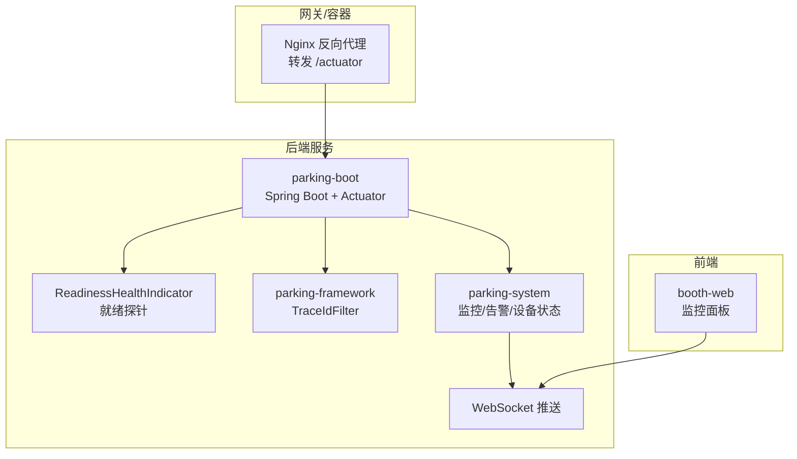
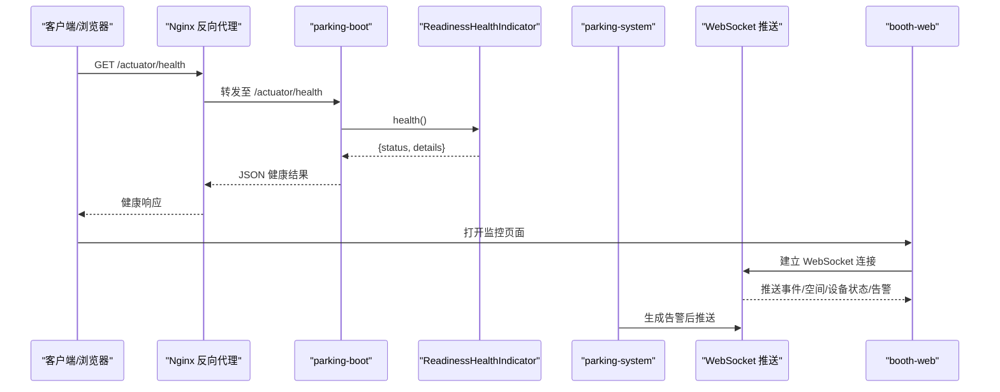
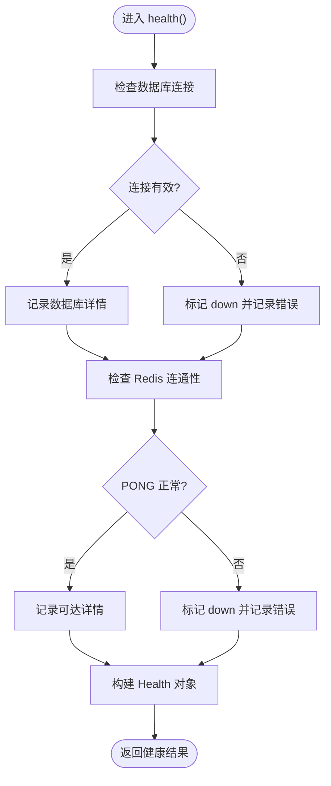
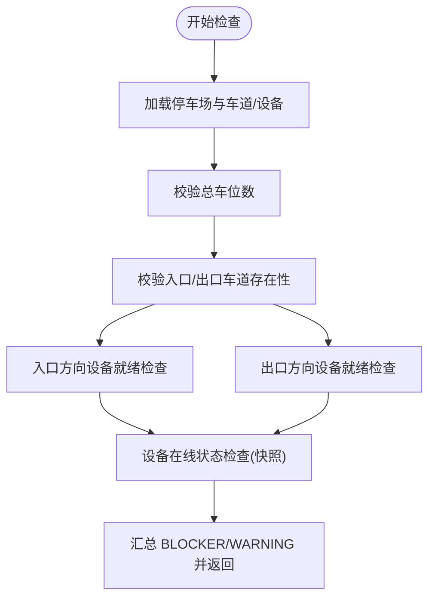
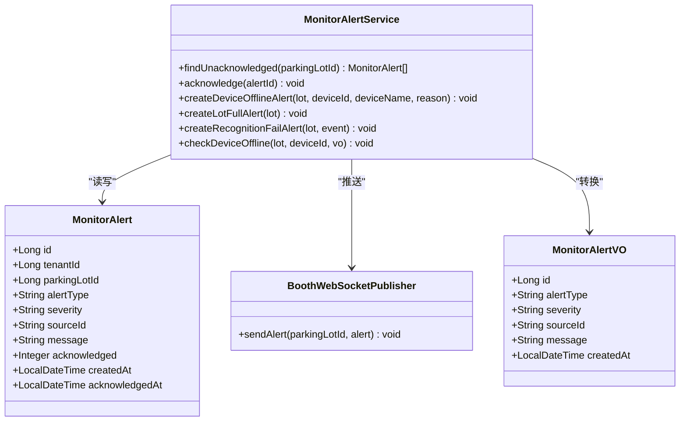
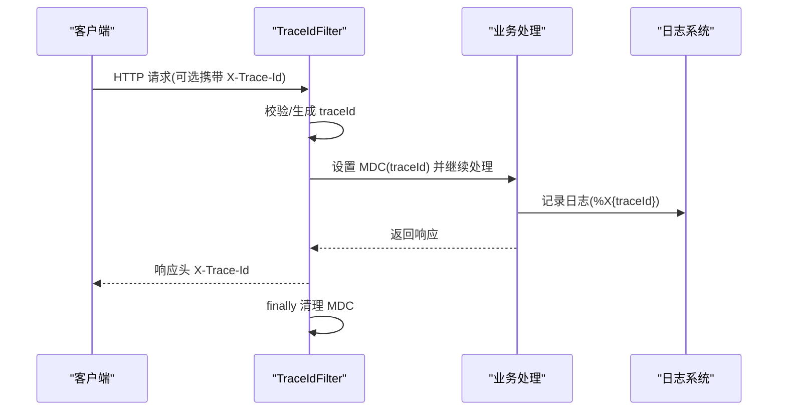
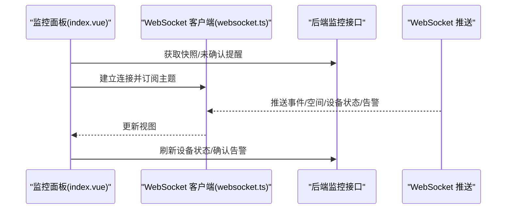
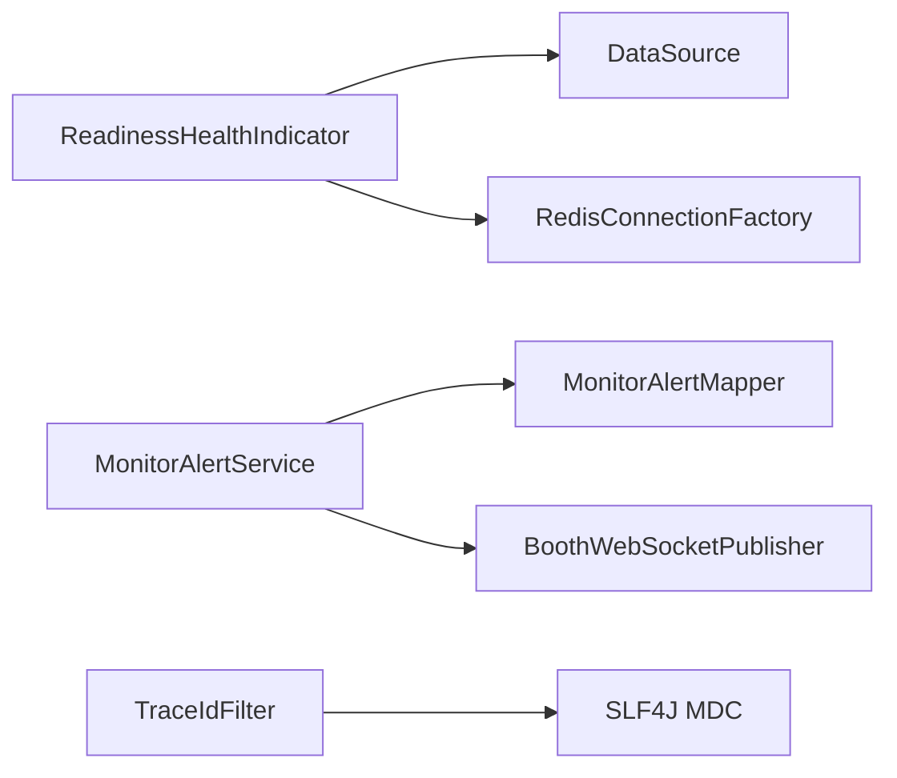

# 监控告警

<cite>
**本文引用的文件**   
- [ReadinessHealthIndicator.java](file://parking-boot/src/main/java/com/jushan/boot/health/ReadinessHealthIndicator.java)
- [application.yml](file://parking-boot/src/main/resources/application.yml)
- [application-docker.yml](file://parking-boot/src/main/resources/application-docker.yml)
- [application-prod.yml](file://parking-boot/src/main/resources/application-prod.yml)
- [default.conf](file://docker/nginx/conf.d/default.conf)
- [TraceIdFilter.java](file://parking-framework/src/main/java/com/jushan/framework/web/TraceIdFilter.java)
- [配置说明.md](file://docs/部署运维/配置说明.md)
- [DeviceAccessClientImpl.java](file://parking-system/src/main/java/com/jushan/system/client/DeviceAccessClientImpl.java)
- [BoothMonitorController.java](file://parking-system/src/main/java/com/jushan/system/controller/BoothMonitorController.java)
- [MonitorAlertService.java](file://parking-system/src/main/java/com/jushan/system/service/MonitorAlertService.java)
- [MonitorAlertMapper.java](file://parking-system/src/main/java/com/jushan/system/mapper/MonitorAlertMapper.java)
- [MonitorAlert.java](file://parking-system/src/main/java/com/jushan/system/entity/MonitorAlert.java)
- [MonitorAlertVO.java](file://parking-system/src/main/java/com/jushan/system/vo/MonitorAlertVO.java)
- [ReadinessCheckService.java](file://parking-system/src/main/java/com/jushan/system/service/ReadinessCheckService.java)
- [index.vue](file://booth-web/src/views/monitor/index.vue)
- [websocket.ts](file://booth-web/src/utils/websocket.ts)
</cite>

## 目录
1. [引言](#引言)
2. [项目结构](#项目结构)
3. [核心组件](#核心组件)
4. [架构总览](#架构总览)
5. [详细组件分析](#详细组件分析)
6. [依赖关系分析](#依赖关系分析)
7. [性能与可观测性](#性能与可观测性)
8. [故障排查指南](#故障排查指南)
9. [结论](#结论)
10. [附录](#附录)

## 引言
本文件面向“停车SaaS平台”的监控与告警体系，覆盖应用健康检查（就绪探针）、关键业务指标采集、告警规则与通知渠道、分布式链路追踪、错误日志收集、监控面板与自定义指标定义、以及阈值调优方法。文档基于仓库现有实现进行梳理，并给出可视化图示与可操作建议，帮助读者快速搭建与优化生产级可观测性方案。

## 项目结构
本项目采用多模块分层：
- parking-boot：启动入口、Actuator 健康检查、Nginx 反向代理配置参考
- parking-framework：通用框架能力（如全链路 TraceId）
- parking-system：业务服务（监控接口、异常提醒、设备状态快照等）
- booth-web：岗亭监控前端（WebSocket 实时推送、异常提醒展示）
- docs：部署运维与配置说明

图表来源
- [default.conf](file://docker/nginx/conf.d/default.conf)
- [ReadinessHealthIndicator.java](file://parking-boot/src/main/java/com/jushan/boot/health/ReadinessHealthIndicator.java)
- [TraceIdFilter.java](file://parking-framework/src/main/java/com/jushan/framework/web/TraceIdFilter.java)
- [BoothMonitorController.java](file://parking-system/src/main/java/com/jushan/system/controller/BoothMonitorController.java)
- [index.vue](file://booth-web/src/views/monitor/index.vue)

章节来源
- [application.yml](file://parking-boot/src/main/resources/application.yml)
- [application-docker.yml](file://parking-boot/src/main/resources/application-docker.yml)
- [application-prod.yml](file://parking-boot/src/main/resources/application-prod.yml)
- [default.conf](file://docker/nginx/conf.d/default.conf)

## 核心组件
- 应用健康检查（就绪探针）
  - 通过 Spring Boot Actuator 暴露健康端点；自定义 ReadinessHealthIndicator 校验数据库与 Redis 连通性，便于 K8s/Docker Compose 编排使用。
- 业务就绪检查
  - ReadinessCheckService 对停车场启用前进行多维检查（车道、设备绑定、执行相机、容量、设备在线快照等），返回 BLOCKER/WARNING 级别项。
- 异常提醒与推送
  - MonitorAlertService 负责离线、车位已满、识别失败等场景的提醒生成、去重、持久化与 WebSocket 推送；提供确认接口。
- 全链路追踪
  - TraceIdFilter 为每个请求分配唯一 traceId，写入 MDC 并在响应头回传，便于日志聚合与问题定位。
- 监控面板与实时数据
  - 后端提供监控快照与未确认提醒列表；前端通过 WebSocket 订阅事件、空间更新、设备状态与告警消息，渲染监控面板。

章节来源
- [ReadinessHealthIndicator.java](file://parking-boot/src/main/java/com/jushan/boot/health/ReadinessHealthIndicator.java)
- [ReadinessCheckService.java](file://parking-system/src/main/java/com/jushan/system/service/ReadinessCheckService.java)
- [MonitorAlertService.java](file://parking-system/src/main/java/com/jushan/system/service/MonitorAlertService.java)
- [TraceIdFilter.java](file://parking-framework/src/main/java/com/jushan/framework/web/TraceIdFilter.java)
- [BoothMonitorController.java](file://parking-system/src/main/java/com/jushan/system/controller/BoothMonitorController.java)
- [index.vue](file://booth-web/src/views/monitor/index.vue)

## 架构总览
从请求到监控的全链路如下：

图表来源
- [default.conf](file://docker/nginx/conf.d/default.conf)
- [ReadinessHealthIndicator.java](file://parking-boot/src/main/java/com/jushan/boot/health/ReadinessHealthIndicator.java)
- [BoothMonitorController.java](file://parking-system/src/main/java/com/jushan/system/controller/BoothMonitorController.java)
- [MonitorAlertService.java](file://parking-system/src/main/java/com/jushan/system/service/MonitorAlertService.java)
- [index.vue](file://booth-web/src/views/monitor/index.vue)

## 详细组件分析

### 应用健康检查（就绪探针）
- 目标：在容器编排中判断服务是否具备对外服务能力。
- 实现要点：
  - 自定义 HealthIndicator 检查数据库连接有效性、Redis PING 响应。
  - 使用 ObjectProvider 优雅降级，避免依赖缺失导致启动失败。
  - 结合 Actuator 暴露 /actuator/health，供 K8s readinessProbe 调用。
- 扩展建议：
  - 后续可增加 Device Access 可达性、RabbitMQ/MQTT 等外部依赖检查。
  - Liveness 仅检查进程存活，避免因单依赖短暂失败触发重启。

图表来源
- [ReadinessHealthIndicator.java](file://parking-boot/src/main/java/com/jushan/boot/health/ReadinessHealthIndicator.java)

章节来源
- [ReadinessHealthIndicator.java](file://parking-boot/src/main/java/com/jushan/boot/health/ReadinessHealthIndicator.java)
- [application.yml](file://parking-boot/src/main/resources/application.yml)
- [application-docker.yml](file://parking-boot/src/main/resources/application-docker.yml)
- [application-prod.yml](file://parking-boot/src/main/resources/application-prod.yml)
- [default.conf](file://docker/nginx/conf.d/default.conf)

### 业务就绪检查（停车场启用前）
- 目标：在启用停车场前，确保车道、设备、执行器、容量等关键项满足运行条件。
- 检查维度：
  - 容量：totalSpaces 必须大于 0
  - 车道：入口/出口方向至少各有一条可用车道
  - 设备：每条车道需绑定相机与道闸，且道闸需设置执行相机
  - 设备在线：基于最新快照判定未知/过期/离线，输出 WARNING
- 输出：ParkingLotReadinessVO，包含 ready 标志、BLOCKER/WARNING 计数及明细项。

图表来源
- [ReadinessCheckService.java](file://parking-system/src/main/java/com/jushan/system/service/ReadinessCheckService.java)

章节来源
- [ReadinessCheckService.java](file://parking-system/src/main/java/com/jushan/system/service/ReadinessCheckService.java)

### 异常提醒与通知渠道
- 规则与场景：
  - 设备离线：根据设备状态快照或查询失败情况生成 CRITICAL 级别提醒
  - 车位已满：生成 WARNING 级别提醒
  - 识别失败：生成 WARNING 级别提醒
- 机制：
  - 去重：同一停车场+类型+来源 ID 的未确认提醒不重复创建
  - 持久化：写入 MonitorAlert 表
  - 推送：通过 WebSocket 推送至对应停车场的岗亭前端
  - 确认：支持前端确认后更新 acknowledged 字段
- 数据结构：
  - 实体：MonitorAlert（含 severity、sourceId、message、acknowledged、createdAt 等）
  - VO：MonitorAlertVO（对外展示）

图表来源
- [MonitorAlert.java](file://parking-system/src/main/java/com/jushan/system/entity/MonitorAlert.java)
- [MonitorAlertVO.java](file://parking-system/src/main/java/com/jushan/system/vo/MonitorAlertVO.java)
- [MonitorAlertService.java](file://parking-system/src/main/java/com/jushan/system/service/MonitorAlertService.java)

章节来源
- [MonitorAlertService.java](file://parking-system/src/main/java/com/jushan/system/service/MonitorAlertService.java)
- [MonitorAlertMapper.java](file://parking-system/src/main/java/com/jushan/system/mapper/MonitorAlertMapper.java)
- [MonitorAlert.java](file://parking-system/src/main/java/com/jushan/system/entity/MonitorAlert.java)
- [MonitorAlertVO.java](file://parking-system/src/main/java/com/jushan/system/vo/MonitorAlertVO.java)

### 分布式链路追踪与日志
- 全链路 TraceId：
  - 过滤器优先复用上游传入的 X-Trace-Id，否则生成新 ID
  - 将 traceId 写入 SLF4J MDC，并在响应头回传
  - 请求结束后清理 MDC，防止线程池复用污染
- 日志模式：
  - 配置 pattern 中包含 %X{traceId}，便于集中式日志系统聚合
  - 禁止输出敏感信息（密码、Token、签名 URL 等）

图表来源
- [TraceIdFilter.java](file://parking-framework/src/main/java/com/jushan/framework/web/TraceIdFilter.java)
- [配置说明.md](file://docs/部署运维/配置说明.md)

章节来源
- [TraceIdFilter.java](file://parking-framework/src/main/java/com/jushan/framework/web/TraceIdFilter.java)
- [配置说明.md](file://docs/部署运维/配置说明.md)

### 监控面板与实时数据
- 后端接口：
  - 提供监控快照与未确认提醒列表
- 前端交互：
  - 选择停车场后建立 WebSocket 连接
  - 订阅主题：事件、空间更新、设备状态、告警
  - 展示剩余车位、在场车辆、总车位、车道状态、最近识别事件与异常提醒
  - 支持手动刷新设备状态与确认告警

图表来源
- [BoothMonitorController.java](file://parking-system/src/main/java/com/jushan/system/controller/BoothMonitorController.java)
- [index.vue](file://booth-web/src/views/monitor/index.vue)
- [websocket.ts](file://booth-web/src/utils/websocket.ts)

章节来源
- [BoothMonitorController.java](file://parking-system/src/main/java/com/jushan/system/controller/BoothMonitorController.java)
- [index.vue](file://booth-web/src/views/monitor/index.vue)
- [websocket.ts](file://booth-web/src/utils/websocket.ts)

## 依赖关系分析
- 健康检查依赖：
  - DataSource、RedisConnectionFactory（通过 ObjectProvider 注入）
- 监控与告警依赖：
  - MonitorAlertMapper（MyBatis-Plus BaseMapper）
  - BoothWebSocketPublisher（用于推送）
- 追踪与日志依赖：
  - SLF4J MDC、Logback pattern 配置

图表来源
- [ReadinessHealthIndicator.java](file://parking-boot/src/main/java/com/jushan/boot/health/ReadinessHealthIndicator.java)
- [MonitorAlertService.java](file://parking-system/src/main/java/com/jushan/system/service/MonitorAlertService.java)
- [MonitorAlertMapper.java](file://parking-system/src/main/java/com/jushan/system/mapper/MonitorAlertMapper.java)
- [TraceIdFilter.java](file://parking-framework/src/main/java/com/jushan/framework/web/TraceIdFilter.java)

章节来源
- [ReadinessHealthIndicator.java](file://parking-boot/src/main/java/com/jushan/boot/health/ReadinessHealthIndicator.java)
- [MonitorAlertService.java](file://parking-system/src/main/java/com/jushan/system/service/MonitorAlertService.java)
- [MonitorAlertMapper.java](file://parking-system/src/main/java/com/jushan/system/mapper/MonitorAlertMapper.java)
- [TraceIdFilter.java](file://parking-framework/src/main/java/com/jushan/framework/web/TraceIdFilter.java)

## 性能与可观测性
- 指标采集建议
  - 设备访问侧（Device Access）建议暴露 Prometheus 指标（在线/离线总数、事件收发、命令成功/失败/超时、MQTT/RabbitMQ 连接状态、Outbox 待处理、本地缓存大小、图片上传失败等）。
  - 平台侧可在 DeviceAccessClientImpl 中集成 Micrometer，记录调用次数、失败率、延迟分布。
- 健康检查策略
  - Readiness 检查外部依赖连通性；Liveness 仅检查进程存活，避免误重启。
- 日志与追踪
  - 统一 TraceId 贯穿请求链路，配合集中式日志系统进行关联检索。
  - 日志脱敏规范：车牌号、图片、凭证、签名 URL 等敏感信息不得明文输出。

章节来源
- [DeviceAccessClientImpl.java](file://parking-system/src/main/java/com/jushan/system/client/DeviceAccessClientImpl.java)
- [配置说明.md](file://docs/部署运维/配置说明.md)

## 故障排查指南
- 健康检查失败
  - 查看 /actuator/health 返回的 database/redis 细节与错误信息
  - 核对 application-{env}.yml 中的数据库与 Redis 配置
- 设备离线告警频繁
  - 检查设备状态快照采集时间是否过期
  - 确认 Device Access 连通性与心跳上报
- 监控面板无数据
  - 检查 WebSocket 连接状态与订阅主题是否正确
  - 确认后端推送是否正常（告警、事件、空间更新）
- 日志无法关联
  - 确认请求是否携带 X-Trace-Id，服务端是否回写该响应头
  - 检查日志 pattern 是否包含 %X{traceId}

章节来源
- [application.yml](file://parking-boot/src/main/resources/application.yml)
- [application-docker.yml](file://parking-boot/src/main/resources/application-docker.yml)
- [application-prod.yml](file://parking-boot/src/main/resources/application-prod.yml)
- [default.conf](file://docker/nginx/conf.d/default.conf)
- [TraceIdFilter.java](file://parking-framework/src/main/java/com/jushan/framework/web/TraceIdFilter.java)
- [配置说明.md](file://docs/部署运维/配置说明.md)

## 结论
本项目已具备基础的健康检查、业务就绪检查、异常提醒与推送、全链路追踪与日志规范，以及监控面板的实时展示能力。建议在后续阶段完善：
- 接入 Prometheus 指标采集与 Grafana 面板
- 完善告警升级策略（短信/邮件/IM）
- 细化设备在线率、订单处理量等关键指标的统计与阈值告警
- 强化错误日志收集与结构化输出，提升排障效率

## 附录
- Actuator 健康检查配置参考
  - 基础配置：application.yml
  - Docker 环境：application-docker.yml
  - 生产环境：application-prod.yml
  - Nginx 转发：docker/nginx/conf.d/default.conf
- 部署运维与日志配置
  - 配置说明：docs/部署运维/配置说明.md

章节来源
- [application.yml](file://parking-boot/src/main/resources/application.yml)
- [application-docker.yml](file://parking-boot/src/main/resources/application-docker.yml)
- [application-prod.yml](file://parking-boot/src/main/resources/application-prod.yml)
- [default.conf](file://docker/nginx/conf.d/default.conf)
- [配置说明.md](file://docs/部署运维/配置说明.md)