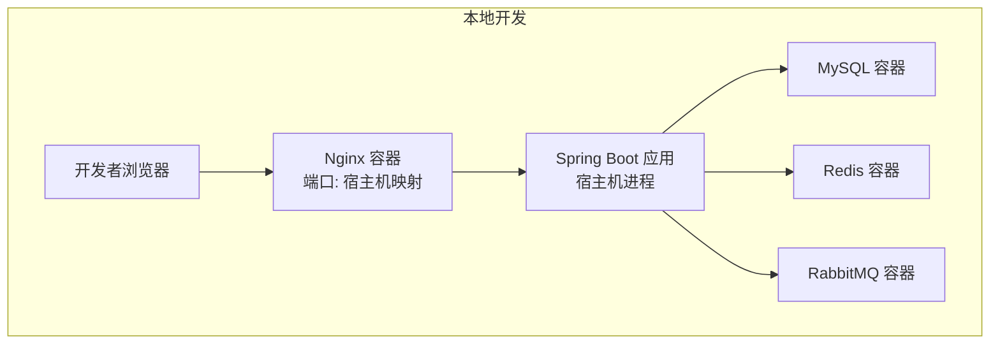
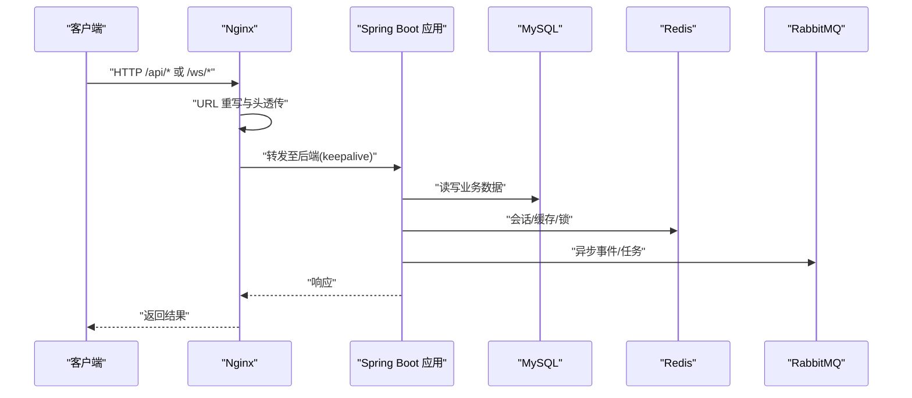
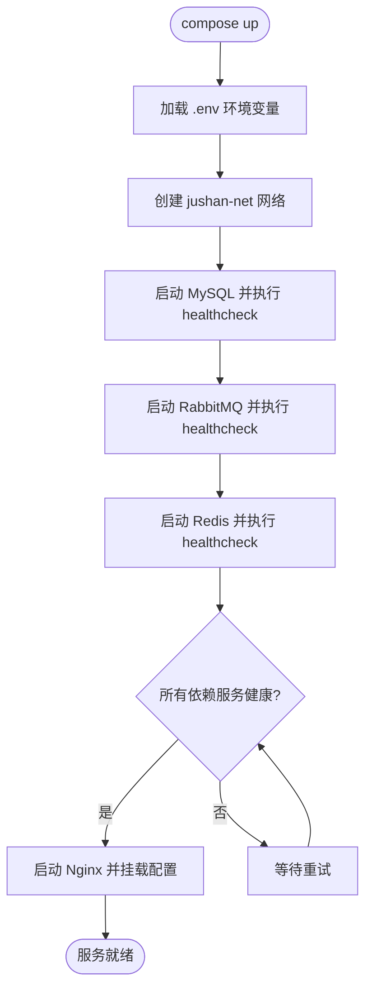
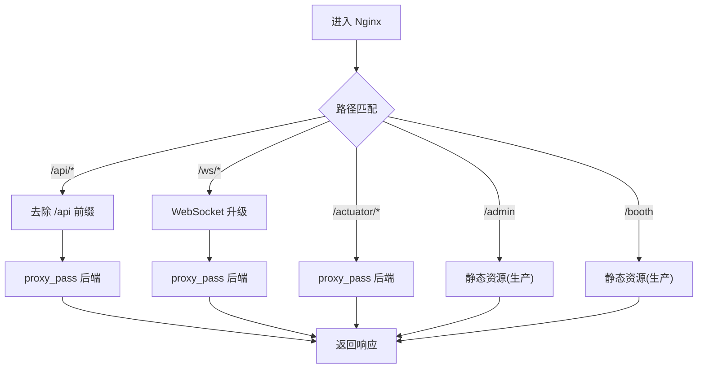
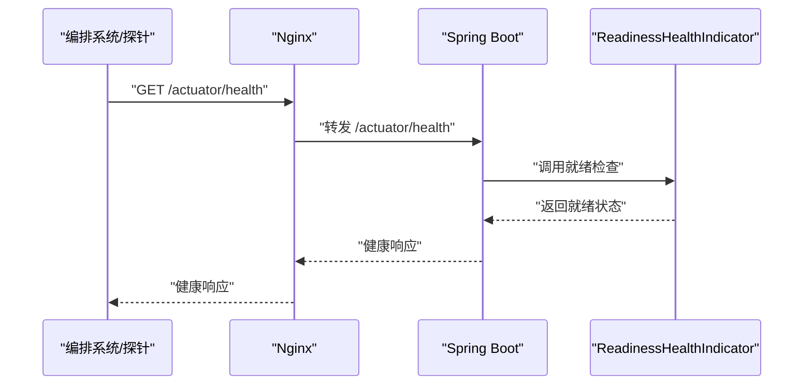
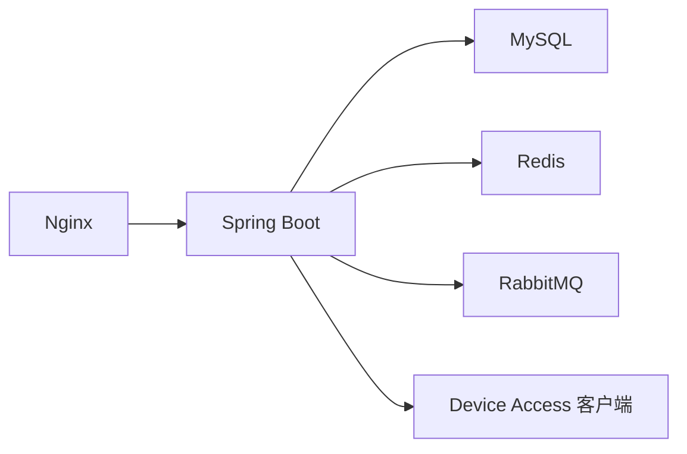

# 部署运维

<cite>
**本文引用的文件**
- [docker-compose.yml](file://docker-compose.yml)
- [nginx.conf](file://docker/nginx/nginx.conf)
- [default.conf](file://docker/nginx/conf.d/default.conf)
- [application.yml](file://parking-boot/src/main/resources/application.yml)
- [application-local.yml](file://parking-boot/src/main/resources/application-local.yml)
- [application-docker.yml](file://parking-boot/src/main/resources/application-docker.yml)
- [application-test.yml](file://parking-boot/src/main/resources/application-test.yml)
- [application-prod.yml](file://parking-boot/src/main/resources/application-prod.yml)
- [ReadinessHealthIndicator.java](file://parking-boot/src/main/java/com/jushan/boot/health/ReadinessHealthIndicator.java)
- [部署说明.md](file://docs/部署运维/部署说明.md)
- [配置说明.md](file://docs/部署运维/配置说明.md)
</cite>

## 目录
1. [简介](#简介)
2. [项目结构](#项目结构)
3. [核心组件](#核心组件)
4. [架构总览](#架构总览)
5. [详细组件分析](#详细组件分析)
6. [依赖关系分析](#依赖关系分析)
7. [性能与容量规划](#性能与容量规划)
8. [CI/CD 流水线与发布流程](#cicd-流水线与发布流程)
9. [故障应急与排障指南](#故障应急与排障指南)
10. [结论](#结论)
11. [附录](#附录)

## 简介
本文件面向运维与平台工程团队，提供基于 Docker Compose 的容器化部署与多环境配置管理方案，涵盖 Nginx 反向代理、SSL 与负载均衡策略、数据库初始化与备份恢复、监控与健康检查、日志收集与问题诊断、以及 CI/CD 流水线与自动化测试建议。文档同时给出生产环境的差异化配置要点与容量规划建议，帮助快速落地并稳定运行。

## 项目结构
仓库采用前后端分离与多模块后端组织方式：
- 基础设施编排：docker-compose.yml 定义 MySQL、Redis、RabbitMQ、Nginx 服务及数据卷、网络、健康检查等。
- 反向代理：docker/nginx 下包含主配置与站点配置，负责 API、WebSocket 与静态资源路由。
- 后端配置：parking-boot 模块下按 profile 拆分 application.yml、local/docker/test/prod 覆盖配置。
- 前端：admin-web、booth-web 使用 Vite 开发服务器，生产构建产物由 Nginx 托管。
- 文档：docs/部署运维 下提供部署与配置说明。



图表来源
- [docker-compose.yml:27-167](file://docker-compose.yml#L27-L167)
- [default.conf:15-124](file://docker/nginx/conf.d/default.conf#L15-L124)
- [nginx.conf:1-68](file://docker/nginx/nginx.conf#L1-L68)

章节来源
- [docker-compose.yml:27-167](file://docker-compose.yml#L27-L167)
- [部署说明.md:1-111](file://docs/部署运维/部署说明.md#L1-L111)

## 核心组件
- 容器编排（Docker Compose）
  - 提供 MySQL 8.4、Redis 7、RabbitMQ 4.x、Nginx 服务；通过环境变量注入敏感信息；为各服务配置 healthcheck 与持久化卷；Nginx 依赖其他服务健康后再启动。
- 反向代理（Nginx）
  - 统一入口，将 /api/* 重写后转发到后端；/ws/* 支持 WebSocket 长连接；/actuator/* 暴露健康检查；预留静态资源路径用于生产挂载。
- 后端配置（Spring Boot Profiles）
  - 通用配置在 application.yml；local/docker/test/prod 分别覆盖数据源、缓存、消息、安全与日志级别等差异项。
- 健康检查与探针
  - 应用暴露 Actuator 健康端点；自定义 Readiness 指标；Compose 层对基础设施进行健康探测。

章节来源
- [docker-compose.yml:33-145](file://docker-compose.yml#L33-L145)
- [default.conf:15-124](file://docker/nginx/conf.d/default.conf#L15-L124)
- [nginx.conf:1-68](file://docker/nginx/nginx.conf#L1-L68)
- [application.yml:1-108](file://parking-boot/src/main/resources/application.yml#L1-L108)
- [application-docker.yml:1-88](file://parking-boot/src/main/resources/application-docker.yml#L1-L88)
- [application-prod.yml:1-83](file://parking-boot/src/main/resources/application-prod.yml#L1-L83)
- [application-test.yml:1-80](file://parking-boot/src/main/resources/application-test.yml#L1-L80)
- [application-local.yml:1-87](file://parking-boot/src/main/resources/application-local.yml#L1-L87)
- [ReadinessHealthIndicator.java:1-60](file://parking-boot/src/main/java/com/jushan/boot/health/ReadinessHealthIndicator.java#L1-L60)

## 架构总览
下图展示从客户端到后端与中间件的请求链路，以及 Nginx 的反向代理规则与上游后端地址解析。



图表来源
- [default.conf:15-124](file://docker/nginx/conf.d/default.conf#L15-L124)
- [docker-compose.yml:117-145](file://docker-compose.yml#L117-L145)

## 详细组件分析

### Docker Compose 编排与服务生命周期
- 服务清单
  - MySQL：字符集 utf8mb4、时区 +08:00、最大连接数可调；端口映射避免冲突；数据卷持久化；healthcheck 使用 mysqladmin ping。
  - RabbitMQ：Management 插件启用；AMQP 与管理端口映射；数据卷持久化；healthcheck 使用 rabbitmq-diagnostics。
  - Redis：开启 AOF；内存上限与淘汰策略；数据卷持久化；healthcheck 使用 redis-cli ping。
  - Nginx：挂载主配置与站点配置；extra_hosts 允许访问宿主机；depends_on 等待其他服务健康。
- 数据卷与网络
  - 独立命名卷保证数据跨重启保留；bridge 网络隔离服务间通信。
- 启动顺序与依赖
  - Nginx 依赖 MySQL、Redis、RabbitMQ 全部 healthy 后才启动，减少冷启动失败概率。



图表来源
- [docker-compose.yml:27-167](file://docker-compose.yml#L27-L167)

章节来源
- [docker-compose.yml:33-145](file://docker-compose.yml#L33-L145)
- [docker-compose.yml:149-167](file://docker-compose.yml#L149-L167)

### Nginx 反向代理与静态资源
- 路由规则
  - /api/*：去除前缀后转发至后端；设置超时、缓冲与追踪头透传。
  - /ws/*：升级协议，保持长连接；调整读写超时以支撑实时推送。
  - /actuator/*：透传到后端健康检查端点。
  - 静态资源：开发阶段不挂载 dist；生产可挂载 admin-web/dist 与 booth-web/dist 到对应路径。
- 性能与安全
  - 启用 Gzip、sendfile、tcp_nopush、tcp_nodelay；限制请求体大小；结构化日志含 TraceId。
- 负载均衡
  - upstream backend 当前指向宿主机单实例；生产可扩展为多个后端节点以实现负载均衡。



图表来源
- [default.conf:15-124](file://docker/nginx/conf.d/default.conf#L15-L124)
- [nginx.conf:1-68](file://docker/nginx/nginx.conf#L1-L68)

章节来源
- [default.conf:1-124](file://docker/nginx/conf.d/default.conf#L1-L124)
- [nginx.conf:1-68](file://docker/nginx/nginx.conf#L1-L68)
- [部署说明.md:81-111](file://docs/部署运维/部署说明.md#L81-L111)

### 多环境配置管理（local/docker/test/prod）
- 分层策略
  - application.yml：通用配置（名称、默认数据源、Flyway、Redis、Sa-Token、Actuator、Device Access 客户端、日志格式）。
  - application-local.yml：本地开发覆盖（直连本机 MySQL/Redis/RabbitMQ，宽松日志，可选 Mock 登录）。
  - application-docker.yml：Docker 环境覆盖（通过端口映射连接 MySQL/Redis/RabbitMQ，开启 Flyway baseline-on-migrate）。
  - application-test.yml：测试覆盖（Testcontainers 动态注入真实依赖，禁用 MQ 自动装配，严格 Token 读取来源）。
  - application-prod.yml：生产骨架（强制环境变量注入，关闭 Flyway clean，收紧 Actuator 输出，降低日志级别）。
- 关键差异点
  - 数据源与连接池大小、Redis 密码与数据库号、RabbitMQ 虚拟主机、Sa-Token 存储位置、Actuator 健康细节可见性、日志级别与模式。

```mermaid
classDiagram
class 通用配置 {
+应用名
+默认数据源
+Flyway
+Redis
+Sa-Token
+Actuator
+DeviceAccess客户端
+日志格式
}
class 本地开发(local) {
+直连本机MySQL/Redis/MQ
+宽松日志
+可选Mock登录
}
class Docker环境(docker) {
+通过端口映射连接
+Flyway baseline-on-migrate
+Actuator 暴露 health/info
}
class 测试(test) {
+Testcontainers注入
+禁用MQ自动装配
+严格Token来源
}
class 生产(prod) {
+强制环境变量注入
+禁止Flyway clean
+收紧Actuator输出
+降低日志级别
}
通用配置 <|-- 本地开发(local)
通用配置 <|-- Docker环境(docker)
通用配置 <|-- 测试(test)
通用配置 <|-- 生产(prod)
```

图表来源
- [application.yml:1-108](file://parking-boot/src/main/resources/application.yml#L1-L108)
- [application-local.yml:1-87](file://parking-boot/src/main/resources/application-local.yml#L1-L87)
- [application-docker.yml:1-88](file://parking-boot/src/main/resources/application-docker.yml#L1-L88)
- [application-test.yml:1-80](file://parking-boot/src/main/resources/application-test.yml#L1-L80)
- [application-prod.yml:1-83](file://parking-boot/src/main/resources/application-prod.yml#L1-L83)

章节来源
- [application.yml:1-108](file://parking-boot/src/main/resources/application.yml#L1-L108)
- [application-local.yml:1-87](file://parking-boot/src/main/resources/application-local.yml#L1-L87)
- [application-docker.yml:1-88](file://parking-boot/src/main/resources/application-docker.yml#L1-L88)
- [application-test.yml:1-80](file://parking-boot/src/main/resources/application-test.yml#L1-L80)
- [application-prod.yml:1-83](file://parking-boot/src/main/resources/application-prod.yml#L1-L83)
- [配置说明.md:1-182](file://docs/部署运维/配置说明.md#L1-L182)

### 数据库初始化、迁移与备份恢复
- 初始化与迁移
  - 首次启动可通过 docker/mysql/init 目录放置初始 SQL（可选）。
  - 业务表结构由 Flyway 管理，位于 resources/db/migration，按版本号递增；生产环境禁用 clean。
- 备份与恢复
  - 使用 Docker 卷持久化数据；备份可通过导出卷或数据库逻辑备份实现；恢复时确保版本一致性与事务完整性。
- 注意事项
  - 迁移脚本一旦发布不可修改；新增变更以增量脚本形式提交。

章节来源
- [部署说明.md:106-111](file://docs/部署运维/部署说明.md#L106-L111)
- [application-docker.yml:27-32](file://parking-boot/src/main/resources/application-docker.yml#L27-L32)
- [application-prod.yml:28-33](file://parking-boot/src/main/resources/application-prod.yml#L28-L33)

### 监控告警与健康检查
- 应用层
  - Actuator 暴露 health/info；生产隐藏详情；自定义 Readiness 指标用于就绪判断。
- 容器层
  - MySQL/Redis/RabbitMQ 均配置 healthcheck；Nginx 依赖其健康状态再启动。
- 接入层
  - Nginx 透传 /actuator/* 到后端，便于外部探针与编排系统探测。



图表来源
- [default.conf:77-87](file://docker/nginx/conf.d/default.conf#L77-L87)
- [application.yml:75-92](file://parking-boot/src/main/resources/application.yml#L75-L92)
- [ReadinessHealthIndicator.java:1-60](file://parking-boot/src/main/java/com/jushan/boot/health/ReadinessHealthIndicator.java#L1-L60)

章节来源
- [application.yml:75-92](file://parking-boot/src/main/resources/application.yml#L75-L92)
- [application-prod.yml:67-76](file://parking-boot/src/main/resources/application-prod.yml#L67-L76)
- [docker-compose.yml:52-57](file://docker-compose.yml#L52-L57)
- [docker-compose.yml:84-89](file://docker-compose.yml#L84-L89)
- [docker-compose.yml:105-110](file://docker-compose.yml#L105-L110)
- [docker-compose.yml:138-144](file://docker-compose.yml#L138-L144)

### SSL 证书与 HTTPS 终结
- 推荐实践
  - 在 Nginx 层引入证书与私钥，监听 443 端口，配置 server_name 与 ssl_certificate/ssl_certificate_key。
  - 根据业务需求启用 HTTP→HTTPS 重定向与 HSTS。
- 注意
  - 证书与私钥不得入库，应通过环境变量或密钥管理服务注入。

章节来源
- [default.conf:21-23](file://docker/nginx/conf.d/default.conf#L21-L23)
- [nginx.conf:1-68](file://docker/nginx/nginx.conf#L1-L68)
- [配置说明.md:170-182](file://docs/部署运维/配置说明.md#L170-L182)

### 负载均衡策略
- 当前实现
  - upstream backend 指向宿主机单实例，适合开发与单机演示。
- 生产扩展
  - 将后端部署为多实例，并在 upstream 中列出多个 server；结合 keepalive 提升复用率；配合健康检查与故障剔除。
- 网关演进
  - 后续可在 Nginx 之上引入 API 网关或 K8s Ingress，实现限流、熔断、租户路由等能力。

章节来源
- [default.conf:15-19](file://docker/nginx/conf.d/default.conf#L15-L19)
- [部署说明.md:93-103](file://docs/部署运维/部署说明.md#L93-L103)

## 依赖关系分析
- 服务耦合
  - Nginx 强依赖 MySQL、Redis、RabbitMQ 的健康状态；后端依赖三者完成数据、会话与异步处理。
- 外部依赖
  - Device Access 客户端通过配置 base-url 与超时参数访问设备侧服务。
- 配置依赖
  - 各 Profile 覆盖不同依赖地址、认证信息与行为开关。



图表来源
- [docker-compose.yml:117-145](file://docker-compose.yml#L117-L145)
- [application.yml:93-100](file://parking-boot/src/main/resources/application.yml#L93-L100)

章节来源
- [docker-compose.yml:117-145](file://docker-compose.yml#L117-L145)
- [application.yml:93-100](file://parking-boot/src/main/resources/application.yml#L93-L100)

## 性能与容量规划
- Nginx
  - 合理设置 worker_processes、worker_connections、keepalive_timeout；启用 gzip 与 sendfile；根据流量调优 proxy_buffers 与超时。
- Spring Boot
  - 根据 QPS 与并发规模调整 Hikari 连接池大小与超时；控制日志级别以减少 I/O 开销；合理使用缓存与幂等机制。
- MySQL
  - 根据连接数与查询复杂度调整 max_connections、innodb_buffer_pool_size、索引与慢查询优化。
- Redis
  - 依据热点数据规模设置 maxmemory 与淘汰策略；关注 AOF 持久化对写入延迟的影响。
- RabbitMQ
  - 根据消息吞吐与堆积情况调整队列数量、消费者并行度与预取计数。
- 容量规划建议
  - 以压测基线为依据，逐步扩容实例与中间件资源；关注 CPU、内存、磁盘 I/O 与网络带宽瓶颈。

[本节为通用指导，不直接分析具体文件]

## CI/CD 流水线与发布流程
- 构建与测试
  - 后端：mvn 编译与单元测试；集成测试可使用 Testcontainers 启动真实 MySQL 验证迁移与接口。
  - 前端：pnpm install/build，生成静态资源。
- 镜像与编排
  - 构建后端镜像与前端镜像；编写生产 compose 或 Kubernetes 清单；通过环境变量注入敏感配置。
- 发布策略
  - 灰度发布与蓝绿切换；滚动更新；回滚预案；发布后执行冒烟与健康检查。
- 质量门禁
  - 代码扫描、依赖漏洞检测、契约校验、性能回归测试。

[本节为通用指导，不直接分析具体文件]

## 故障应急与排障指南
- 常见问题定位
  - 端口冲突：检查宿主机已占用端口，调整 Compose 映射端口。
  - 健康检查失败：查看各服务 healthcheck 日志与依赖状态。
  - 反向代理异常：确认 Nginx 日志与 upstream 可达性；核对 /api 重写规则。
  - 数据库连接失败：核对 JDBC URL、用户名密码与时区；检查 Flyway 迁移是否成功。
  - Redis/MQ 连接失败：核对 host/port/password/vhost；确认防火墙与网络连通。
- 日志与追踪
  - Nginx 结构化日志包含 trace_id；后端日志包含 traceId 字段；集中收集到日志平台进行关联分析。
- 应急操作
  - 快速回滚：切换到上一稳定版本镜像或配置；必要时暂停流量并修复。
  - 降级策略：关闭非核心功能或临时绕过第三方依赖。

章节来源
- [nginx.conf:25-32](file://docker/nginx/nginx.conf#L25-L32)
- [application.yml:102-108](file://parking-boot/src/main/resources/application.yml#L102-L108)
- [docker-compose.yml:52-57](file://docker-compose.yml#L52-L57)
- [docker-compose.yml:84-89](file://docker-compose.yml#L84-L89)
- [docker-compose.yml:105-110](file://docker-compose.yml#L105-L110)

## 结论
本项目提供了完善的本地开发编排与多环境配置体系，具备健康检查、反向代理与基础的可观测性。生产环境需在此基础上完善 SSL、负载均衡、日志收集、监控告警与 CI/CD 流水线，并通过压测与容量规划保障稳定性与扩展性。

## 附录
- 常用命令
  - 启动/停止/清理：参考 Compose 使用说明。
  - 查看服务状态与日志：使用 docker compose ps/logs。
- 环境变量参考
  - 详见配置说明中的环境变量表格。

章节来源
- [部署说明.md:1-111](file://docs/部署运维/部署说明.md#L1-L111)
- [配置说明.md:151-182](file://docs/部署运维/配置说明.md#L151-L182)