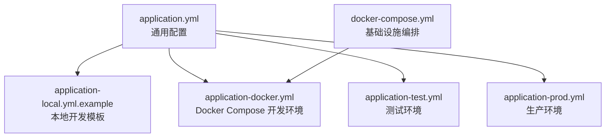
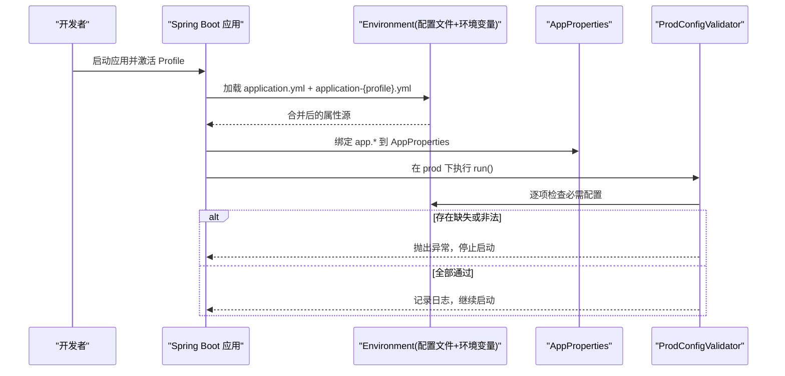
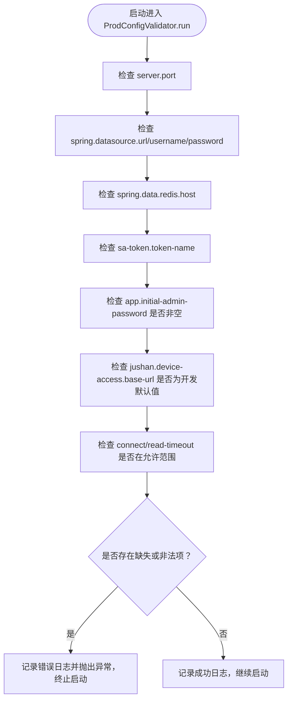
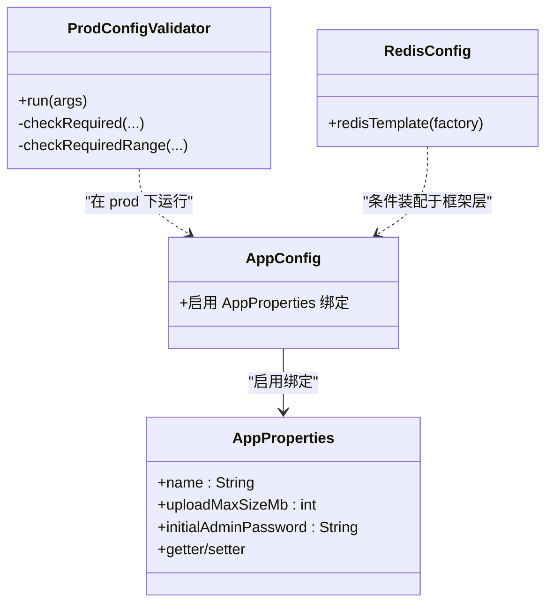

# 配置管理

<cite>
**本文引用的文件**
- [application.yml](file://parking-boot/src/main/resources/application.yml)
- [application-local.yml.example](file://parking-boot/src/main/resources/application-local.yml.example)
- [application-docker.yml](file://parking-boot/src/main/resources/application-docker.yml)
- [application-test.yml](file://parking-boot/src/main/resources/application-test.yml)
- [application-prod.yml](file://parking-boot/src/main/resources/application-prod.yml)
- [AppConfig.java](file://parking-boot/src/main/java/com/jushan/boot/config/AppConfig.java)
- [AppProperties.java](file://parking-boot/src/main/java/com/jushan/boot/config/AppProperties.java)
- [ProdConfigValidator.java](file://parking-boot/src/main/java/com/jushan/boot/config/ProdConfigValidator.java)
- [docker-compose.yml](file://docker-compose.yml)
- [RedisConfig.java](file://parking-framework/src/main/java/com/jushan/framework/redis/RedisConfig.java)
</cite>

## 目录
1. [简介](#简介)
2. [项目结构](#项目结构)
3. [核心组件](#核心组件)
4. [架构总览](#架构总览)
5. [详细组件分析](#详细组件分析)
6. [依赖关系分析](#依赖关系分析)
7. [性能与容量规划](#性能与容量规划)
8. [故障排查指南](#故障排查指南)
9. [结论](#结论)
10. [附录](#附录)

## 简介
本文件面向 Spring Boot 应用的配置管理，覆盖多环境策略、配置文件结构与属性优先级、动态配置更新机制、敏感信息安全管理、配置验证与默认值设置、以及配置热重载能力。同时提供配置迁移工具使用方法和版本控制最佳实践，帮助团队在开发、测试、生产环境中安全、稳定地管理配置。

## 项目结构
本项目采用“通用配置 + Profile 差异化”的组织方式：
- 通用配置：所有环境共享的基础配置
- 本地开发：便于本地快速启动的模板与示例
- Docker Compose：一键拉起 MySQL、Redis、RabbitMQ 等基础设施
- 测试：基于 Testcontainers 的集成测试配置
- 生产：严格的环境变量注入与最小化默认值

图表来源
- [application.yml:1-108](file://parking-boot/src/main/resources/application.yml#L1-L108)
- [application-local.yml.example:1-70](file://parking-boot/src/main/resources/application-local.yml.example#L1-L70)
- [application-docker.yml:1-88](file://parking-boot/src/main/resources/application-docker.yml#L1-L88)
- [application-test.yml:1-80](file://parking-boot/src/main/resources/application-test.yml#L1-L80)
- [application-prod.yml:1-83](file://parking-boot/src/main/resources/application-prod.yml#L1-L83)
- [docker-compose.yml:1-167](file://docker-compose.yml#L1-L167)

章节来源
- [application.yml:1-108](file://parking-boot/src/main/resources/application.yml#L1-L108)
- [application-local.yml.example:1-70](file://parking-boot/src/main/resources/application-local.yml.example#L1-L70)
- [application-docker.yml:1-88](file://parking-boot/src/main/resources/application-docker.yml#L1-L88)
- [application-test.yml:1-80](file://parking-boot/src/main/resources/application-test.yml#L1-L80)
- [application-prod.yml:1-83](file://parking-boot/src/main/resources/application-prod.yml#L1-L83)
- [docker-compose.yml:1-167](file://docker-compose.yml#L1-L167)

## 核心组件
- 应用配置装配：通过配置类启用 @ConfigurationProperties 绑定与校验
- 应用级属性模型：定义业务相关配置项及约束
- 生产环境关键配置校验器：在 prod profile 下强制校验必要环境变量
- Redis 配置：提供统一的序列化策略与连接工厂条件装配

章节来源
- [AppConfig.java:1-18](file://parking-boot/src/main/java/com/jushan/boot/config/AppConfig.java#L1-L18)
- [AppProperties.java:1-46](file://parking-boot/src/main/java/com/jushan/boot/config/AppProperties.java#L1-L46)
- [ProdConfigValidator.java:1-114](file://parking-boot/src/main/java/com/jushan/boot/config/ProdConfigValidator.java#L1-L114)
- [RedisConfig.java:37-69](file://parking-framework/src/main/java/com/jushan/framework/redis/RedisConfig.java#L37-L69)

## 架构总览
下图展示了配置加载与校验的关键流程：Spring Boot 按优先级合并多个配置文件与环境变量；在 prod 环境下，启动后执行关键配置校验，缺失则拒绝运行。

图表来源
- [application.yml:1-108](file://parking-boot/src/main/resources/application.yml#L1-L108)
- [application-prod.yml:1-83](file://parking-boot/src/main/resources/application-prod.yml#L1-L83)
- [AppConfig.java:1-18](file://parking-boot/src/main/java/com/jushan/boot/config/AppConfig.java#L1-L18)
- [AppProperties.java:1-46](file://parking-boot/src/main/java/com/jushan/boot/config/AppProperties.java#L1-L46)
- [ProdConfigValidator.java:1-114](file://parking-boot/src/main/java/com/jushan/boot/config/ProdConfigValidator.java#L1-L114)

## 详细组件分析

### 多环境配置策略
- 通用配置（application.yml）
  - 包含服务名、Web 资源映射、数据源默认值、Flyway 迁移、Redis 默认连接、Sa-Token 基础配置、Actuator 健康检查、Device Access 客户端默认地址与超时、日志级别等
  - 明确禁止在此文件中写入敏感信息，生产环境通过环境变量注入
- 本地开发（application-local.yml.example）
  - 提供本地开发常用占位与注释说明，建议复制为 application-local.yml 并按需修改
  - 对 Sa-Token 会话存储、日志级别等进行宽松配置
- Docker Compose（application-docker.yml）
  - 针对容器化开发环境，数据库、Redis、RabbitMQ 均通过环境变量注入，并提供合理的默认值
  - 开启 Flyway baseline-on-migrate，适配首次初始化
- 测试（application-test.yml）
  - 使用 Testcontainers 动态注入真实 MySQL/Redis 连接，避免外部依赖
  - 默认禁用 RabbitMQ 自动装配，可通过测试用例按需启用
  - Actuator 健康检查细节在测试模式打开
- 生产（application-prod.yml）
  - 所有敏感值通过环境变量注入，不设置默认值，缺失即启动失败
  - 非敏感项可设置合理默认值，如端口、线程池大小等
  - Actuator 健康检查细节关闭，仅暴露 health/info

章节来源
- [application.yml:1-108](file://parking-boot/src/main/resources/application.yml#L1-L108)
- [application-local.yml.example:1-70](file://parking-boot/src/main/resources/application-local.yml.example#L1-L70)
- [application-docker.yml:1-88](file://parking-boot/src/main/resources/application-docker.yml#L1-L88)
- [application-test.yml:1-80](file://parking-boot/src/main/resources/application-test.yml#L1-L80)
- [application-prod.yml:1-83](file://parking-boot/src/main/resources/application-prod.yml#L1-L83)

### 配置文件结构与属性优先级
- 配置文件加载顺序（由低到高）
  - 应用内默认配置（application.yml）
  - 指定 Profile 的配置（application-{profile}.yml）
  - 命令行参数、系统属性、环境变量
- 环境变量覆盖
  - 生产配置大量使用 ${VAR:default} 语法，确保缺失时能显式失败或回退到安全默认值
- 典型覆盖场景
  - 数据源 URL、用户名、密码
  - Redis 主机、端口、密码、数据库索引
  - RabbitMQ 主机、端口、用户、密码、虚拟主机
  - Sa-Token 名称、超时时间
  - Device Access 客户端地址与超时

章节来源
- [application.yml:1-108](file://parking-boot/src/main/resources/application.yml#L1-L108)
- [application-prod.yml:1-83](file://parking-boot/src/main/resources/application-prod.yml#L1-L83)
- [application-docker.yml:1-88](file://parking-boot/src/main/resources/application-docker.yml#L1-L88)
- [application-test.yml:1-80](file://parking-boot/src/main/resources/application-test.yml#L1-L80)

### 动态配置更新机制
- 当前仓库未实现运行时动态刷新配置（例如 @RefreshScope 或自定义监听器）
- 建议方案
  - 使用 Spring Cloud Config 或 Nacos/Apollo 等配置中心，结合 @RefreshScope 实现热更新
  - 对于仅影响连接池或日志级别的配置，可在运行时通过 Actuator 端点或运维脚本触发重启
- 注意
  - 热更新需谨慎评估副作用，尤其是连接池、线程池、安全策略等

[本节为概念性内容，不直接分析具体文件]

### 敏感信息安全管理
- 原则
  - 禁止在代码库中提交任何敏感值（数据库密码、Redis 密码、支付密钥等）
  - 生产环境必须通过环境变量注入，且不得在配置文件中留空或写死
- 实施要点
  - application.yml 与 local/docker/test 配置仅保留非敏感默认值
  - application-prod.yml 中所有敏感项使用 ${ENV_VAR} 形式，缺失即启动失败
  - docker-compose.yml 通过 .env 文件集中管理环境变量，避免硬编码
- 密钥管理建议
  - 使用平台级密钥管理服务（如 KMS、Vault）在部署阶段注入
  - 对初始管理员密码等一次性敏感值进行强管控与审计

章节来源
- [application.yml:1-108](file://parking-boot/src/main/resources/application.yml#L1-L108)
- [application-prod.yml:1-83](file://parking-boot/src/main/resources/application-prod.yml#L1-L83)
- [docker-compose.yml:1-167](file://docker-compose.yml#L1-L167)

### 配置验证、默认值与安全边界
- 类型与范围校验
  - 使用 @Validated 与 Jakarta Validation 注解对 app.* 属性进行约束（如必填、数值范围）
  - 当对应属性出现在配置中时，Spring Boot 自动校验并在无效时报错
- 生产环境关键配置校验器
  - 仅在 prod profile 下运行，逐项检查数据库、Redis、Sa-Token、Device Access 等关键配置
  - 对超时等数值型配置进行范围校验，防止极端值导致不稳定
  - 若发现缺失或非法配置，抛出异常使应用启动失败，遵循“宁可失败，不可带病运行”的安全原则

图表来源
- [ProdConfigValidator.java:1-114](file://parking-boot/src/main/java/com/jushan/boot/config/ProdConfigValidator.java#L1-L114)

章节来源
- [AppProperties.java:1-46](file://parking-boot/src/main/java/com/jushan/boot/config/AppProperties.java#L1-L46)
- [ProdConfigValidator.java:1-114](file://parking-boot/src/main/java/com/jushan/boot/config/ProdConfigValidator.java#L1-L114)

### 配置热重载功能
- 现状
  - 仓库未内置运行时热重载机制
- 推荐做法
  - 引入配置中心（Nacos/Apollo/Spring Cloud Config），结合 @RefreshScope 实现部分配置的热更新
  - 对需要重启才能生效的配置（如连接池、日志级别）通过运维流程滚动发布
- 注意事项
  - 热更新应限制在可控范围内，避免引发状态不一致或并发问题

[本节为概念性内容，不直接分析具体文件]

### 配置迁移工具使用方法
- 使用 Flyway 进行数据库迁移
  - 启用位置：classpath:db/migration
  - 基线迁移：在 docker 开发环境启用 baseline-on-migrate，便于首次初始化
  - 幂等性：重复启动不会重复建表，迁移历史表 flyway_schema_history 记录执行状态
- 测试保障
  - 通过集成测试验证迁移历史表记录、sys_config 表结构与唯一约束、重复启动幂等性

章节来源
- [application.yml:33-37](file://parking-boot/src/main/resources/application.yml#L33-L37)
- [application-docker.yml:27-31](file://parking-boot/src/main/resources/application-docker.yml#L27-L31)
- [application-test.yml:17-21](file://parking-boot/src/main/resources/application-test.yml#L17-L21)

### 配置版本控制最佳实践
- 分支策略
  - 主分支仅保留通用配置与生产骨架，敏感值一律通过环境变量注入
  - 特性分支用于新增非敏感配置项，并通过 PR 审查
- 变更规范
  - 新增配置需在 application-prod.yml 中以 ${ENV_VAR} 形式声明，并在文档中列出
  - 对默认值变更进行风险评估，必要时增加向后兼容逻辑
- 审计与追踪
  - 所有配置变更纳入版本控制，附带变更说明与影响面评估
  - 生产环境变更通过 CI/CD 流水线校验与灰度发布

[本节为概念性内容，不直接分析具体文件]

## 依赖关系分析
配置相关的核心类与职责如下：
- AppConfig：启用 @ConfigurationProperties 绑定
- AppProperties：定义 app.* 属性与校验规则
- ProdConfigValidator：prod 环境下关键配置校验
- RedisConfig：条件装配 RedisTemplate，统一序列化策略

图表来源
- [AppConfig.java:1-18](file://parking-boot/src/main/java/com/jushan/boot/config/AppConfig.java#L1-L18)
- [AppProperties.java:1-46](file://parking-boot/src/main/java/com/jushan/boot/config/AppProperties.java#L1-L46)
- [ProdConfigValidator.java:1-114](file://parking-boot/src/main/java/com/jushan/boot/config/ProdConfigValidator.java#L1-L114)
- [RedisConfig.java:37-69](file://parking-framework/src/main/java/com/jushan/framework/redis/RedisConfig.java#L37-L69)

章节来源
- [AppConfig.java:1-18](file://parking-boot/src/main/java/com/jushan/boot/config/AppConfig.java#L1-L18)
- [AppProperties.java:1-46](file://parking-boot/src/main/java/com/jushan/boot/config/AppProperties.java#L1-L46)
- [ProdConfigValidator.java:1-114](file://parking-boot/src/main/java/com/jushan/boot/config/ProdConfigValidator.java#L1-L114)
- [RedisConfig.java:37-69](file://parking-framework/src/main/java/com/jushan/framework/redis/RedisConfig.java#L37-L69)

## 性能与容量规划
- 连接池与超时
  - HikariCP 最大连接数、空闲连接数、超时时间在通用与生产配置中分别给出默认值，可根据负载调整
  - Device Access 客户端连接与读取超时在生产环境需严格校验范围，避免过长导致雪崩
- Redis 连接池
  - Lettuce 连接池大小与等待策略在通用与 Docker 配置中给出默认值，建议根据缓存命中率与内存占用调优
- 日志级别
  - 开发/测试环境更详细，生产环境降低日志级别以减少 I/O 开销

章节来源
- [application.yml:22-52](file://parking-boot/src/main/resources/application.yml#L22-L52)
- [application-docker.yml:16-46](file://parking-boot/src/main/resources/application-docker.yml#L16-L46)
- [application-prod.yml:17-46](file://parking-boot/src/main/resources/application-prod.yml#L17-L46)
- [application.yml:93-99](file://parking-boot/src/main/resources/application.yml#L93-L99)
- [application-test.yml:40-49](file://parking-boot/src/main/resources/application-test.yml#L40-L49)

## 故障排查指南
- 启动失败：缺少关键配置
  - 现象：prod 环境下启动报错，提示缺失数据库、Redis、Sa-Token 或 Device Access 等配置
  - 处理：检查环境变量是否注入，确认 application-prod.yml 中的 ${ENV_VAR} 已正确赋值
- 连接失败：数据库/Redis/RabbitMQ
  - 现象：Hikari/Lettuce/RabbitMQ 连接异常
  - 处理：核对 host/port/password/virtual-host 等环境变量，确认容器网络与端口映射
- 迁移异常：Flyway
  - 现象：重复启动出现建表冲突或历史表不一致
  - 处理：确认 baseline-on-migrate 仅用于开发环境，生产环境保持 clean-disabled=true，并检查迁移脚本幂等性
- 健康检查：Actuator
  - 现象：health 接口返回异常或无详细信息
  - 处理：在开发/测试环境开启 show-details=always，生产环境保持 never，仅暴露 health/info

章节来源
- [ProdConfigValidator.java:1-114](file://parking-boot/src/main/java/com/jushan/boot/config/ProdConfigValidator.java#L1-L114)
- [application.yml:75-90](file://parking-boot/src/main/resources/application.yml#L75-L90)
- [application-test.yml:67-71](file://parking-boot/src/main/resources/application-test.yml#L67-L71)
- [application-prod.yml:67-76](file://parking-boot/src/main/resources/application-prod.yml#L67-L76)

## 结论
本项目采用“通用配置 + Profile 差异化 + 环境变量注入”的配置管理模式，配合严格的类型校验与生产环境关键配置校验器，有效降低了配置错误带来的风险。建议在后续演进中引入配置中心与热更新机制，完善密钥管理与审计流程，进一步提升配置的可维护性与安全性。

## 附录
- 快速启动（Docker Compose）
  - 准备 .env 文件，启动 mysql、redis、rabbitmq、nginx
  - 以 docker profile 启动后端，访问 Nginx 反向代理入口
- 本地开发
  - 复制 application-local.yml.example 为 application-local.yml，按需修改非敏感默认值
- 测试
  - 使用 mvn test 或 IDE 运行，Testcontainers 自动拉起真实 MySQL/Redis

章节来源
- [docker-compose.yml:1-167](file://docker-compose.yml#L1-L167)
- [application-docker.yml:1-88](file://parking-boot/src/main/resources/application-docker.yml#L1-L88)
- [application-local.yml.example:1-70](file://parking-boot/src/main/resources/application-local.yml.example#L1-L70)