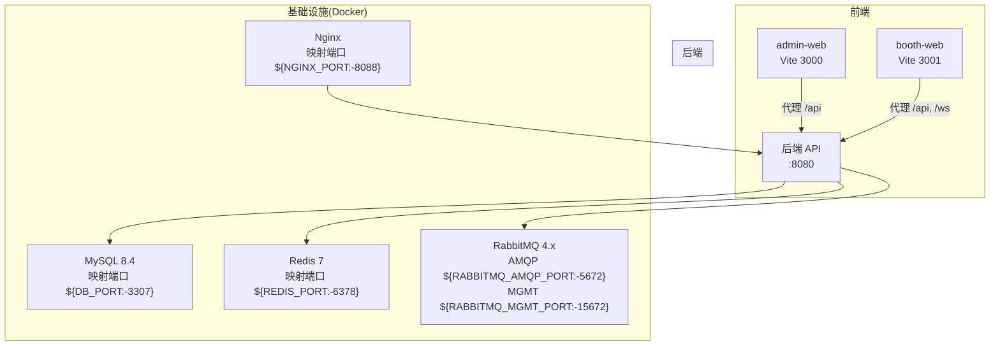
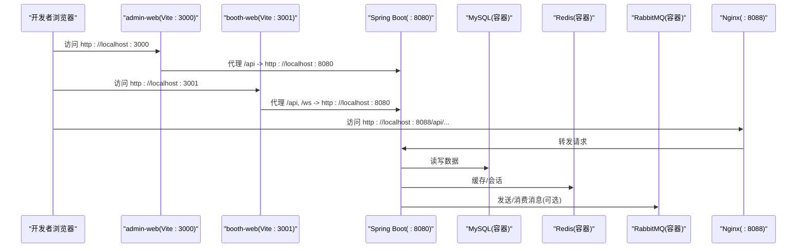
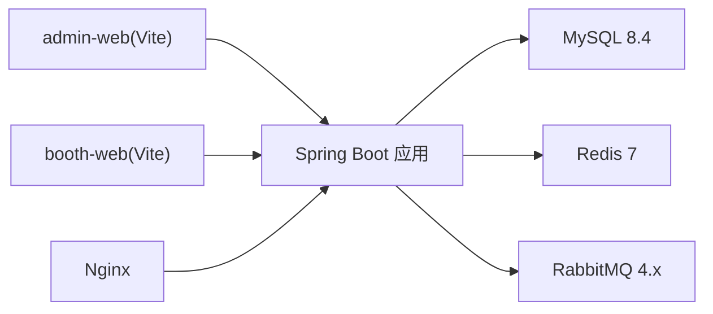

# 开发环境配置

<cite>
**本文引用的文件**   
- [README.md](file://README.md)
- [application.yml](file://parking-boot/src/main/resources/application.yml)
- [application-local.yml.example](file://parking-boot/src/main/resources/application-local.yml.example)
- [application-docker.yml](file://parking-boot/src/main/resources/application-docker.yml)
- [application-prod.yml](file://parking-boot/src/main/resources/application-prod.yml)
- [application-test.yml](file://parking-boot/src/main/resources/application-test.yml)
- [docker-compose.yml](file://docker-compose.yml)
- [admin-web/package.json](file://admin-web/package.json)
- [booth-web/package.json](file://booth-web/package.json)
- [admin-web/vite.config.ts](file://admin-web/vite.config.ts)
- [booth-web/vite.config.ts](file://booth-web/vite.config.ts)
</cite>

## 目录
1. [简介](#简介)
2. [项目结构](#项目结构)
3. [核心组件](#核心组件)
4. [架构总览](#架构总览)
5. [详细组件分析](#详细组件分析)
6. [依赖分析](#依赖分析)
7. [性能考虑](#性能考虑)
8. [故障排查指南](#故障排查指南)
9. [结论](#结论)
10. [附录](#附录)

## 简介
本文件面向本地开发与联调，覆盖后端 Spring Boot、前端 Vue 工程、Docker 基础设施与常用工具链的配置说明。内容基于仓库现有配置文件整理，确保“即配即用”，并给出调试、日志、构建与部署相关的关键要点。

## 项目结构
- 后端：Spring Boot 多模块（parking-boot/parking-framework/parking-system/parking-common），默认端口 8080，使用 Flyway 管理数据库迁移，Redis 用于缓存与会话，RabbitMQ 作为消息中间件（可选）。
- 前端：两个独立 Vite + Vue 3 工程（admin-web、booth-web），分别提供管理端与岗亭端页面，均通过 Vite 代理转发到后端 /api 接口。
- 基础设施：docker-compose 提供 MySQL、Redis、RabbitMQ、Nginx 的本地一键启动能力。

图示来源
- [docker-compose.yml:27-167](file://docker-compose.yml#L27-L167)
- [application.yml:8-108](file://parking-boot/src/main/resources/application.yml#L8-L108)
- [admin-web/vite.config.ts:29-38](file://admin-web/vite.config.ts#L29-L38)
- [booth-web/vite.config.ts:12-26](file://booth-web/vite.config.ts#L12-L26)

章节来源
- [README.md:1-75](file://README.md#L1-L75)
- [docker-compose.yml:27-167](file://docker-compose.yml#L27-L167)
- [application.yml:8-108](file://parking-boot/src/main/resources/application.yml#L8-L108)
- [admin-web/vite.config.ts:29-38](file://admin-web/vite.config.ts#L29-L38)
- [booth-web/vite.config.ts:12-26](file://booth-web/vite.config.ts#L12-L26)

## 核心组件
- 应用配置分层
  - application.yml：通用配置（服务名、默认数据源、Flyway、Redis、Sa-Token、Actuator、日志等）
  - application-local.yml.example：本地开发模板（非敏感默认值，复制为 application-local.yml 后生效）
  - application-docker.yml：Docker Compose 环境覆盖（连接容器化 MySQL/Redis/RabbitMQ，开启 Sa-Token Redis 会话）
  - application-prod.yml：生产骨架（所有敏感项通过环境变量注入）
  - application-test.yml：测试环境（Testcontainers 动态注入真实 MySQL/Redis；默认禁用 RabbitMQ）
- 前端工程
  - admin-web：Vite + Vue 3 + Ant Design Vue，自动导入与按需组件解析，SCSS 全局变量注入，手动分包优化
  - booth-web：Vite + Vue 3，支持 WebSocket 代理，SCSS 全局变量注入，手动分包优化
- 基础设施
  - docker-compose：MySQL 8.4、Redis 7、RabbitMQ 4.x Management、Nginx，统一网络与数据卷，健康检查与端口映射

章节来源
- [application.yml:8-108](file://parking-boot/src/main/resources/application.yml#L8-L108)
- [application-local.yml.example:1-70](file://parking-boot/src/main/resources/application-local.yml.example#L1-L70)
- [application-docker.yml:1-88](file://parking-boot/src/main/resources/application-docker.yml#L1-L88)
- [application-prod.yml:1-83](file://parking-boot/src/main/resources/application-prod.yml#L1-L83)
- [application-test.yml:1-80](file://parking-boot/src/main/resources/application-test.yml#L1-L80)
- [admin-web/package.json:1-38](file://admin-web/package.json#L1-L38)
- [booth-web/package.json:1-35](file://booth-web/package.json#L1-L35)
- [admin-web/vite.config.ts:1-60](file://admin-web/vite.config.ts#L1-L60)
- [booth-web/vite.config.ts:1-47](file://booth-web/vite.config.ts#L1-L47)
- [docker-compose.yml:27-167](file://docker-compose.yml#L27-L167)

## 架构总览
下图展示本地开发时前后端与基础设施的交互关系，以及 Nginx 反向代理入口。

图示来源
- [admin-web/vite.config.ts:29-38](file://admin-web/vite.config.ts#L29-L38)
- [booth-web/vite.config.ts:12-26](file://booth-web/vite.config.ts#L12-L26)
- [docker-compose.yml:118-145](file://docker-compose.yml#L118-L145)
- [application.yml:21-52](file://parking-boot/src/main/resources/application.yml#L21-L52)

## 详细组件分析

### IDE 与代码规范推荐
- IntelliJ IDEA
  - 启用 Lombok 插件（如使用）
  - 安装 MyBatisX 插件以增强 Mapper/XML 导航
  - 设置编码 UTF-8，JDK 版本与项目一致（参考 README 技术栈）
  - 格式化：建议启用 EditorConfig 或团队统一的 .editorconfig（若存在）
- VS Code
  - 推荐插件：Java Extension Pack、Lombok Annotations Support、Vue Language Features (Volar)、ESLint、Prettier、EditorConfig
  - 保存时自动格式化，保持与 Prettier 规则一致
- 代码格式化
  - 前端：使用 Prettier 脚本命令进行统一格式化（见 package.json scripts）
  - 后端：建议统一使用 Spotless 或团队约定格式（当前仓库未包含显式格式化配置）

章节来源
- [admin-web/package.json:6-12](file://admin-web/package.json#L6-L12)
- [booth-web/package.json:6-10](file://booth-web/package.json#L6-L10)
- [README.md:14-14](file://README.md#L14-L14)

### 后端配置详解（application-local.yml 与 Profile）
- 本地开发（local）
  - 将 application-local.yml.example 复制为 application-local.yml 并按需修改
  - 默认连接本机 MySQL/Redis；如需使用 Docker 提供的服务，请切换至 docker profile
  - Actuator health 在 local 下显示详细信息便于排障
- Docker 开发（docker）
  - 通过环境变量注入数据库、Redis、RabbitMQ 连接信息
  - 开启 Sa-Token 使用 Redis 存储会话
  - Flyway 启用 baseline-on-migrate，适配已有库
- 生产（prod）
  - 所有敏感项强制通过环境变量注入，缺失则启动失败
  - 日志级别调整为 WARN/INFO，减少噪音
- 测试（test）
  - Testcontainers 动态注入真实 MySQL/Redis
  - 默认禁用 RabbitMQ，需要 MQ 的测试单独启用
  - Device Access 客户端 base-url 可通过测试覆盖

关键参数说明（节选）
- 服务与 Web
  - server.port：后端服务端口（默认 8080）
  - spring.mvc.throw-exception-if-no-handler-found：未匹配路由抛异常
  - spring.web.resources.add-mappings：关闭静态资源映射
- 数据源与迁移
  - spring.datasource.*：JDBC URL、用户名、密码、驱动类
  - spring.flyway.*：启用迁移、扫描路径、clean-disabled
- 缓存与会话
  - spring.data.redis.*：host/port/password/database/timeout/Lettuce 池
  - sa-token.alone-redis.*：Sa-Token 独立 Redis 配置（docker/profile）
- 安全与鉴权
  - sa-token.*：Token 名称/前缀、超时、并发策略、读取来源（仅 Header）
- 监控与健康
  - management.endpoints.web.exposure.include：暴露 health/info
  - management.endpoint.health.show-details：按环境控制详情可见性
- 外部服务
  - jushan.device-access.*：Device Access 客户端基础地址与超时
- 日志
  - logging.level.root/com.jushan：根包与业务包日志级别
  - logging.pattern.console：控制台输出格式（含 traceId）

章节来源
- [application-local.yml.example:1-70](file://parking-boot/src/main/resources/application-local.yml.example#L1-L70)
- [application-docker.yml:1-88](file://parking-boot/src/main/resources/application-docker.yml#L1-L88)
- [application-prod.yml:1-83](file://parking-boot/src/main/resources/application-prod.yml#L1-L83)
- [application-test.yml:1-80](file://parking-boot/src/main/resources/application-test.yml#L1-L80)
- [application.yml:8-108](file://parking-boot/src/main/resources/application.yml#L8-L108)

### 环境变量与数据库连接
- 本地直连 MySQL/Redis
  - 直接编辑 application-local.yml（从 example 复制）
  - 确认端口、账号、密码与本地服务一致
- Docker Compose 环境
  - 通过 .env 或 shell 环境变量覆盖：
    - DB_ROOT_PASSWORD、DB_NAME、DB_USERNAME、DB_PASSWORD、DB_PORT
    - REDIS_PORT、REDIS_PASSWORD
    - RABBITMQ_*（用户、密码、虚拟主机、端口）
    - NGINX_PORT
  - 后端以 docker profile 启动，自动读取上述变量
- 生产环境
  - 必须提供 DB_URL、DB_USERNAME、DB_PASSWORD、REDIS_HOST、REDIS_PORT、REDIS_PASSWORD、RABBITMQ_*、SERVER_PORT 等
  - 不设置默认值，缺失即启动失败，避免误用弱口令

章节来源
- [docker-compose.yml:33-63](file://docker-compose.yml#L33-L63)
- [docker-compose.yml:94-116](file://docker-compose.yml#L94-L116)
- [docker-compose.yml:120-145](file://docker-compose.yml#L120-L145)
- [application-docker.yml:13-55](file://parking-boot/src/main/resources/application-docker.yml#L13-L55)
- [application-prod.yml:10-54](file://parking-boot/src/main/resources/application-prod.yml#L10-L54)

### 前端开发环境配置
- Node.js 与包管理器
  - 建议使用 Node.js LTS（与 @types/node 20 兼容）
  - 包管理器：pnpm（已配置 pnpm-onlyBuiltDependencies）
- 脚本命令
  - admin-web：dev/build/preview/lint/format
  - booth-web：dev/build/preview
- 开发服务器
  - admin-web：端口 3000，/api 代理到 http://localhost:8080，重写去除 /api 前缀
  - booth-web：端口 3001，/api 与 /ws 代理到 http://localhost:8080
- 构建优化
  - 手动分包 vendor-vue/vendor-ui/vendor-utils 等，减小主包体积
- SCSS 全局变量
  - additionalData 注入 @use "@/styles/variables.scss" as *，消除弃用警告

章节来源
- [admin-web/package.json:1-38](file://admin-web/package.json#L1-L38)
- [booth-web/package.json:1-35](file://booth-web/package.json#L1-L35)
- [admin-web/vite.config.ts:1-60](file://admin-web/vite.config.ts#L1-L60)
- [booth-web/vite.config.ts:1-47](file://booth-web/vite.config.ts#L1-L47)

### 调试环境搭建指南
- 断点调试
  - 后端：IDE 中运行 Spring Boot 主类，选择 local/docker/test profile 即可
  - 前端：在浏览器开发者工具中打断点，或通过 Vite 的 Source Map 定位源码
- 日志配置
  - 本地：logging.level.com.jushan=DEBUG，控制台输出含 traceId
  - 测试：额外输出 org.springframework.test/org.testcontainers 日志
  - 生产：root=WARN，com.jushan=INFO，建议由运维侧配置文件追加器
- 性能分析
  - 后端：可结合 JFR/Arthas 等工具（需自行引入）
  - 前端：浏览器 Performance 面板、Webpack/Vite Bundle 分析

章节来源
- [application.yml:101-108](file://parking-boot/src/main/resources/application.yml#L101-L108)
- [application-test.yml:73-80](file://parking-boot/src/main/resources/application-test.yml#L73-L80)
- [application-prod.yml:77-83](file://parking-boot/src/main/resources/application-prod.yml#L77-L83)

### Git 工作流配置
- 分支策略
  - 建议采用主干发布模型或 GitFlow（feature/*、release/*、hotfix/*）
  - 合并前需通过 CI 检查（构建、测试、lint）
- 提交规范
  - 建议遵循 Conventional Commits（feat/fix/docs/chore 等）
- 代码审查流程
  - Pull Request 至少一人 Review，通过后合并
  - 变更涉及配置/DDL 的，需在 PR 描述中说明影响范围

[本节为通用实践说明，不直接分析具体文件]

### 开发工具链配置
- Maven
  - 使用 mvnw 包装器执行构建与测试
  - 多模块打包：mvn clean install -pl parking-boot -am
- Docker
  - 启动基础设施：docker compose up -d
  - 停止并清理数据卷：docker compose down -v
- 数据库客户端
  - 本地直连：localhost:3306（或 docker 映射端口 ${DB_PORT:-3307}）
  - 用户名/密码：根据 application-local.yml 或 docker-compose.yml 的环境变量
- 消息队列
  - RabbitMQ Management：http://localhost:${RABBITMQ_MGMT_PORT:-15672}
  - AMQP 端口：${RABBITMQ_AMQP_PORT:-5672}
- Nginx 反向代理
  - 端口：${NGINX_PORT:-8088}
  - 访问示例：http://localhost:8088/api/...

章节来源
- [docker-compose.yml:27-167](file://docker-compose.yml#L27-L167)
- [application-docker.yml:1-88](file://parking-boot/src/main/resources/application-docker.yml#L1-L88)

## 依赖分析
- 后端依赖
  - Spring Boot 3、MyBatis-Plus、Sa-Token、HikariCP、Lettuce、Flyway、Actuator
  - 可选：RabbitMQ（测试默认禁用，docker/prod 可按需启用）
- 前端依赖
  - Vue 3、Vue Router、Pinia、Ant Design Vue、Axios、Day.js、NProgress
  - 构建工具：Vite 5、TypeScript、Sass
- 基础设施依赖
  - MySQL 8.4、Redis 7、RabbitMQ 4.x、Nginx

图示来源
- [application.yml:21-52](file://parking-boot/src/main/resources/application.yml#L21-L52)
- [docker-compose.yml:33-145](file://docker-compose.yml#L33-L145)
- [admin-web/vite.config.ts:29-38](file://admin-web/vite.config.ts#L29-L38)
- [booth-web/vite.config.ts:12-26](file://booth-web/vite.config.ts#L12-L26)

章节来源
- [application.yml:8-108](file://parking-boot/src/main/resources/application.yml#L8-L108)
- [docker-compose.yml:27-167](file://docker-compose.yml#L27-L167)
- [admin-web/package.json:1-38](file://admin-web/package.json#L1-L38)
- [booth-web/package.json:1-35](file://booth-web/package.json#L1-L35)

## 性能考虑
- 数据库连接池
  - HikariCP：maximum-pool-size、minimum-idle、connection-timeout 按负载调整
- Redis 连接池
  - Lettuce pool：max-active/max-idle/min-idle 与业务并发量匹配
- 前端构建
  - manualChunks 拆分 vendor 包，提升缓存命中率与加载速度
- 日志级别
  - 本地 DEBUG，生产 WARN/INFO，避免 IO 瓶颈

章节来源
- [application.yml:27-52](file://parking-boot/src/main/resources/application.yml#L27-L52)
- [application-docker.yml:21-46](file://parking-boot/src/main/resources/application-docker.yml#L21-L46)
- [application-prod.yml:22-46](file://parking-boot/src/main/resources/application-prod.yml#L22-L46)
- [admin-web/vite.config.ts:47-58](file://admin-web/vite.config.ts#L47-L58)
- [booth-web/vite.config.ts:35-45](file://booth-web/vite.config.ts#L35-L45)

## 故障排查指南
- 无法连接数据库
  - 检查 application-local.yml 或 docker profile 的 JDBC URL、用户名、密码
  - 确认 MySQL 容器健康与端口映射正确
- Redis 连接失败
  - 核对 host/port/password/database，注意 docker 映射端口差异
- RabbitMQ 不可用
  - 确认 AMQP 端口与管理后台端口是否被占用
  - 测试环境下默认禁用 MQ，需要 MQ 的测试需单独启用
- 前端代理无效
  - 检查 vite.config.ts 的 proxy target 与 rewrite 规则
  - 确认后端服务已在 8080 启动
- 健康检查
  - 访问 /actuator/health 查看各组件状态（local/docker 模式 show-details 不同）

章节来源
- [application.yml:75-92](file://parking-boot/src/main/resources/application.yml#L75-L92)
- [application-docker.yml:73-82](file://parking-boot/src/main/resources/application-docker.yml#L73-L82)
- [application-test.yml:35-39](file://parking-boot/src/main/resources/application-test.yml#L35-L39)
- [admin-web/vite.config.ts:29-38](file://admin-web/vite.config.ts#L29-L38)
- [booth-web/vite.config.ts:12-26](file://booth-web/vite.config.ts#L12-L26)
- [docker-compose.yml:52-63](file://docker-compose.yml#L52-L63)
- [docker-compose.yml:84-90](file://docker-compose.yml#L84-L90)
- [docker-compose.yml:105-110](file://docker-compose.yml#L105-L110)

## 结论
通过分层配置与 Docker Compose 基础设施，本项目可在本地快速拉起完整开发环境。建议严格区分 local/docker/prod/test 配置边界，敏感信息一律走环境变量，配合前端代理与日志策略，提高联调效率与问题定位能力。

## 附录
- 快速启动清单
  - 启动基础设施：docker compose up -d
  - 后端以 docker profile 运行：./mvnw spring-boot:run -Dspring-boot.run.profiles=docker
  - 前端开发：pnpm dev（admin-web:3000，booth-web:3001）
  - 访问 Nginx 入口：http://localhost:8088/api/...

章节来源
- [docker-compose.yml:1-26](file://docker-compose.yml#L1-L26)
- [application-docker.yml:4-11](file://parking-boot/src/main/resources/application-docker.yml#L4-L11)
- [admin-web/vite.config.ts:29-38](file://admin-web/vite.config.ts#L29-L38)
- [booth-web/vite.config.ts:12-26](file://booth-web/vite.config.ts#L12-L26)