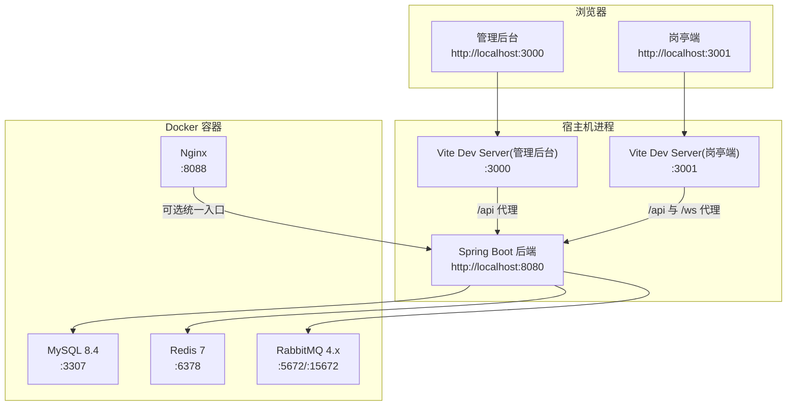
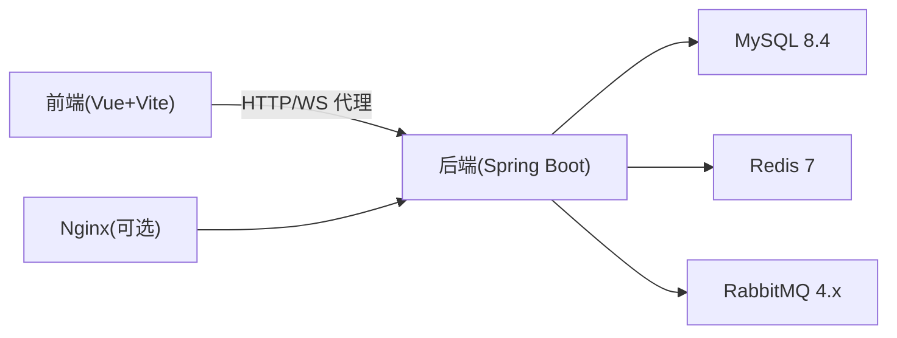

# 快速开始指南

<cite>
**本文引用的文件**
- [README.md](file://README.md)
- [docker-compose.yml](file://docker-compose.yml)
- [application.yml](file://parking-boot/src/main/resources/application.yml)
- [application-docker.yml](file://parking-boot/src/main/resources/application-docker.yml)
- [application-local.yml.example](file://parking-boot/src/main/resources/application-local.yml.example)
- [V20260710001__baseline.sql](file://parking-boot/src/main/resources/db/migration/V20260710001__baseline.sql)
- [V20260711002__sys_user_and_login_log.sql](file://parking-boot/src/main/resources/db/migration/V20260711002__sys_user_and_login_log.sql)
- [V20260711003__sys_role_permission.sql](file://parking-boot/src/main/resources/db/migration/V20260711003__sys_role_permission.sql)
- [admin-web/package.json](file://admin-web/package.json)
- [booth-web/package.json](file://booth-web/package.json)
- [admin-web/vite.config.ts](file://admin-web/vite.config.ts)
- [booth-web/vite.config.ts](file://booth-web/vite.config.ts)
- [部署说明.md](file://docs/部署运维/部署说明.md)
- [配置说明.md](file://docs/部署运维/配置说明.md)
</cite>

## 目录
1. [简介](#简介)
2. [环境要求](#环境要求)
3. [本地开发环境搭建（推荐）](#本地开发环境搭建推荐)
4. [Docker Compose 一键部署](#docker-compose-一键部署)
5. [应用访问地址与入口](#应用访问地址与入口)
6. [初始账号与基本操作指引](#初始账号与基本操作指引)
7. [架构概览](#架构概览)
8. [详细组件分析](#详细组件分析)
9. [依赖关系分析](#依赖关系分析)
10. [性能与可观测性建议](#性能与可观测性建议)
11. [常见问题排查](#常见问题排查)
12. [结论](#结论)

## 简介
本指南面向首次接触智慧停车 SaaS 平台的开发者，目标是在 30 分钟内完成本地或容器化环境的搭建并成功运行管理后台、岗亭端与后端 API。平台采用多模块 Maven + Spring Boot 3 后端，Vue 3 + Vite 前端，MySQL、Redis、RabbitMQ 作为基础设施，支持 Flyway 自动迁移数据库结构。

## 环境要求
- Java 21（用于构建与运行 Spring Boot 后端）
- Node.js（用于安装前端依赖与启动 Vite dev server；版本与包管理器 pnpm 需满足 admin-web 与 booth-web 的 package.json 要求）
- MySQL 8.4（通过 Docker 提供，默认映射到宿主机端口 3307）
- Redis 7（通过 Docker 提供，默认映射到宿主机端口 6378）
- RabbitMQ 4.x Management（通过 Docker 提供，AMQP 端口 5672，管理后台 15672）
- Nginx（可选，用于反向代理，默认映射到宿主机端口 8088）
- Docker 与 Docker Compose（用于一键拉起基础设施）

章节来源
- [README.md](file://README.md)
- [docker-compose.yml](file://docker-compose.yml)
- [admin-web/package.json](file://admin-web/package.json)
- [booth-web/package.json](file://booth-web/package.json)

## 本地开发环境搭建（推荐）
以下步骤在宿主机直接运行后端与前端，使用 Docker Compose 仅启动基础设施服务。

步骤
1) 克隆仓库
- 将代码克隆至本地工作目录。

2) 启动基础设施（MySQL、Redis、RabbitMQ、Nginx）
- 复制环境变量模板：cp .env.example .env（若不存在则忽略）
- 启动服务：docker compose up -d
- 验证状态：docker compose ps
- 查看日志：docker compose logs -f

3) 初始化数据库
- 项目已启用 Flyway，首次连接数据库后会自动执行 db/migration 下的迁移脚本，无需手动导入 DDL。
- 基线迁移包含系统配置表等基础元数据。
- 用户与权限相关迁移会创建默认超级管理员账号。

4) 启动后端（Spring Boot）
- 编译：mvn clean compile
- 运行：mvn spring-boot:run -pl parking-boot
- 默认监听端口：8080
- 本地 profile 下默认连接本地 MySQL/Redis；如需使用 Docker 提供的服务，请切换为 docker profile 并参考“Docker Compose 一键部署”中的说明。

5) 启动前端
- 管理后台：cd admin-web && pnpm install && pnpm dev（默认端口 3000，代理 /api 到 http://localhost:8080）
- 岗亭端：cd booth-web && pnpm install && pnpm dev（默认端口 3001，代理 /api 与 /ws 到 http://localhost:8080）

6) 访问页面
- 管理后台：http://localhost:3000
- 岗亭端：http://localhost:3001
- 后端 API：http://localhost:8080/api/...

章节来源
- [部署说明.md](file://docs/部署运维/部署说明.md)
- [application.yml](file://parking-boot/src/main/resources/application.yml)
- [application-docker.yml](file://parking-boot/src/main/resources/application-docker.yml)
- [application-local.yml.example](file://parking-boot/src/main/resources/application-local.yml.example)
- [V20260710001__baseline.sql](file://parking-boot/src/main/resources/db/migration/V20260710001__baseline.sql)
- [V20260711002__sys_user_and_login_log.sql](file://parking-boot/src/main/resources/db/migration/V20260711002__sys_user_and_login_log.sql)
- [V20260711003__sys_role_permission.sql](file://parking-boot/src/main/resources/db/migration/V20260711003__sys_role_permission.sql)
- [admin-web/vite.config.ts](file://admin-web/vite.config.ts)
- [booth-web/vite.config.ts](file://booth-web/vite.config.ts)

## Docker Compose 一键部署
该方案通过 Docker Compose 拉起 MySQL、Redis、RabbitMQ、Nginx，后端与前端仍在宿主机运行。

命令
- 启动所有服务：docker compose up -d
- 查看服务状态：docker compose ps
- 查看日志：docker compose logs -f
- 停止服务：docker compose down
- 清理数据卷（重置数据库）：docker compose down -v

端口与网络
- MySQL 宿主机端口：3307（容器内 3306）
- Redis 宿主机端口：6378（容器内 6379）
- RabbitMQ AMQP：5672；Management：15672
- Nginx：8088（容器内 80）
- 自定义网络：jushan-net

健康检查
- 所有服务均配置 healthcheck，Nginx 等待 MySQL、Redis、RabbitMQ 全部健康后再启动。

注意
- 生产环境敏感配置禁止写入配置文件，统一通过环境变量注入。
- 如需通过 Nginx 统一入口访问，请将前端静态资源挂载到 Nginx 并在 Nginx 中配置反向代理到 host.docker.internal:8080。

章节来源
- [docker-compose.yml](file://docker-compose.yml)
- [部署说明.md](file://docs/部署运维/部署说明.md)
- [配置说明.md](file://docs/部署运维/配置说明.md)

## 应用访问地址与入口
- 管理后台（开发）：http://localhost:3000
- 岗亭端（开发）：http://localhost:3001
- 后端 API（开发）：http://localhost:8080/api/...
- Nginx 统一入口（可选）：http://localhost:8088
- RabbitMQ 管理后台（可选）：http://localhost:15672

前端代理规则
- 管理后台与岗亭端均通过 Vite dev server 将 /api 请求转发到 http://localhost:8080。
- 岗亭端额外将 /ws 转发到 ws://localhost:8080。

章节来源
- [admin-web/vite.config.ts](file://admin-web/vite.config.ts)
- [booth-web/vite.config.ts](file://booth-web/vite.config.ts)
- [docker-compose.yml](file://docker-compose.yml)

## 初始账号与基本操作指引
- 默认超级管理员账号会在数据库迁移时自动插入。
- 角色与权限由固定角色与权限表维护，第一阶段不支持自定义角色组合。
- 登录成功后，Token 以 Authorization: Bearer <token> 形式传递。

安全提示
- 首次登录后请立即修改默认密码。
- 禁止在日志中输出敏感信息（密码、Token、支付密钥等）。

章节来源
- [V20260711002__sys_user_and_login_log.sql](file://parking-boot/src/main/resources/db/migration/V20260711002__sys_user_and_login_log.sql)
- [V20260711003__sys_role_permission.sql](file://parking-boot/src/main/resources/db/migration/V20260711003__sys_role_permission.sql)
- [application.yml](file://parking-boot/src/main/resources/application.yml)
- [配置说明.md](file://docs/部署运维/配置说明.md)

## 架构概览
下图展示了本地开发时的主要组件与交互关系：前端通过 Vite dev server 代理到后端，后端连接 MySQL、Redis、RabbitMQ，Nginx 可作为统一入口进行反向代理。

图表来源
- [docker-compose.yml](file://docker-compose.yml)
- [admin-web/vite.config.ts](file://admin-web/vite.config.ts)
- [booth-web/vite.config.ts](file://booth-web/vite.config.ts)
- [application.yml](file://parking-boot/src/main/resources/application.yml)

## 详细组件分析

### 后端（Spring Boot）
- 通用配置位于 application.yml，包含数据源、Flyway、Redis、Sa-Token、Actuator、Device Access 客户端等。
- Docker 环境覆盖配置位于 application-docker.yml，通过环境变量注入敏感项。
- 本地开发模板位于 application-local.yml.example，可按需复制为 application-local.yml 覆盖默认值。
- 数据库迁移位于 parking-boot/src/main/resources/db/migration，按版本号顺序执行。

章节来源
- [application.yml](file://parking-boot/src/main/resources/application.yml)
- [application-docker.yml](file://parking-boot/src/main/resources/application-docker.yml)
- [application-local.yml.example](file://parking-boot/src/main/resources/application-local.yml.example)
- [V20260710001__baseline.sql](file://parking-boot/src/main/resources/db/migration/V20260710001__baseline.sql)
- [V20260711002__sys_user_and_login_log.sql](file://parking-boot/src/main/resources/db/migration/V20260711002__sys_user_and_login_log.sql)
- [V20260711003__sys_role_permission.sql](file://parking-boot/src/main/resources/db/migration/V20260711003__sys_role_permission.sql)

### 前端（管理后台与岗亭端）
- 管理后台与岗亭端均为 Vue 3 + Vite 工程，分别定义于 admin-web 与 booth-web。
- 开发服务器端口分别为 3000 与 3001，均将 /api 请求代理到后端 8080。
- 岗亭端额外代理 WebSocket 路径 /ws 到后端。

章节来源
- [admin-web/package.json](file://admin-web/package.json)
- [booth-web/package.json](file://booth-web/package.json)
- [admin-web/vite.config.ts](file://admin-web/vite.config.ts)
- [booth-web/vite.config.ts](file://booth-web/vite.config.ts)

### 基础设施（Docker Compose）
- 编排了 MySQL、Redis、RabbitMQ、Nginx，并通过 healthcheck 保证启动顺序。
- 数据持久化通过命名卷实现，便于开发与测试环境的数据保留与重置。
- 端口映射避免与宿主机已有服务冲突。

章节来源
- [docker-compose.yml](file://docker-compose.yml)
- [部署说明.md](file://docs/部署运维/部署说明.md)

## 依赖关系分析
下图展示关键依赖关系：后端依赖 MySQL、Redis、RabbitMQ；前端通过 Vite dev server 代理到后端；Nginx 作为可选统一入口。

图表来源
- [docker-compose.yml](file://docker-compose.yml)
- [admin-web/vite.config.ts](file://admin-web/vite.config.ts)
- [booth-web/vite.config.ts](file://booth-web/vite.config.ts)
- [application.yml](file://parking-boot/src/main/resources/application.yml)

## 性能与可观测性建议
- 合理设置 HikariCP 连接池大小与超时参数，避免连接耗尽。
- Redis 开启 AOF 持久化，并根据内存策略调整 maxmemory 与淘汰策略。
- Actuator 暴露 health 与 info 端点，便于健康检查与探针集成。
- 日志中包含 TraceId，便于链路追踪与问题定位。

章节来源
- [application.yml](file://parking-boot/src/main/resources/application.yml)
- [docker-compose.yml](file://docker-compose.yml)
- [配置说明.md](file://docs/部署运维/配置说明.md)

## 常见问题排查
- 无法连接数据库
  - 确认 MySQL 容器已健康且端口映射正确（默认 3307）。
  - 检查 application.yml 或 application-docker.yml 中的数据源配置是否与环境一致。
- Redis 连接失败
  - 确认 Redis 容器健康且端口映射正确（默认 6378）。
  - 检查 Sa-Token 单独 Redis 配置（如启用）是否与宿主端口一致。
- RabbitMQ 未就绪
  - 确认 AMQP 与管理后台端口可用（5672/15672），用户名密码与虚拟主机匹配。
- 前端无法调用后端接口
  - 检查 Vite dev server 的代理配置是否正确指向 http://localhost:8080。
  - 确认后端已启动且未被防火墙拦截。
- 端口冲突
  - 修改 docker-compose.yml 中的端口映射或宿主机已有服务的端口。
- 数据库结构不一致
  - 确保 Flyway 已启用且迁移脚本路径正确；必要时清理数据卷后重新启动。

章节来源
- [docker-compose.yml](file://docker-compose.yml)
- [application.yml](file://parking-boot/src/main/resources/application.yml)
- [application-docker.yml](file://parking-boot/src/main/resources/application-docker.yml)
- [admin-web/vite.config.ts](file://admin-web/vite.config.ts)
- [booth-web/vite.config.ts](file://booth-web/vite.config.ts)
- [部署说明.md](file://docs/部署运维/部署说明.md)

## 结论
通过本指南，你可以在 30 分钟内完成智慧停车 SaaS 平台的本地或容器化环境搭建，并成功访问管理后台、岗亭端与后端 API。建议在后续开发中严格遵循配置分层与安全红线，结合 Actuator 与日志 TraceId 提升可观测性与排障效率。