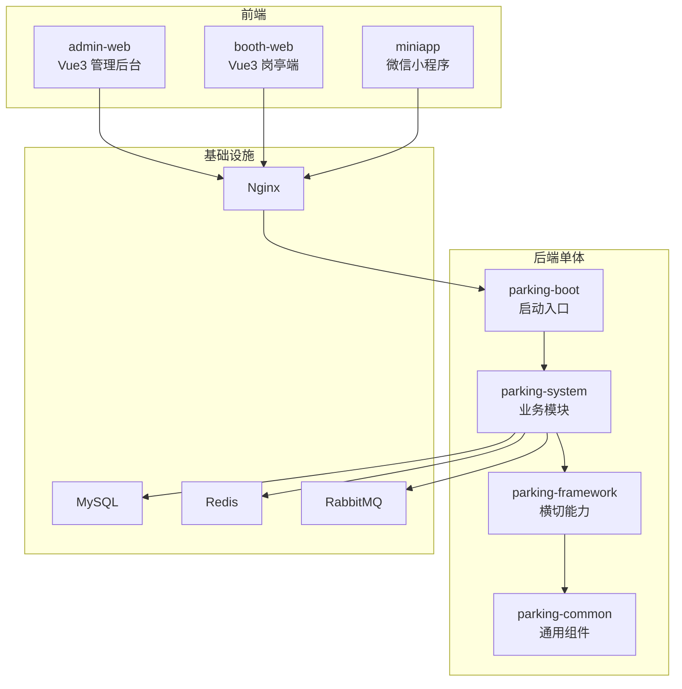
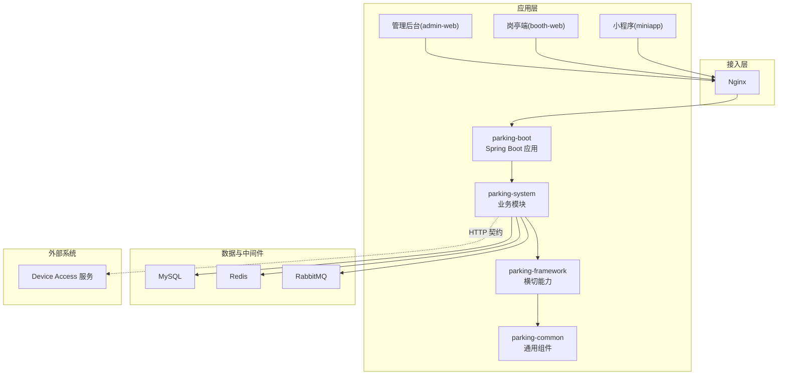
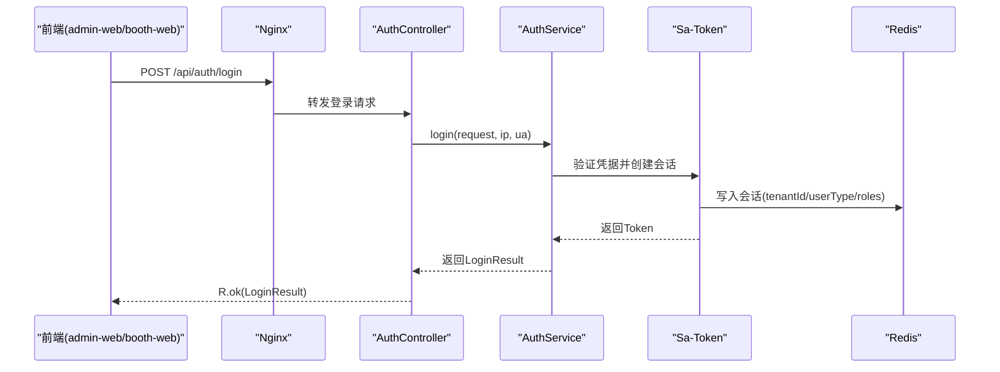
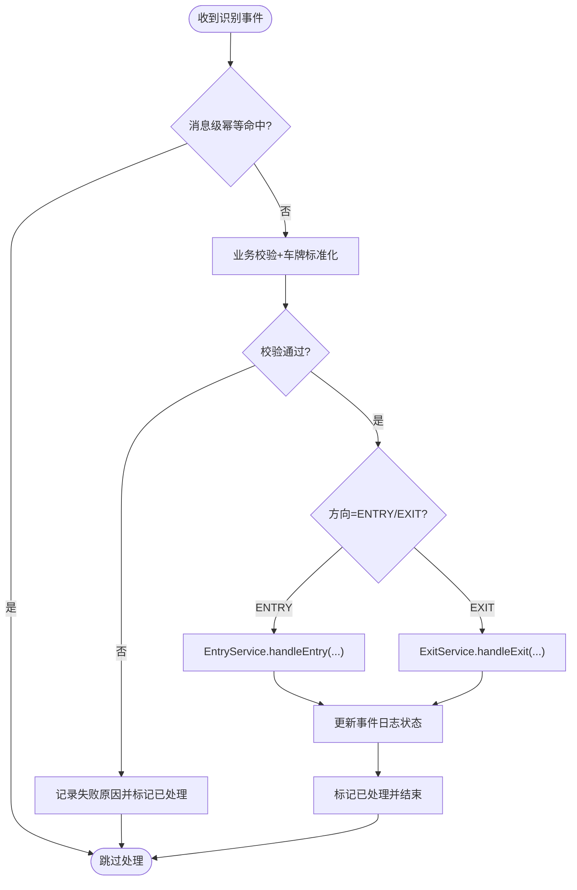
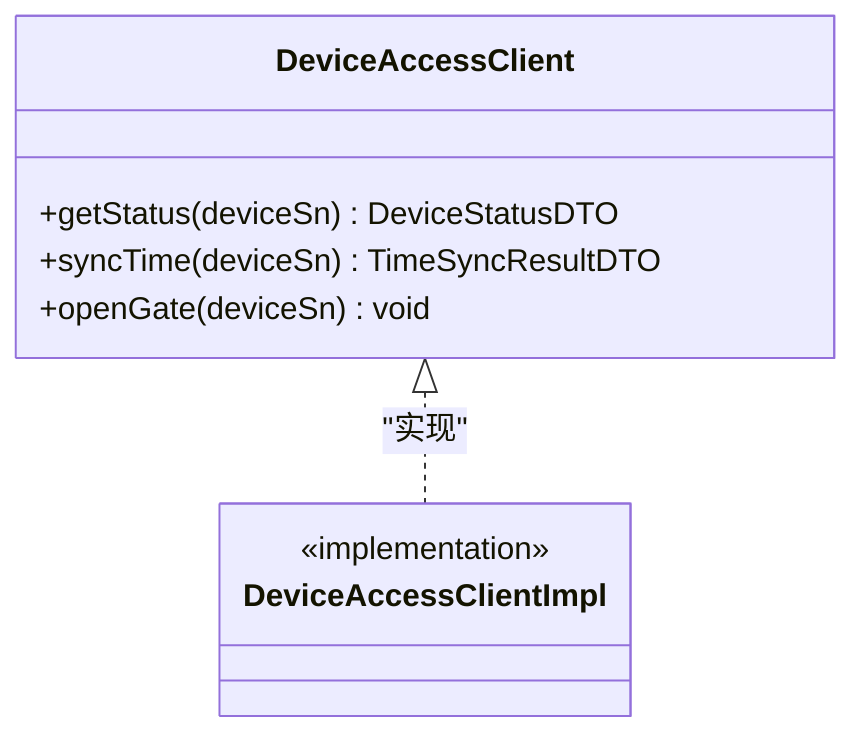
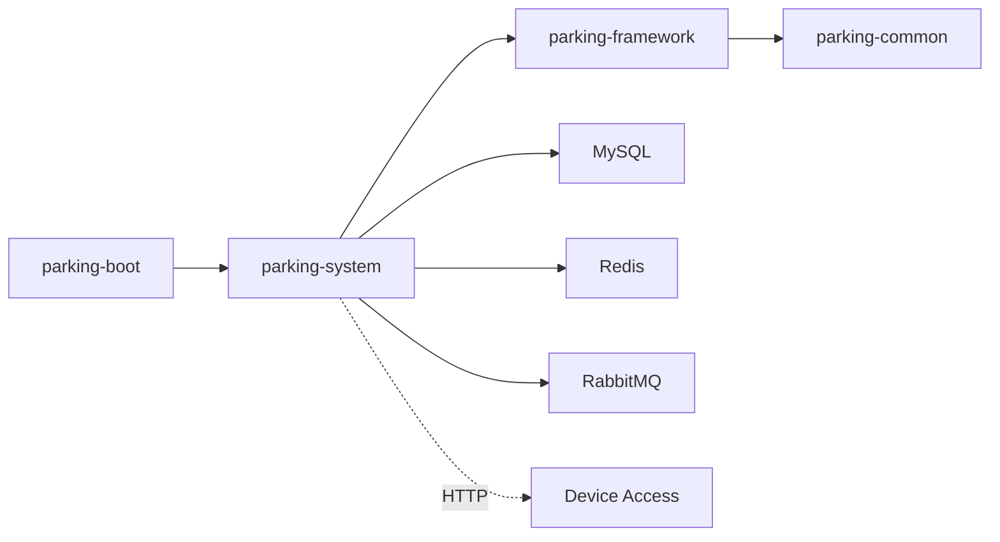

# 技术架构总览

<cite>
**本文引用的文件**   
- [README.md](file://README.md)
- [pom.xml](file://pom.xml)
- [ParkingApplication.java](file://parking-boot/src/main/java/com/jushan/boot/ParkingApplication.java)
- [技术架构.md](file://docs/项目概述/技术架构.md)
- [T02-架构模块与前端工程方案冻结.md](file://docs/归档/平台侧/T02-架构模块与前端工程方案冻结.md)
- [R.java](file://parking-common/src/main/java/com/jushan/common/R.java)
- [TenantContext.java](file://parking-framework/src/main/java/com/jushan/framework/auth/TenantContext.java)
- [AuthController.java](file://parking-system/src/main/java/com/jushan/system/controller/AuthController.java)
- [RabbitMqConfig.java](file://parking-framework/src/main/java/com/jushan/framework/mq/RabbitMqConfig.java)
- [RedisConfig.java](file://parking-framework/src/main/java/com/jushan/framework/redis/RedisConfig.java)
- [RecognitionEventConsumer.java](file://parking-system/src/main/java/com/jushan/system/event/RecognitionEventConsumer.java)
- [DeviceAccessClient.java](file://parking-system/src/main/java/com/jushan/system/client/DeviceAccessClient.java)
- [docker-compose.yml](file://docker-compose.yml)
- [admin-web/package.json](file://admin-web/package.json)
- [booth-web/package.json](file://booth-web/package.json)
</cite>

## 目录
1. [引言](#引言)
2. [项目结构](#项目结构)
3. [核心组件](#核心组件)
4. [架构总览](#架构总览)
5. [详细组件分析](#详细组件分析)
6. [依赖关系分析](#依赖关系分析)
7. [性能与可靠性考量](#性能与可靠性考量)
8. [故障排查指南](#故障排查指南)
9. [结论](#结论)
10. [附录：技术选型与约束](#附录技术选型与约束)

## 引言
本文件面向智慧停车 SaaS 平台，从整体架构、模块职责、前后端协作、外部系统集成、事件驱动与幂等设计、部署与运维等方面给出统一的技术架构总览。目标读者包括产品、研发、测试与运维人员，力求在保持技术深度的同时提供清晰的可视化图示与可操作建议。

## 项目结构
仓库采用模块化单体（Monolith with Modules）组织方式，后端为 Maven 多模块聚合工程，前端包含管理后台、岗亭端与微信小程序三个独立工程，基础设施通过 Docker Compose 编排本地开发环境。

- 后端模块
  - parking-boot：应用启动入口与装配
  - parking-system：业务逻辑（控制器、服务、实体、映射器、事件消费者、客户端等）
  - parking-framework：横切能力（认证授权、租户上下文、异常处理、TraceId、WebSocket、消息队列、缓存、分布式锁等）
  - parking-common：通用类型（统一响应、错误码、业务异常等）
- 前端工程
  - admin-web：Vue3 + TypeScript + Vite + Pinia + Ant Design Vue 4（运营后台）
  - booth-web：Vue3 + TypeScript + Vite + Pinia + Ant Design Vue 4（岗亭端，含 STOMP 实时通信）
  - miniapp：原生微信小程序（车主端）
- 基础设施
  - MySQL、Redis、RabbitMQ、Nginx（反向代理与静态资源）

图表来源
- [技术架构.md:54-78](file://docs/项目概述/技术架构.md#L54-L78)
- [pom.xml:46-52](file://pom.xml#L46-L52)

章节来源
- [技术架构.md:1-88](file://docs/项目概述/技术架构.md#L1-L88)
- [pom.xml:1-217](file://pom.xml#L1-L217)
- [T02-架构模块与前端工程方案冻结.md:78-133](file://docs/归档/平台侧/T02-架构模块与前端工程方案冻结.md#L78-L133)

## 核心组件
- parking-boot
  - 作用：Spring Boot 启动类、跨模块扫描、健康检查、配置加载
  - 关键点：扫描 com.jushan 包，覆盖 framework、common 与业务模块；MyBatis 条件化扫描以支持轻量测试
- parking-system
  - 作用：业务领域实现（认证、设备、停车场、计费、订单、用户、事件消费、对外客户端等）
  - 关键点：REST 控制器、服务层、数据访问层、事件消费者、外部系统客户端
- parking-framework
  - 作用：横切能力封装（Sa-Token、租户上下文、全局异常、TraceId、WebSocket、RabbitMQ、Redis、分布式锁等）
  - 关键点：安全与可观测性、异步与缓存基础设施、降级策略
- parking-common
  - 作用：纯工具与通用类型（统一响应 R<T>、错误码、业务异常等），不依赖 Spring
  - 关键点：前后端一致的数据契约基础

章节来源
- [ParkingApplication.java:1-30](file://parking-boot/src/main/java/com/jushan/boot/ParkingApplication.java#L1-L30)
- [R.java:1-162](file://parking-common/src/main/java/com/jushan/common/R.java#L1-L162)
- [技术架构.md:54-78](file://docs/项目概述/技术架构.md#L54-L78)

## 架构总览
整体采用“模块化单体 + 分层架构 + 事件驱动”的设计：
- 模块化单体：通过 Maven 多模块划分边界，避免循环依赖，便于逐步演进到微服务
- 分层架构：Web 层（Controller）→ 服务层（Service）→ 数据访问层（Mapper）→ 数据库/缓存/消息
- 事件驱动：识别事件经 RabbitMQ 异步分发，消费者进行校验、标准化与入场/出场流程编排
- 前后端分离：三端通过 Nginx 反向代理访问后端 REST API，岗亭端使用 WebSocket（STOMP）接收实时推送
- 外部集成：Device Access 作为独立服务，通过 HTTP 契约交互；当前 v0.2 未开放开闸与事件通道

图表来源
- [技术架构.md:54-78](file://docs/项目概述/技术架构.md#L54-L78)
- [docker-compose.yml:1-167](file://docker-compose.yml#L1-L167)

## 详细组件分析

### 认证与会话（Auth 流程）
- 登录接口由 AuthController 暴露，调用 AuthService 完成鉴权并返回 Token 与用户信息
- Sa-Token 负责会话管理，结合 Redis 持久化会话
- TenantContext 在请求链路中注入可信租户上下文，确保所有业务操作基于可信来源推导租户范围

图表来源
- [AuthController.java:1-100](file://parking-system/src/main/java/com/jushan/system/controller/AuthController.java#L1-L100)
- [RedisConfig.java:1-70](file://parking-framework/src/main/java/com/jushan/framework/redis/RedisConfig.java#L1-L70)

章节来源
- [AuthController.java:1-100](file://parking-system/src/main/java/com/jushan/system/controller/AuthController.java#L1-L100)
- [TenantContext.java:1-257](file://parking-framework/src/main/java/com/jushan/framework/auth/TenantContext.java#L1-L257)

### 识别事件处理（事件驱动）
- 生产者（T28）将识别事件投递至平台内部 Exchange，绑定到 recognition_event_queue
- 消费者 RecognitionEventConsumer 执行：
  - 消息级幂等（基于 messageId）
  - 业务校验（设备/停车场/车道存在性与状态、方向匹配、跨租户一致性）
  - 车牌标准化
  - 入场/出场流程委托 EntryService/ExitService
  - 更新 recognition_event_log 状态
  - 失败进入死信队列（DLX）

图表来源
- [RabbitMqConfig.java:1-176](file://parking-framework/src/main/java/com/jushan/framework/mq/RabbitMqConfig.java#L1-L176)
- [RecognitionEventConsumer.java:1-344](file://parking-system/src/main/java/com/jushan/system/event/RecognitionEventConsumer.java#L1-L344)

章节来源
- [RabbitMqConfig.java:1-176](file://parking-framework/src/main/java/com/jushan/framework/mq/RabbitMqConfig.java#L1-L176)
- [RecognitionEventConsumer.java:1-344](file://parking-system/src/main/java/com/jushan/system/event/RecognitionEventConsumer.java#L1-L344)

### 外部系统集成（Device Access）
- 通过 DeviceAccessClient 抽象对 Device Access 的 HTTP 调用，当前 v0.2 支持状态查询与校时
- 开闸接口在 v0.2 未实现，预留占位方法，待 v1.0 契约冻结后启用
- 平台与 Device Access 通过共享契约（OpenAPI/AsyncAPI/JSON Schema）协作，严格遵循联合决策

图表来源
- [DeviceAccessClient.java:1-65](file://parking-system/src/main/java/com/jushan/system/client/DeviceAccessClient.java#L1-L65)

章节来源
- [DeviceAccessClient.java:1-65](file://parking-system/src/main/java/com/jushan/system/client/DeviceAccessClient.java#L1-L65)
- [README.md:1-76](file://README.md#L1-L76)

### 前后端协作关系
- 管理后台（admin-web）：Vue3 + TS + Vite + Pinia + Ant Design Vue 4，负责车场、设备、计费规则、员工、审计等管理功能
- 岗亭端（booth-web）：Vue3 + TS + Vite + Pinia + Ant Design Vue 4，使用 STOMP 连接 WebSocket 获取实时监控与事件推送
- 小程序（miniapp）：原生微信小程序，提供车主端能力（首页、缴费、车牌绑定、个人中心等）
- 三者均通过 Nginx 反向代理访问后端 REST API，统一鉴权与限流

章节来源
- [admin-web/package.json:1-38](file://admin-web/package.json#L1-L38)
- [booth-web/package.json:1-35](file://booth-web/package.json#L1-L35)
- [技术架构.md:30-51](file://docs/项目概述/技术架构.md#L30-L51)

## 依赖关系分析
- 模块依赖方向：boot → system → framework → common，禁止跨层直接访问 Mapper/实体，禁止循环依赖
- 运行时依赖：MySQL（持久化）、Redis（会话/缓存/幂等/锁）、RabbitMQ（内部事件）、Nginx（反向代理）
- 外部依赖：Device Access（HTTP 契约），当前版本能力受限

图表来源
- [pom.xml:46-52](file://pom.xml#L46-L52)
- [技术架构.md:54-78](file://docs/项目概述/技术架构.md#L54-L78)

章节来源
- [pom.xml:1-217](file://pom.xml#L1-L217)
- [技术架构.md:54-78](file://docs/项目概述/技术架构.md#L54-L78)

## 性能与可靠性考量
- 幂等与重试
  - 消息级幂等：基于 messageId 的 Redis 幂等键（TTL 72h），防止重复投递
  - 业务级幂等：recognition_event_log.eventId 唯一约束，保证相同事件只处理一次
  - 死信队列：消费异常进入 DLX，保留原始 messageId，支持人工重放
- 并发与吞吐
  - RabbitMQ 监听容器默认并发 1~5，prefetch 10，可按负载调整
  - Redis 作为高吞吐缓存与锁介质，注意 Key 前缀隔离与过期策略
- 降级与健壮性
  - RabbitMQ 不可用时，RabbitTemplate 与 ListenerFactory 降级为空操作，不影响非 MQ 场景启动
  - Redis 不可用时，RedisConfig 自动跳过，避免阻塞启动
- 可观测性
  - TraceId 过滤器与响应体增强，贯穿请求链路
  - 全局异常处理器统一错误格式，配合 R<T> 统一响应结构

章节来源
- [RabbitMqConfig.java:1-176](file://parking-framework/src/main/java/com/jushan/framework/mq/RabbitMqConfig.java#L1-L176)
- [RedisConfig.java:1-70](file://parking-framework/src/main/java/com/jushan/framework/redis/RedisConfig.java#L1-L70)
- [R.java:1-162](file://parking-common/src/main/java/com/jushan/common/R.java#L1-L162)

## 故障排查指南
- 认证与会话问题
  - 检查 Sa-Token 会话是否写入 Redis，确认 tenantId/userType/roles 是否正确
  - 若出现“未登录或会话已过期”，检查 Token 有效期与跨域配置
- 事件处理失败
  - 查看 dead letter queue 中的消息，定位 messageId 与 failureReason
  - 校验设备/停车场/车道状态与方向匹配，关注跨租户一致性
- 外部系统调用异常
  - Device Access v0.2 未实现开闸，调用 openGate 会抛出不支持异常
  - 网络超时或协议不一致时，检查 OpenAPI 契约与签名机制（v1.0 规划）
- 基础设施可用性
  - 使用 docker compose ps/logs 检查 MySQL/Redis/RabbitMQ/Nginx 健康状态
  - 端口冲突时调整环境变量映射（如 3307/6378/15672/8088）

章节来源
- [docker-compose.yml:1-167](file://docker-compose.yml#L1-L167)
- [README.md:1-76](file://README.md#L1-L76)

## 结论
本架构以模块化单体为基础，结合分层与事件驱动，兼顾了可维护性与扩展性。通过统一的横切能力与通用组件，降低了业务复杂度；借助共享契约与外部系统集成点，为后续能力演进（如开闸、事件通道）预留空间。建议在后续迭代中持续完善事件生产端、提升监控告警与容量规划，并在必要时按模块拆分向微服务演进。

## 附录：技术选型与约束
- 后端技术栈
  - Java 21 LTS、Spring Boot 3.5.16、Maven 多模块
  - MyBatis-Plus 3.5.9、Flyway 10.22.0
  - Sa-Token 1.42.0（权限与会话）、RabbitMQ 4.x（内部事件）、Spring WebSocket（STOMP）
  - MySQL 8.4、Redis 7.x、Docker Compose
- 前端技术栈
  - admin-web/booth-web：Vue3 + TS + Vite + Pinia + Ant Design Vue 4
  - miniapp：原生微信小程序
- 架构约束
  - 禁止跨模块直接操作 Mapper/实体，禁止循环依赖
  - 租户上下文必须通过 TenantContext 获取，前端传入的 tenantId 不可信
  - 外部系统调用需通过 Client 抽象，不得自行拼接 URL
  - 事件处理需满足消息级与业务级双重幂等

章节来源
- [技术架构.md:1-88](file://docs/项目概述/技术架构.md#L1-L88)
- [T02-架构模块与前端工程方案冻结.md:78-133](file://docs/归档/平台侧/T02-架构模块与前端工程方案冻结.md#L78-L133)
- [pom.xml:1-217](file://pom.xml#L1-L217)
- [admin-web/package.json:1-38](file://admin-web/package.json#L1-L38)
- [booth-web/package.json:1-35](file://booth-web/package.json#L1-L35)