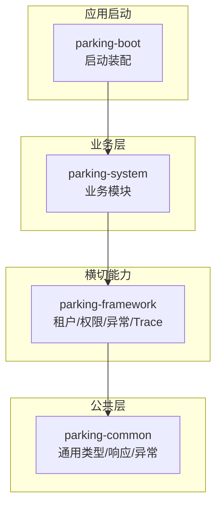
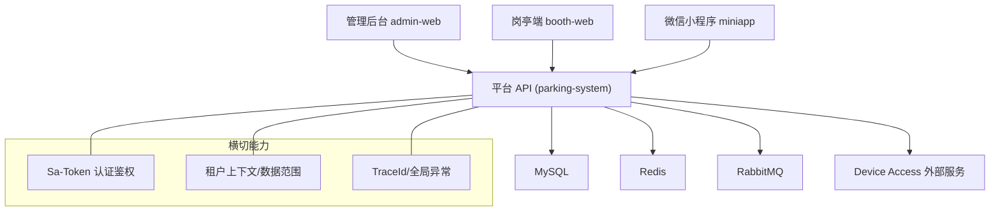
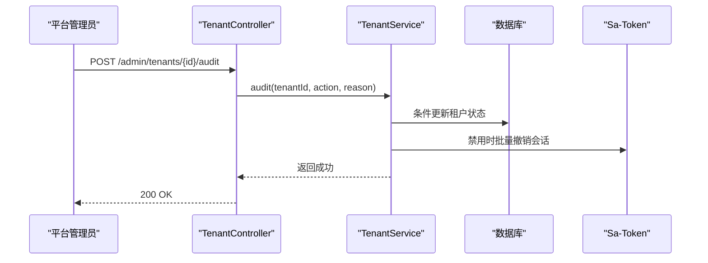
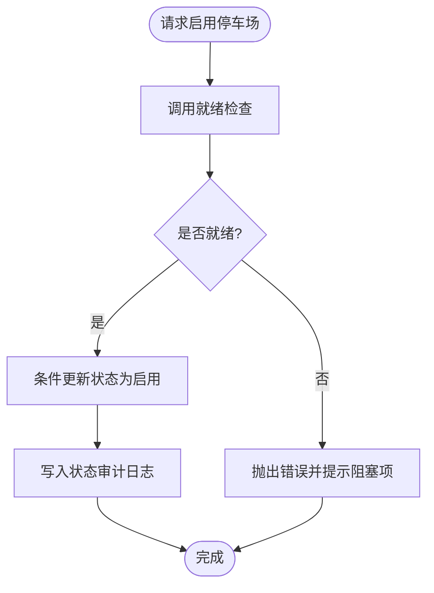
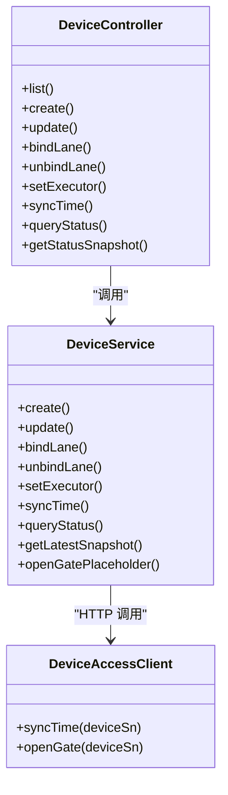
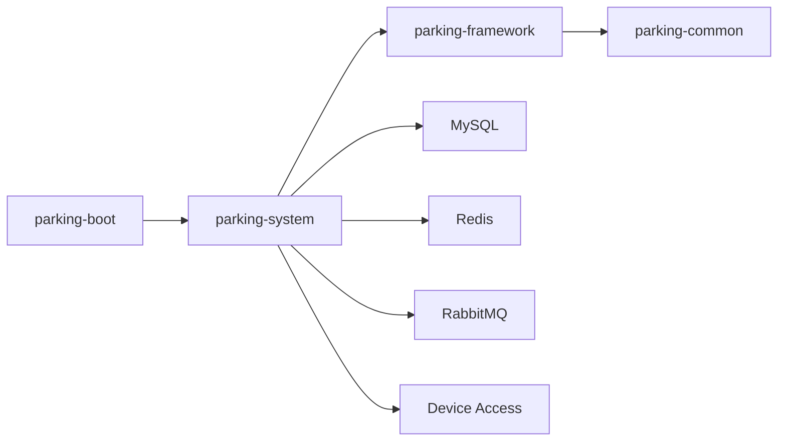

# 项目介绍与定位

<cite>
**本文引用的文件**   
- [README.md](file://README.md)
- [技术架构.md](file://docs/项目概述/技术架构.md)
- [ParkingApplication.java](file://parking-boot/src/main/java/com/jushan/boot/ParkingApplication.java)
- [application.yml](file://parking-boot/src/main/resources/application.yml)
- [TenantController.java](file://parking-system/src/main/java/com/jushan/system/controller/TenantController.java)
- [TenantService.java](file://parking-system/src/main/java/com/jushan/system/service/TenantService.java)
- [ParkingLotController.java](file://parking-system/src/main/java/com/jushan/system/controller/ParkingLotController.java)
- [ParkingLotService.java](file://parking-system/src/main/java/com/jushan/system/service/ParkingLotService.java)
- [DeviceController.java](file://parking-system/src/main/java/com/jushan/system/controller/DeviceController.java)
- [DeviceService.java](file://parking-system/src/main/java/com/jushan/system/service/DeviceService.java)
</cite>

## 目录
1. [引言](#引言)
2. [项目结构](#项目结构)
3. [核心组件](#核心组件)
4. [架构总览](#架构总览)
5. [详细组件分析](#详细组件分析)
6. [依赖关系分析](#依赖关系分析)
7. [性能考量](#性能考量)
8. [故障排查指南](#故障排查指南)
9. [结论](#结论)
10. [附录](#附录)

## 引言
本仓库为“智慧停车 SaaS 平台”，定位为停车业务的核心业务平台，负责多租户管理、停车场配置、设备台账、停车计费、支付、订单管理、月卡、优惠券等核心能力，并提供管理后台、岗亭端和微信小程序。平台与 Device Access（外部设备接入服务）通过共享契约协作：平台侧拥有业务数据所有权与策略编排权，Device Access 负责设备通信、协议适配与事件转换。

当前阶段处于 M0（基线与冻结）→ M1+（工程骨架）。基础框架已搭建（多模块 Maven、Spring Boot 3、MyBatis-Plus、Sa-Token），业务模块逐步实现。现阶段无法形成真实停车主链路，因为 Device Access v0.2 尚未提供开闸、车牌识别事件与 RabbitMQ 能力。

与传统停车系统相比，本平台的优势在于：
- SaaS 模式与多租户隔离：按租户维度进行资源配额、权限与数据隔离。
- 云端管理与可观测性：统一配置、审计日志、就绪检查与健康探针。
- 清晰的职责边界：平台侧专注业务编排与数据治理，设备侧专注通信与协议适配。

目标用户群体与典型场景：
- 超级管理员（平台运营）：租户注册审核、全局监控、平台级配置。
- 租户管理员（集团/公司级）：创建与管理多个停车场、收费规则、员工授权。
- 车场管理员（单场级）：现场监控、通道与设备管理、异常处理。
- 岗亭操作员：实时查看车道状态、人工放行、设备校时与状态刷新。
- 车主用户（小程序）：绑定车辆、查询余位、在线缴费、开具发票。

功能边界说明（平台 vs Device Access）：
- 平台侧：租户与权限、停车场与通道、设备台账与绑定、计费规则与订单、支付与发票、月卡与优惠券、审计与就绪检查。
- Device Access 侧：设备通信、协议适配、命令下发与结果上报、设备事件（如车牌识别、状态变更）的采集与转发。
- 数据所有权：平台侧持久化并拥有所有业务数据；设备侧仅持有运行时通信与临时状态。

## 项目结构
本项目采用模块化单体架构，后端以 Spring Boot 3 为核心，前端包含管理后台、岗亭端与微信小程序。模块分层清晰，禁止跨层直接访问 Mapper/实体，避免循环依赖。

图表来源
- [技术架构.md:54-78](file://docs/项目概述/技术架构.md#L54-L78)

章节来源
- [技术架构.md:1-88](file://docs/项目概述/技术架构.md#L1-L88)

## 核心组件
- 多租户与权限
  - 控制器暴露租户管理接口，服务层实现注册、审核、启停与会话撤销，确保状态流转合法与审计可追溯。
- 停车场管理
  - 提供 CRUD、启用/停用、容量修正与就绪检查；启用前强制校验关键项，防止未就绪上线。
- 设备台账与联动
  - 设备 CRUD、厂商/型号、车道绑定、执行相机设置、状态快照与校时；与 Device Access 通过客户端交互。
- 启动入口与配置
  - 应用启动扫描 com.jushan 包；配置文件定义数据库、Redis、Sa-Token、Actuator 与 Device Access 客户端参数。

章节来源
- [TenantController.java:1-81](file://parking-system/src/main/java/com/jushan/system/controller/TenantController.java#L1-L81)
- [TenantService.java:1-441](file://parking-system/src/main/java/com/jushan/system/service/TenantService.java#L1-L441)
- [ParkingLotController.java:1-166](file://parking-system/src/main/java/com/jushan/system/controller/ParkingLotController.java#L1-L166)
- [ParkingLotService.java:1-589](file://parking-system/src/main/java/com/jushan/system/service/ParkingLotService.java#L1-L589)
- [DeviceController.java:1-315](file://parking-system/src/main/java/com/jushan/system/controller/DeviceController.java#L1-L315)
- [DeviceService.java:1-800](file://parking-system/src/main/java/com/jushan/system/service/DeviceService.java#L1-L800)
- [ParkingApplication.java:1-30](file://parking-boot/src/main/java/com/jushan/boot/ParkingApplication.java#L1-L30)
- [application.yml:1-108](file://parking-boot/src/main/resources/application.yml#L1-L108)

## 架构总览
平台作为业务编排中心，对外提供管理端与小程序 API，对内通过设备客户端与 Device Access 交互。安全与横切能力由 framework 层统一提供。

图表来源
- [技术架构.md:54-78](file://docs/项目概述/技术架构.md#L54-L78)
- [application.yml:58-108](file://parking-boot/src/main/resources/application.yml#L58-L108)

## 详细组件分析

### 多租户管理（注册、审核、启停）
- 角色与权限
  - 超级管理员：平台运营，负责租户注册审核与启停。
  - 租户管理员：管理本租户下的停车场与员工。
- 流程要点
  - 注册：校验企业名称与手机号唯一性，创建待审核管理员账号与租户记录。
  - 审核：支持批准/拒绝/启用/禁用，条件更新防并发，写入审计日志。
  - 会话控制：禁用租户后批量撤销该租户下所有用户会话，确保即时生效。

图表来源
- [TenantController.java:74-80](file://parking-system/src/main/java/com/jushan/system/controller/TenantController.java#L74-L80)
- [TenantService.java:171-225](file://parking-system/src/main/java/com/jushan/system/service/TenantService.java#L171-L225)

章节来源
- [TenantController.java:1-81](file://parking-system/src/main/java/com/jushan/system/controller/TenantController.java#L1-L81)
- [TenantService.java:1-441](file://parking-system/src/main/java/com/jushan/system/service/TenantService.java#L1-L441)

### 停车场管理（CRUD、状态、容量、就绪检查）
- 能力概览
  - 列表/详情：基于租户与停车场级数据范围过滤。
  - 启用/停用：启用前调用就绪检查，阻塞项阻止上线；停用时需填写原因并可配置保留范围。
  - 容量修正：支持总车位与剩余车位的人工修正，记录审计日志。
- 就绪检查
  - 在启用前检查车道配置、设备绑定、执行相机、容量等关键项，返回 BLOCKER/WARNING 两级结果。

图表来源
- [ParkingLotController.java:157-165](file://parking-system/src/main/java/com/jushan/system/controller/ParkingLotController.java#L157-L165)
- [ParkingLotService.java:312-411](file://parking-system/src/main/java/com/jushan/system/service/ParkingLotService.java#L312-L411)

章节来源
- [ParkingLotController.java:1-166](file://parking-system/src/main/java/com/jushan/system/controller/ParkingLotController.java#L1-L166)
- [ParkingLotService.java:1-589](file://parking-system/src/main/java/com/jushan/system/service/ParkingLotService.java#L1-L589)

### 设备台账与联动（CRUD、绑定、状态、校时）
- 能力概览
  - 设备 CRUD：校验停车场归属、厂商/型号有效性、编码与序列号唯一性。
  - 车道绑定：同车道同类型设备唯一；GATE 需指定执行相机。
  - 状态快照：主动查询会调用 Device Access 并持久化快照；列表使用快照避免频繁网络开销。
  - 设备校时：调用 Device Access 发送校时命令，记录审计日志，失败标记 UNCERTAIN/FAILED。
- 与 Device Access 的职责划分
  - 平台侧：设备台账、绑定关系、策略与审计；不信任前端传入 device_sn。
  - Device Access 侧：设备通信、命令下发与结果上报、事件采集。

图表来源
- [DeviceController.java:1-315](file://parking-system/src/main/java/com/jushan/system/controller/DeviceController.java#L1-L315)
- [DeviceService.java:1-800](file://parking-system/src/main/java/com/jushan/system/service/DeviceService.java#L1-L800)

章节来源
- [DeviceController.java:1-315](file://parking-system/src/main/java/com/jushan/system/controller/DeviceController.java#L1-L315)
- [DeviceService.java:1-800](file://parking-system/src/main/java/com/jushan/system/service/DeviceService.java#L1-L800)

### 应用启动与配置
- 启动入口
  - 应用扫描 com.jushan 包，覆盖框架、公共与业务模块。
- 关键配置
  - Sa-Token：从 Header 读取 Token，关闭 Cookie/Body 来源。
  - Actuator：健康检查与探针。
  - Device Access 客户端：基础 URL 与超时配置。

章节来源
- [ParkingApplication.java:1-30](file://parking-boot/src/main/java/com/jushan/boot/ParkingApplication.java#L1-L30)
- [application.yml:1-108](file://parking-boot/src/main/resources/application.yml#L1-L108)

## 依赖关系分析
- 模块依赖
  - parking-boot 聚合启动，依赖 parking-system。
  - parking-system 依赖 parking-framework 与 parking-common。
  - parking-framework 依赖 parking-common。
- 外部依赖
  - MySQL、Redis、RabbitMQ、Nginx、Docker Compose。
  - Device Access 外部服务（HTTP 客户端）。

图表来源
- [技术架构.md:54-78](file://docs/项目概述/技术架构.md#L54-L78)

章节来源
- [技术架构.md:1-88](file://docs/项目概述/技术架构.md#L1-L88)

## 性能考量
- 设备状态查询
  - 主动查询会触发 HTTP 调用并持久化快照，建议仅在用户主动刷新时使用；列表展示应读取最近快照，避免频繁网络开销。
- 缓存与限流
  - Redis 用于会话缓存、热点数据与分布式锁；批量状态查询内置信号量限流，保护下游设备服务。
- 幂等与重试
  - 当前 Device Access v0.2 无 commandId 幂等，平台侧不包含自动重试逻辑；UNCERTAIN 状态需人工确认。

[本节为通用指导，无需源码引用]

## 故障排查指南
- 租户禁用后仍登录
  - 检查是否触发了批量会话撤销逻辑；确认 Sa-Token 配置与缓存清理。
- 停车场启用失败
  - 查看就绪检查结果中的 BLOCKER 项，逐项修复后再启用。
- 设备状态查询慢或失败
  - 优先使用快照接口；若必须主动查询，关注网络超时与 Device Access 可用性。
- 设备校时不确定
  - 审计日志中结果为 UNCERTAIN 时，需人工复核设备时间并必要时再次操作。

章节来源
- [TenantService.java:355-374](file://parking-system/src/main/java/com/jushan/system/service/TenantService.java#L355-L374)
- [ParkingLotService.java:360-373](file://parking-system/src/main/java/com/jushan/system/service/ParkingLotService.java#L360-L373)
- [DeviceService.java:575-615](file://parking-system/src/main/java/com/jushan/system/service/DeviceService.java#L575-L615)

## 结论
本平台以 SaaS 多租户为核心，围绕停车场与设备台账构建业务编排能力，并通过共享契约与 Device Access 解耦设备通信。当前处于工程骨架阶段，具备完善的权限、审计与就绪检查机制，后续将逐步补齐计费、支付、订单、月卡与优惠券等核心业务，并在 Device Access v1.0 契约冻结后打通真实主链路。

[本节为总结性内容，无需源码引用]

## 附录
- 文档优先级与联合决策
  - 参考 README 中的文档优先级与联合决策状态，明确当前事实与目标契约。
- 技术栈与版本原则
  - 后端以 pom.xml 为准，前端以各工程 package.json 为准，数据库迁移以 Flyway 脚本为准，共享契约以 contracts 目录为准。

章节来源
- [README.md:1-77](file://README.md#L1-L77)
- [技术架构.md:82-88](file://docs/项目概述/技术架构.md#L82-L88)