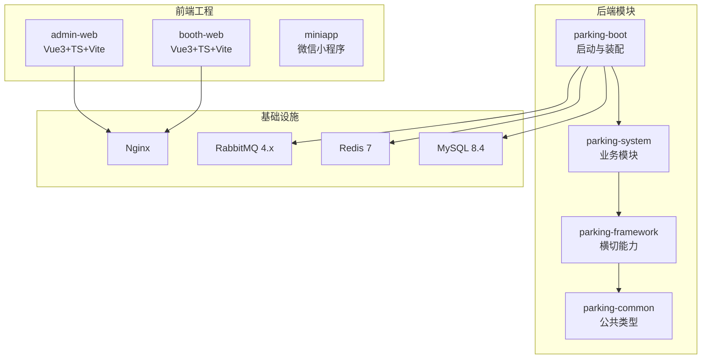
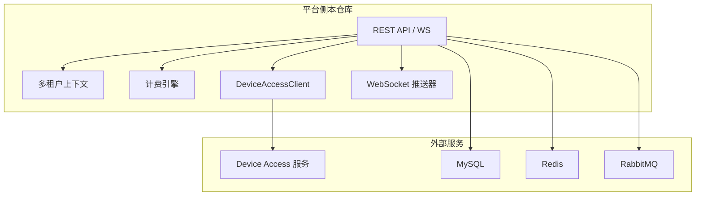
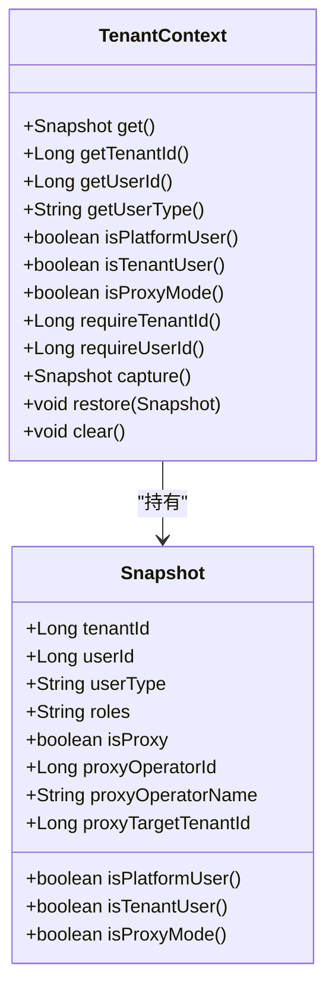
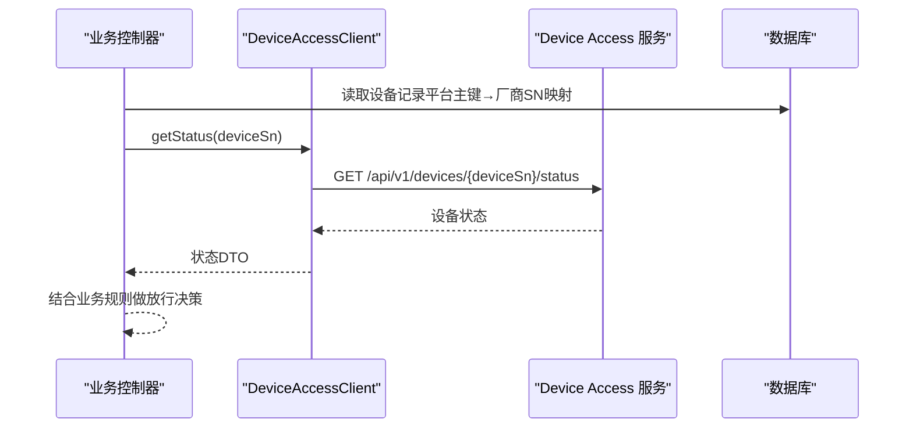
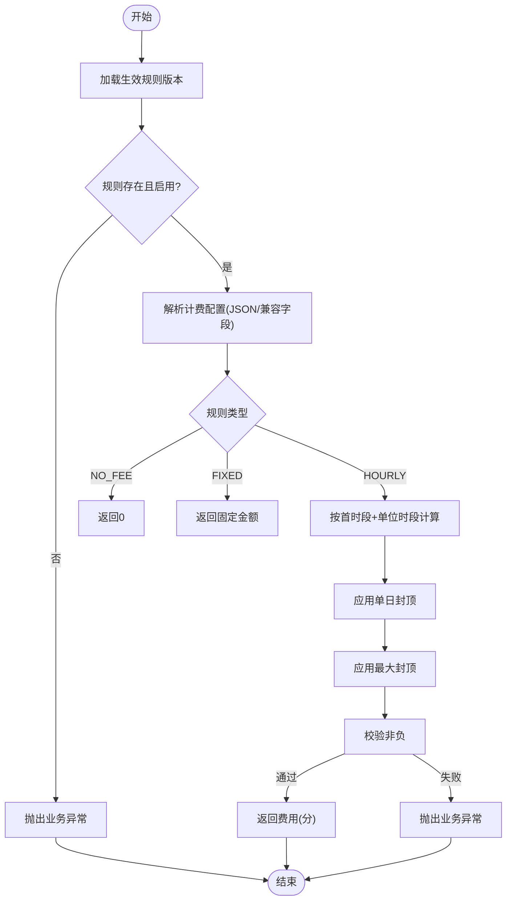
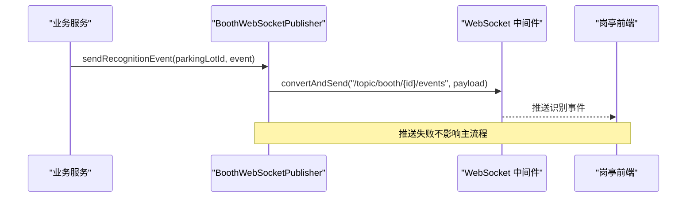
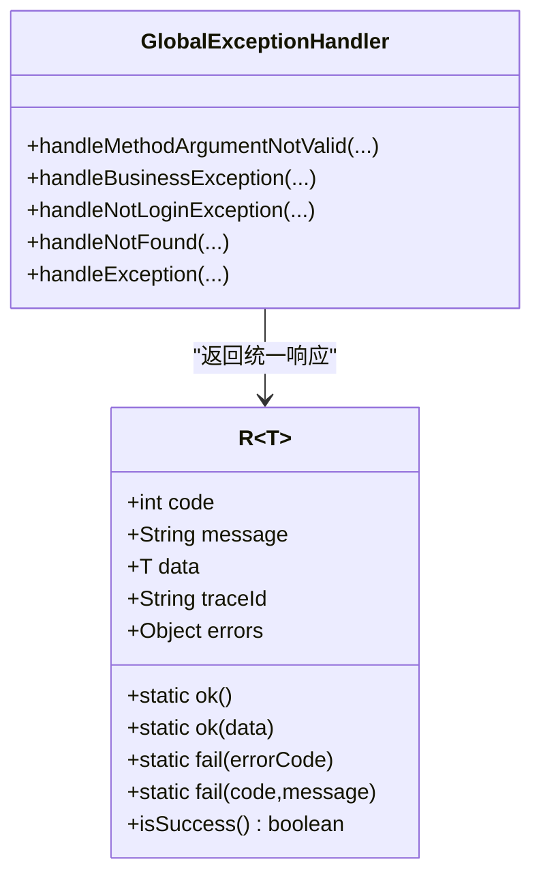
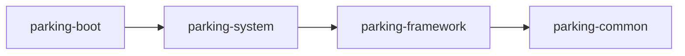

# 项目概述

<cite>
**本文引用的文件列表**
- [README.md](file://README.md)
- [pom.xml](file://pom.xml)
- [ParkingApplication.java](file://parking-boot/src/main/java/com/jushan/boot/ParkingApplication.java)
- [技术架构.md](file://docs/项目概述/技术架构.md)
- [R.java](file://parking-common/src/main/java/com/jushan/common/R.java)
- [TenantContext.java](file://parking-framework/src/main/java/com/jushan/framework/auth/TenantContext.java)
- [DeviceAccessClient.java](file://parking-system/src/main/java/com/jushan/system/client/DeviceAccessClient.java)
- [BillingEngine.java](file://parking-system/src/main/java/com/jushan/system/service/BillingEngine.java)
- [BoothWebSocketPublisher.java](file://parking-system/src/main/java/com/jushan/system/ws/BoothWebSocketPublisher.java)
- [GlobalExceptionHandler.java](file://parking-framework/src/main/java/com/jushan/framework/web/GlobalExceptionHandler.java)
- [docker-compose.yml](file://docker-compose.yml)
- [部署说明.md](file://docs/部署运维/部署说明.md)
- [配置说明.md](file://docs/部署运维/配置说明.md)
- [02-职责边界与数据所有权.md](file://docs/contracts/platform-device-access/02-职责边界与数据所有权.md)
</cite>

## 目录
1. [引言](#引言)
2. [项目结构](#项目结构)
3. [核心组件](#核心组件)
4. [架构总览](#架构总览)
5. [详细组件分析](#详细组件分析)
6. [依赖关系分析](#依赖关系分析)
7. [性能考量](#性能考量)
8. [故障排查指南](#故障排查指南)
9. [结论](#结论)
10. [附录：快速开始](#附录快速开始)

## 引言
本项目为智慧停车 SaaS 平台，定位为停车业务的核心业务平台，负责多租户管理、停车场与车道配置、设备台账、计费、订单与支付、月卡与优惠券等能力，并提供管理后台、岗亭端和微信小程序。外部设备通信由独立的 Device Access 服务负责，双方通过共享契约协作。当前阶段处于工程骨架搭建期，基础框架已就绪，业务模块逐步实现。

**章节来源**
- [README.md:1-77](file://README.md#L1-L77)

## 项目结构
仓库采用模块化单体架构，后端基于 Spring Boot 3 + Java 21，使用 Maven 多模块组织。模块职责如下：
- parking-common：统一响应体、错误码、通用异常等公共类型
- parking-framework：横切能力（多租户上下文、权限、全局异常、TraceId、Redis、MQ、WebSocket 等）
- parking-system：业务领域（租户、车场、车道、设备、计费引擎、事件处理、监控推送、对外客户端等）
- parking-boot：应用启动入口与装配，扫描 com.jushan 包以加载上述模块

前端包含 admin-web（总后台）、booth-web（岗亭端）与 miniapp（微信小程序）。基础设施通过 Docker Compose 编排 MySQL、Redis、RabbitMQ、Nginx。

**图表来源**
- [技术架构.md:54-78](file://docs/项目概述/技术架构.md#L54-L78)
- [pom.xml:46-52](file://pom.xml#L46-L52)

**章节来源**
- [技术架构.md:1-88](file://docs/项目概述/技术架构.md#L1-L88)
- [pom.xml:1-217](file://pom.xml#L1-L217)

## 核心组件
- 统一响应与错误码：所有 Controller 返回统一响应结构，便于前后端一致解析；全局异常处理器将参数校验、业务异常、认证授权异常等统一转换为标准响应。
- 多租户上下文：在请求入口处从会话推导并注入可信的租户上下文，业务代码必须通过上下文获取租户 ID，禁止信任前端传入的 tenantId。
- 设备接入客户端：封装对 Device Access 的 HTTP 调用，业务层不得自行拼接 URL；当前 v0.2 支持状态查询与校时，开闸接口预留待契约冻结后启用。
- 计费引擎：根据生效收费规则版本计算费用，支持免费、固定金额、分时段按单位时长计费，含单日封顶与最大封顶，严格整数分计算与安全校验。
- 实时推送：基于 WebSocket（STOMP）向岗亭端推送识别事件、车位变化、设备状态与异常提醒，推送失败不阻断主业务。
- 全局异常处理：统一映射协议级错误码到 HTTP 状态码，避免泄露内部堆栈。

**章节来源**
- [R.java:1-162](file://parking-common/src/main/java/com/jushan/common/R.java#L1-L162)
- [GlobalExceptionHandler.java:1-240](file://parking-framework/src/main/java/com/jushan/framework/web/GlobalExceptionHandler.java#L1-L240)
- [TenantContext.java:1-257](file://parking-framework/src/main/java/com/jushan/framework/auth/TenantContext.java#L1-L257)
- [DeviceAccessClient.java:1-65](file://parking-system/src/main/java/com/jushan/system/client/DeviceAccessClient.java#L1-L65)
- [BillingEngine.java:1-386](file://parking-system/src/main/java/com/jushan/system/service/BillingEngine.java#L1-L386)
- [BoothWebSocketPublisher.java:1-177](file://parking-system/src/main/java/com/jushan/system/ws/BoothWebSocketPublisher.java#L1-L177)

## 架构总览
系统采用“模块化单体”设计，后端模块分层清晰，外部设备通信通过 Device Access 服务解耦。平台侧专注业务决策（计费、放行判断、订单支付），Device Access 专注设备通信与协议适配。

**图表来源**
- [技术架构.md:54-78](file://docs/项目概述/技术架构.md#L54-L78)
- [DeviceAccessClient.java:1-65](file://parking-system/src/main/java/com/jushan/system/client/DeviceAccessClient.java#L1-L65)
- [BillingEngine.java:1-386](file://parking-system/src/main/java/com/jushan/system/service/BillingEngine.java#L1-L386)
- [BoothWebSocketPublisher.java:1-177](file://parking-system/src/main/java/com/jushan/system/ws/BoothWebSocketPublisher.java#L1-L177)

## 详细组件分析

### 多租户与权限上下文
- 通过过滤器在请求进入时从 Sa-Token 会话推导租户 ID、用户 ID、用户类型与角色，写入线程本地上下文。
- 提供 requireTenantId 等方法强制推导，确保 fail-close；平台用户无租户范围，代理模式限定目标租户。
- 支持快照捕获与恢复，用于异步任务或消息消费场景。

**图表来源**
- [TenantContext.java:1-257](file://parking-framework/src/main/java/com/jushan/framework/auth/TenantContext.java#L1-L257)

**章节来源**
- [TenantContext.java:1-257](file://parking-framework/src/main/java/com/jushan/framework/auth/TenantContext.java#L1-L257)

### 设备接入客户端（与 Device Access 协作）
- 业务层通过 DeviceAccessClient 调用 Device Access 的 HTTP 接口，禁止自行拼接 URL。
- 当前 v0.2 实现状态查询与校时；开闸接口预留，v1.0 契约冻结后启用。
- 平台与 Device Access 的职责边界明确：平台负责业务决策与计费，Device Access 负责设备通信与协议转换。

**图表来源**
- [DeviceAccessClient.java:1-65](file://parking-system/src/main/java/com/jushan/system/client/DeviceAccessClient.java#L1-L65)
- [02-职责边界与数据所有权.md:57-109](file://docs/contracts/platform-device-access/02-职责边界与数据所有权.md#L57-L109)

**章节来源**
- [DeviceAccessClient.java:1-65](file://parking-system/src/main/java/com/jushan/system/client/DeviceAccessClient.java#L1-L65)
- [02-职责边界与数据所有权.md:57-109](file://docs/contracts/platform-device-access/02-职责边界与数据所有权.md#L57-L109)

### 计费引擎（智能计费）
- 根据停车场当前生效的收费规则版本计算费用，支持 NO_FEE、FIXED、HOURLY 三种类型。
- HOURLY 支持首时段、后续单位时段、分时段计费、单日封顶与最大封顶，金额以整数分计算，负值抛异常。
- 解析 JSON 配置兼容旧列字段，时间冲突与非法格式均失败关闭。

**图表来源**
- [BillingEngine.java:1-386](file://parking-system/src/main/java/com/jushan/system/service/BillingEngine.java#L1-L386)

**章节来源**
- [BillingEngine.java:1-386](file://parking-system/src/main/java/com/jushan/system/service/BillingEngine.java#L1-L386)

### 实时监控（WebSocket 推送）
- 基于 STOMP 向岗亭端推送识别事件、车位变化、设备状态与异常提醒。
- 推送失败仅记录告警日志，不阻断主业务事务；topic 路径按停车场维度隔离。

**图表来源**
- [BoothWebSocketPublisher.java:1-177](file://parking-system/src/main/java/com/jushan/system/ws/BoothWebSocketPublisher.java#L1-L177)

**章节来源**
- [BoothWebSocketPublisher.java:1-177](file://parking-system/src/main/java/com/jushan/system/ws/BoothWebSocketPublisher.java#L1-L177)

### 全局异常处理与统一响应
- 统一响应体 R 包含 code、message、data、traceId、errors 等字段，保证前后端一致性。
- 全局异常处理器将参数校验、业务异常、认证授权异常、Spring 内置异常统一转换为 R，并按协议语义映射 HTTP 状态码，不泄露内部堆栈。

**图表来源**
- [R.java:1-162](file://parking-common/src/main/java/com/jushan/common/R.java#L1-L162)
- [GlobalExceptionHandler.java:1-240](file://parking-framework/src/main/java/com/jushan/framework/web/GlobalExceptionHandler.java#L1-L240)

**章节来源**
- [R.java:1-162](file://parking-common/src/main/java/com/jushan/common/R.java#L1-L162)
- [GlobalExceptionHandler.java:1-240](file://parking-framework/src/main/java/com/jushan/framework/web/GlobalExceptionHandler.java#L1-L240)

## 依赖关系分析
- 模块依赖方向：parking-boot → parking-system → parking-framework → parking-common，禁止跨模块直接操作 Mapper/实体，禁止循环依赖。
- 外部依赖：Spring Boot 3.5.16、MyBatis-Plus 3.5.9、Sa-Token 1.42.0、Flyway 10.22.0、Hutool、MapStruct、Testcontainers、RabbitMQ、Redis、MySQL。

**图表来源**
- [技术架构.md:54-78](file://docs/项目概述/技术架构.md#L54-L78)
- [pom.xml:46-52](file://pom.xml#L46-L52)

**章节来源**
- [技术架构.md:1-88](file://docs/项目概述/技术架构.md#L1-L88)
- [pom.xml:1-217](file://pom.xml#L1-L217)

## 性能考量
- 计费引擎采用整数分计算与分段计费策略，避免浮点误差；分时段计费按时间边界截断，减少重复计算。
- WebSocket 推送失败不阻塞主流程，保障高可用；按停车场维度广播，降低无关连接负载。
- 多租户上下文使用 ThreadLocal 存储，轻量高效；异步场景需显式捕获与恢复上下文。
- 外部设备调用通过客户端封装，建议后续增加超时、重试与熔断策略以提升鲁棒性。

[本节为通用指导，无需具体文件引用]

## 故障排查指南
- 参数校验失败：查看全局异常处理器输出的 errors 数组，定位字段与提示信息。
- 业务异常：检查业务错误码与消息，确认计费配置、规则启用状态与时间有效性。
- 未登录/无权限：确认 Sa-Token 会话与权限配置，检查租户上下文是否初始化。
- 设备状态查询失败：核对 Device Access 地址可达性与设备 SN 映射是否正确。
- WebSocket 推送失败：关注推送器日志，确认 topic 路径与连接状态。

**章节来源**
- [GlobalExceptionHandler.java:1-240](file://parking-framework/src/main/java/com/jushan/framework/web/GlobalExceptionHandler.java#L1-L240)
- [BoothWebSocketPublisher.java:1-177](file://parking-system/src/main/java/com/jushan/system/ws/BoothWebSocketPublisher.java#L1-L177)
- [DeviceAccessClient.java:1-65](file://parking-system/src/main/java/com/jushan/system/client/DeviceAccessClient.java#L1-L65)

## 结论
本项目以模块化单体架构为基础，围绕多租户、设备集成、智能计费与实时监控构建停车 SaaS 核心能力。通过清晰的模块边界与共享契约，平台侧专注于业务决策与数据治理，Device Access 专注设备通信与协议适配。当前阶段已完成工程骨架与关键组件，后续将围绕契约冻结与真机验证推进完整链路落地。

[本节为总结性内容，无需具体文件引用]

## 附录：快速开始
- 环境要求
  - Java 21 LTS
  - Docker 与 docker compose
  - Node.js（前端开发）
- 依赖安装与本地启动
  - 复制并编辑环境变量：cp .env.example .env
  - 启动基础设施：docker compose up -d
  - 查看服务状态与日志：docker compose ps / docker compose logs -f
  - 停止与清理：docker compose down / docker compose down -v
  - 运行后端：mvn clean compile && mvn spring-boot:run -pl parking-boot
  - 运行前端：cd admin-web && pnpm install && pnpm dev（booth-web 同理）
- 端口与服务
  - MySQL 宿主机端口默认 3307，Redis 6378，RabbitMQ AMQP 5672、Management 15672，Nginx 8088
- 敏感配置红线
  - 生产环境通过环境变量注入敏感信息，禁止提交至仓库

**章节来源**
- [部署说明.md:1-111](file://docs/部署运维/部署说明.md#L1-L111)
- [配置说明.md:151-182](file://docs/部署运维/配置说明.md#L151-L182)
- [docker-compose.yml:1-167](file://docker-compose.yml#L1-L167)
- [ParkingApplication.java:1-30](file://parking-boot/src/main/java/com/jushan/boot/ParkingApplication.java#L1-L30)