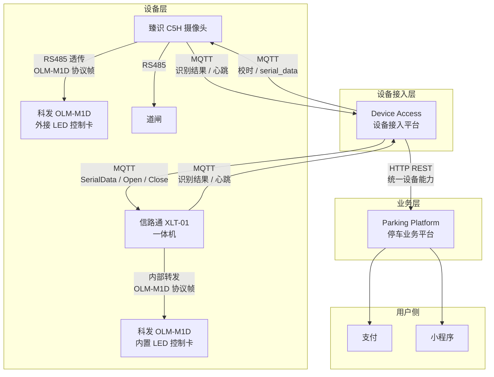
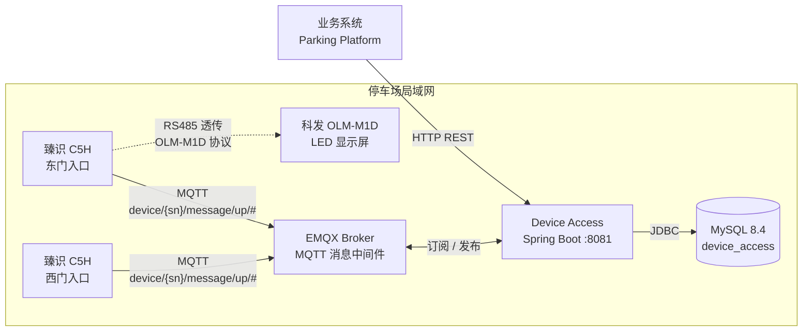
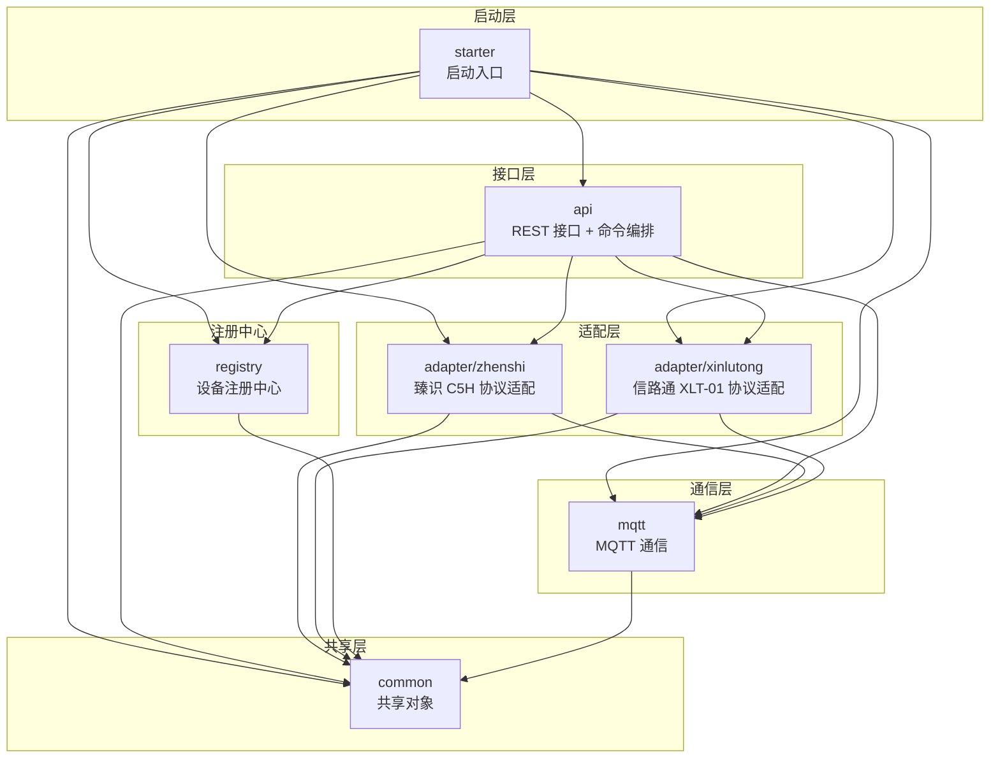
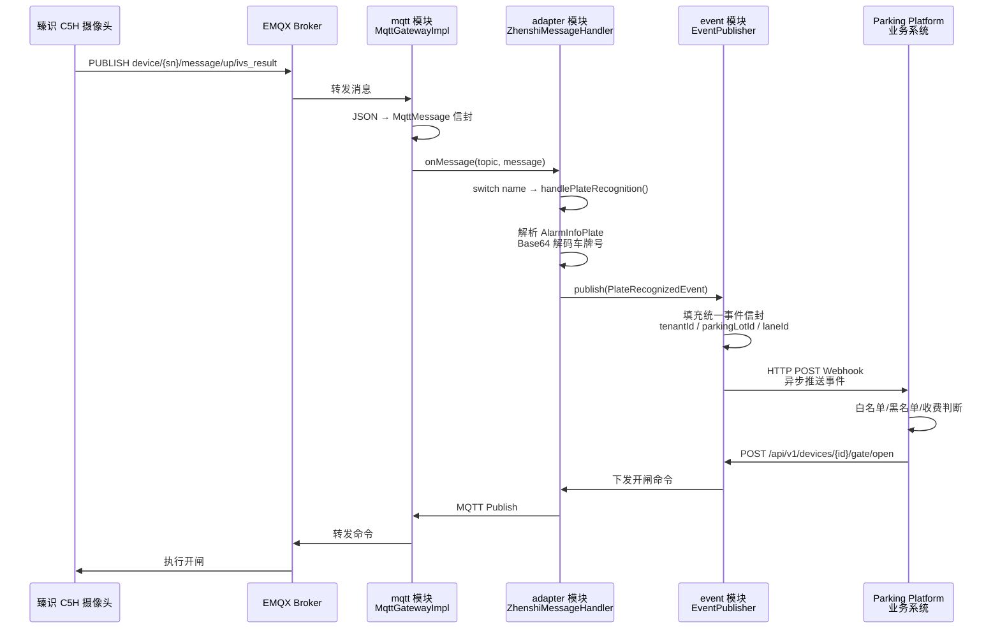
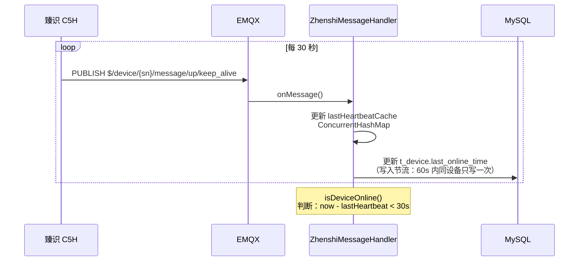
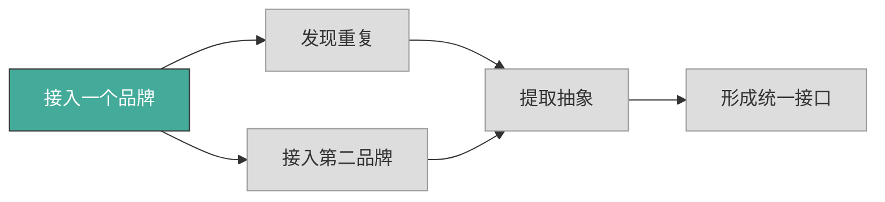
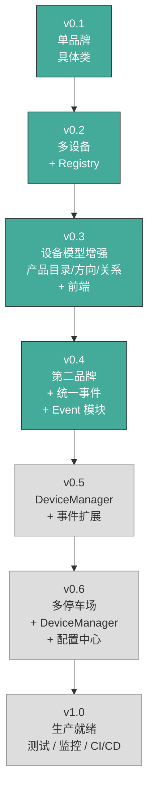

# Device Access Architecture

## 1. 项目定位

Device Access 是智能停车系统的**设备接入层**。

### 为什么存在

停车场业务系统需要与硬件设备（车牌识别相机、道闸等）交互，但不同品牌设备的通信协议各不相同——有的用 MQTT、有的用 HTTP、有的用 TCP Socket，消息格式也千差万别。

Device Access 的使命是：**让业务系统不用关心设备品牌和通信协议。**

### 职责边界

| 属于 Device Access | 不属于 Device Access |
|---|---|
| 接入各种品牌设备 | 停车记录 |
| 屏蔽设备协议差异 | 收费 |
| 接收设备事件（识别结果、心跳、状态变更） | 月卡 / 白名单 |
| 下发设备控制命令（开闸、关闸、校时、显示屏控制等） | 订单 |
| 输出统一设备能力 | 用户管理 |
| 协议适配与转换 | 数据统计 / 报表 |
| 设备事件推送（HTTP Webhook） | 业务规则判断（白名单/收费/开闸决策） |

> **Device Access 提供设备控制能力，但不做业务规则判断。**
> 
> 例如：Device Access 提供 `POST /gate/open` 开闸 API，但**是否开闸**由 Parking Platform 根据白名单/收费规则决定。
> 
> 设备控制代码（开闸/关闸/显示屏文字/校时）由 Device Access 实现，通过 REST API 暴露给业务侧。

---

## 2. 整体系统架构



核心约束：

- **设备永远不会直接和业务系统通信**
- **所有设备交互必须经过 Device Access**
- Device Access 不直接控制道闸 — 开闸指令通过摄像头 RS485 继电器输出触发电信号

---

## 3. 当前部署架构

v0.3 采用集中部署，所有组件部署在同一网络内。



要点：

- **Device Access 与 EMQX 部署在同一网络，通过 TCP 连接
- 臻识 C5H / 信路通 XLT-01 通过 MQTT 协议接入 EMQX Broker
- 业务系统通过 HTTP REST 调用 Device Access
- MySQL 持久化设备基础信息、产品目录和设备关系（`t_device` / `t_device_product` / `t_device_relation`）

---

## 4. 当前模块架构

### 模块总览

```
device-access
├── starter             # Spring Boot 启动入口
├── common              # 共享对象（DTO / Entity / Enum / Exception）
├── mqtt                # MQTT 通信层（不解析业务数据）
├── adapter
│   ├── support         # adapter 层内部支持组件（DeviceHeartbeatRecorder）
│   ├── xinlutong       # 信路通 XLT-01 协议适配
│   └── zhenshi         # 臻识 C5H 协议适配
├── registry            # 设备注册中心（Device + Product + Relation 三 Registry）
├── api                 # REST 接口 + BrandCommandDispatcher + Zhenshi/Xinlutong Coordinator
└── frontend            # Vue 3 设备管理后台（v0.4 已删除）
```

### 模块依赖图



依赖方向：**单向，无循环**。上层依赖下层，下层不感知上层。

```
starter → api → adapter → mqtt → common
starter → api → registry → common
starter → api → event → common
```

### 各模块职责

| 模块 | 职责 | 输入 | 输出 | 关键约束 |
|------|------|------|------|----------|
| **starter** | 应用启动、全局异常处理 | — | — | 不包含业务逻辑 |
| **common** | 共享 DTO、Entity、Enum、Exception | — | — | 零业务依赖，纯数据结构 |
| **mqtt** | MQTT 连接/重连/订阅/发布 | MQTT Broker 原始消息 | 反序列化的 `MqttMessage` | **不解析业务数据**，payload 以 `Object` 透传 |
| **adapter** | 品牌协议适配（臻识/信路通） | `MqttMessage`（通用信封）或原始 JSON Map | 事件对象，下行命令 | **不处理 HTTP**，具体类非接口；协议字段解析不得逃逸到 api |
| **adapter.support** | adapter 层内部支持组件 | — | 心跳缓存 / 上下线标记 | v0.4 过渡组件；v0.6 由 DeviceManager 替代 |
| **registry** | 设备元数据 CRUD | — | Device 实体 | v0.2 新增；**不依赖 MQTT 或 HTTP**；替代 DeviceConfigLoader |
| **api** | 对外 REST 接口 + 命令分派 | HTTP 请求 | `Result<T>` 统一响应 | **不处理厂商协议**，只做能力校验与编排；品牌路由由 BrandCommandDispatcher 集中处理 |

四层隔离：

- **mqtt 不解析业务** — 只负责 JSON 反序列化为通用 `MqttMessage` 信封，payload 保持原始 Object 透传
- **adapter 不处理 HTTP** — 只负责协议字段解析和命令构建，不感知 REST 请求
- **event 不处理业务规则** — 只负责统一事件定义和 HTTP Webhook 推送，不判断白名单/收费/开闸
- **api 不处理厂商协议** — 只负责参数校验、调用 adapter、包装返回结果

---

## 5. 数据流

### 5.1 车牌识别流程

摄像头检测到车辆 → 上报识别结果 → Device Access 解析 → 输出统一事件对象。



关键点：

- MQTT 模块只做 JSON → `MqttMessage` 的转换，**不解包 payload**
- Adapter 模块按 `message.name` 字段路由到对应解析方法，**不处理 HTTP**
- **event 模块**负责统一事件定义和 HTTP Webhook 推送，**不判断业务规则**（白名单/收费/开闸）
- 臻识协议中车牌号使用 Base64 编码（避免中文乱码），Adapter 负责解码
- 解析结果封装为 `PlateRecognizedEvent`，event 模块填充完整业务信封后推送
- 业务判断（白名单/黑名单/收费）由 Parking Platform 负责，Device Access 只执行命令

### 5.2 开闸（当前状态）

> **CURRENT_IMPLEMENTATION**：v0.4 引入 `POST /{deviceId}/gate/open` 和 `POST /{deviceId}/gate/close` 端点。
> 当前仅信路通 XLT-01 支持开闸/关闸；臻识 C5H 产品目录中未声明 `OPEN_GATE`/`CLOSE_GATE` 能力，调用将返回 422。

**实现要点**：
- `DeviceService` 通过 `requireCapability()` 校验设备是否具备 `OPEN_GATE`/`CLOSE_GATE` 能力，缺能力直接抛 `CapabilityUnsupportedException` → HTTP 422
- `BrandCommandDispatcher` 按品牌路由：信路通 → `XinlutongDeviceCoordinator`；臻识 → 暂不支持（抛 `UnsupportedOperationException`）
- 无 commandId 幂等（v1.x Command Dispatcher 阶段引入）
- 臻识 C5H 实际开闸方式仍为 NEEDS_DEVICE_VERIFICATION（V04），后续真机验证后补充

**开闸三层状态**：
1. 命令已发送
2. 厂商设备回复成功
3. 闸杆实际处于 OPEN

三者不得混为同一状态。

> Device Access 不直接控制道闸 —— 摄像头通过 RS485 继电器输出触发电信号。超时默认 10 秒。

### 5.3 心跳与在线判定



---

## 6. 模块职责详表

| 模块 | 职责 | 依赖 | 可包含业务逻辑 | 备注 |
|------|------|------|:---:|------|
| **common** | DTO、Entity、Enum（含 DeviceCapability/DisplayDirection/DisplayMode/PeripheralType）、Exception | 无 | ❌ | 纯数据结构，零业务依赖 |
| **mqtt** | MQTT 连接/自动重连/订阅/发布/请求响应关联 | common | ❌ | 不解析 payload 业务字段 |
| **adapter/zhenshi** | 臻识 C5H 协议解析、命令构建 | common, mqtt | ✅ | 具体类，非接口；心跳逻辑已委托给 adapter.support |
| **adapter/xinlutong** | 信路通 XLT-01 协议解析、命令构建、回执结构化（XinlutongCommandResult）、内置科发屏卡 SerialData 透传 | common, mqtt | ✅ | 具体类，非接口；心跳逻辑已委托给 adapter.support；显示屏控制通过 SerialData MQTT 命令下发 OLM-M1D 协议帧 |
| **adapter.support** | 运行时心跳缓存、写入节流、上下线标记（DeviceHeartbeatRecorder） | common | ❌ | v0.4 过渡组件；v0.6 由 DeviceManager 替代 |
| **registry** | 设备元数据 CRUD（Device + Product + Relation），t_device/t_device_product/t_device_relation 表唯一写入入口 | common | ❌ | v0.2+；不依赖 MQTT 或 HTTP |
| **event** | 统一事件定义（`DeviceEvent`/`PlateRecognizedEvent`）+ 异步 HTTP Webhook 推送（`EventPublisher`） | common | ❌ | v0.4 已实现；品牌无关事件信封；通过 DeviceRegistry 查表填充 tenantId/parkingLotId/laneId/platformDeviceId；**不处理业务规则**。 |
| **api** | REST 接口、设备能力校验、命令编排与分派（BrandCommandDispatcher / ZhenshiDeviceCoordinator / XinlutongDeviceCoordinator）、结果封装 | common, mqtt, adapter, registry | ✅ | 编排层；BrandCommandDispatcher 集中处理品牌路由（臻识/信路通 开闸/关闸/校时/显示屏控制），DeviceService 不再直接依赖 Handler |
| **starter** | Spring Boot 启动、全局异常处理、配置绑定 | 所有模块 | ❌ | 不含业务代码 |

---

## 7. 演进式架构思想

### 不是不会设计，是不提前设计

当前 v0.3 代码中以下内容**有意不存在**：

| 不存在的东西 | 原因 |
|---|---|
| `DeviceAdapter` 接口 | 只有一个品牌（臻识），不知道第二品牌长什么样 |
| `AdapterFactory` | 只有一个品牌，工厂模式增加复杂度而不创造价值 |
| `EventBus` | 事件目前仅打日志，无消费者订阅（v0.5 引入） |
| `RabbitMQ` | 单服务部署，直接方法调用即可 |
| `WebSocket` | 业务系统无实时推送需求 |
| `parking_lot_id` / `tenant_id` | Device Access 不负责停车场业务 |
| `DeviceGateway` / `DeviceAdapter` 接口 | 没有第二品牌无法验证抽象是否正确 |
| `Adapter SPI` / 插件体系 | 远未达到需要插件化的规模 |

### 为什么当前架构长这样

v0.1 的目标只有一个：**完成臻识 C5H 的 MQTT 接入**。



当前处于"A 接入一个品牌"阶段。API 层直接依赖 `ZhenshiMessageHandler` 具体类而非接口，这是**有意为之**——只有一个品牌时，接口只能从一个样本推测，几乎一定猜错。

> **更新（2026-07-13）**：信路通 XLT-01 真机联调已通过（心跳、校时、开闸/关闸）。v0.4 已提取 `BrandCommandDispatcher` 实现品牌命令分派，`DeviceAdapter` 接口和 `AdapterFactory` 将在两个品牌共同能力验证后提取。

### 演进路线

架构的演进遵循实际需求的增长：

```
v0.1: 接通臻识 C5H          → 单品牌、具体类、配置文件管理设备
v0.2: 支持多个摄像头          → Registry（设备注册 API）
v0.3: 设备模型增强            → 产品目录 + 设备方向 + 设备关系 + 前端
v0.4: 接入第二品牌 + 统一事件   → BrandCommandDispatcher + Event 模块（HTTP Webhook）
v0.5: 设备管理增强             → DeviceManager（设备缓存、在线状态管理）
v0.6: 多停车场                → 停车场隔离 + 配置中心
v1.0: 生产就绪                → 测试覆盖、监控、CI/CD
```

每个版本只引入当前真实需要的模块。详细版本规划见 [ROADMAP.md](ROADMAP.md)。

---

## 8. 当前版本说明（v0.4）

### 版本范围

| 维度 | 范围 |
|------|------|
| 品牌 | 臻识 C5H（主要）+ 信路通 XLT-01（真机验证通过） |
| 设备类型 | CAMERA（摄像头）+ DISPLAY（科发 OLM-M1D LED 控制卡） |
| 协议 | MQTT + RS485 串口透传（显示屏通过 Camera 代理接入） |
| 设备数 | API 管理，无上限 |
| 停车场 | 单一停车场 |
| 模块数 | 7（starter / common / mqtt / adapter / registry / api / event） |
| API 数 | 21（CRUD 5 + 校时/状态 2 + 产品 1 + 关系 5 + 显示内容 2 + 显示屏配置 1 + 语音控制 1 + 增强显示 1 + 外围控制 1 + 开闸/关闸 2） |
| 事件模块 | ✅ 已实现（`DeviceEvent` + `PlateRecognizedEvent` + `EventPublisher` + `EventRetryService` + `t_event_outbox`） |
| 安全 | ✅ API Key 认证（`ApiKeyAuthInterceptor` + `WebMvcConfig`，大小写不敏感，空配置禁用） |

### 版本目标

v0.4 在 v0.3 基础上接入第二品牌（信路通 XLT-01）并统一设备控制能力：

- **信路通 XLT-01 真机验证** — 心跳、校时、开闸/关闸、显示屏控制（SerialData 透传内置科发屏卡）
- **品牌命令分派** — `BrandCommandDispatcher` 按品牌路由命令（臻识/信路通 开闸/关闸/校时/显示屏控制）
- **显示屏高级控制** — 音量/时间同步/显示方向/字体/语音（三接口分离架构：配置/内容/语音）
- **设备注册扩展** — 支持 `tenantId`/`parkingLotId`/`laneId`/`platformDeviceId` 业务字段
- **删除 frontend 模块** — Device Access 不提供前端，业务侧负责 UI
- **Event 模块** — `DeviceEvent` + `PlateRecognizedEvent` + `EventPublisher` + `EventRetryService` 已实现，通过 HTTP Webhook 异步推送，支持内存重试 + 发件箱持久化
- **视频流** — 当前未实现，业务侧如需视频应直接访问摄像头 RTSP 地址

### 版本约束

- 不引入 DeviceAdapter 接口（两个品牌共同能力验证后提取）
- 不引入 AdapterFactory / Adapter SPI
- 不处理业务规则（白名单/黑名单/收费/月卡/订单）
- event 模块已实现（v0.4 交付范围）
- 事件推送失败先内存重试，耗尽后写入 `t_event_outbox` 由 `EventRetryService` 定时重试

---

## 8.1 事件模块（v0.4 已实现）

### 8.1.1 职责

`event` 模块负责统一事件定义和 HTTP Webhook 推送：

- 定义品牌无关的事件信封（`DeviceEvent`）
- 定义 `PlateRecognizedEvent`（车牌识别事件）
- 实现 `EventPublisher`（异步 HTTP POST 到 Parking Platform）
- 推送失败时内存重试（3 次固定间隔）
- **不处理业务规则** — 白名单/黑名单/收费判断由 Parking Platform 负责

### 8.1.2 事件信封

```json
{
  "eventId": "evt_...",
  "eventType": "PLATE_RECOGNIZED",
  "tenantId": "tenant_001",
  "parkingLotId": "park_001",
  "laneId": "lane_entry_001",
  "platformDeviceId": "dev_camera_001",
  "deviceSn": "a422cb58-6c62f055",
  "vendor": "ZHENSHI",
  "occurredAt": "2026-07-13T10:30:00Z",
  "receivedAt": "2026-07-13T10:30:00.100Z",
  "payload": {
    "plateNo": "鲁Q12345",
    "plateColor": 1,
    "confidence": 98,
    "direction": 1,
    "imagePath": "..."
  }
}
```

字段来源：
- `tenantId`/`parkingLotId`/`laneId`/`platformDeviceId` — `EventPublisher` 通过 `deviceSn` 查询 `DeviceRegistry`，从 `Device` 实体读取（设备注册时传入）
- `deviceSn`/`vendor` — 从设备消息/产品目录读取
- `occurredAt` — 设备上报时间
- `receivedAt` — Device Access 收到时间

### 8.1.3 Webhook 配置

```yaml
# application.yml
device-access:
  webhook:
    url: https://parking-platform.example.com/webhooks/events
    timeout-seconds: 5
    retry-count: 3
    retry-interval-seconds: 5
```

### 8.1.4 事件类型（v0.4）

| 事件类型 | 状态 | 说明 |
|----------|------|------|
| `PLATE_RECOGNIZED` | ✅ v0.4 已实现 | 车牌识别成功 |
| `DEVICE_ONLINE` | ⏳ v0.5 | 设备上线 |
| `DEVICE_OFFLINE` | ⏳ v0.5 | 设备离线 |
| `GATE_STATUS_CHANGED` | ⏳ v0.5 | 道闸状态变化 |
| `DEVICE_ALARM` | ⏳ v0.5 | 设备告警 |

---

### 8.2 外围设备控制与显示内容

#### 8.1.1 设备能力模型（DeviceCapability）

v0.3 引入 `DeviceCapability` 枚举，替代 deviceType 硬编码判断。能力声明在 `DeviceProduct.capabilities`（JSON 数组字段），由产品型号决定。

| 能力 | 对应 API | 说明 |
|------|---------|------|
| `DISPLAY_TEXT` | `POST /display/text` | 实时显示文字（临时区） |
| `DISPLAY_SAVE` | `POST /display/save` | 持久保存内容（存储区） |
| `DISPLAY_CONFIG` | `POST /display/config` | 显示屏配置（音量/亮度/方向/时间同步） |
| `VOICE_CONTROL` | `POST /voice/control` | 语音控制（播放/停止） |
| `DISPLAY_ENHANCED` | `POST /display/text/enhanced` | 增强显示（字体/颜色/语音联动） |
| `PERIPHERAL_CONTROL` | `POST /peripheral/display` | 外围设备控制（启用/关闭/模式） |
| `TIME_SYNC` | `POST /time/sync` | 校时 |
| `OPEN_GATE` | `POST /gate/open` | 开闸（当前仅信路通 XLT-01） |
| `CLOSE_GATE` | `POST /gate/close` | 关闸（当前仅信路通 XLT-01） |

Service 层通过 `ProductRegistry.hasCapability()` 进行能力校验，不再依赖 deviceType。

#### 8.1.2 命令执行编排（ZhenshiDeviceCoordinator）

v0.3 引入 `ZhenshiDeviceCoordinator` 封装命令执行编排模板：
查设备 → 能力校验 → MQTT 校验 → 调用 Handler → 等待回复 → 转换结果。
降低 `DeviceService` 对 `ZhenshiMessageHandler` 的直接依赖。

#### 8.1.3 外围设备控制

Camera 可以通过 RS485/MQTT 控制多种外围设备（显示屏、道闸、语音播报等）。
v0.3 中，DISPLAY 类型外围设备（如 LED-01）作为独立 Device 实例注册，并通过 RS485_DISPLAY 关系与宿主 Camera 关联；控制命令仍由 Camera 通过 RS485/MQTT 代理下发。

| 原则 | 说明 |
|------|------|
| 通过宿主设备代理控制 | v0.3 中，DISPLAY 类型外围设备（如 LED-01）作为独立 Device 实例注册，并通过 RS485_DISPLAY 关系与宿主 Camera 关联；控制命令仍由 Camera 通过 RS485/MQTT 代理下发 |
| 能力校验 | 通过 DeviceCapability 而非 deviceType 判断 |
| 统一控制模型 | 所有外围控制通过 Camera 的 MQTT 通道下发 |
| 预留扩展 | PeripheralType 枚举覆盖 Display/Barrier/Voice/FillLight/Alarm |

#### 8.1.4 显示内容控制

v0.3 新增显示内容下发能力。Device Access 提供两种语义：

| API | 协议 | 存储 | 频率 | 说明 |
|-----|------|------|------|------|
| `POST /display/text` | 0x6F (SF=0) | 控制卡 RAM（掉电丢失） | 高 | 实时临时显示 |
| `POST /display/save` | 0x67 | 控制卡 Flash（掉电保存） | 低 | 持久化内容配置 |
| `POST /display/config` | 0x0D/0x05/0x19 | 控制卡寄存器 | 低 | 显示屏硬件配置（音量/时间/方向） |
| `POST /voice/control` | 0x30/0x31 | - | 中 | 语音播报控制 |
| `POST /display/text/enhanced` | 0x6F (SF=0) + VF/VTL | 控制卡 RAM | 高 | 增强显示（字体/颜色/语音联动） |

平台通过 `content` + `direction`（当前仅支持 HORIZONTAL；VERTICAL 不可用——OLM-M1D v2.0 协议不支持运行时方向切换，非开发计划）表达显示意图，Adapter 负责文本→LID 映射和协议帧构造。平台不感知 TWID/FID/SF/FINDEX 等协议字段。

**三接口分离设计**：
- **配置接口**（`/display/config`）：硬件参数（音量、亮度、方向、时间），独立生命周期，低频操作
- **内容接口**（`/display/text`、`/display/save`）：显示文字内容，掉电可失/可持久化
- **语音接口**（`/voice/control`）：语音播报，可独立触发，也可与显示联动（enhanced 端点）

新增配置类型只需扩展 `DisplayConfigRequest.configType` 和 `OlmM1dProtocol`，无需修改 API 结构。

#### 8.1.5 实现层次

**臻识 C5H（RS485 透传外接显示屏）**：

```
Platform
  │  POST /display/text  { content, direction }
  ▼
DeviceController → DeviceService → BrandCommandDispatcher → ZhenshiDeviceCoordinator
                                      │
  查设备 → 能力校验 → MQTT校验        │
                                      ▼
                              ZhenshiMessageHandler
                                │ displayText() / saveDisplay()
                                ▼
                              OlmM1dProtocol
                                │ buildMultiLineFrame() / build0x67Frame()
                                ▼
                              MqttGateway.publishAndWait()
                                │ Base64 → MQTT serial_data topic
                                ▼
                              C5H Camera → RS485 → OLM-M1D 控制卡
```

**信路通 XLT-01（SerialData 透传内置科发屏卡）**：

```
Platform
  │  POST /display/text  { content, direction }
  ▼
DeviceController → DeviceService → BrandCommandDispatcher → XinlutongDeviceCoordinator
                                      │
  查设备 → 能力校验 → MQTT校验        │
                                      ▼
                              XinlutongMessageHandler
                                │ displayText() / saveDisplay()
                                ▼
                              OlmM1dProtocol（复用）
                                │ buildMultiLineFrame() / build0x67Frame()
                                ▼
                              MqttGateway.publishRaw()
                                │ JSON → MQTT download/{sn} topic
                                ▼
                              XLT-01 一体机 → 内部转发 → 内置科发屏卡
```

关键差异：

| 维度 | 臻识 C5H | 信路通 XLT-01 |
|------|---------|--------------|
| 通信路径 | Camera → RS485 → 外接 OLM-M1D | 一体机内部 → 内置科发屏卡 |
| MQTT Topic | `device/{sn}/message/down/serial_data` | `download/{sn}` |
| 消息格式 | 臻识 `MqttMessage` 信封（Base64 data） | 信路通 JSON（`{"command":"SerialData",...}`） |
| 协议帧 | OLM-M1D 二进制帧（Base64 编码） | OLM-M1D 二进制帧（Base64 编码） |
| 回执 Topic | `device/{sn}/message/down/serial_data/reply` | `download/{sn}/reply`（SerialDataReply） |
| 回执格式 | 臻识 `MqttMessage`（code/message） | 信路通 JSON（errCode/errInfo） |

> OlmM1dProtocol 已从 `adapter.zhenshi.display` 提取到 `adapter.support.display`，供两个品牌复用。

---

## 9. 后续演进方向

以下为架构自然演进方向，仅说明每个阶段引入什么、为什么引入。详细版本规划见 [ROADMAP.md](ROADMAP.md)。



| 阶段 | 触发条件 | 引入模块 | 解决什么问题 |
|------|----------|----------|-------------|
| v0.1 → v0.2 | 设备数量增加，配置文件难以维护 | Registry | 设备注册 API，统一管理设备元数据 |
| v0.2 → v0.3 | 设备模型需要增强（方向、关系、显示屏） | Product + Relation + Frontend | 产品目录统一品牌/型号、设备关联关系、可视化运维 |
| v0.3 → v0.4 | 接入第二品牌 + 事件格式需统一 | BrandCommandDispatcher + Event 模块 | 品牌命令分派、统一事件对外透明 |
| v0.4 → v0.5 | 设备管理能力不足（无缓存、无离线检测、无事件查询） | DeviceManager + 事件持久化 | 设备缓存、心跳超时检测、在线状态维护、事件查询 API |
| v0.5 → v0.6 | 多停车场部署 | DeviceManager + 配置中心 | 设备缓存、心跳管理、在线状态、配置隔离 |
| v0.6 → v1.0 | 生产环境运行 | 测试 / 监控 / CI/CD | 稳定性与可维护性 |

---

## 10. 架构原则

| # | 原则 | 说明 |
|---|------|------|
| 1 | **Device Access 不负责停车业务** | 停车记录、收费、月卡、订单等一律属于业务系统 |
| 2 | **Device Access 屏蔽设备协议** | 对外输出统一能力，不暴露 MQTT Topic、协议字段、消息格式 |
| 3 | **不提前抽象** | 只有一个品牌时不定义接口，只有看到共同模式后才提取抽象 |
| 4 | **不过度设计** | 每一个引入的模块必须由真实需求驱动，不为假想的未来设计 |
| 5 | **真实设备优先** | 协议文档是参考，真实设备行为是标准。联调结果与文档冲突时，以联调为准 |
| 6 | **单一职责** | mqtt 不解业务、adapter 不碰 HTTP、api 不碰协议字段 |
| 7 | **单向依赖** | `starter → api → adapter → mqtt → common`，无循环 |
| 8 | **一个版本只解决一个问题** | v0.1 只解决臻识 C5H MQTT 接入，不背负后续版本的设计包袱 |

---

## 11. 架构变更治理规则

### 11.1 新增能力分类

任何对项目的修改，在动手之前按此表分类：

| 分类 | 判定标准 | 动作 |
|------|---------|------|
| **Core Capability** | 新增模块、改变数据流、修改模块职责边界、改变依赖方向、修改公共领域模型、修改跨模块接口契约、引入新通信方式或基础设施 | 先更新本文档对应章节，再写代码 |
| **Future Capability** | 已确认属于远期规划、当前版本不实现 | 更新 ROADMAP.md 对应 Phase |
| **Implementation Detail** | 不改变架构边界（Bug 修复、性能优化、内部重构、辅助工具类、接口实现优化） | 只修改代码，不修改本文档 |

### 11.2 判断流程

1. 是否改变架构边界？ → 是：**Core Capability**
2. 是否属于未来规划但当前不实现？ → 是：**Future Capability**
3. 否则 → **Implementation Detail**

### 11.3 架构变更禁止事项

| # | 禁止事项 | 说明 |
|---|---------|------|
| 1 | **不为单个设备型号修改核心架构** | 核心模块（registry / mqtt / api / event）不因某个品牌设备特殊行为改变整体设计。设备差异在 Adapter 层消化。 |
| 2 | **品牌特殊逻辑禁止进入通用层** | mqtt / api / registry 等通用模块不得出现品牌判断或品牌专用字段。品牌差异必须封装在 Adapter。 |
| 3 | **不因短期需求破坏长期演进** | 优先选择当前简单且不阻塞 ROADMAP 演进路径的方案。不等同于提前实现未来功能。 |

> 完整规则见 CLAUDE.md → 架构变更治理规则。

---

## 12. 外围设备控制扩展参考

> 外围设备控制的完整说明见 [§8.1 外围设备控制与显示内容](#81-外围设备控制与显示内容)。本节仅补充扩展性内容。

### 12.1 外围设备类型枚举

`PeripheralType` 枚举定义了所有潜在外围设备类型，当前仅 DISPLAY 已实现：

| 类型 | 说明 | v0.3 状态 |
|------|------|-----------|
| DISPLAY | LED 显示屏 | ✅ 已实现 |
| BARRIER | 道闸 | 未来 |
| VOICE | 语音播报 | 未来 |
| FILL_LIGHT | 补光灯 | 未来 |
| ALARM | 报警器 | 未来 |
| TRAFFIC_LIGHT | 信号灯 | 未来 |
| RELAY | 继电器 | 未来 |

### 12.2 显示屏控制动作

| 动作 | 说明 | OLM-M1D 命令 | 实现方法 |
|------|------|-------------|---------|
| ENABLE | 启用显示（亮度 80%） | 0x0C brightness=80 | `setDisplayEnabled(sn, true)` |
| DISABLE | 关闭显示（亮度 10%） | 0x0C brightness=10 | `setDisplayEnabled(sn, false)` |
| SET_MODE | 设置分区布局（2行/4行） | 0x6F 多行配置（空文本） | `setDisplayMode(sn, mode)` |
| SET_VOLUME | 音量控制（0-100%） | 0x0D | `setVolume(sn, percent)` |
| SYNC_TIME | 屏卡时间同步 | 0x05 | `syncDisplayTime(sn, ...)` |
| SET_DIRECTION | 显示方向控制 | 0x19 | `setDisplayDirection(sn, direction)` |
| PLAY_VOICE | 播放语音（带变量） | 0x30 | `playVoice(sn, voiceId, variable)` |
| STOP_VOICE | 停止语音 | 0x31 | `stopVoice(sn)` |

> **OLM-M1D v2.0 协议限制**：不支持横竖屏软件切换。屏幕方向由控卡硬件屏参决定。如需旋转显示效果，应由上位机提前旋转图片或文字点阵，而非在协议层实现。

### 12.3 OLM-M1D 协议限制详情

以下限制基于 OLM-M1D v2.0 协议文档与真机联调验证，**不允许在 API 或协议层虚构不存在的能力**。

| 限制项 | 来源 | 说明 |
|--------|------|------|
| 不支持横竖屏切换 | 协议文档（全命令集无方向命令） | 屏幕方向由控卡硬件屏参（分辨率、级联面板数）决定，无软件命令可切换 |
| 无独立清屏命令 | 协议文档（全命令集无 clear 命令） | `DISABLE`（亮度降到 10%）可使屏幕不可读，但不是协议定义的清屏语义。发送 TL=0 的空文本帧（0x6F）可覆盖当前显示，此行为属**联调验证结果**，协议未明确定义，不同固件版本可能存在差异 |
| 0x6F 单包 ≤255 字节 | 协议文档 §0x6F | 帧头+多行文本参数+语音参数之和不得超过单包最大长度 |
| 0x67 低频擦写 | 协议文档 §0x67 | 每次调用写入控制卡 Flash 外部存储器，"不要频繁的擦写广告语，否则会降低显示屏的存储器寿命" |
| VERTICAL 方向不可用 | 协议文档 + 联调确认 | OLM-M1D 协议无文本方向旋转命令，所有文本始终按水平行排列。`DisplayDirection.VERTICAL` 枚举值保留但服务端抛出 `UnsupportedOperationException` |

### 12.4 扩展方式

接入新品牌时，外围控制逻辑在对应 Adapter 中实现，通用层不感知品牌差异：

```
Adapter
├── ZhenShiAdapter
│   ├── Camera control (set_time, serial_data)
│   └── Peripheral control (display enable/disable/mode via OLM-M1D)
└── OtherAdapter
    └── Peripheral control (brand-specific protocol)
```
