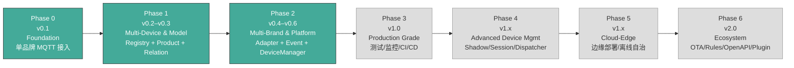
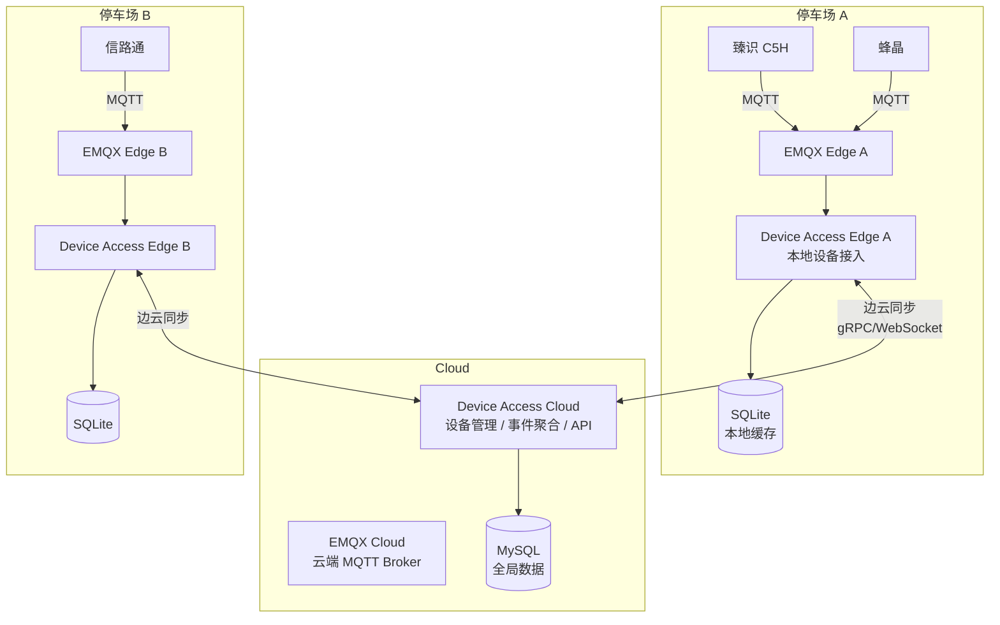
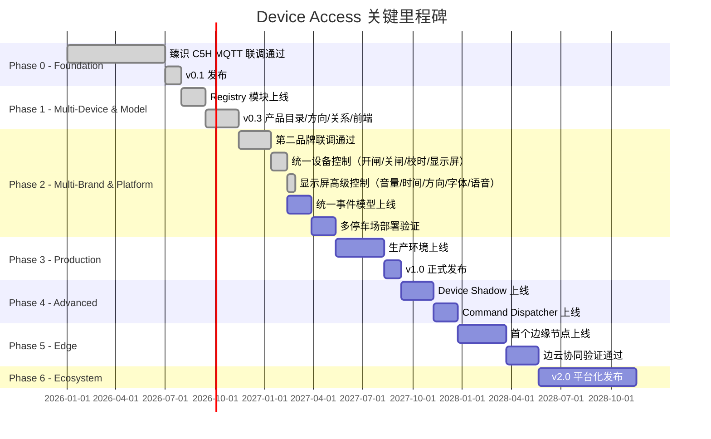
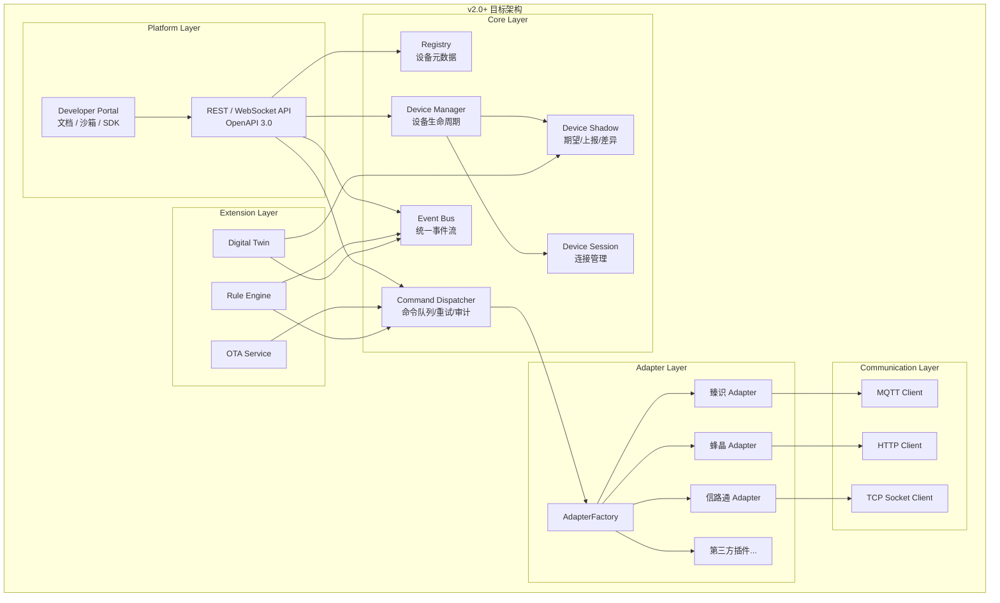

# Device Access Roadmap

> 版本：1.0
> 更新：2026-07-13
> 关联文档：[ARCHITECTURE.md](ARCHITECTURE.md) · [CLAUDE.md](../CLAUDE.md) · [共享契约](../contracts/platform-device-access/)
>
> **注意**：本文档是 Device Access 唯一当前路线图。原 `device-access-roadmap.md` 已合并到本文档并归档至 `docs/archive/device-access/device-access-roadmap-旧版.md`。

---

## 目录

- [1. Product Vision](#1-product-vision)
- [2. Development Principles](#2-development-principles)
- [3. Phase Overview](#3-phase-overview)
- [4. Phase 0 — Foundation (v0.1)](#4-phase-0--foundation-v01)
- [5. Phase 1 — Multi-Device & Multi-Brand (v0.2–v0.3)](#5-phase-1--multi-device--multi-brand-v02v03)
- [6. Phase 2 — Multi-Brand & Platform (v0.4–v0.6)](#6-phase-2--multi-brand--platform-v04v06)
- [7. Phase 3 — Production Grade (v1.0)](#7-phase-3--production-grade-v10)
- [8. Phase 4 — Advanced Device Management (v1.x)](#8-phase-4--advanced-device-management-v1x)
- [9. Phase 5 — Cloud-Edge Collaboration (v1.x)](#9-phase-5--cloud-edge-collaboration-v1x)
- [10. Phase 6 — Platform Ecosystem (v2.0)](#10-phase-6--platform-ecosystem-v20)
- [11. Milestones](#11-milestones)
- [12. Technical Debt Management](#12-technical-debt-management)
- [13. Risk Register](#13-risk-register)
- [14. Long-term Evolution](#14-long-term-evolution)
- [15. Extensible Capabilities](#15-extensible-capabilities)

---

## 1. Product Vision

### 我们为什么存在

智能停车场行业有几十个设备品牌，每个品牌的通信协议各不相同 — MQTT、HTTP、TCP Socket、私有二进制协议。业务系统开发者不应该被迫理解这些差异。

**Device Access 的愿景：让接入一个新品牌设备，从数周的工作量变成数小时。**

### 我们最终要成为什么

```
                      ┌──────────────────────────┐
                      │      Device Access        │
                      │    设备接入统一平台        │
                      │                          │
    ┌─────────┐       │  ┌────────────────────┐  │       ┌─────────────┐
    │ 臻识 C5H │──────▶│  │   Adapter Layer    │  │──────▶│             │
    ├─────────┤       │  │   协议适配层          │  │       │   Parking   │
    │ 蜂晶     │──────▶│  └────────────────────┘  │       │   Platform  │
    ├─────────┤       │                          │──────▶│   停车业务    │
    │ 信路通   │──────▶│  ┌────────────────────┐  │       │   平台       │
    ├─────────┤       │  │   Event Bus          │  │       │             │
    │ ...      │──────▶│  │   统一事件流          │──▶────▶│             │
    └─────────┘       │  └────────────────────┘  │       └─────────────┘
                      │                          │
                      │  ┌────────────────────┐  │
                      │  │   Command Dispatcher │  │
                      │  │   命令分发器          │  │
                      │  └────────────────────┘  │
                      └──────────────────────────┘
```

一句话：**任何品牌、任何协议、任何规模 — 一套 API，统一接入。**

### 核心目标

| 维度 | 目标 |
|------|------|
| 品牌覆盖 | 接入主流停车设备品牌（臻识、蜂晶、信路通等），并具备快速接入新品牌的能力 |
| 协议覆盖 | MQTT 3.1.1/5.0、HTTP/HTTPS、TCP Socket、厂商私有协议 |
| 规模 | 支持数百个停车场、数千台设备并发接入 |
| 部署 | 支持集中部署、边缘部署、云边协同三种模式 |
| 可扩展 | 插件化适配器、OpenAPI、规则引擎、OTA 固件升级 |
| 可靠性 | 99.9% 可用性，命令下发成功率 ≥ 99.5%，端到端延迟 < 500ms |

---

## 2. Development Principles

这些原则适用于整个项目的全生命周期。

### 架构原则

| # | 原则 | 说明 |
|---|------|------|
| P1 | **边界清晰** | Device Access 只做设备接入，停车业务逻辑一律不属于本项目 |
| P2 | **协议透明** | 对外不暴露任何厂商协议细节 — MQTT Topic、消息格式、字段名一律内部消化 |
| P3 | **演进式架构** | 不提前抽象、不过度设计。每个模块只由真实需求驱动引入 |
| P4 | **真实设备优先** | 协议文档是参考，真实设备行为是标准。联调结果与文档冲突时以联调为准 |
| P5 | **单一职责** | 每个模块只做一件事 — mqtt 不解业务、adapter 不碰 HTTP、api 不碰协议字段 |
| P6 | **单向依赖** | 模块依赖无循环，上层依赖下层 |

### 工程原则

| # | 原则 | 说明 |
|---|------|------|
| E1 | **一个版本只解决一个问题** | 不背负后续版本的设计包袱 |
| E2 | **先跑通再优化** | 功能正确性优先于性能优化 |
| E3 | **测试驱动演进** | 核心流程必须有自动化测试覆盖 |
| E4 | **文档与代码同步** | 架构变更必须同步更新 ARCHITECTURE.md |
| E5 | **向后兼容** | API 变更遵循语义化版本，breaking change 必须有迁移指南 |
| E6 | **架构变更治理** | 新增能力必须先分类：Core Capability → 更新 ARCHITECTURE.md，Future Capability → 更新 ROADMAP.md，Implementation Detail → 仅修改代码。详细规则见 CLAUDE.md |

---

## 3. Phase Overview



| Phase | 版本 | 主题 | 核心交付 | 时间预估 |
|-------|------|------|----------|----------|
| **0** | v0.1 | Foundation | 臻识 C5H MQTT 接入跑通 | ✅ |
| **1** | v0.2–v0.3 | Multi-Device & Model | Registry + Product + Relation + Direction + Frontend | v0.3 ✅ |
| **2** | v0.4–v0.6 | Multi-Brand & Platform | Adapter + Event + DeviceManager + 多停车场 | v0.4 设备侧 ✅ / 业务侧对接 ⏸️ |
| **3** | v1.0 | Production Grade | 测试 / 监控 / 安全 / CI/CD | — |
| **4** | v1.x | Advanced Device Mgmt | Device Shadow / Session / Command Dispatcher | — |
| **5** | v1.x | Cloud-Edge | 边缘部署 / 离线自治 / 边云同步 | — |
| **6** | v2.0 | Ecosystem | OTA / 规则引擎 / OpenAPI / 插件 SDK | — |

> 时间预估在 Phase 3 之后不给出具体日期。后续阶段的精确排期取决于前序阶段的交付经验和真实运营数据。

---

## 4. Phase 0 — Foundation (v0.1)

### 4.1 Goals

完成第一个品牌（臻识 C5H）的 MQTT 接入。证明架构可行。

### 4.2 Features

- MQTT 连接管理（连接、自动重连、心跳保活）
- Wildcard Topic 订阅：`device/+/message/up/#`
- 消息接收与 JSON 反序列化
- 臻识协议解析：keep_alive、ivs_result、barr_gate_status
- 命令下发：gate_direct_open、set_time
- 请求-响应关联（message.id → CompletableFuture）
- 设备状态查询（在线判定 + 道闸状态）
- 配置文件管理设备列表
- 设备基础信息持久化（t_device 表）

### 4.3 Deliverables

| 交付物 | 说明 |
|--------|------|
| 多模块 Maven 项目 | starter / common / mqtt / adapter / api |
| MqttGatewayImpl | Eclipse Paho 异步客户端封装，自动重连 |
| ZhenshiMessageHandler | 臻识协议适配器（具体类，非接口） |
| DeviceController | 3 个 REST API：开闸 / 校时 / 查询状态 |
| application.yml | 设备列表配置 + MQTT 连接配置 |
| schema.sql | t_device 表 DDL |
| GlobalExceptionHandler | 统一异常 → Result 转换 |

### 4.4 Exit Criteria

- [x] Maven 多模块项目构建成功
- [x] MQTT 连接 / 自动重连 / 订阅 / 发布正常
- [x] 消息解析正常（keep_alive / ivs_result / barr_gate_status）
- [x] 命令下发正常（gate_direct_open / set_time）
- [x] 请求-响应关联正常（CompletableFuture 匹配）
- [x] 3 个 REST API 可用
- [x] MqttConnectionException cause chain bug 已修复
- [x] 与真实臻识 C5H 联调通过（收发、解析、命令均正常）
- [x] 心跳持久化到 DB 正常（含 status ONLINE/OFFLINE 自动维护）
- [x] 全量测试通过（v0.1/v0.2 回归正常，v0.3 新增测试全部通过 2026-07-11）

---

## 5. Phase 1 — Multi-Device & Model Enhancement (v0.2–v0.3)

### 5.1 v0.2 — Multi-Device Management

#### Goals

设备数量增长后，配置文件管理不再可行。引入设备注册中心，通过 API 管理设备生命周期。

#### Features

- **Registry 模块**：设备元数据统一管理
- 设备注册 API：`POST /api/v1/devices`
- 设备查询 API：`GET /api/v1/devices`、`GET /api/v1/devices/{id}`
- 设备更新 / 注销 API
- 设备状态管理：ONLINE / OFFLINE / UNKNOWN
- 配置文件设备列表迁移到 Registry

#### Deliverables

| 交付物 | 说明 |
|--------|------|
| registry 模块 | MyBatis Plus 实现，设备 CRUD |
| DeviceController 扩展 | 新增注册/查询/更新/注销端点 |
| 数据迁移脚本 | application.yml 设备列表 → t_device |

#### Exit Criteria

- [x] 设备注册/查询/更新/注销 API 全部可用
- [x] 配置文件中无硬编码设备列表
- [x] 已有设备数据迁移完成
- [x] 集成测试覆盖所有注册 API

---

### 5.2 v0.3 — Device Model Enhancement

#### Goals

增强设备数据模型，使其能够表达真实停车场中的设备拓扑关系。引入产品目录统一管理品牌/型号，为后续多品牌接入打好数据基础。提供可视化前端界面。

#### Features

- **产品目录（t_device_product）**：将 brand/model 从 Device 表中独立出来，通过 productId FK 关联。预设臻识 C5H/C6H、信路通 XLT-01、LED 显示屏等产品。
- **设备方向（direction）**：ENTRANCE / EXIT / BIDIRECTIONAL，标识摄像头在停车场的物理位置。
- **设备关系（t_device_relation）**：支持两种关系类型：
  - `AUX_CAMERA` — 主摄像头与辅助摄像头的可选关联
  - `RS485_DISPLAY` — 摄像头与 LED 显示屏的 RS485 代理关系
- **关系生命周期**：create → disable → enable → delete。启用/停用控制而非级联删除。
- **双向关系查询**：不创建反向记录，通过 source=? + target=? 双向查询实现。
- **DTO 分离**：DeviceDTO（列表，不含 relations） + DeviceDetailDTO（详情，含 relations），优化列表查询性能。
- **status 字段锁定**：API 不可修改设备状态，status 由系统心跳维护。
- **产品目录 API**：`GET /api/v1/products`，供前端下拉选择。
- **关系管理 API**：5 个端点（查/增/删/启用/停用）。
- **Vue 3 + Vite 设备管理后台**：设备注册/查看/关系管理页面，支持 product 下拉、direction 标签、关系面板、关联弹窗。设备控制（开闸/显示等）由业务侧直接调用 API，不通过前端 UI。
- **LED 显示屏控制**：通过摄像头 RS485 串口透传 OLM-M1D 协议帧。支持：
  - 实时显示文字（`displayText`，0x6F SF=0 临时区，掉电丢失）
  - 持久保存内容（`saveDisplay`，0x67 逐行写入 Flash，掉电保存）
  - 亮度控制（`setDisplayEnabled`，0x0C 亮度 80%/10%）
  - 布局模式（`setDisplayMode`，0x6F 空文本仅配 zone 分区）
  - Platform 通过 content + direction 表达显示意图，Adapter 负责文本→LID 映射和协议帧构造。
  - **协议限制**：OLM-M1D v2.0 不支持横竖屏软件切换，屏幕方向由控卡硬件屏参决定。
- **设备能力模型（DeviceCapability）**：声明式能力枚举（DISPLAY_TEXT / DISPLAY_SAVE / PERIPHERAL_CONTROL / TIME_SYNC），替代 deviceType 硬编码判断。能力绑定在 DeviceProduct 上，Service 层通过 hasCapability() 校验。
- **命令执行编排（ZhenshiDeviceCoordinator）**：封装命令执行模板（查设备→能力校验→MQTT 校验→Handler→结果），写入命令调用、回执消费、超时/异常处理。降低 api 层对具体 Handler 的依赖。

#### 关键约束

```
✓ 产品目录是通用设备目录，不绑定特定停车场场景
✗ 产品目录不包含 parking_lot_id / tenant_id
✓ Device 通过 productId 关联产品（brand/model 字段从 Device 表移除）
✗ 关系不创建反向记录（双向查询通过 source + target 双条件实现）
✓ status 字段完全由系统维护，禁止 API 手动修改
✗ 不引入 DeviceAdapter / AdapterFactory（只有臻识一个品牌）
```

#### Deliverables

| 交付物 | 说明 |
|--------|------|
| t_device_product 表 | 产品目录 DDL + 预设种子数据 |
| t_device_relation 表 | 设备关系 DDL（source/target + type + enabled） |
| DeviceProductRegistry | 产品查询服务 |
| DeviceRelationRegistry | 关系 CRUD + 双向查询 + 类型校验 |
| DeviceRegistry 扩展 | productId 替代 brand/model、direction 字段 |
| DeviceService 扩展 | 列表/详情 DTO 分离、关系管理编排 |
| ProductController | `GET /api/v1/products` |
| DeviceController 扩展 | 5 个关系管理端点 |
| 新增 Enum | DeviceType / Direction / DeviceRelationType / Protocol / DeviceCapability / DisplayDirection / DisplayMode / PeripheralType |
| 新增 Exception | ProductNotFound / RelationNotFound / RelationAlreadyExists / InvalidRelation |
| ZhenshiDeviceCoordinator | 命令执行编排器，封装校验→调用→转换模板 |
| BrandCommandDispatcher | 品牌命令分派器（具体类，内部按 brand 字符串 switch，不提前抽接口） |
| DeviceHeartbeatRecorder | adapter.support 公共组件，心跳缓存 + 写入节流 + 上下线标记 |
| XinlutongCommandResult | 信路通命令回执结构化对象（parseCommandResult 下沉到 adapter） |
| OlmM1dProtocol | OLM-M1D LED 控制卡 RS485 协议构造（0x6F/0x67/0x0C 帧） |
| 显示内容 API | POST /display/text + POST /display/save |
| ~~Vue 3 设备管理后台~~ | ~~[v0.4 已删除] 原设备注册/查看/关系管理前端~~ |
| schema.sql | 同步为 v0.3 三表 DDL |
| api-v0.4.md | 完整 API 文档（v0.4 当前版本） |

#### Exit Criteria

- [x] 产品目录 API 可用，预设数据可查询
- [x] 设备注册使用 productId（不再传 brand/model）
- [x] direction 字段在 CRUD 中正常流转
- [x] 关系生命周期完整：创建 → 停用 → 启用 → 删除
- [x] AUX_CAMERA 类型校验（双方必须都是 CAMERA）
- [x] RS485_DISPLAY 类型校验（target 必须是 DISPLAY）
- [x] 双向查询正确（OUTBOUND + INBOUND）
- [x] 列表/详情 DTO 分离正确
- [x] status 字段通过 API 不可修改
- [x] ~~前端 product 下拉、direction 标签、关系面板、关联弹窗全部可用~~（v0.4 已删除 frontend）
- [x] 全量测试通过
- [x] 显示屏 OLM-M1D 协议帧构造正确（0x6F/0x67/0x0C，CRC 验证通过）
- [x] 显示屏实时显示与持久保存两端点可用
- [x] DeviceCapability 能力校验替代 deviceType 硬编码
- [x] ZhenshiDeviceCoordinator 命令编排器正常运行
- [x] BrandCommandDispatcher 品牌命令分派（校时/开闸/关闸/在线状态/外围控制/显示）
- [x] OPEN_GATE / CLOSE_GATE 能力定义与种子数据（XLT-01）
- [x] DeviceService 命令方法前置 requireCapability → 422
- [x] 信路通协议解析下沉（XinlutongMessageHandler.parseCommandResult + XinlutongCommandResult）
- [x] 心跳/上下线逻辑公共化（DeviceHeartbeatRecorder，两品牌 Handler 共用）
- [x] BrandCommandDispatcherTest + DeviceControllerTest（开闸/关闸/能力校验）
- [x] schema.sql 同步到 v0.3（含 capabilities 字段）
- [ ] 臻识 C5H + 科发 OLM-M1D 真机联调（v0.4 待执行）
- [ ] 视频流获取功能（当前缺失，需评估是否纳入 v0.5 或业务侧直接访问 RTSP）

#### 当前优先事项（v0.3 持续验证）

v0.3 显示屏功能已通过 API 测试（MQTT 回执 code=200），以下为真机联调结论：

- **OLM-M1D 真机联调** — 0x6F（实时显示）和 0x67（保存广告语）命令均通过 C5H serial_data 通道成功送达控卡，控卡正常回复 ACK=0。
- **协议限制确认** — OLM-M1D v2.0 协议**不支持横竖屏切换**。屏幕方向由控卡硬件配置（屏参宽度/高度/级联面板数）决定，非软件命令可控。
- **信路通 XLT-01 真机联调通过** — 心跳、校时、开闸/关闸均通过真实设备验证，v0.4 已启动。
- **臻识 C5H + 科发 OLM-M1D 真机联调计划** — v0.4 待执行：显示屏实时文字/保存/配置/语音/开闸/关闸/车牌识别事件推送。视频流功能当前缺失。

---

## 6. Phase 2 — Multi-Brand & Platform (v0.4–v0.6)

### 6.1 v0.4 — Second Brand Access + Unified Device Control

#### Goals

接入第二个设备品牌（信路通 XLT-01），统一臻识/信路通的设备控制能力（开闸/关闸/校时/显示屏控制）。Event 模块（统一事件输出）待业务侧接口定义后实现。

#### Features

- **信路通 XLT-01 协议适配**：心跳、校时、开闸/关闸、车牌识别、显示屏控制（SerialData 透传内置科发屏卡）
- **品牌命令分派**：`BrandCommandDispatcher` 按品牌路由命令（臻识/信路通 开闸/关闸/校时/显示屏控制）
- **显示屏高级控制**：音量/时间同步/显示方向/字体/语音（三接口分离架构：配置/内容/语音）
- **设备注册扩展**：支持 `tenantId`/`parkingLotId`/`laneId`/`platformDeviceId` 业务字段
- **删除 frontend 模块**：Device Access 不提供前端，业务侧负责 UI
- **Event 模块**（⏸️ 规划中）：统一事件定义 + HTTP Webhook 推送
  - `PlateRecognizedEvent` — 车牌识别成功（品牌无关格式）
  - `EventPublisher` — 异步 HTTP POST 到 Parking Platform
  - 推送失败内存重试（3 次固定间隔）

#### 关键约束

```
✓ 信路通 XLT-01 真机联调通过（心跳、校时、开闸/关闸）
✓ 信路通 XLT-01 显示屏控制实现（SerialData 透传 OLM-M1D 协议帧）
✓ 显示屏高级控制实现（音量/时间同步/显示方向/字体/语音，三接口分离）
✓ 品牌命令分派覆盖臻识/信路通 开闸/关闸/校时/显示屏控制/显示屏高级控制
✗ 事件推送采用 HTTP Webhook，但业务侧接口未定义，Event 模块暂不实现
✓ 不处理业务规则（白名单/黑名单/收费/月卡/订单）
✗ 不提取 DeviceAdapter 接口（两个品牌共同能力验证后再提取）
✗ 不引入 AdapterFactory / Adapter SPI
✗ 事件推送失败不持久化（仅内存重试，event 模块实现后生效）
```

#### Deliverables

| 交付物 | 状态 | 说明 |
|--------|------|------|
| 信路通 XLT-01 Adapter | ✅ | `XinlutongMessageHandler` + `XinlutongCommandResult` + SerialData 显示控制 |
| BrandCommandDispatcher | ✅ | 品牌命令分派（臻识/信路通 开闸/关闸/校时/显示屏控制/显示屏高级控制） |
| 设备注册扩展 | ✅ | `t_device` 表新增业务字段（tenantId/parkingLotId/laneId/platformDeviceId） |
| OlmM1dProtocol 提取 | ✅ | 从 `adapter.zhenshi.display` 提取到 `adapter.support.display`，两品牌复用 |
| 显示屏高级控制 | ✅ | 音量/时间同步/显示方向/字体/语音（三接口分离架构） |
| Event 模块 | ⏸️ | `DeviceEvent` + `PlateRecognizedEvent` + `EventPublisher`，待业务侧接口定义 |
| Webhook 配置 | ⏸️ | `application.yml` 全局配置，待业务侧接口定义 |

#### Exit Criteria

- [x] 第二品牌设备真实联调通过（信路通 XLT-01，2026-07-13）
- [x] 信路通显示屏控制实现（SerialData 透传内置科发屏卡，OLM-M1D 协议帧）
- [x] 臻识 `gate_direct_open` 命令实现（待真机验证）
- [x] 显示屏高级控制实现（音量/时间同步/显示方向/字体/语音，三接口分离架构）
- [x] 信路通 `handleImage()` 移除自动 `sendOpen()`，改为仅记录车牌（待 EventPublisher 实现后推送事件）
- [x] 业务代码中无品牌 if-else 判断（BrandCommandDispatcher 集中路由）
- [x] 设备注册扩展（tenantId/parkingLotId/laneId/platformDeviceId）
- [x] 删除 frontend 模块（目录仍存在，v0.4 仅移除设备控制面板，保留设备管理后台）
- [x] 集成测试覆盖两个品牌设备控制（开闸/关闸/校时/显示屏控制）
- [x] 集成测试覆盖事件推送（EventPublisher + EventRetryService + t_event_outbox 已实现）
- [x] 统一事件输出（`PlateRecognizedEvent` HTTP Webhook）— 已实现
- [ ] 臻识 C5H + 科发 OLM-M1D 真机联调（待执行）
- [ ] 视频流获取功能（当前缺失，需评估是否纳入 v0.5 或业务侧直接访问 RTSP）

> **v0.4 当前状态（2026-07-14 代码扫描更新）**：
> - ✅ 设备侧开发完成：臻识/信路通 开闸/关闸/校时/显示屏控制/显示屏高级控制
> - ✅ 数据库扩展完成：t_device 新增业务字段
> - ✅ OlmM1dProtocol 提取为公共组件，两品牌复用
> - ✅ 显示屏高级控制完成：音量/时间同步/显示方向/字体/语音（三接口分离架构）
> - ✅ Event 模块已实现：DeviceEvent + PlateRecognizedEvent + EventPublisher + EventRetryService + t_event_outbox
> - ✅ Webhook 推送已实现：支持内存重试 + 发件箱持久化 + HMAC-SHA256 签名
> - ⏸️ 臻识 C5H + 科发 OLM-M1D 真机联调：待执行（显示屏文字/配置/语音/开闸/关闸/车牌识别事件）
> - ❌ 视频流获取：当前代码中无任何视频流相关实现
> - 下一步：执行臻识+科发真机联调；评估视频流需求是否纳入 v0.5

---

### 6.2 v0.5 — Device Management Enhancement

#### Goals

设备管理能力增强。引入 DeviceManager 模块，支持设备缓存、心跳管理、在线状态维护。v0.5 不接入新品牌，两个品牌（臻识/信路通）的 Handler 保持独立实现。

#### Features

- **DeviceManager 模块**：设备缓存、心跳管理、在线状态维护
- **DeviceOnlineEvent / DeviceOfflineEvent**：状态变化事件推送
- **GateStatusChangedEvent**：道闸状态变化事件
- **DeviceAlarmEvent**：设备告警事件
- **事件持久化**：t_event 表 + 事件查询 API（按时间/设备/类型）
- **不提取品牌抽象**：DeviceAdapter / AdapterFactory 推迟到 2.0 之后（如有第三个品牌）

#### Deliverables

| 交付物 | 说明 |
|--------|------|
| DeviceManager | 设备生命周期管理 + 缓存 |
| HealthCheck | 心跳超时检测 + 自动标记离线 |
| 事件存储 | t_event 表 + 事件查询 API |

#### Exit Criteria

- [ ] 设备离线检测延迟 < 60s
- [ ] 事件查询 API 可用
- [ ] 事件发布延迟 < 100ms
- [ ] 设备缓存命中率 ≥ 95%

---

### 6.3 v0.6 — Multi-Parking Deployment

#### Goals

支持多个停车场独立部署与隔离运营。

#### Features

- **DeviceManager 模块**：设备缓存、心跳管理、在线状态维护
- 停车场维度的设备隔离
- 设备健康检查与自动离线检测
- 设备缓存策略（Caffeine / Redis）
- 设备分组管理（按停车场、按进出口）

#### Deliverables

| 交付物 | 说明 |
|--------|------|
| DeviceManager | 设备生命周期管理 + 缓存 |
| HealthCheck | 心跳超时检测 + 自动标记离线 |
| 停车场隔离 | 按 parking_id 隔离设备与事件 |
| 运营 Dashboard API | 停车场维度设备概览 |

#### Exit Criteria

- [ ] 支持 ≥ 3 个停车场同时运行
- [ ] 设备离线检测延迟 < 60s
- [ ] 停车场间数据完全隔离
- [ ] 设备缓存命中率 ≥ 95%

---

## 7. Phase 3 — Production Grade (v1.0)

### 7.1 Goals

从"可以工作"到"可以放心用"。补齐测试、监控、安全、CI/CD。

### 7.2 Features

- **测试体系**：单元测试 ≥ 80% 覆盖率、集成测试覆盖核心流程、端到端测试（Playwright）
- **监控体系**：Prometheus 指标采集 + Grafana 仪表板 + 告警规则
- **日志体系**：结构化日志（Logback JSON）、日志聚合（Loki）
- **安全体系**：API 鉴权（Sa-Token）、设备认证（MQTT TLS + 证书）、传输加密（HTTPS）
- **CI/CD**：自动化构建 → 测试 → 部署流水线
- **数据库迁移**：Flyway 版本化管理
- **性能优化**：连接池调优、消息批处理、DB 查询优化

### 7.3 Deliverables

| 交付物 | 说明 |
|--------|------|
| 测试套件 | 单元 + 集成 + E2E，CI 门禁 |
| Prometheus + Grafana | 预置仪表板 + 告警规则 |
| 结构化日志 | JSON 格式 + traceId 串联 |
| 安全加固 | 认证 + 鉴权 + 加密 |
| CI/CD Pipeline | GitHub Actions / Jenkins |
| Flyway 迁移脚本 | 替代 schema.sql |
| 部署文档 | Docker Compose + Nginx 配置 |

### 7.4 Exit Criteria

- [ ] 生产环境稳定运行 ≥ 1 个月无 P0/P1 故障
- [ ] 至少 2 个品牌、2 个停车场在生产环境正常运行
- [ ] 测试覆盖率 ≥ 80%
- [ ] API 鉴权 100% 覆盖
- [ ] Prometheus 指标 + Grafana 面板可用
- [ ] CI/CD 流水线通过率 ≥ 95%
- [ ] 部署文档可复现

---

## 8. Phase 4 — Advanced Device Management (v1.x)

### 8.1 Goals

设备管理能力从业余走向专业。引入 Device Shadow、Device Session、Command Dispatcher，形成完整的设备管理闭环。

### 8.2 Features

#### 8.2.1 Device Shadow（设备影子）

```
业务系统只与 Device Shadow 交互，不直接与物理设备通信。

Shadow 是设备期望状态与上报状态的合并视图。
```

- 期望状态（Desired State）：业务系统想达成的状态
- 上报状态（Reported State）：设备实际上报的状态
- 差异检测（Delta）：Desired vs Reported 的差异，触发命令下发
- 离线重放：设备上线后自动同步未达成的 Desired State

#### 8.2.2 Device Session（设备会话）

- 每台设备一个 Session，管理连接生命周期
- Session 状态机：DISCONNECTED → CONNECTING → CONNECTED → DISCONNECTING
- Session 内维护：连接元数据、消息序列号、最后活跃时间
- 连接异常自动恢复与会话迁移

#### 8.2.3 Command Dispatcher（命令分发器）

- 命令队列：FIFO 顺序执行，支持优先级
- 命令重试：指数退避，可配置最大重试次数
- 命令超时：可配置超时时间，超时后自动失败
- 命令审计：所有命令记录 t_command 表，可追溯
- 命令幂等：基于 commandId 去重
- 批量命令：一批设备同时下发

### 8.3 Deliverables

| 交付物 | 说明 |
|--------|------|
| Device Shadow 服务 | Desired/Reported/Delta 状态管理 |
| Device Session 管理 | 连接生命周期 + 状态机 |
| Command Dispatcher | 命令队列 + 重试 + 审计 |
| t_shadow 表 | Shadow 状态持久化 |
| t_command 表 | 命令记录与审计 |

### 8.4 Exit Criteria

- [ ] Device Shadow 延迟 < 200ms
- [ ] Command Dispatcher 命令成功率 ≥ 99.5%
- [ ] 命令审计记录 100% 可追溯
- [ ] Session 断线重连 < 5s

---

## 9. Phase 5 — Cloud-Edge Collaboration (v1.x)

### 9.1 Goals

支持边缘部署。停车场本地运行 Device Access Edge，云端运行 Device Access Cloud。断网时边缘自治，恢复后数据同步。

### 9.2 Features

#### 9.2.1 Edge Deployment（边缘部署）

- Device Access Edge：轻量版，部署在停车场本地服务器
- 本地 MQTT Broker（EMQX Edge）直连设备
- 本地数据库（SQLite / H2）缓存设备状态
- 低延迟开闸（< 200ms，本地闭环）

#### 9.2.2 Cloud-Edge Sync（边云同步）

- 设备元数据：Cloud → Edge 同步（设备列表、配置）
- 事件数据：Edge → Cloud 同步（识别记录、心跳）
- 命令审计：Edge → Cloud 同步（操作日志）
- Shadow 状态：双向同步
- 断网队列：Edge 本地缓存，恢复后批量上传

#### 9.2.3 Offline Autonomy（离线自治）

- 断网时 Edge 独立运行，不影响本地开闸
- 本地规则引擎：白名单/黑名单本地校验
- 断网事件缓存：恢复后补传
- 冲突解决：Cloud 和 Edge 状态冲突时的合并策略（Last Writer Wins / CRDT）

### 9.3 Deployment Architecture



### 9.4 Deliverables

| 交付物 | 说明 |
|--------|------|
| Device Access Edge | 轻量版 Spring Boot 应用 |
| Edge Sync Service | 边云数据同步引擎 |
| Offline Queue | 断网事件本地缓存 |
| Conflict Resolver | 状态冲突解决策略 |
| Edge Deployment Guide | 边缘部署与运维文档 |

### 9.5 Exit Criteria

- [ ] 单个停车场断网 ≥ 30 分钟，本地开闸不受影响
- [ ] 恢复后 ≤ 5 分钟内完成数据同步
- [ ] 边云状态冲突自动解决率 ≥ 99%
- [ ] Edge 部署包 ≤ 100MB
- [ ] Edge 启动时间 ≤ 30s

---

## 10. Phase 6 — Platform Ecosystem (v2.0)

### 10.1 Goals

Device Access 从"项目"走向"平台"。第三方可自助接入新品牌设备，无需修改核心代码。

### 10.2 Features

#### 10.2.1 OTA 固件升级

- 设备固件版本管理
- 差分升级包分发
- 升级任务编排（分批、灰度、回滚）
- 升级状态追踪
- 设备侧 OTA Agent 规范

#### 10.2.2 Rule Engine（规则引擎）

- 可视化规则配置（类 Node-RED）
- 触发条件：设备事件 + 时间 + 状态组合
- 执行动作：开闸、告警、HTTP 回调、MQTT 发布
- 规则优先级与冲突解决
- 规则模板市场

#### 10.2.3 Digital Twin（数字孪生）

- 停车场 3D 可视化建模
- 设备实时状态映射
- 设备健康预测（基于历史数据分析）
- 故障模拟与应急演练
- 历史回放（指定时间段的事件重放）

#### 10.2.4 OpenAPI & Developer Portal

- 标准化 REST API（OpenAPI 3.0 规范）
- WebSocket 事件流 API
- 多语言 SDK（Java / Python / Go / JavaScript）
- 开发者门户：文档、沙箱环境、API Key 管理
- 第三方应用市场

#### 10.2.5 Plugin Ecosystem（插件生态）

- Adapter 开发 SDK
- 插件热加载（不重启核心服务）
- 插件版本管理与兼容性检查
- 插件认证与安全沙箱
- 社区插件仓库

### 10.3 Deliverables

| 交付物 | 说明 |
|--------|------|
| OTA Service | 固件管理 + 升级编排 |
| Rule Engine | 可视化规则配置 + 执行引擎 |
| Digital Twin Dashboard | 3D 可视化 + 健康预测 |
| OpenAPI Spec | 标准化 API 文档 |
| Developer Portal | 文档/沙箱/Key 管理 |
| Plugin SDK | Adapter 开发 + 热加载 |
| Plugin Marketplace | 社区插件仓库 |

### 10.4 Exit Criteria

- [ ] ≥ 3 个第三方品牌通过插件 SDK 自行接入
- [ ] OTA 升级成功率 ≥ 98%
- [ ] Rule Engine 规则执行延迟 < 100ms
- [ ] OpenAPI 覆盖 100% 对外能力
- [ ] ≥ 2 种语言 SDK 可用
- [ ] 开发者门户上线并有 ≥ 5 个活跃开发者

---

## 11. Milestones



> Phase 3 之后的里程碑为预估，将根据前序阶段的交付经验调整。

---

## 12. Technical Debt Management

### 12.1 已知技术债务

| # | 债务 | 影响 | 计划清偿版本 |
|---|------|------|-------------|
| TD-1 | ~~MqttConnectionException cause chain 丢失~~ ✅ | 异常排查困难 | v0.1 |
| TD-2 | 无自动化测试 | 回归风险高 | v0.1 |
| TD-3 | 心跳缓存仅内存（ConcurrentHashMap） | 重启丢失在线状态 | v0.1 |
| TD-4 | ~~设备管理用配置文件（非 API）~~ ✅ | 运维不便 | v0.2 |
| TD-5 | 无数据库迁移工具（Flyway） | 表结构变更风险 | v1.0 |
| TD-6 | ~~DeviceService 仍直接依赖 ZhenshiMessageHandler~~ ✅ | ZhenshiDeviceCoordinator / XinlutongDeviceCoordinator 已封装命令编排，BrandCommandDispatcher 集中路由，DeviceService 不再直接依赖具体 Handler | v0.4 |
| TD-6b | ~~DeviceService 包含品牌 switch~~ ✅ | BrandCommandDispatcher 已提取，品牌路由集中到单一具体类 | v0.4 |
| TD-6c | ~~OlmM1dProtocol 仅臻识可用~~ ✅ | 已提取到 `adapter.support.display`，信路通 XLT-01 复用同一协议构造器 | v0.4 |
| TD-7 | ~~API 无鉴权~~ ✅ | 安全风险 | v0.4 |
| TD-8 | 无结构化日志 + traceId | 分布式追踪困难 | v1.0 |

### 12.2 技术债务管理原则

- 每个版本结束前，该版本引入的技术债务必须清偿
- 现有债务按影响程度（P0/P1/P2）排序，每个版本至少清偿一项 P0 债务
- 新功能开发不得以累积债务为代价

---

## 13. Risk Register

| # | 风险 | 概率 | 影响 | 缓解措施 |
|---|------|------|------|----------|
| R1 | 协议文档与真实设备行为不一致 | 高 | 中 | 以联调结果为准；联调原则写入 CLAUDE.md |
| R2 | 设备厂商协议版本升级导致不兼容 | 中 | 高 | 协议版本号管理；Adapter 内版本适配层 |
| R3 | 多品牌抽象过早导致接口不稳定 | 中 | 高 | 演进式架构；两品牌验证后再抽象 |
| R4 | 边缘部署环境下网络不稳定 | 高 | 中 | 离线自治；断网队列；边云冲突解决 |
| R5 | MQTT Broker 单点故障 | 低 | 高 | EMQX 集群部署；连接自动切换 |
| R6 | 命令下发超时或丢失 | 中 | 高 | Command Dispatcher 重试 + 审计 + 幂等 |
| R7 | 停车场规模增长超出预期 | 低 | 中 | 水平扩展架构；Edge 分担 Cloud 负载 |
| R8 | 新品牌协议与现有抽象不兼容 | 中 | 中 | Adapter 接口只定义已验证的共同能力 |
| R9 | 第三方插件安全风险 | 低 | 高 | 插件沙箱；代码审查；数字签名验证 |
| R10 | 核心团队成员变动 | 低 | 中 | 文档完善（ARCHITECTURE.md + ROADMAP.md）；知识传承 |

---

## 14. Long-term Evolution

### 14.1 架构终极形态



### 14.2 能力演进图谱

| 能力域 | v0.3（当前） | v1.0 | v2.0 |
|--------|------------|------|------|
| **设备接入** | 2 品牌 MQTT + 产品目录预设 + OLM-M1D 控制卡（RS485/SerialData 透传） | 多品牌多协议 | 插件化自助接入 |
| **设备管理** | Registry + Product + Relation + DeviceCapability | DeviceManager | Device Shadow + Session |
| **命令下发** | 校时 + 开闸/关闸 + 状态查询 + 显示内容控制 | 同步/异步 | 命令队列 + 优先级 + 重试 |
| **事件处理** | Adapter 内部日志（Event 模块待业务侧接口定义） | EventBus 内部消费 | 事件流 + 规则引擎 |
| **部署模式** | 集中部署 | 集中部署 | 云边协同 |
| **运维能力** | 无前端（Device Access 只提供 API） | 监控 + 日志 + 告警 | 自愈 + 预测性维护 |
| **安全** | 无 | 认证 + 鉴权 + 加密 | 插件沙箱 + 零信任 |
| **开放能力** | 18 REST API | HTTP + WebSocket | OpenAPI + SDK + 插件 |

---

## 15. Extensible Capabilities

以下能力已纳入远期规划（Phase 4–6），当前版本不做设计。

### 15.1 OTA 固件升级

- 设备固件版本注册与管理
- 差分升级包制作与分发
- 分批灰度升级策略（1% → 10% → 50% → 100%）
- 升级失败自动回滚
- 设备侧 OTA Agent 通信协议

### 15.2 Rule Engine（规则引擎）

- 事件驱动规则执行
- 可视化规则编排
- 内置规则模板（高峰放行、黑名单拦截、异常告警）
- 规则执行沙箱
- 规则效果统计与分析

### 15.3 Digital Twin（数字孪生）

- 停车场三维可视化建模
- 设备实时状态与历史回放
- 设备故障预测（基于 ML 模型）
- 虚拟设备模拟（用于测试和演示）
- 应急预案演练

### 15.4 Edge AI（边缘智能）

- 本地车牌识别模型部署
- 本地异常行为检测
- 边缘推理结果与云端模型同步
- 模型 A/B 测试框架
- 边缘设备算力管理

### 15.5 OpenAPI & Developer Ecosystem

- OpenAPI 3.0 标准规范
- 多语言 SDK（Java / Python / Go / JavaScript）
- 沙箱测试环境
- API Key 管理与用量统计
- 开发者社区与文档

### 15.6 Plugin Ecosystem（插件生态）

- Adapter 开发 SDK
- 插件热加载与热卸载
- 插件版本管理
- 插件安全沙箱（类加载器隔离）
- 社区插件仓库
- 插件认证签名

### 15.7 Multi-tenancy（多租户）

- 停车场级别数据隔离
- 租户配额与限流
- 租户级配置与定制
- 租户计费与账单
- 跨租户设备共享策略

### 15.8 Observability（可观测性）

- 分布式追踪（OpenTelemetry + traceId）
- 业务指标（设备在线率、识别准确率、开闸成功率）
- SLA 监控与告警
- 慢请求分析与优化建议
- 容量规划与自动扩缩容

---

> **本文档是 Device Access 项目的演进路线图，不是一次性的设计文档。** 它随着每个版本的交付持续更新。当前生效版本为 Phase 1 / v0.3（产品目录 + 设备方向 + 设备关系 + 前端已交付，v0.1/v0.2 全部验收项回归通过），后续阶段的内容仅作为方向指引，具体设计将在进入对应阶段时基于当时的真实需求和运营数据确定。
