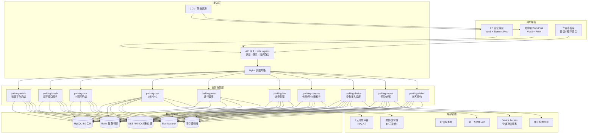

# 6. 技术架构建议

> 本章节基于《停车 SaaS 系统完整需求文档_PRD_V1.0_最终定稿》第 21 章（非功能性需求）、第 27 章（系统整体架构图）、第 29 章（最终问题确认与 PRD 更新）及第 32 章（最终定稿完成声明）提炼形成，作为后续技术方案设计与系统实现的顶层指导。

---

## 6.1 总体架构定位

停车 SaaS 平台采用「**云端多租户 + 边缘岗亭 PWA + 微信小程序**」三端一体架构：

- **后端**：Java 17/21 + Spring Boot 3 + MyBatis-Plus + MySQL 8.0 + Redis；
- **PC 运营平台**：Vue 3 + Element Plus；
- **岗亭端**：Vue 3 + PWA，支持离线缓存与弱网环境；
- **车主小程序**：微信小程序原生框架；
- **部署**：Docker 容器化 + Kubernetes 编排，按租户与业务域水平扩展。

架构设计遵循以下红线：

1. **纯 SaaS 多租户**：所有业务表必须包含 `tenant_id BIGINT NOT NULL`，所有查询必须带 `tenant_id` 过滤；
2. **软删除**：每张表包含 `deleted_at DATETIME DEFAULT NULL`，删除时更新为当前时间，查询时过滤 `deleted_at IS NULL`；
3. **金额精确**：金额字段统一使用 `DECIMAL(18,2)` 或 `DECIMAL(18,4)`，禁止使用 `FLOAT/DOUBLE`；
4. **车牌大写**：车牌号码统一以大写存储，业务层入参转大写后再落库/查询；
5. **操作审计**：所有配置变更记录 `operator_id`、`operator_ip`、`operation_time`、`before_value/after_value`（JSON）；
6. **并发控制**：车位余量、优惠券库存、积分扣减必须使用 Redis 分布式锁 + 数据库乐观锁（`version` 字段）；
7. **时间字段**：统一使用 `DATETIME(3)` 或 `DATETIME`。

---

## 6.2 系统整体架构图

### 6.2.1 文字描述

系统自顶向下分为五层：

1. **用户端层**：PC 运营平台（管理员）、岗亭 Web/PWA（现场操作员）、微信小程序（车主/访客）；
2. **接入层**：CDN/静态资源、API 网关、负载均衡（Nginx/K8s Ingress），统一负责 SSL 终结、限流、熔断、租户路由；
3. **业务服务层**：按领域拆分的车场服务、车辆服务、收费服务、订单服务、支付服务、优惠服务、访客服务、设备服务、报表服务等；
4. **数据存储层**：MySQL 8.0 主从（业务数据）、Redis（缓存/会话/锁/实时计数）、OSS（图片/文件）、Elasticsearch（日志检索）、冷存储（归档数据）；
5. **外部依赖层**：P云开放平台（PP支付）、短信服务商、电子发票税控系统、第三方充电、地图服务。

### 6.2.2 架构图（mermaid）



### 6.2.3 适用场景与优缺点

| 维度 | 适用场景 | 优点 | 缺点/注意 |
|------|----------|------|-----------|
| 云端 SaaS + 边缘 PWA | 多车场、集团化管理、现场网络不稳定 | 集中运维成本低，岗亭可离线缓存关键数据 | 岗亭离线期间数据冲突需人工兜底 |
| 按领域微服务拆分 | 业务复杂、团队规模较大、需独立迭代 | 服务边界清晰，可独立部署扩容 | 初期拆分过细会增加运维复杂度，建议先用 Maven 多模块聚合 |
| MySQL 主从 + Redis | 高并发读写、热点配置查询 | 读写分离、缓存加速 | 需保证缓存与数据库一致性，关键配置建议本地缓存 + 推送刷新 |

---

## 6.3 服务拆分建议

### 6.3.1 拆分原则

按「**租户边界内高内聚、外部依赖低耦合**」原则拆分，初期可采用 Maven 多模块聚合工程（如 `parking-system` 作为核心 domain，`parking-boot` 作为启动器），业务流量增长后再按服务边界拆分为独立部署单元。

### 6.3.2 服务清单

| 服务/模块 | 主要职责 | 依赖 | 备注 |
|-----------|----------|------|------|
| `parking-admin` | 运营平台 Web 后端：车场配置、车辆登记、收费规则、账号权限、报表 | MySQL、Redis、RabbitMQ、OSS | 面向二级/三级管理员 |
| `parking-booth` | 岗亭端接口：车道状态、在场车辆、人工放行、收费面板、离线同步 | MySQL、Redis、WebSocket、RabbitMQ | 必须支持 PWA 离线缓存 |
| `parking-mini` | 微信小程序后端：车牌绑定、缴费、月卡续费、优惠券、发票、访客预约 | MySQL、Redis、RabbitMQ、P云开放平台 | 仅P云支付一期实现 |
| `parking-pay` | 支付中心：P云统一下单、回调、退款、对账、商户配置、停车记录同步 | MySQL、Redis、RabbitMQ、P云开放平台 | 支付策略模式，P云为唯一实现 |
| `parking-device` | 设备接入调度：相机/道闸/屏管理，统一 DeviceAccessClient；接收 Device Access Webhook 事件推送 | MySQL、Redis、RabbitMQ、Device Access HTTP | 禁止直连厂商设备；Webhook 事件需幂等去重 |
| `parking-pass` | 通行调度：入出场事件识别、匹配、开闸决策、异常处理 | MySQL、Redis、RabbitMQ | 核心流量最大 |
| `parking-fee` | 计费引擎：规则解析、费用计算、分时段/封顶/优惠叠加 | MySQL、Redis | 纯计算型，尽量无状态 |
| `parking-coupon` | 优惠/积分/商家券：发券、核销、库存、积分抵扣 | MySQL、Redis、RabbitMQ | 高并发核销场景 |
| `parking-report` | 报表与对账：统计报表、财务报表、自动提现、审计查询 | MySQL、ES、OSS | 可接受秒级延迟 |
| `parking-visitor` | 访客预约：来访单位、预约申请、审核、岗亭下发 | MySQL、Redis、RabbitMQ | 可合并至 admin |
| `parking-gateway` | API 网关：认证、限流、路由、租户解析、日志 | Redis | 预留 OpenAPI 扩展 |

### 6.3.3 关键边界约束

1. **入口网关统一鉴权**：所有请求先经过网关解析 Token，注入 `tenantId`、`userId`、`dataScope`，再路由到具体服务。禁止各服务自行解析 Token 导致逻辑不一致。
2. **Device Access 边界隔离**：`parking-device` 是平台侧唯一允许调用 Device Access 的服务，也是唯一接收 Device Access Webhook 事件推送的服务。其他服务需开闸/校时/查状态或处理识别事件时，通过内部 RPC/HTTP 调用 `parking-device`，禁止跨服务直接调用 Device Access。
3. **支付独立**：P云应用密钥、商户配置、回调全部收敛在 `parking-pay`，其他服务只通过支付订单号查询状态。`parking-pay` 同时负责P云数据同步（入场/离场/固定车/黑名单）。
4. **数据库按服务独立 Schema**：每个服务拥有独立数据库用户和 Schema，跨服务只读查询走 API 或 CDC，禁止直接连其他服务库表（除报表库可只读同步）。

---

## 6.4 数据库分库分表策略

### 6.4.1 分库策略

按「**租户 + 业务域**」二维分库：

- **平台库（`parking_platform`）**：租户、公司、集团、管理员账号、角色权限、系统配置、授权码、API 密钥。数据量小，单库即可。
- **业务主库**：
  - **模式 A（推荐初期）**：单实例多 Schema，`parking_biz_tenant_{tenant_id}`，每个 Schema 包含完整业务表。迁移脚本通过 Flyway 按租户自动执行。
  - **模式 B（大租户拆分）**：头部租户独立 RDS 实例，中小租户共享实例。
- **归档库（`parking_archive`）**：冷数据归档，只读，按年月分表。
- **日志库（`parking_log`）**：操作日志、审计日志、设备调用审计，可独立实例并降低配置。

### 6.4.2 分表策略

| 表 | 数据特征 | 分表字段 | 分表方式 | 说明 |
|---|---|---|---|---|
| `parking_record`（停车记录） | 量大、按时间增长 | `entry_time` | 按月分表 `parking_record_202601` | 每张表控制在 500 万行以内 |
| `pass_record`（通行记录） | 量大、查询按车牌/时间 | `pass_time` | 按月分表 | 保留抓拍图片 URL，图片存 OSS |
| `order`（订单） | 按租户+时间 | `create_time` | 按月分表 | 支付回调幂等依赖 `order_no` 全局唯一 |
| `vehicle`（车辆登记） | 按车场 | `tenant_id` / `lot_id` | 不分表，单表 + 索引 | 单租户车辆通常在几十万以内 |
| `operation_log`（操作日志） | 量大、按时间 | `created_at` | 按月分表 | 超过 1 年归档 |
| `device_access_audit`（设备调用审计） | 按时间 | `created_at` | 按月分表 | 开闸审计必须持久化 |
| `coupon_instance`（优惠券实例） | 按用户/时间 | `issue_time` | 按月分表 | 核销时反查原始发放记录 |
| `wallet_log`（储值流水） | 按车辆 | `vehicle_id` | 按车辆 ID 取模或按月 | 同一车辆流水集中 |

### 6.4.3 全局 ID 与唯一约束

- 所有表主键使用雪花算法（Snowflake）或数据库号段，避免自增 ID 跨库冲突；
- 分表后全局唯一字段（如 `order_no`、`vehicle_id`）使用独立发号器或 Redis 原子自增；
- 所有业务表必须包含 `tenant_id BIGINT NOT NULL` 和 `deleted_at DATETIME DEFAULT NULL`。

### 6.4.4 示例 DDL（遵循共享规范）

```sql
CREATE TABLE `parking_record` (
  `id`              BIGINT       NOT NULL COMMENT '雪花ID',
  `tenant_id`       BIGINT       NOT NULL COMMENT '租户ID',
  `lot_id`          BIGINT       NOT NULL COMMENT '车场ID',
  `plate_number`    VARCHAR(20)  NOT NULL COMMENT '车牌号（大写存储）',
  `entry_time`      DATETIME(3)  NOT NULL COMMENT '入场时间',
  `exit_time`       DATETIME(3)  NULL     COMMENT '出场时间',
  `fee_amount`      DECIMAL(18,2) DEFAULT 0 COMMENT '应收金额',
  `paid_amount`     DECIMAL(18,2) DEFAULT 0 COMMENT '实付金额',
  `status`          TINYINT      NOT NULL DEFAULT 1 COMMENT '状态',
  `version`         INT          NOT NULL DEFAULT 0 COMMENT '乐观锁版本号',
  `deleted_at`      DATETIME     NULL     DEFAULT NULL COMMENT '软删除时间',
  `created_at`      DATETIME(3)  NOT NULL DEFAULT CURRENT_TIMESTAMP(3),
  `updated_at`      DATETIME(3)  NOT NULL DEFAULT CURRENT_TIMESTAMP(3) ON UPDATE CURRENT_TIMESTAMP(3),
  PRIMARY KEY (`id`),
  KEY `idx_tenant_lot_entry` (`tenant_id`, `lot_id`, `entry_time`),
  KEY `idx_plate_entry` (`tenant_id`, `plate_number`, `entry_time`)
) ENGINE=InnoDB DEFAULT CHARSET=utf8mb4 COMMENT='停车记录';
```

---

## 6.5 Redis 缓存策略

### 6.5.1 缓存分层

| 层级 | 数据类型 | 示例 | 过期时间 | 一致性策略 |
|------|----------|------|----------|------------|
| L1 本地缓存（Caffeine） | 热点配置、字典 | 收费规则、车辆类型 | 5 分钟 | 监听 Redis Pub/Sub 刷新 |
| L2 Redis | 业务对象、会话、锁 | 车场配置、Token、车位余量 | 10~60 分钟 | Cache-Aside + 更新失效 |
| L3 数据库 | 持久化数据 | 所有业务表 | 永久 | 最终一致 |

### 6.5.2 关键缓存 Key 设计

```
# 车场完整配置（JSON）
parking:lot:config:{tenantId}:{lotId}

# 收费规则（按车场+区域）
parking:fee:rule:{tenantId}:{lotId}:{zoneId}

# 车辆档案（车牌 -> 车辆ID）
parking:vehicle:plate:{tenantId}:{plateUpper}

# 在场车辆集合（按车场）
parking:inlot:{tenantId}:{lotId}

# 车位余量实时计数
parking:space:avail:{tenantId}:{lotId}:{zoneId}

# 优惠券库存
parking:coupon:stock:{tenantId}:{ruleId}

# 商家余额
parking:merchant:balance:{tenantId}:{merchantId}

# 用户会话
parking:session:{token}
```

### 6.5.3 缓存更新策略

1. **车场配置/收费规则变更**：管理员保存后，先更新数据库，再删除对应 Redis Key，同时发布刷新事件使各服务本地缓存失效；
2. **车辆登记变更**：写库后删除 `parking:vehicle:plate:*` 缓存，下一次识别时回源重建；
3. **车位余量**：使用 Redis 原子计数 `INCR/DECR`，每日定时与数据库对账校准；
4. **订单/支付状态**：支付回调成功后，缓存订单状态 5 分钟，减少重复回调压力。

### 6.5.4 优缺点

| 方案 | 优点 | 缺点 |
|------|------|------|
| Cache-Aside + 失效 | 实现简单，数据库为主 | 短暂不一致，需配合消息队列补偿 |
| 本地缓存 + Redis 发布刷新 | 岗亭端高频查询响应 < 50ms | 需保证本地缓存刷新可靠 |

---

## 6.6 消息队列使用场景

建议采用 **RabbitMQ** 作为异步消息中间件（与 PRD 部署架构一致）。

### 6.6.1 核心场景

| 场景 | 消息类型 | 生产者 | 消费者 | 说明 |
|------|----------|--------|--------|------|
| 设备事件异步处理 | `device.event.{lotId}` | `parking-device`（接收 Webhook 后内部转发） | `parking-pass` | 车牌识别事件解耦，避免设备抖动压垮主流程；Webhook 事件需先经幂等校验 |
| 支付回调处理 | `pay.callback` | 网关/API 网关 | `parking-pay` | 异步验签、幂等、更新订单 |
| 订单状态变更通知 | `order.status.changed` | `parking-pay` | `parking-mini`、`parking-booth` | 推送给岗亭端与小程序 |
| 优惠券核销 | `coupon.consume` | `parking-pass` | `parking-coupon` | 保证库存扣减一致性 |
| 积分扣减/返还 | `points.deduct` / `points.refund` | `parking-pass`/`parking-pay` | `parking-coupon` | 积分账户变更 |
| 操作审计日志 | `audit.log` | 各服务 | `parking-report` | 异步持久化，削峰填谷 |
| 短信/订阅消息推送 | `notification.push` | 各服务 | 通知服务 | 小程序订阅消息失败 fallback 短信 |
| 数据归档任务 | `archive.job` | 定时任务 | 归档服务 | 按月迁移超期数据 |
| 岗亭离线同步 | `booth.sync` | `parking-booth` | `parking-pass`/`parking-admin` | 网络恢复后上传离线操作 |

### 6.6.2 队列与 Exchange 设计要点

- 按租户或车场进行 **Topic/Queue 路由**，避免单个队列堆积影响所有租户；
- 设备事件消息使用 **Direct Exchange**，按 `lotId` 路由到对应 Queue；
- 支付回调使用 **Delay Queue** 实现超时关单与主动查询补偿；
- 审计日志使用 **Fanout Exchange**，多消费者分别落库和写 ES；
- 所有消息消费必须保证幂等（通过业务唯一键或 Redis 去重）。

---

## 6.7 并发控制方案

### 6.7.1 需要严格并发控制的场景

1. **车位余量扣减**：同一车场多通道同时入场；
2. **优惠券库存扣减**：商家券/平台券高并发领取与核销；
3. **积分扣减**：车主使用积分抵扣停车费；
4. **储值车余额扣减**：无感支付/余额支付出场；
5. **一位多车动态升级**：固定车出场后第二辆车升级为固定车待遇。

### 6.7.2 控制策略：Redis 分布式锁 + 数据库乐观锁

#### 6.7.2.1 两层锁设计

| 层级 | 机制 | 作用 | 锁 Key 示例 |
|------|------|------|-------------|
| 分布式锁 | Redis Redisson | 串行化同一资源的并发请求 | `lock:parking:space:{lotId}:{zoneId}` |
| 数据库乐观锁 | `version` 字段 | 防止锁失效或分布式锁边界外的写冲突 | `UPDATE ... WHERE version = #{version}` |

#### 6.7.2.2 Redisson 锁示例（Java）

```java
import org.redisson.api.RLock;
import org.redisson.api.RedissonClient;
import org.springframework.stereotype.Service;

@Service
public class ParkingSpaceService {

    private final RedissonClient redissonClient;

    public ParkingSpaceService(RedissonClient redissonClient) {
        this.redissonClient = redissonClient;
    }

    /**
     * 车辆入场时扣减车位余量
     */
    public boolean deductAvailableSpace(Long tenantId, Long lotId, Long zoneId) {
        String lockKey = String.format("lock:parking:space:%d:%d:%d", tenantId, lotId, zoneId);
        RLock lock = redissonClient.getFairLock(lockKey);
        try {
            // 等待 3 秒，锁持有 10 秒，看门狗自动续期
            boolean locked = lock.tryLock(3, 10, TimeUnit.SECONDS);
            if (!locked) {
                log.warn("获取车位锁失败, tenantId={}, lotId={}, zoneId={}", tenantId, lotId, zoneId);
                return false;
            }

            // 1. 先读 Redis 实时余量
            String key = String.format("parking:space:avail:%d:%d:%d", tenantId, lotId, zoneId);
            Long avail = redissonClient.getAtomicLong(key).get();
            if (avail == null || avail <= 0) {
                return false;
            }

            // 2. 扣减 Redis 计数
            long after = redissonClient.getAtomicLong(key).decrementAndGet();
            if (after < 0) {
                // 回滚，避免超卖
                redissonClient.getAtomicLong(key).incrementAndGet();
                return false;
            }

            // 3. 数据库乐观锁更新（异步或同步均可，视一致性要求）
            int rows = parkingZoneMapper.decrementSpace(tenantId, zoneId);
            if (rows == 0) {
                // 回滚 Redis 计数
                redissonClient.getAtomicLong(key).incrementAndGet();
                return false;
            }
            return true;
        } catch (InterruptedException e) {
            Thread.currentThread().interrupt();
            return false;
        } finally {
            if (lock.isHeldByCurrentThread()) {
                lock.unlock();
            }
        }
    }
}
```

#### 6.7.2.3 数据库乐观锁示例（MyBatis-Plus）

```java
// Entity
@TableName("parking_zone")
public class ParkingZone {
    @TableId(type = IdType.ASSIGN_ID)
    private Long id;
    private Long tenantId;
    private Long lotId;
    private Integer availableSpaces;
    @Version
    private Integer version;
    private LocalDateTime deletedAt;
}

// Mapper XML 片段
// <update id="decrementSpace">
//   UPDATE parking_zone
//   SET available_spaces = available_spaces - 1, version = version + 1
//   WHERE tenant_id = #{tenantId} AND id = #{zoneId}
//     AND available_spaces > 0 AND deleted_at IS NULL
// </update>
```

### 6.7.3 各场景实现要点

#### 6.7.3.1 车位余量

- 入口识别时先获取锁，再扣减 Redis 计数；
- 余位为 0 时按车场「车位已满策略」处理；
- 出场时释放余量，`INCR` 后异步校准数据库；
- 每日凌晨对 Redis 计数与数据库物理在场车辆数进行对账。

#### 6.7.3.2 优惠券库存

- 商家充值后生成库存批次，发券时扣减「可用库存」并增加「冻结库存」；
- 用户领取时加 `lock:coupon:stock:{ruleId}` 锁；
- 核销时改为扣减「冻结库存」并增加「已核销量」；
- 过期未核销的券通过定时任务返还「可用库存」。

#### 6.7.3.3 积分扣减

- 出场结算时先扣减 Redis 预占积分，再异步持久化到数据库；
- 支付失败/取消时通过消息队列返还积分；
- 积分账户表使用 `version` 乐观锁，防止并发扣减导致负积分。

---

## 6.8 数据归档方案

### 6.8.1 归档范围与周期

依据 PRD 第 29 章 Q16 确认结果：

| 数据类型 | 线上保留期 | 归档后保留期 | 归档方式 |
|----------|------------|--------------|----------|
| 操作日志 | 1 年 | 3 年 | 按月分表迁移至归档库 |
| 车辆进出记录 | 3 年 | 5 年以上 | 按月分表 + OSS 压缩 |
| 订单数据 | 2 年 | 5 年 | 按月分表迁移 |
| 支付流水 | 5 年 | 永久 | 冷库存储 |
| 抓拍图片 | 30 天（正常）/ 90 天（异常） | 争议解决后保留 | OSS 生命周期策略转低频/归档 |
| 审计日志 | 1 年 | 3 年 | 归档库 + ES 只读索引 |

### 6.8.2 归档流程

```
定时任务触发（每月 1 日凌晨 2 点）
    │
    ▼
扫描线上超期分表（如 parking_record_202401）
    │
    ▼
数据校验（checksum） → 写入归档库/冷存储
    │
    ▼
归档成功 → 线上表标记只读 → 压缩/转存 OSS
    │
    ▼
保留 7 天后删除线上分表（或改为归档视图）
```

### 6.8.3 归档库设计

- 归档表结构与线上表保持一致，去除索引中的高频写索引，保留查询索引；
- 归档数据只读，禁止 UPDATE/DELETE；
- 归档库可部署在低成本存储上，查询响应目标 < 5s；
- 对账/审计查询走归档库或 ES 只读索引。

### 6.8.4 优缺点

| 方案 | 优点 | 缺点 |
|------|------|------|
| 按月分表 + 自动归档 | 查询性能稳定，运维简单 | 跨月查询需合并结果 |
| OSS 压缩存储图片 | 成本低，适合海量非结构化数据 | 访问延迟高于在线存储 |

---

## 6.9 Kubernetes 部署示例

### 6.9.1 部署清单（节选）

```yaml
# parking-admin-deployment.yaml
apiVersion: apps/v1
kind: Deployment
metadata:
  name: parking-admin
  namespace: parking-saas
  labels:
    app: parking-admin
spec:
  replicas: 3
  selector:
    matchLabels:
      app: parking-admin
  template:
    metadata:
      labels:
        app: parking-admin
    spec:
      containers:
        - name: parking-admin
          image: registry.example.com/parking/admin:latest
          ports:
            - containerPort: 8080
          env:
            - name: SPRING_PROFILES_ACTIVE
              value: "prod"
            - name: DB_URL
              valueFrom:
                secretKeyRef:
                  name: parking-db-secret
                  key: url
            - name: REDIS_NODES
              valueFrom:
                configMapKeyRef:
                  name: parking-config
                  key: redis.nodes
          resources:
            requests:
              memory: "512Mi"
              cpu: "250m"
            limits:
              memory: "2Gi"
              cpu: "1000m"
          livenessProbe:
            httpGet:
              path: /actuator/health/liveness
              port: 8080
            initialDelaySeconds: 60
            periodSeconds: 10
          readinessProbe:
            httpGet:
              path: /actuator/health/readiness
              port: 8080
            initialDelaySeconds: 30
            periodSeconds: 5
---
apiVersion: v1
kind: Service
metadata:
  name: parking-admin
  namespace: parking-saas
spec:
  selector:
    app: parking-admin
  ports:
    - port: 80
      targetPort: 8080
---
apiVersion: autoscaling/v2
kind: HorizontalPodAutoscaler
metadata:
  name: parking-admin-hpa
  namespace: parking-saas
spec:
  scaleTargetRef:
    apiVersion: apps/v1
    kind: Deployment
    name: parking-admin
  minReplicas: 3
  maxReplicas: 20
  metrics:
    - type: Resource
      resource:
        name: cpu
        target:
          type: Utilization
          averageUtilization: 70
```

### 6.9.2 部署要点

1. **配置外置**：数据库连接、Redis、密钥等通过 K8s Secret/ConfigMap 注入，禁止硬编码；
2. **健康探针**：每个 Spring Boot 服务暴露 `/actuator/health/liveness` 与 `/actuator/health/readiness`；
3. **HPA 弹性**：核心服务（`parking-pass`、`parking-pay`、`parking-booth`）配置 CPU/内存 HPA；
4. **日志采集**：统一输出 JSON 日志到 stdout，由 Fluentd/Vector 采集到 Elasticsearch；
5. **网络策略**：`parking-device` 仅允许访问 Device Access 内网地址，禁止访问公网；Webhook 接收端点（`/api/v1/device-webhook/events`）需配置 IP 白名单或请求签名验证。

---

## 6.10 预留接口说明

以下能力 PRD 已明确一期不实现或仅预留，后端接口必须标注【预留】，字段定义完整但当前返回 mock 或空实现：

| 模块 | 预留能力 | 说明 |
|------|----------|------|
| 支付 | 支付宝支付 | 微信支付为主，预留策略接口 |
| 支付 | 余额 + 优惠券组合支付 | 一期仅微信支付，组合支付预留 |
| 小程序 | 无感支付签约/解约/扣款 | 二期对接微信免密、支付宝无感 |
| 小程序 | 室内导航/寻车 | 预留 `parking_space`、`indoor_map` 字段 |
| 岗亭端 | 语音对讲 | 预留 WebRTC/语音通道接口 |
| 平台 | 开闸/显示屏/语音控制 | 预留 Device Access v1.0 控制接口，当前返回 mock |
| 平台 | 开闸/显示屏/语音控制 | 预留 Device Access v1.0 控制接口，当前返回 mock |
| 平台 | OpenAPI 外部对接 | 预留 API 网关路由与租户密钥 |
| 平台 | 积分商城 | 当前仅积分抵扣，商城预留 |
| 平台 | 多语言/白标 | 当前仅中文、统一品牌 |

---

## 6.11 风险与建议

| 风险点 | 影响 | 建议 |
|--------|------|------|
| 多租户数据隔离遗漏 | 严重（越权） | 所有 SQL 通过 MyBatis-Plus 插件强制注入 `tenant_id` 条件，代码 Review 必查 |
| 车位余量并发超卖 | 中等 | 必须 Redis 分布式锁 + DB 乐观锁双重保护，并定时对账 |
| 支付回调重复 | 严重（资金） | 订单表 `order_no` 唯一索引 + 幂等键 + 状态机校验 |
| 设备接入 | Device Access 事件推送（Webhook）未冻结 | 严重（阻塞主链路） | 推动 V01～V04 真机验证，确认事件字段和幂等语义；平台侧先实现 Webhook 接收端点和幂等去重 |
| 设备接入 | Device Access 开闸/控制接口未冻结 | 严重（阻塞放行） | 平台侧预留接口和审计逻辑，待 v1.0 契约冻结后联调 |
| 分表后跨月查询复杂 | 低 | 报表服务使用 ES 或归档库聚合，避免直接跨分表 JOIN |
| 图片存储成本 | 低 | OSS 设置生命周期，正常通行 30 天后转低频，90 天后删除 |

---

## 6.12 迭代阶段建议

结合 PRD 第 32 章迭代路线图，技术落地可按以下节奏推进：

| 阶段 | 时间 | 技术重点 |
|------|------|----------|
| 一期（MVP） | 1-2 个月 | 完成多租户基础、车场/车辆/收费核心表、岗亭 PWA 基础、微信支付、通行调度 |
| 二期 | 3-4 个月 | 优惠券/积分/商家优惠、无感支付预留、访客预约、报表分析、数据归档 |
| 三期 | 5-6 个月 | 电子发票、财务管理、API 网关开放、第三方对接、多语言/白标预留 |

---

> 本章节为技术架构建议，具体接口契约、数据库 DDL、OpenAPI 定义需结合后续详细设计文档进一步细化。
