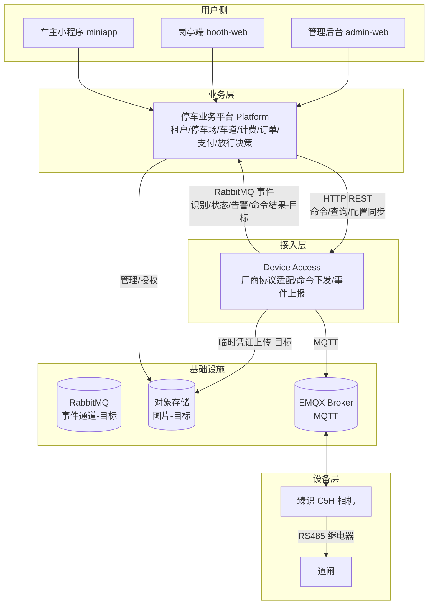
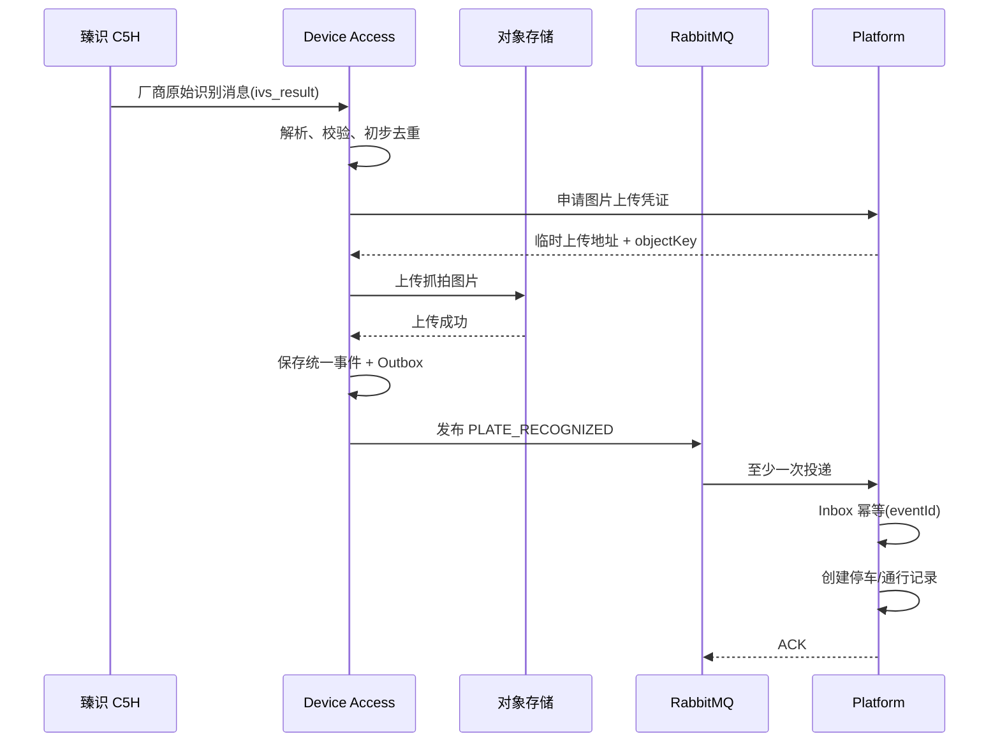
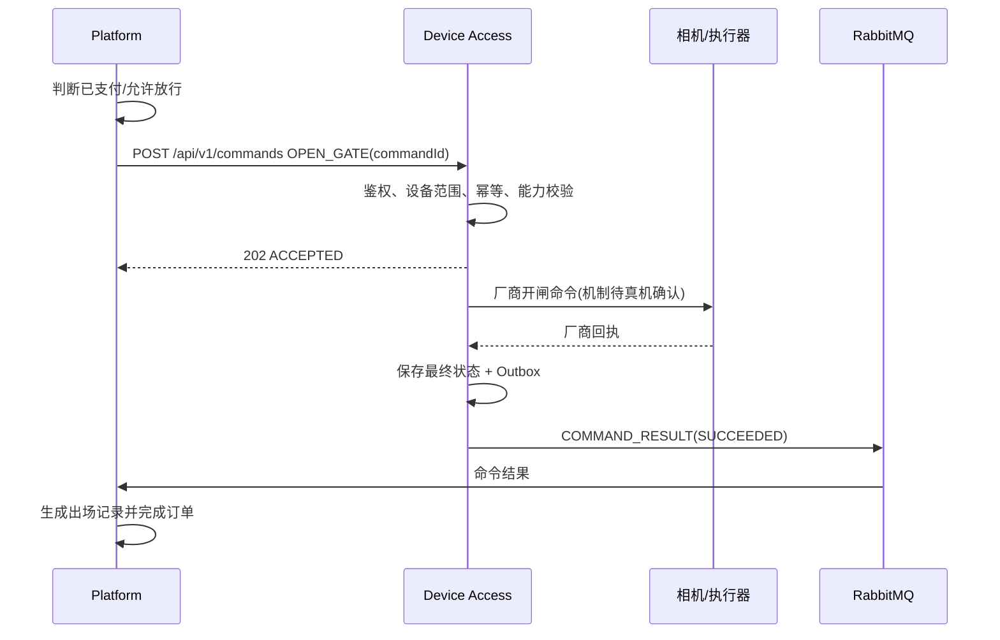
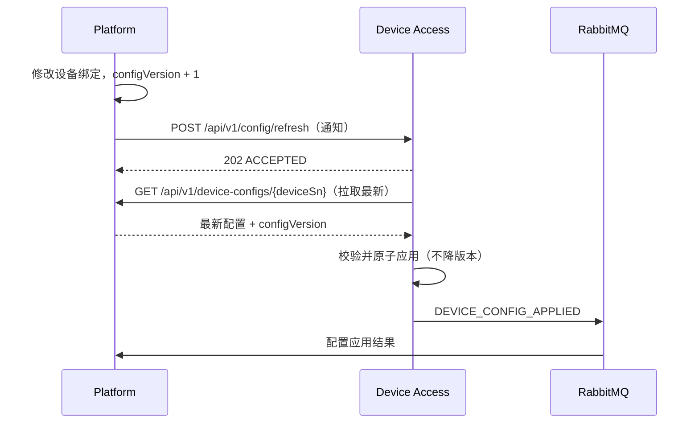

# 02 职责边界与数据所有权

> 文档状态：DRAFT FOR JOINT REVIEW
> 分类：BUSINESS-REQUIREMENT + TARGET-DRAFT

---

## 1. 系统上下文

核心约束：

- 设备永远不会直接和业务系统通信；
- 所有设备交互必须经过 Device Access；
- Platform 不直接连接厂商 MQTT，不拼装厂商 Topic，不解析厂商私有报文；
- Device Access 不直接控制道闸业务语义，不判断月卡/支付/放行；
- 双方不得直接读写对方数据库。

## 2. Platform 职责

停车业务平台负责：

1. 租户和客户；
2. 停车场；
3. 车道；
4. 平台逻辑设备档案；
5. 设备与车道、停车场、租户绑定；
6. 车辆入场和出场业务；
7. 停车记录；
8. 计费；
9. 月卡、白名单、黑名单和免费车；
10. 订单；
11. 支付；
12. 是否允许放行的最终业务决策；
13. 操作员权限；
14. 人工开闸审批和审计；
15. 业务告警处理；
16. 对象存储授权和图片访问；
17. 多租户与多停车场数据隔离。

## 3. Device Access 职责

Device Access 负责：

1. 接入物理设备；
2. MQTT、TCP、HTTP、SDK 等协议通信；
3. 厂商协议解析；
4. 厂商字段到统一事件的转换；
5. 统一命令到厂商命令的转换；
6. 设备注册和通信身份识别；
7. 设备连接、心跳和在线状态；
8. 原始设备报文保存和脱敏；
9. 命令下发；
10. 厂商回执关联；
11. 命令执行状态；
12. 设备事件可靠投递；
13. 事件去重基础信息（eventId / vendorEventId / sequenceNo）；
14. 本地离线缓存和补传；
15. 图片获取、上传和补传；
16. 厂商适配器；
17. 设备通信日志和指标。

## 4. Device Access 严禁负责

- 停车费计算；
- 月卡判断；
- 支付状态判断；
- 订单创建；
- 车辆是否可以免费放行的业务决定；
- 直接写 Platform 数据库；
- 根据厂商白名单直接替代平台业务规则。

## 5. Platform 严禁

- 直接连接厂商 MQTT；
- 拼装厂商 Topic；
- 解析 `ivs_result` 等厂商私有报文；
- 保存厂商 MQTT 密码供前端使用；
- 浏览器直接调用 Device Access；
- 将前端传入的 `deviceSn` 原样透传给 Device Access（必须经后端可信配置校验）；
- 在网络超时后盲目重复开闸。

## 6. 数据所有权

### 6.1 Platform 是以下数据的最终数据源

| 数据 | 所有者 | 说明 |
|------|--------|------|
| `tenantId` | Platform | 租户主数据 |
| `parkingLotId` | Platform | 停车场主数据 |
| `laneId` | Platform | 车道主数据 |
| 平台逻辑设备档案 | Platform | 平台逻辑设备（CAMERA/GATE）与绑定 |
| 设备与车道绑定 | Platform | 哪台设备属于哪个车道 |
| 入口/出口方向 | Platform | 车道方向 |
| 设备启用状态（administrativeStatus） | Platform | 平台管理状态：未激活/启用/禁用/维护中 |
| 允许能力（capabilities） | Platform | 平台授权的能力，Device Access 实际能力不得超出 |
| 逻辑道闸与执行相机映射 | Platform | `logicalGateDeviceId → executorDeviceId` |
| 业务权限 | Platform | 操作人权限、放行权限 |
| 计费/订单/支付/停车记录 | Platform | 业务数据 |
| objectKey 访问授权 | Platform | 对象存储桶策略与临时签名 |

### 6.2 Device Access 是以下数据的最终数据源

| 数据 | 所有者 | 说明 |
|------|--------|------|
| 设备通信会话 | Device Access | MQTT/TCP/HTTP 连接状态 |
| 厂商协议配置 | Device Access | 厂商 Topic、字段映射 |
| 厂商凭证 | Device Access | MQTT 用户名/密码、SDK 凭证（不明文入库） |
| 心跳接收时间 | Device Access | `lastHeartbeatAt` |
| 原始设备状态（connectivityStatus/healthStatus） | Device Access | 在线/离线、故障 |
| 厂商回执 | Device Access | 命令回执原始码与消息 |
| 原始报文及解析状态 | Device Access | 厂商报文留档（脱敏） |
| 命令执行状态 | Device Access | commandId 生命周期 |
| 本地配置缓存版本 | Device Access | `configVersion` 本地应用版本 |
| 事件投递状态（Outbox） | Device Access | 事件发布与重试 |

### 6.3 数据归属结论

> 不得让双方各自独立维护一份互相冲突的停车场、车道和设备绑定主数据。

- 平台逻辑设备 = 业务台账（谁、在哪个车道、放行能力、是否启用）；
- Device Access 设备 = 通信实体（SN、连接、心跳、协议）；
- 二者通过 `deviceSn`（厂商 SN）关联；
- 目标设计中 Platform 拥有设备业务主数据并同步给 Device Access，Device Access 的 v0.2 设备 CRUD 在目标架构中降级为内部/同步接口（见 §8 与冲突 C10）。

## 7. 状态所有权

### 7.1 三维度状态模型

> NEEDS_HUMAN_DECISION（最终枚举值待确认），推荐如下三维度拆分。

不得强行把平台 6 态与 Device Access 3 态合并为单一枚举。建议冻结三个不同维度：

| 维度 | 所有者 | 当前来源 | 候选值 |
|------|--------|----------|--------|
| `administrativeStatus`（管理状态） | Platform | 需求规格 §7.9 | `UNACTIVATED` / `ENABLED` / `DISABLED` / `MAINTENANCE` |
| `connectivityStatus`（连接状态） | Device Access | Device Access 代码 | `ONLINE` / `OFFLINE` / `UNKNOWN` |
| `healthStatus`（健康状态） | Device Access（推导）+ Platform（告警） | 需求规格 §7.9 故障 | `NORMAL` / `FAULT` / `UNKNOWN` |

- 平台"未激活/禁用/维护中" → `administrativeStatus`；
- Device Access"ONLINE/OFFLINE" → `connectivityStatus`；
- 平台"故障" → `healthStatus=FAULT`（由 Device Access 告警或心跳异常推导，Platform 记录与展示）；
- 平台"在线/离线"展示 = `connectivityStatus` 映射。

### 7.2 状态转换规则

- `connectivityStatus`：心跳在阈值内 → ONLINE；超阈值 → OFFLINE（Device Access 检测并发布 DEVICE_OFFLINE）；
- `administrativeStatus`：由平台运维操作，Platform 推送配置同步给 Device Access，Device Access 据此停止生成业务事件/拒绝命令；
- `healthStatus`：由告警事件驱动，告警恢复时置 NORMAL；
- 禁用设备后 Device Access 保留连接诊断数据，拒绝控制命令，已在执行的高风险命令按安全策略终止或完成；
- 平台展示状态 = `administrativeStatus` + `connectivityStatus` + `healthStatus` 组合，不得用单一枚举表达。

## 8. 设备配置所有权

- Platform 是设备业务配置（绑定、方向、能力、启用、心跳阈值、图片策略、`configVersion`）的最终数据源；
- Device Access 可缓存配置，但必须：持久化最后成功版本、启动加载、收到刷新通知后拉取、不使用低版本覆盖高版本、配置损坏回退；
- Device Access v0.2 的设备 CRUD（POST/PUT/DELETE `/api/v1/devices`）在目标架构中的定位：> NEEDS_HUMAN_DECISION（见冲突 C10）。推荐定位为"内部运维 + 平台配置同步缓存"，不再作为设备业务主数据的权威源；目标由 Platform 推送设备配置同步替代裸 CRUD。

## 9. 图片所有权

| 职责 | 归属 |
|------|------|
| 对象存储管理（桶、策略、生命周期） | Platform |
| 临时上传凭证签发 | Platform |
| 图片获取、上传、哈希计算、补传 | Device Access |
| objectKey 保存与业务关联 | Platform |
| 临时访问签名 URL | Platform |

禁止：RabbitMQ 传 Base64、库存图片二进制、永久公开 URL、Device Access 保存对象存储主密钥。

## 10. 日志与审计所有权

| 日志类型 | 所有者 | 关键字段 |
|----------|--------|----------|
| 业务调用审计（开闸原因、操作人、订单） | Platform | tenantId/parkingLotId/laneId/platformDeviceId/deviceSn/operationType/operatorId/traceId/result |
| 命令执行日志 | Device Access | commandId/commandType/deviceSn/status/vendorCode/traceId |
| 原始厂商报文（脱敏） | Device Access | sn/name/timestamp/摘要 |
| 通信指标 | Device Access | online/offline/mqtt 连接/事件投递 |

## 11. 数据流图

### 11.1 车辆识别上报（目标）

### 11.2 平台下发开闸（目标）

> 当前（CURRENT-COMPATIBILITY）：开闸接口已从 Device Access v0.2 代码移除（见 `04-当前兼容契约-v0.2`、冲突 C01）。目标开闸机制需真机确认 C5H 实际开闸方式。

### 11.3 配置同步（目标，推荐方案 C：通知 + 拉取）

