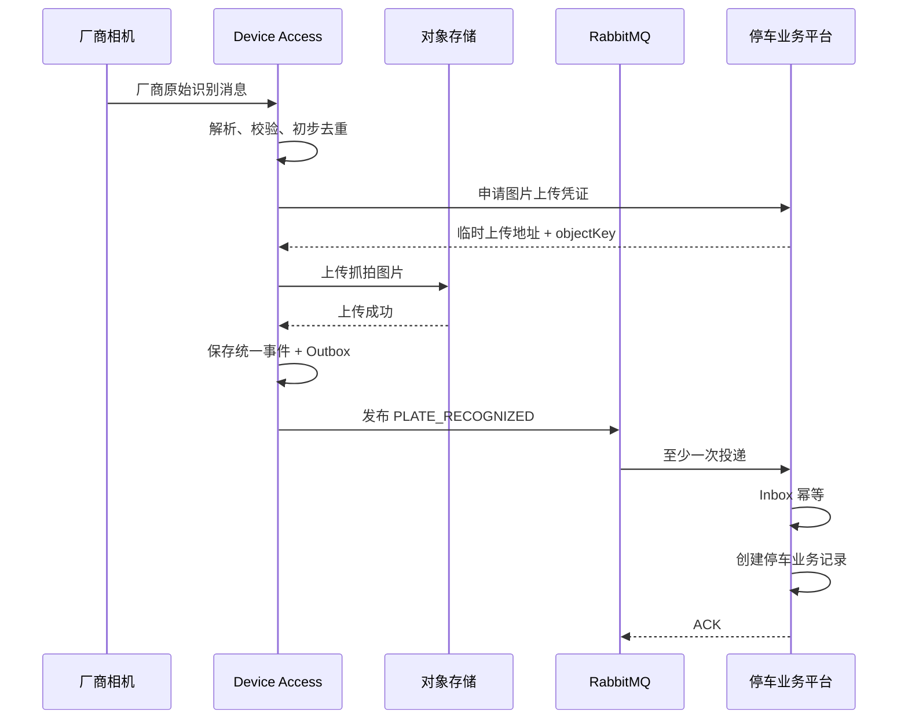
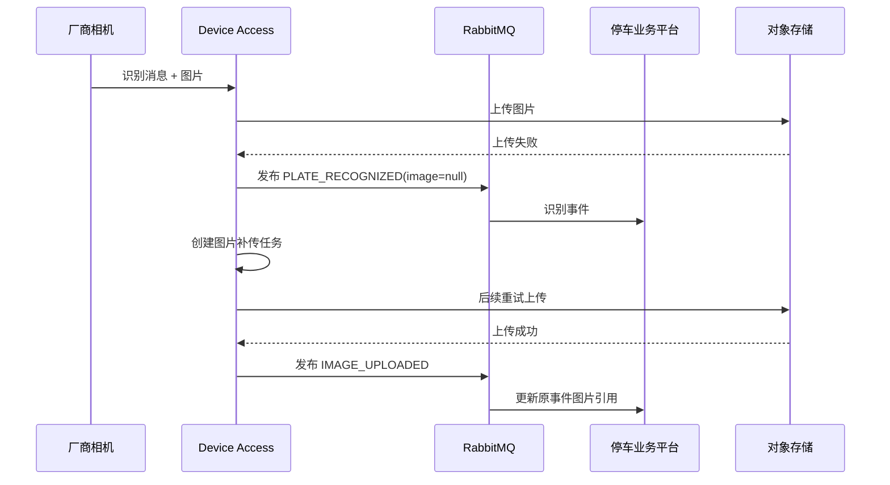
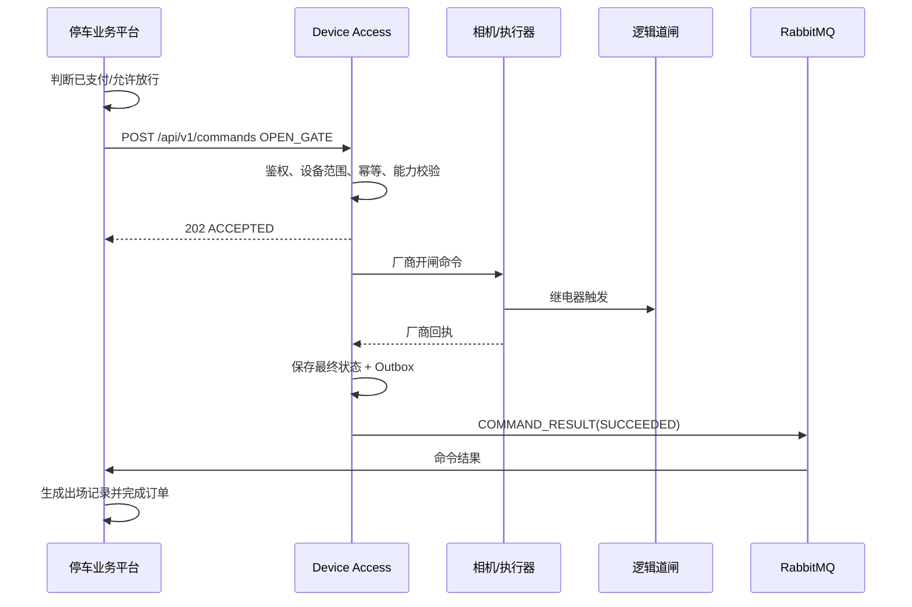
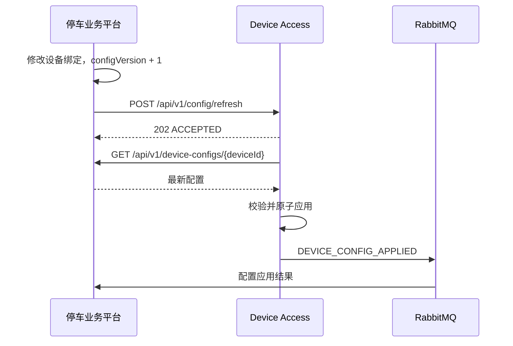

# 停车业务平台与 Device Access 接口规范（真机实现合并版）

> 文档版本：V1.0-MERGED  
> 当前接口版本：Device Access API v0.1  
> 文档状态：当前真机联调基线  
> 适用系统：停车业务平台、Device Access 设备接入服务  
> 当前设备范围：臻识 C5H 车牌识别相机及其继电器控制的道闸  
> 当前协议：停车业务平台通过 HTTP 调用 Device Access；Device Access 内部通过 MQTT 与设备通信  
> 编制日期：2026-07-10  
> 冲突处理原则：两份原始文档内容不一致时，以《Device Access 真机验证接口》描述的已实现行为为准

---

## 目录

1. [文档目的](#1-文档目的)
2. [合并及优先级规则](#2-合并及优先级规则)
3. [当前已实现范围](#3-当前已实现范围)
4. [术语与职责边界](#4-术语与职责边界)
5. [当前总体架构](#5-当前总体架构)
6. [基础地址与公共响应](#6-基础地址与公共响应)
7. [设备标识规则](#7-设备标识规则)
8. [开闸接口](#8-开闸接口)
9. [校时接口](#9-校时接口)
10. [查询设备状态接口](#10-查询设备状态接口)
11. [当前错误码](#11-当前错误码)
12. [超时、重试与幂等](#12-超时重试与幂等)
13. [在线状态判定](#13-在线状态判定)
14. [停车业务平台接入规则](#14-停车业务平台接入规则)
15. [日志、审计与监控](#15-日志审计与监控)
16. [安全与部署边界](#16-安全与部署边界)
17. [当前接口验收用例](#17-当前接口验收用例)
18. [原 V1.0 设计与当前实现差异](#18-原-v10-设计与当前实现差异)
19. [后续目标设计](#19-rabbitmq-事件总览目标设计当前-v01-未实现)

---

## 1. 文档目的

本文档将以下两份文档合并为一份统一规范：

1. 《停车业务平台与 Device Access 接口规范 V1.0》；
2. 《Device Access 真机验证接口》。

合并后的文档同时承担两类作用：

- **当前联调依据**：第 1～18 章描述 Device Access v0.1 已经实现并经过真机验证的接口，停车业务平台应按这些接口开发；
- **后续演进参考**：第 19 章及以后保留原 V1.0 中 RabbitMQ、统一事件、统一命令、配置同步、对象存储等目标设计，但这些内容当前尚未由 Device Access v0.1 提供，不能作为现阶段已经可调用的接口。

当前联调必须以实际可运行行为为准，不得因为目标架构中存在某项设计，就假定 Device Access 已经实现该能力。

---

## 2. 合并及优先级规则

### 2.1 文档优先级

当两份原始文档出现冲突时，按以下顺序处理：

1. Device Access 真机验证接口中明确写明的接口路径、请求参数、返回字段和运行行为；
2. Device Access 当前代码及真机实测行为；
3. 本合并文档第 1～18 章；
4. 原 V1.0 目标设计；
5. 其他口头约定或未冻结草稿。

### 2.2 已覆盖的冲突

本合并版已按真机接口覆盖以下差异：

| 项目 | 原 V1.0 目标设计 | 当前真机实现，最终采用 |
|---|---|---|
| 开闸入口 | `POST /api/v1/commands` | `POST /api/v1/devices/{deviceId}/gate/open` |
| 校时入口 | 统一命令 `SYNC_TIME` | `POST /api/v1/devices/{deviceId}/time/sync` |
| 命令返回 | `202 Accepted`，异步回执 | 同步等待设备回复并返回最终结果 |
| 最终结果 | RabbitMQ `COMMAND_RESULT` | 当前 HTTP 响应 |
| 设备标识 | 平台 `deviceId` 与厂商 `deviceSn` 分离 | 跨系统调用中的 `deviceId` 必须等于臻识设备 SN |
| 命令幂等 | `commandId` 幂等 | 当前无幂等保护，每次请求都会执行 |
| 服务认证 | HMAC-SHA256 | 当前接口未定义服务认证 |
| 传输协议 | 生产 HTTPS | 当前 Base URL 为 HTTP |
| 时间格式 | ISO 8601，带时区 | 当前响应使用 `yyyy-MM-dd HH:mm:ss` |
| 在线阈值 | 配置化，示例 180 秒 | 当前固定为 30 秒无心跳视为离线 |
| 设备心跳 | RabbitMQ 心跳事件 | 当前由 Device Access 内部维护，平台通过状态接口查询 |
| RabbitMQ 事件 | 当前主链路 | v0.1 未在真机接口文档中提供 |
| 配置同步 | 平台接口 + `configVersion` | v0.1 未提供 |
| 图片上传 | 临时上传凭证 | v0.1 未提供 |

### 2.3 未定义能力的处理

真机接口未定义的能力一律按“当前未实现”处理，包括但不限于：

- 车牌识别事件向停车业务平台上报；
- RabbitMQ Exchange、Queue 和 Routing Key；
- 命令查询接口；
- 命令异步结果事件；
- Device Access 配置刷新；
- Device Access 主动拉取平台设备配置；
- 图片上传和补传；
- HMAC 服务间认证；
- `commandId` 和 `eventId` 幂等；
- Outbox、Inbox 和死信队列；
- 关闸、常开、取消常开、抓拍和重启接口。

上述能力必须在 Device Access 实际实现、双方联调通过并更新本规范后，才能进入正式调用链路。

---

## 3. 当前已实现范围

### 3.1 已实现接口

Device Access v0.1 当前提供三个接口：

| 方法 | 路径 | 用途 | 当前语义 |
|---|---|---|---|
| POST | `/api/v1/devices/{deviceId}/gate/open` | 开闸 | 同步等待设备回复 |
| POST | `/api/v1/devices/{deviceId}/time/sync` | 校时 | 同步等待设备回复 |
| GET | `/api/v1/devices/{deviceId}/status` | 查询设备状态 | 返回当前缓存的心跳和道闸状态 |

### 3.2 当前支持设备

- 厂商：臻识；
- 型号：C5H；
- 道闸控制方式：相机继电器控制；
- Device Access 与设备通信方式：MQTT；
- 设备调用标识：臻识 C5H 的 `sn`。

### 3.3 当前不保证的能力

- 不保证接口幂等；
- 不保证命令异步可靠投递；
- 不提供命令记录查询；
- 不提供跨实例一致性；
- 不提供 RabbitMQ 业务事件；
- 不提供平台配置同步；
- 不提供对象存储图片上传；
- 不提供服务间签名认证；
- 不提供信路通正式适配；
- 不提供完整离线补传。

---

## 4. 术语与职责边界

### 4.1 术语

| 名称 | 定义 |
|---|---|
| 停车业务平台 | 负责停车场、车道、停车记录、计费、订单、支付和放行决策 |
| Device Access | 负责连接设备、解析厂商协议、发送 MQTT 命令并维护设备状态 |
| 厂商设备 | 当前指臻识 C5H 相机及其继电器控制的道闸 |
| `deviceId` | 当前 HTTP 路径参数，实际值必须是厂商设备 SN |
| 平台设备主键 | 停车业务平台数据库内部设备 ID，不应直接替代当前接口的 `deviceId` |
| 设备回复 | Device Access 下发 MQTT 命令后收到的厂商响应 |
| 同步等待 | HTTP 请求保持等待，直到设备回复、设备拒绝、MQTT 不可用或 10 秒超时 |

### 4.2 Device Access 当前职责

Device Access 当前负责：

1. 保存已接入设备信息；
2. 维护 MQTT Broker 连接；
3. 按设备 SN 查找设备；
4. 向设备下发开闸命令；
5. 向设备下发校时命令；
6. 同步等待设备回复；
7. 维护设备最后在线时间；
8. 根据心跳计算在线状态；
9. 维护道闸状态和道闸连接状态；
10. 将设备错误转换为 HTTP 错误响应。

### 4.3 停车业务平台职责

停车业务平台负责：

1. 租户、停车场、车道和设备业务数据；
2. 保存平台设备主键与厂商 SN 的映射；
3. 判断车辆是否允许放行；
4. 计费、订单和支付；
5. 调用开闸接口；
6. 处理开闸成功、拒绝、MQTT 不可达和超时；
7. 查询和展示设备状态；
8. 保存调用日志和人工操作审计；
9. 对跨租户、跨停车场和跨车道操作进行后端校验；
10. 在当前无设备侧幂等保护的情况下避免盲目重复开闸。

### 4.4 禁止事项

停车业务平台不得：

- 直接连接臻识设备 MQTT；
- 在业务模块中自行拼装厂商 MQTT Topic；
- 绕过 Device Access 直接向设备下发命令；
- 使用未经映射校验的任意 SN 调用接口；
- 因 HTTP 超时直接断定道闸未动作；
- 对开闸请求进行无条件自动重试；
- 将前端传入的设备 SN 直接透传给 Device Access；
- 将 `deviceId` 名称误解为平台数据库主键。

Device Access 不得：

- 判断月卡、白名单、订单或支付状态；
- 自行计算停车费；
- 未经平台业务决策主动执行收费放行；
- 直接写入停车业务平台数据库。

---

## 5. 当前总体架构

```text
┌─────────────────────────────┐
│       停车业务平台           │
│ 记录 / 计费 / 订单 / 支付     │
└──────────────┬──────────────┘
               │ HTTP
               │ 开闸 / 校时 / 状态查询
               ▼
┌─────────────────────────────┐
│        Device Access         │
│ 设备注册 / MQTT / 状态 / 控制 │
└──────────────┬──────────────┘
               │ MQTT
               ▼
┌─────────────────────────────┐
│       臻识 C5H 相机           │
│      相机继电器 → 道闸         │
└─────────────────────────────┘
```

### 5.1 当前通信方向

| 方向 | 协议 | 当前用途 |
|---|---|---|
| 停车业务平台 → Device Access | HTTP REST | 开闸、校时、查询状态 |
| Device Access ↔ 臻识设备 | MQTT | 厂商命令、设备回复、心跳和状态 |
| Device Access → 停车业务平台 | 未定义 | v0.1 未提供统一事件上报契约 |
| Device Access → RabbitMQ | 未实现或未纳入当前契约 | 不得作为当前可用能力 |
| Device Access → 对象存储 | 未实现或未纳入当前契约 | 不得作为当前可用能力 |

### 5.2 数据所有权

- 停车业务平台是租户、停车场、车道、业务设备绑定和停车业务的最终数据源；
- Device Access 保存设备通信所需信息和运行状态；
- 双方不得直接读写对方数据库；
- 当前调用必须通过设备 SN 完成，但平台仍应保留自己的设备主键。

---

## 6. 基础地址与公共响应

### 6.1 Base URL

```text
http://{host}:8081
```

示例：

```text
http://127.0.0.1:8081
http://device-access.internal:8081
```

### 6.2 Content-Type

```text
Content-Type: application/json
```

### 6.3 当前统一响应格式

```json
{
  "code": 200,
  "message": "success",
  "data": {},
  "timestamp": "2026-07-10 14:30:00"
}
```

| 字段 | 类型 | 说明 |
|---|---|---|
| `code` | integer | 当前业务结果码，通常与 HTTP 状态一致 |
| `message` | string | 结果或错误说明 |
| `data` | object/null | 返回数据 |
| `timestamp` | string | 当前格式为 `yyyy-MM-dd HH:mm:ss` |

### 6.4 客户端兼容要求

当前部分设备接口示例可能未展示全部公共字段。停车业务平台客户端应：

- 以 HTTP 状态和 `code` 共同判断结果；
- 允许 `message`、`data` 或 `timestamp` 在异常情况下缺失；
- 忽略未知新增字段；
- 不依赖 JSON 字段顺序；
- 使用 UTF-8 解析响应；
- 对响应反序列化失败记录原始摘要，不记录敏感信息。

---

## 7. 设备标识规则

### 7.1 当前强制规则

当前接口中的路径参数 `deviceId` 必须与臻识 C5H 的 `sn` 完全一致。

示例：

```text
a422cb58-6c62f055
```

调用示例：

```http
POST /api/v1/devices/a422cb58-6c62f055/gate/open
```

### 7.2 平台数据模型建议

停车业务平台至少保留：

| 字段 | 说明 |
|---|---|
| `id` | 平台内部设备主键 |
| `device_code` | 人类可读设备编码 |
| `vendor` | 当前为 `ZHENSHI` |
| `model` | 当前为 `C5H` |
| `device_sn` | 厂商 SN，调用 Device Access 时使用 |
| `tenant_id` | 租户 |
| `parking_lot_id` | 停车场 |
| `lane_id` | 车道 |
| `enabled` | 是否启用 |
| `device_access_base_url` | Device Access 地址或服务引用 |

建议唯一约束：

```text
UNIQUE(vendor, device_sn)
```

建议常用索引：

```text
INDEX(tenant_id, parking_lot_id, lane_id)
INDEX(parking_lot_id, enabled)
```

### 7.3 调用前校验

平台调用 Device Access 前必须校验：

1. 当前操作人有权限；
2. 设备属于当前租户；
3. 设备属于当前停车场；
4. 设备绑定当前车道；
5. 设备已启用；
6. `device_sn` 非空；
7. 厂商和型号在当前 Device Access 支持范围内；
8. 调用目标来自后端可信配置，而不是前端自由输入。

---

## 8. 开闸接口

### 8.1 接口说明

向指定臻识 C5H 相机下发开闸命令，并同步等待设备回复。

```http
POST /api/v1/devices/{deviceId}/gate/open
```

### 8.2 路径参数

| 参数 | 类型 | 必填 | 说明 |
|---|---|---|---|
| `deviceId` | string | 是 | 臻识 C5H 的设备 SN |

### 8.3 请求体

请求体为空。

推荐请求：

```http
POST /api/v1/devices/a422cb58-6c62f055/gate/open
Content-Type: application/json
```

可以不发送 body；如调用框架要求，可发送空 JSON：

```json
{}
```

### 8.4 成功响应

设备返回成功时：

```json
{
  "code": 200,
  "message": "success",
  "data": {
    "success": true,
    "deviceCode": 200,
    "message": "Gate opened"
  },
  "timestamp": "2026-07-10 14:30:00"
}
```

平台处理：

- 将本次设备调用标记为成功；
- 保存设备返回码和消息；
- 记录业务原因、操作人、车辆、订单和停车记录；
- 注意：HTTP 成功代表 Device Access 收到设备成功回复，不等价于平台可以省略业务审计。

### 8.5 设备拒绝

设备返回非 200：

```json
{
  "code": 500,
  "message": "Device returned error code: 500",
  "data": null,
  "timestamp": "2026-07-10 14:30:00"
}
```

平台处理：

- 标记开闸失败；
- 不得生成“已成功开闸”状态；
- 显示设备错误信息；
- 生成设备异常记录或告警；
- 允许岗亭人工兜底。

### 8.6 设备不存在

```json
{
  "code": 404,
  "message": "Device not found: a422cb58-6c62f055",
  "data": null,
  "timestamp": "2026-07-10 14:30:00"
}
```

平台处理：

- 检查平台保存的 `device_sn`；
- 检查 Device Access 是否已录入该设备；
- 禁止通过反复尝试不同 SN 进行枚举；
- 记录配置错误。

### 8.7 MQTT 未连接

```json
{
  "code": 503,
  "message": "MQTT is not connected, cannot send command",
  "data": null,
  "timestamp": "2026-07-10 14:30:00"
}
```

平台处理：

- 标记 Device Access 当前无法向设备下发命令；
- 展示通信不可用；
- 可以在确认 MQTT 恢复后重试；
- 自动重试开闸前必须考虑重复动作风险。

### 8.8 命令超时

Device Access 内部等待设备回复的超时时间为 10 秒。

```json
{
  "code": 500,
  "message": "Command failed: ...",
  "data": null,
  "timestamp": "2026-07-10 14:30:10"
}
```

超时只表示 Device Access 在 10 秒内没有确认设备回复，不保证设备一定没有动作。

平台不得因为超时立即无条件再次开闸。应先：

1. 查询设备状态；
2. 检查现场道闸；
3. 由岗亭人员确认；
4. 确认安全后再执行人工重试。

---

## 9. 校时接口

### 9.1 接口说明

将 Device Access 当前时间同步到指定设备。

```http
POST /api/v1/devices/{deviceId}/time/sync
```

### 9.2 路径参数

| 参数 | 类型 | 必填 | 说明 |
|---|---|---|---|
| `deviceId` | string | 是 | 臻识 C5H 的设备 SN |

### 9.3 请求体

请求体为空。

```http
POST /api/v1/devices/a422cb58-6c62f055/time/sync
Content-Type: application/json
```

### 9.4 成功响应

```json
{
  "code": 200,
  "message": "success",
  "data": {
    "success": true,
    "deviceCode": 200,
    "message": "Time synced"
  },
  "timestamp": "2026-07-10 14:30:00"
}
```

### 9.5 失败响应

校时接口使用与开闸相同的主要错误：

- `404`：设备不存在；
- `503`：MQTT 未连接；
- `500`：设备错误、内部错误或 10 秒超时。

### 9.6 使用要求

- 校时属于运维操作；
- 仅设备运维人员或授权管理员可执行；
- 记录操作人、设备、时间和结果；
- 当前请求不支持传入目标时间，实际同步时间由 Device Access 决定；
- 不得按原 V1.0 的 `SYNC_TIME` 统一命令格式调用。

---

## 10. 查询设备状态接口

### 10.1 接口说明

查询设备在线状态、最后在线时间、道闸状态和道闸连接状态。

```http
GET /api/v1/devices/{deviceId}/status
```

### 10.2 路径参数

| 参数 | 类型 | 必填 | 说明 |
|---|---|---|---|
| `deviceId` | string | 是 | 臻识 C5H 的设备 SN |

### 10.3 成功响应

```json
{
  "code": 200,
  "message": "success",
  "data": {
    "deviceId": "a422cb58-6c62f055",
    "deviceName": "东门入口摄像头",
    "brand": "ZHENSHI",
    "model": "C5H",
    "online": true,
    "lastOnlineTime": "2026-07-10 14:29:55",
    "gateStatus": 1,
    "gateConnectStatus": 1
  },
  "timestamp": "2026-07-10 14:30:00"
}
```

### 10.4 字段说明

| 字段 | 类型 | 可空 | 说明 |
|---|---|---|---|
| `deviceId` | string | 否 | 当前为设备 SN |
| `deviceName` | string | 否 | Device Access 中保存的设备名称 |
| `brand` | string | 否 | 当前固定为 `ZHENSHI` |
| `model` | string | 否 | 当前固定为 `C5H` |
| `online` | boolean | 否 | 30 秒内有心跳则为 true |
| `lastOnlineTime` | string | 是 | 最后在线时间，从未上线时为 null |
| `gateStatus` | integer | 是 | `0` 关到位、`1` 开到位、`2` 中间状态 |
| `gateConnectStatus` | integer | 是 | `0` 未连接、`1` 已连接 |

### 10.5 状态枚举

`gateStatus`：

| 值 | 含义 |
|---|---|
| `0` | 关到位 |
| `1` | 开到位 |
| `2` | 开关过程或中间状态 |
| `null` | 尚未收到过道闸状态 |

`gateConnectStatus`：

| 值 | 含义 |
|---|---|
| `0` | 道闸未连接 |
| `1` | 道闸已连接 |
| `null` | 尚未收到过连接状态 |

### 10.6 设备不存在

```json
{
  "code": 404,
  "message": "Device not found: xxx",
  "data": null,
  "timestamp": "2026-07-10 14:30:00"
}
```

### 10.7 平台展示建议

平台可转换为以下展示状态：

| 条件 | 展示 |
|---|---|
| `online=true` 且 `gateConnectStatus=1` | 在线 |
| `online=true` 且 `gateConnectStatus=0` | 相机在线，道闸未连接 |
| `online=false` | 离线 |
| `lastOnlineTime=null` | 从未上线 |
| `gateStatus=null` | 道闸状态未知 |
| 接口调用失败 | Device Access 状态不可用 |

平台不得把“Device Access 接口可访问”误认为“设备在线”。

---

## 11. 当前错误码

| HTTP 状态码 / code | 含义 | 平台处理建议 |
|---|---|---|
| `200` | 成功 | 正常处理 |
| `404` | 设备不存在 | 检查设备 SN 和 Device Access 注册信息 |
| `503` | MQTT Broker 不可达或未连接 | 等待自动重连，确认恢复后再操作 |
| `500` | 内部错误、设备拒绝或命令超时 | 根据 `message` 判断并记录 |
| 连接超时 | Device Access 地址不可达 | 检查网络、服务和端口 |
| 反序列化失败 | 返回格式异常 | 保存响应摘要并告警 |

### 11.1 当前错误模型限制

当前 `500` 同时承载多种情况：

- 厂商设备返回错误码；
- 命令执行异常；
- 等待设备回复超时；
- Device Access 内部异常。

因此平台当前必须结合 `message` 进行分类，但不得在核心业务中依赖完整英文文本永久判断错误类型。后续应由 Device Access 增加稳定业务错误码。

---

## 12. 超时、重试与幂等

### 12.1 Device Access 内部超时

开闸和校时内部等待设备回复的超时时间：

```text
10 秒
```

### 12.2 平台 HTTP 超时建议

为了接收 Device Access 的 10 秒超时响应，平台客户端建议：

```yaml
device-access:
  connect-timeout-ms: 3000
  read-timeout-ms: 12000
```

生产环境可根据真实网络调整，但 `read-timeout` 不应小于 Device Access 内部命令超时。

### 12.3 当前幂等事实

当前开闸和校时接口没有幂等保护：

- 每次调用都会向设备执行一次；
- 不支持 `commandId`；
- 不支持查询历史命令；
- 不支持重复请求返回历史结果；
- HTTP 客户端、网关或业务层不得自动重放写请求。

### 12.4 开闸重试规则

开闸重试必须遵循安全优先：

1. `404`：不重试，先修复配置；
2. `503`：等待 MQTT 恢复，不立即高频重试；
3. `500` 且明确设备拒绝：不自动重试；
4. `500` 且超时：状态不确定，先现场确认；
5. 网络断开：状态不确定，先查询状态或人工确认；
6. 仅在确认前一次未导致危险或重复动作后，再进行人工重试。

### 12.5 校时重试规则

校时不涉及车辆放行，可在 MQTT 恢复后进行有限次数重试，但仍需：

- 设置最大次数；
- 设置固定间隔；
- 记录每次结果；
- 避免无限循环。

---

## 13. 在线状态判定

### 13.1 当前判定规则

- 设备正常心跳间隔约为 5 秒；
- 30 秒内收到心跳：`online=true`；
- 连续 30 秒未收到心跳：`online=false`；
- 在线状态由 Device Access 计算；
- 停车业务平台不自行使用本地时间重新推算当前接口中的 `online`。

### 13.2 状态接口轮询

当前没有设备状态事件推送时，可由平台轮询：

- 设备列表页：建议 15～30 秒；
- 单设备详情页：建议 5～10 秒；
- 岗亭关键设备：建议 5～10 秒；
- 后台批量任务应限流，避免对每台设备无控制并发请求。

### 13.3 平台状态持久化

平台可保存最近查询结果：

- `online`；
- `last_online_time`；
- `gate_status`；
- `gate_connect_status`；
- `status_checked_at`；
- `status_query_success`；
- `last_query_error`。

缓存状态必须标注采集时间，避免将过期数据展示为实时状态。

---

## 14. 停车业务平台接入规则

### 14.1 推荐客户端接口

```java
public interface DeviceAccessClient {

    DeviceCommandResult openGate(String deviceSn);

    DeviceCommandResult syncTime(String deviceSn);

    DeviceStatusResult getStatus(String deviceSn);
}
```

平台业务层不得直接拼接 URL，应通过统一客户端调用。

### 14.2 开闸应用流程

```text
出口识别或人工操作
        ↓
平台校验租户、停车场、车道、设备
        ↓
平台判断月卡、白名单、支付或人工放行规则
        ↓
创建本地设备调用记录
        ↓
POST /api/v1/devices/{deviceSn}/gate/open
        ↓
同步等待结果
        ├── 200：记录成功
        ├── 404：配置错误
        ├── 503：通信不可用
        └── 500/超时：结果失败或不确定，人工兜底
```

### 14.3 本地调用记录

建议平台增加设备调用记录，至少包含：

| 字段 | 说明 |
|---|---|
| `id` | 调用记录 ID |
| `tenant_id` | 租户 |
| `parking_lot_id` | 停车场 |
| `lane_id` | 车道 |
| `platform_device_id` | 平台设备主键 |
| `device_sn` | 实际调用 SN |
| `operation_type` | `OPEN_GATE`、`SYNC_TIME`、`QUERY_STATUS` |
| `business_ref_type` | 停车记录、订单、人工操作等 |
| `business_ref_id` | 关联业务 ID |
| `operator_id` | 操作人 |
| `request_at` | 请求时间 |
| `response_at` | 响应时间 |
| `http_status` | HTTP 状态 |
| `result_code` | 响应 code |
| `result_message` | 响应说明 |
| `result_status` | `SUCCESS`、`FAILED`、`UNCERTAIN` |
| `request_trace_id` | 平台追踪 ID |
| `retry_of` | 重试来源，可空 |

### 14.4 结果分类

| 场景 | 平台结果 |
|---|---|
| HTTP 200 且 `data.success=true` | `SUCCESS` |
| 404 | `FAILED_CONFIGURATION` |
| 503 | `FAILED_COMMUNICATION` |
| 500 且明确设备拒绝 | `FAILED_DEVICE` |
| 500 且命令超时 | `UNCERTAIN` |
| 平台客户端读取超时 | `UNCERTAIN` |
| 连接 Device Access 失败 | `FAILED_SERVICE_UNAVAILABLE` 或 `UNCERTAIN` |

### 14.5 岗亭人工兜底

当前接口无可靠异步确认和幂等机制，真实停车场必须保留：

- 人工确认道闸状态；
- 现场手动开闸；
- 人工放行原因；
- 操作审计；
- 异常记录；
- 禁止仅依赖自动开闸作为唯一离场手段。

---

## 15. 日志、审计与监控

### 15.1 平台调用日志

应记录：

- Trace ID；
- 业务操作类型；
- 平台设备 ID；
- 脱敏后的设备 SN；
- 停车场和车道；
- 请求开始时间；
- 响应耗时；
- HTTP 状态；
- `code`；
- 结果分类；
- 异常类型。

不得记录：

- 用户支付敏感数据；
- 完整认证密钥；
- 无必要的完整车牌；
- 未来加入的签名密钥。

### 15.2 关键指标

建议监控：

```text
device_access_http_requests_total
device_access_http_request_duration
device_access_open_gate_success_total
device_access_open_gate_failed_total
device_access_open_gate_uncertain_total
device_access_mqtt_unavailable_total
device_access_device_not_found_total
device_access_command_timeout_total
device_access_status_online_total
device_access_status_offline_total
```

### 15.3 告警建议

以下场景应告警：

- Device Access 地址不可达；
- MQTT 连续不可用；
- 关键出口设备离线；
- 开闸连续失败；
- 单设备频繁超时；
- 大量设备同时离线；
- 配置中的 SN 在 Device Access 中不存在；
- 道闸连接状态为 0。

---

## 16. 安全与部署边界

### 16.1 当前实现状态

当前真机验证接口使用：

```text
http://{host}:8081
```

当前接口文档未定义：

- HMAC；
- Token；
- mTLS；
- IP 白名单；
- Nonce；
- 请求时间戳；
- 防重放。

因此该接口适合开发或受控内网联调，不应直接裸露到公网。

### 16.2 当前最低安全要求

在 Device Access 未实现应用层认证前，部署至少满足：

1. Device Access 端口仅内网可访问；
2. 通过安全组或防火墙限制调用源；
3. 不允许浏览器端直接调用 Device Access；
4. 所有调用由停车业务平台后端发起；
5. Nginx 或网关不得开放匿名公网访问；
6. 对开闸接口设置平台侧权限和频率限制；
7. 保存人工开闸审计；
8. 测试、预生产和生产网络隔离；
9. 不使用 RabbitMQ、EMQX 管理员账号运行应用；
10. 生产前补充 HTTPS 或可信内网加密通道。

### 16.3 后续安全目标

原 V1.0 中的以下设计保留为后续目标：

- HTTPS；
- HMAC-SHA256；
- `X-Client-Id`；
- `X-Timestamp`；
- `X-Nonce`；
- `X-Signature`；
- 防重放；
- 双密钥轮换；
- RabbitMQ TLS 和最小权限。

这些能力在 Device Access 实现前，不得写入平台代码并假定服务端已支持。

---

## 17. 当前接口验收用例

### 17.1 开闸测试

| 编号 | 场景 | 操作 | 预期 |
|---|---|---|---|
| G01 | 正常开闸 | 在线设备调用开闸 | HTTP 200，`success=true` |
| G02 | 设备不存在 | 使用未录入 SN | HTTP/code 404 |
| G03 | MQTT 未连接 | 断开 Broker 后调用 | HTTP/code 503 |
| G04 | 设备拒绝 | 制造设备错误回复 | HTTP/code 500 |
| G05 | 无设备回复 | 设备不回复 | 约 10 秒后返回 500 |
| G06 | 重复调用 | 连续调用两次 | 两次均执行，不具备幂等 |
| G07 | 跨停车场操作 | 使用无权限设备 | 平台在调用前拒绝 |
| G08 | 调用超时 | 平台读超时 | 结果标记 `UNCERTAIN`，不得盲目重试 |
| G09 | 审计 | 岗亭人工开闸 | 保存操作人、原因和结果 |
| G10 | 现场核验 | HTTP 成功 | 道闸实际动作与返回一致 |

### 17.2 校时测试

| 编号 | 场景 | 预期 |
|---|---|---|
| T01 | 正常校时 | HTTP 200，`Time synced` |
| T02 | 设备不存在 | 404 |
| T03 | MQTT 未连接 | 503 |
| T04 | 命令超时 | 约 10 秒后 500 |
| T05 | 权限不足 | 平台侧拒绝调用 |
| T06 | 审计记录 | 保存操作人和结果 |

### 17.3 状态测试

| 编号 | 场景 | 预期 |
|---|---|---|
| S01 | 设备持续心跳 | `online=true` |
| S02 | 超过 30 秒无心跳 | `online=false` |
| S03 | 从未上线 | `lastOnlineTime=null` |
| S04 | 道闸关闭 | `gateStatus=0` |
| S05 | 道闸打开 | `gateStatus=1` |
| S06 | 道闸运动中 | `gateStatus=2` |
| S07 | 未收到道闸状态 | `gateStatus=null` |
| S08 | 道闸未连接 | `gateConnectStatus=0` |
| S09 | 道闸已连接 | `gateConnectStatus=1` |
| S10 | 设备不存在 | 404 |

### 17.4 联调需要固定的信息

双方开始平台接入前至少确认：

```text
1. Device Access 联调 Base URL
2. 测试相机 SN
3. 设备名称
4. 相机所在停车场
5. 相机所在车道
6. 入口或出口方向
7. MQTT Broker 联通状态
8. 开闸测试安全时段
9. 可人工观察道闸的现场人员
10. Device Access 日志查看方式
```

---

## 18. 原 V1.0 设计与当前实现差异

### 18.1 当前可以直接开发

平台当前可以开发：

- Device Access HTTP Client；
- 设备 SN 映射；
- 开闸调用；
- 校时调用；
- 设备状态查询；
- 平台侧权限校验；
- 平台侧调用记录；
- 超时和异常分类；
- 岗亭人工兜底；
- 状态轮询和监控。

### 18.2 当前不能按原设计开发联调

以下原 V1.0 能力尚无真实服务端接口，不应进入实际联调调用：

- `POST /api/v1/commands`；
- `GET /api/v1/commands/{commandId}`；
- `POST /api/v1/config/refresh`；
- `GET /api/v1/device-configs/{deviceId}`；
- `POST /api/v1/device-configs/resolve`；
- `POST /api/v1/storage/upload-tickets`；
- RabbitMQ `device.events.v1`；
- `PLATE_RECOGNIZED`；
- `COMMAND_RESULT`；
- `DEVICE_CONFIG_APPLIED`；
- `commandId` 幂等；
- Outbox / Inbox；
- DLQ；
- HMAC 请求签名。

平台可以预留接口和表结构，但不得将这些能力标记为“已完成”或用于当前真机验收。

### 18.3 当前最大缺口

停车业务主链路需要“设备识别车辆后主动上报平台”，但 Device Access v0.1 真机接口文档只定义了平台主动调用的控制和状态接口，尚未定义车牌识别上报契约。

在进入完整的：

```text
车辆识别 → 入场记录 → 计费 → 支付 → 出场识别 → 开闸
```

联调前，设备侧必须补充并确认至少一种识别事件上报方式：

- RabbitMQ；
- HTTP 回调；
- 其他双方冻结的可靠事件通道。

事件至少应包含：

- 唯一事件标识；
- 设备 SN；
- 发生时间；
- 车牌号；
- 入口或出口方向；
- 识别置信度；
- 图片引用或图片获取方式；
- 原始厂商消息标识；
- 重复消息处理规则。

### 18.4 演进建议

建议按以下顺序演进：

1. 保持当前三个 v0.1 接口稳定；
2. 补充车牌识别事件上报；
3. 增加稳定业务错误码；
4. 增加服务间认证；
5. 增加平台设备 ID 与设备 SN 的明确映射；
6. 增加 `commandId` 幂等；
7. 将同步命令逐步演进为受理与最终结果分离；
8. 增加 RabbitMQ、Outbox、Inbox 和 DLQ；
9. 增加配置同步；
10. 增加图片上传和补传。

---

# 第二部分：后续目标设计

> **重要说明**
>
> 以下内容来自原《停车业务平台与 Device Access 接口规范 V1.0》，用于描述后续目标架构和演进方向。
>
> 当前 Device Access API v0.1 尚未提供这些接口或事件。以下章节中的“必须”“第一阶段”“接口”等表述，均应理解为“目标版本实现后生效”，不得覆盖第 1～18 章的当前真机接口。
>
> 若目标设计与当前真机接口存在任何冲突，仍以第 1～18 章为准。目标能力只有在 Device Access 实际实现、双方契约测试通过并更新文档状态后，才转为正式开发基线。


## 19. RabbitMQ 事件总览（目标设计，当前 v0.1 未实现）

### 19.1 Exchange

```text
device.events.v1
```

类型：`topic`

属性：

- durable：true；
- autoDelete：false；
- internal：false。

### 19.2 Routing Key

| 事件 | Routing Key |
|---|---|
| 车牌识别 | `device.plate.recognized` |
| 设备上线 | `device.status.online` |
| 设备离线 | `device.status.offline` |
| 设备心跳 | `device.status.heartbeat` |
| 道闸状态 | `device.gate.status-changed` |
| 设备告警 | `device.alarm` |
| 命令结果 | `device.command.result` |
| 图片补传完成 | `device.image.uploaded` |
| 配置应用结果 | `device.config.applied` |

### 19.3 平台队列建议

```text
parking.device.plate-recognized.v1
parking.device.status.v1
parking.device.gate-status.v1
parking.device.alarm.v1
parking.device.command-result.v1
parking.device.image-uploaded.v1
parking.device.config-applied.v1
```

### 19.4 RabbitMQ 消息属性

| 属性 | 值 |
|---|---|
| `contentType` | `application/json` |
| `contentEncoding` | `utf-8` |
| `deliveryMode` | `2`，持久化 |
| `messageId` | `eventId` |
| `type` | `eventType` |
| `correlationId` | `commandId` 或 `traceId` |
| `timestamp` | `publishedAt` |

推荐 Header：

```text
x-protocol-version: 1.0
x-schema-version: 1.0.0
x-device-id: dev_camera_001
x-tenant-id: tenant_001
x-parking-lot-id: park_001
x-trace-id: trace_01JZ...
```

### 19.5 投递语义

- 至少一次投递；
- 不保证全局顺序；
- 同设备事件尽量按发送顺序发布；
- 可能重复；
- 可能延迟；
- 可能乱序；
- 平台消费者必须使用 `eventId` 幂等；
- 平台不得将 RabbitMQ ACK 当作业务处理成功的唯一证据。

---

## 20. 统一事件信封（目标设计，当前 v0.1 未实现）

所有事件采用统一信封：

```json
{
  "eventId": "evt_01JZ...",
  "eventType": "PLATE_RECOGNIZED",
  "protocolVersion": "1.0",
  "schemaVersion": "1.0.0",
  "tenantId": "tenant_001",
  "parkingLotId": "park_001",
  "laneId": "lane_entry_001",
  "deviceId": "dev_camera_001",
  "deviceCode": "CAMERA-001",
  "deviceSn": "C5H-SN-001",
  "deviceType": "CAMERA",
  "vendor": "ZHENSHI",
  "vendorEventId": "vendor-msg-001",
  "occurredAt": "2026-07-10T15:30:20.123+08:00",
  "receivedAt": "2026-07-10T15:30:20.220+08:00",
  "publishedAt": "2026-07-10T15:30:20.300+08:00",
  "sequenceNo": 10001,
  "offline": false,
  "traceId": "trace_01JZ...",
  "payload": {},
  "extensions": {}
}
```

### 20.1 必填字段

除 `laneId`、`vendorEventId` 和 `extensions` 外，其他公共字段原则上必填。

### 20.2 extensions

- 用于携带厂商私有字段；
- 最大 16KB；
- 不得放置图片 Base64；
- 不得放置密钥；
- 停车业务平台核心逻辑不得依赖；
- 仅用于排障、审计和未来映射。

---

## 21. 车牌识别事件（目标设计，当前 v0.1 未实现）

### 21.1 Routing Key

```text
device.plate.recognized
```

### 21.2 eventType

```text
PLATE_RECOGNIZED
```

### 21.3 完整示例

```json
{
  "eventId": "evt_01JZ8S2V3K7FX2W8JZQZZZZZZZ",
  "eventType": "PLATE_RECOGNIZED",
  "protocolVersion": "1.0",
  "schemaVersion": "1.0.0",
  "tenantId": "tenant_001",
  "parkingLotId": "park_001",
  "laneId": "lane_entry_001",
  "deviceId": "dev_camera_001",
  "deviceCode": "CAMERA-001",
  "deviceSn": "C5H-SN-001",
  "deviceType": "CAMERA",
  "vendor": "ZHENSHI",
  "vendorEventId": "a1b2c3d4-e5f6-7890-abcd-ef1234567890",
  "occurredAt": "2026-07-10T15:30:20.123+08:00",
  "receivedAt": "2026-07-10T15:30:20.220+08:00",
  "publishedAt": "2026-07-10T15:30:20.300+08:00",
  "sequenceNo": 10001,
  "offline": false,
  "traceId": "trace_01JZ...",
  "payload": {
    "recognitionStatus": "SUCCESS",
    "plateNo": "鲁Q12345",
    "normalizedPlateNo": "鲁Q12345",
    "plateColor": "BLUE",
    "vehicleType": "SMALL",
    "energyType": "FUEL",
    "direction": "ENTRY",
    "confidence": 98.5,
    "triggerType": "AUTO",
    "image": {
      "objectKey": "parking/tenant_001/park_001/2026/07/10/evt_01JZ.jpg",
      "contentType": "image/jpeg",
      "sizeBytes": 328192,
      "sha256": "4b227777d4dd1fc61c6f884f48641d02..."
    }
  },
  "extensions": {
    "vendorPlateType": "TBD"
  }
}
```

### 21.4 payload 字段

| 字段 | 类型 | 必填 | 说明 |
|---|---|---|---|
| `recognitionStatus` | enum | 是 | 识别状态 |
| `plateNo` | string | 条件必填 | 原始车牌号 |
| `normalizedPlateNo` | string | 条件必填 | 标准化车牌号 |
| `plateColor` | enum | 是 | 车牌颜色，未知传 UNKNOWN |
| `vehicleType` | enum | 是 | 车辆类型，未知传 UNKNOWN |
| `energyType` | enum | 否 | 能源类型 |
| `direction` | enum | 是 | ENTRY/EXIT/UNKNOWN |
| `confidence` | decimal | 否 | 0~100 |
| `triggerType` | enum | 是 | AUTO/MANUAL/RETRY/OFFLINE_UPLOAD |
| `image` | object | 否 | 图片引用 |

### 21.5 recognitionStatus

| 值 | 说明 |
|---|---|
| `SUCCESS` | 正常识别到车牌 |
| `NO_PLATE` | 检测到车辆但无车牌 |
| `FAILED` | 识别失败 |
| `LOW_CONFIDENCE` | 识别结果低于阈值 |
| `UNKNOWN` | 无法判断 |

### 21.6 plateColor

```text
BLUE
GREEN
YELLOW
WHITE
BLACK
GRADIENT_GREEN
YELLOW_GREEN
OTHER
UNKNOWN
```

### 21.7 vehicleType

```text
SMALL
MEDIUM
LARGE
MOTORCYCLE
OTHER
UNKNOWN
```

### 21.8 energyType

```text
FUEL
NEW_ENERGY
HYBRID
OTHER
UNKNOWN
```

### 21.9 车牌标准化

Device Access 必须：

- 去除首尾空格；
- 英文字母转大写；
- 保留中文省份简称；
- 不擅自纠正疑似错牌；
- 原值放 `plateNo`；
- 标准化值放 `normalizedPlateNo`；
- 无法识别时不得构造虚假车牌。

### 21.10 图片缺失

图片上传失败时：

```json
{
  "image": null
}
```

识别事件仍正常发布。后续成功上传后发送 `IMAGE_UPLOADED`。

### 21.11 离线补传

- `offline=true`；
- `triggerType=OFFLINE_UPLOAD`；
- `occurredAt` 保留真实识别时间；
- `receivedAt` 为 Device Access 实际接收时间；
- `sequenceNo` 用于排序；
- 平台按 `eventId` 幂等，不得重复创建停车记录。

---

## 22. 设备上线事件（目标设计，当前 v0.1 未实现）

### 22.1 Routing Key

```text
device.status.online
```

### 22.2 eventType

```text
DEVICE_ONLINE
```

### 22.3 payload

```json
{
  "previousStatus": "OFFLINE",
  "currentStatus": "ONLINE",
  "reason": "MQTT_CONNECTED",
  "firmwareVersion": "TBD",
  "ipAddress": "10.0.0.10",
  "connectionProtocol": "MQTT",
  "connectedAt": "2026-07-10T15:30:20.123+08:00"
}
```

### 22.4 规则

- 状态无变化时不重复发布上线事件；
- 服务重启后首次确认在线可发布；
- 厂商没有独立上线消息时，可由连接或心跳推导；
- 推导原因必须明确。

---

## 23. 设备离线事件（目标设计，当前 v0.1 未实现）

### 23.1 Routing Key

```text
device.status.offline
```

### 23.2 eventType

```text
DEVICE_OFFLINE
```

### 23.3 payload

```json
{
  "previousStatus": "ONLINE",
  "currentStatus": "OFFLINE",
  "reason": "HEARTBEAT_TIMEOUT",
  "lastHeartbeatAt": "2026-07-10T15:27:00.000+08:00",
  "offlineDetectedAt": "2026-07-10T15:30:20.123+08:00",
  "detail": "No heartbeat for 180 seconds"
}
```

### 23.4 reason

```text
HEARTBEAT_TIMEOUT
MQTT_DISCONNECTED
TCP_DISCONNECTED
HTTP_UNREACHABLE
DEVICE_WILL_MESSAGE
MANUAL_DISABLED
AUTH_FAILED
UNKNOWN
```

### 23.5 规则

- 离线事件只在状态变化时发布；
- 设备恢复后发布上线事件；
- Device Access 负责检测，平台负责保存和展示；
- 设备恢复后平台可自动关闭对应离线告警。

---

## 24. 设备心跳事件（目标设计，当前 v0.1 未实现）

### 24.1 Routing Key

```text
device.status.heartbeat
```

### 24.2 eventType

```text
DEVICE_HEARTBEAT
```

### 24.3 payload

```json
{
  "onlineStatus": "ONLINE",
  "heartbeatAt": "2026-07-10T15:30:20.123+08:00",
  "uptimeSeconds": 86400,
  "firmwareVersion": "TBD",
  "temperatureCelsius": null,
  "networkLatencyMs": 42,
  "vendorStatus": "NORMAL"
}
```

### 24.4 频率

- Device Access 可以接收每次厂商心跳；
- 对平台发布频率可限流，例如最多每 30 秒或 60 秒一次；
- 在线、离线状态变化不得因限流而延迟；
- 高频心跳可只更新 Redis，再按周期汇总发布。

---

## 25. 道闸状态变更事件（目标设计，当前 v0.1 未实现）

### 25.1 Routing Key

```text
device.gate.status-changed
```

### 25.2 eventType

```text
GATE_STATUS_CHANGED
```

### 25.3 payload

```json
{
  "gateDeviceId": "dev_gate_001",
  "executorDeviceId": "dev_camera_001",
  "previousStatus": "CLOSED",
  "currentStatus": "OPEN",
  "source": "DEVICE_REPORT",
  "changedAt": "2026-07-10T15:30:21.000+08:00"
}
```

### 25.4 gateStatus

```text
OPEN
CLOSED
OPENING
CLOSING
KEEP_OPEN
FAULT
UNKNOWN
```

### 25.5 规则

- 厂商无法提供实际闸杆状态时，不得根据“命令发送成功”伪造 OPEN；
- 无实际状态反馈时使用 `UNKNOWN`；
- 命令结果与闸杆状态是两个不同概念；
- 停车订单完成条件由业务平台决定，不由 Device Access 决定。

---

## 26. 设备告警事件（目标设计，当前 v0.1 未实现）

### 26.1 Routing Key

```text
device.alarm
```

### 26.2 eventType

```text
DEVICE_ALARM
```

### 26.3 payload

```json
{
  "alarmId": "alarm_01JZ...",
  "alarmCode": "DEVICE_OFFLINE",
  "severity": "ERROR",
  "title": "设备离线",
  "message": "相机连续 180 秒未收到心跳",
  "recoverable": true,
  "recovered": false,
  "vendorCode": null,
  "firstOccurredAt": "2026-07-10T15:30:20.123+08:00",
  "lastOccurredAt": "2026-07-10T15:30:20.123+08:00",
  "occurrenceCount": 1
}
```

### 26.4 severity

```text
INFO
WARNING
ERROR
CRITICAL
```

### 26.5 第一阶段告警码

```text
DEVICE_OFFLINE
HEARTBEAT_TIMEOUT
MQTT_DISCONNECTED
DEVICE_AUTH_FAILED
COMMAND_FAILED
COMMAND_TIMEOUT
IMAGE_UPLOAD_FAILED
CONFIG_APPLY_FAILED
TIME_DRIFT
UNKNOWN_DEVICE
VENDOR_PROTOCOL_ERROR
```

### 26.6 告警恢复

设备恢复时可发布：

```json
{
  "alarmId": "alarm_01JZ...",
  "alarmCode": "DEVICE_OFFLINE",
  "recovered": true,
  "recoveredAt": "2026-07-10T15:35:20.123+08:00"
}
```

停车业务平台自动将对应告警标记为已恢复并关闭，保留历史记录。

---

## 27. 命令执行结果事件（目标设计，当前 v0.1 未实现）

### 27.1 Routing Key

```text
device.command.result
```

### 27.2 eventType

```text
COMMAND_RESULT
```

### 27.3 payload

```json
{
  "commandId": "cmd_01JZ...",
  "commandType": "OPEN_GATE",
  "targetDeviceId": "dev_gate_001",
  "executorDeviceId": "dev_camera_001",
  "status": "SUCCEEDED",
  "acceptedAt": "2026-07-10T15:30:20.220+08:00",
  "startedAt": "2026-07-10T15:30:20.300+08:00",
  "completedAt": "2026-07-10T15:30:21.100+08:00",
  "retryCount": 0,
  "vendorCode": "200",
  "vendorMessage": "success",
  "resultData": {
    "relayChannel": 1
  },
  "error": null
}
```

### 27.4 status

```text
ACCEPTED
EXECUTING
SUCCEEDED
FAILED
TIMEOUT
REJECTED
```

第一阶段至少发送最终状态：

- `SUCCEEDED`；
- `FAILED`；
- `TIMEOUT`；
- `REJECTED`。

### 27.5 error

失败示例：

```json
{
  "code": "VENDOR_TIMEOUT",
  "message": "device did not reply within 5 seconds",
  "retryable": true,
  "detail": "vendor request id xxx"
}
```

### 27.6 规则

- 相同命令只允许一个最终状态；
- 最终状态发布失败必须通过 Outbox 重试；
- 同一个最终事件可重复投递，平台必须幂等；
- 平台收到 `SUCCEEDED` 后仍需按业务规则生成出场记录；
- HTTP `202` 不能替代该事件；
- 厂商回执不明确时不得返回 `SUCCEEDED`。

---

## 28. 图片补传完成事件（目标设计，当前 v0.1 未实现）

### 28.1 Routing Key

```text
device.image.uploaded
```

### 28.2 eventType

```text
IMAGE_UPLOADED
```

### 28.3 payload

```json
{
  "sourceEventId": "evt_plate_001",
  "image": {
    "objectKey": "parking/tenant_001/park_001/2026/07/10/evt_plate_001.jpg",
    "contentType": "image/jpeg",
    "sizeBytes": 328192,
    "sha256": "4b227777d4dd1fc61c6f884f48641d02..."
  },
  "uploadedAt": "2026-07-10T15:35:20.123+08:00",
  "retryCount": 2
}
```

### 28.4 规则

- `sourceEventId` 必须指向原车牌识别事件；
- 平台根据 `sourceEventId` 更新图片引用；
- 找不到原事件时进入异常队列；
- 相同 objectKey 重复事件应幂等更新。

---

## 29. 配置应用结果事件（目标设计，当前 v0.1 未实现）

### 29.1 Routing Key

```text
device.config.applied
```

### 29.2 eventType

```text
DEVICE_CONFIG_APPLIED
```

### 29.3 payload

```json
{
  "requestId": "cfg_req_01JZ...",
  "deviceId": "dev_camera_001",
  "configVersion": 18,
  "status": "SUCCEEDED",
  "appliedAt": "2026-07-10T15:30:25.123+08:00",
  "error": null
}
```

### 29.4 status

```text
SUCCEEDED
FAILED
IGNORED_OLDER_VERSION
```

### 29.5 规则

- 旧配置版本不得覆盖新版本；
- 配置应用必须原子化；
- 应用失败时保留上一可用版本；
- 失败应产生告警；
- Device Access 重启后必须恢复最后成功版本。

---

## 30. 设备能力模型（目标设计，当前 v0.1 未实现）

### 30.1 能力枚举

```text
PLATE_RECOGNITION
GATE_OPEN
GATE_CLOSE
GATE_KEEP_OPEN
CAPTURE
REBOOT
TIME_SYNC
STATUS_QUERY
OFFLINE_UPLOAD
IMAGE_UPLOAD
GATE_STATUS_REPORT
DEVICE_ALARM
```

### 30.2 能力校验

- 停车业务平台应根据配置控制 UI 和命令入口；
- Device Access 必须再次校验；
- 不支持的命令返回 `422002 CAPABILITY_UNSUPPORTED`；
- 能力由平台配置和 Device Access 实际探测共同决定；
- 实际探测结果可以比平台配置少，不能比平台授权多。

### 30.3 动态能力变化

固件升级或配置变化后能力发生变化时：

- Device Access 更新状态；
- 发布配置应用结果或告警；
- 平台刷新设备能力展示；
- 不允许静默执行未授权能力。

---

## 31. 相机与道闸建模（目标设计，当前 v0.1 未实现）

### 31.1 逻辑模型

相机和道闸在平台中建成两个逻辑设备：

```text
CAMERA
- deviceId: dev_camera_001
- deviceSn: C5H-SN-001
- capabilities: PLATE_RECOGNITION, CAPTURE, GATE_OPEN

GATE
- deviceId: dev_gate_001
- executorDeviceId: dev_camera_001
- relayChannel: 1
- capabilities: GATE_OPEN, GATE_CLOSE
```

### 31.2 命令关系

```json
{
  "targetDeviceId": "dev_gate_001",
  "executorDeviceId": "dev_camera_001",
  "commandType": "OPEN_GATE"
}
```

### 31.3 原因

该模型支持：

- 当前相机继电器控制道闸；
- 后续独立道闸控制器；
- 一个相机控制多个继电器通道；
- 更换相机而保留逻辑道闸；
- 清晰区分业务目标和物理执行器。

### 31.4 禁止建模

禁止将相机和道闸永远视为同一个不可拆分设备，否则后续无法兼容独立道闸控制器。

---

## 32. 命令生命周期（目标设计，当前 v0.1 未实现）

```text
RECEIVED
   ↓ 参数、鉴权、设备归属校验
ACCEPTED
   ↓ 排队和下发
EXECUTING
   ↓
SUCCEEDED / FAILED / TIMEOUT

参数或能力不合法：REJECTED
```

### 32.1 状态定义

| 状态 | 说明 | 是否最终状态 |
|---|---|---|
| `RECEIVED` | 已接收，内部状态 | 否 |
| `ACCEPTED` | 已持久化并受理 | 否 |
| `EXECUTING` | 已开始下发或等待回执 | 否 |
| `SUCCEEDED` | 有明确成功证据 | 是 |
| `FAILED` | 有明确失败结果 | 是 |
| `TIMEOUT` | 在超时时间内未获得明确结果 | 是 |
| `REJECTED` | 参数、权限、能力或状态不允许 | 是 |

### 32.2 最终状态不可逆

- 命令进入最终状态后不得改为其他最终状态；
- 如晚到设备回执与已记录状态冲突，记录异常，不覆盖；
- 需要重新执行时必须生成新的 `commandId`；
- 同一业务操作可关联多次命令尝试，但每次命令 ID 独立。

### 32.3 开闸重试安全

- 相同 `commandId` 的物理操作原则上至多执行一次；
- 仅在确认消息未发送到设备时允许传输层重试；
- 设备已接收但回执丢失时不得盲目重复触发；
- 厂商协议明确支持幂等时，可在适配器内部安全重试；
- 平台需要再次开闸时生成新 `commandId` 并记录原因。

---

## 33. 事件幂等与命令幂等（目标设计，当前 v0.1 未实现）

### 33.1 事件幂等

停车业务平台必须建立 Inbox：

```text
unique(event_id)
```

消费流程：

1. 开启数据库事务；
2. 尝试插入 `eventId`；
3. 已存在则直接 ACK，不重复业务处理；
4. 不存在则处理业务；
5. 提交事务；
6. 成功后 ACK RabbitMQ。

### 33.2 命令幂等

Device Access 必须建立命令表：

```text
unique(command_id)
```

规则：

- 首次请求保存完整请求摘要；
- 重复 `commandId` 且摘要一致，返回历史结果；
- 重复 `commandId` 且摘要不一致，返回 `409001`；
- 服务重启后幂等记录仍有效；
- 命令记录保留至少 90 天。

### 33.3 业务幂等

平台不能只依赖短时间车牌去重，应同时使用：

- `eventId`；
- 设备 ID；
- 发生时间；
- 车牌号；
- 车道；
- 当前未完成停车记录。

Device Access 的短时间去重只是初步过滤，不替代平台业务幂等。

### 33.4 Outbox

Device Access 生成统一事件时：

1. 保存标准事件；
2. 保存 Outbox；
3. 两者同一事务提交；
4. 发布器发送 RabbitMQ；
5. Broker Confirm 成功后标记已发送；
6. 失败后重试。

---

## 34. 消息顺序、重试与死信（目标设计，当前 v0.1 未实现）

### 34.1 顺序

- 不保证跨设备顺序；
- 同一设备尽量按 `sequenceNo` 递增发布；
- 平台以 `occurredAt + sequenceNo` 处理离线补传；
- 平台不得使用 `receivedAt` 替代实际发生时间；
- 检测到序号缺口时记录监控指标，不阻塞全部消费。

### 34.2 RabbitMQ 重试

建议三级重试：

| 次数 | 延迟 |
|---|---|
| 第 1 次 | 5 秒 |
| 第 2 次 | 30 秒 |
| 第 3 次 | 5 分钟 |

超过最大次数进入死信队列：

```text
device.events.dlq.v1
```

### 34.3 死信处理

- 不得自动删除；
- 总后台或运维后台可查看；
- 支持人工重放；
- 重放保留原 `eventId`；
- 重放操作需要审计；
- 重放前检查失败原因是否已修复。

### 34.4 HTTP 重试

Device Access 调用平台配置和上传凭证接口：

- 连接超时：3 秒；
- 读取超时：5 秒；
- 最大尝试：3 次；
- 指数退避：1 秒、3 秒、10 秒；
- 只对网络异常、502、503、504 重试；
- 4xx 不自动重试，除 408、429；
- 429 按 `Retry-After` 处理。

### 34.5 离线缓存

第一阶段建议：

- 至少支持 24 小时；或
- 至少 10 万条事件；
- 取先达到者作为最低要求。

缓存满时：

1. 优先保留车牌识别事件和命令结果；
2. 心跳可丢弃或聚合；
3. 不得无日志静默覆盖；
4. 产生 `LOCAL_CACHE_FULL` 告警；
5. 淘汰策略必须可配置。

---

## 35. 图片处理规范（目标设计，当前 v0.1 未实现）

### 35.1 职责

- Device Access：获取图片、申请上传凭证、上传、计算哈希、补传；
- 停车业务平台：授权上传、保存 objectKey、生成临时访问地址、生命周期管理；
- 对象存储：保存实际文件。

### 35.2 禁止事项

- RabbitMQ 传 Base64；
- 数据库存图片二进制；
- 使用永久公开 URL；
- Device Access 保存对象存储主密钥；
- 在普通日志输出完整图片 URL 签名参数。

### 35.3 图片引用

```json
{
  "objectKey": "parking/tenant_001/park_001/2026/07/10/evt_001.jpg",
  "contentType": "image/jpeg",
  "sizeBytes": 328192,
  "sha256": "..."
}
```

### 35.4 图片上传失败

- 识别事件先发送；
- `image` 为空；
- Device Access 创建补传任务；
- 最多立即重试 5 次；
- 后续周期性补传；
- 成功后发送 `IMAGE_UPLOADED`；
- 长期失败产生告警。

### 35.5 保存期限

- 具体期限由停车场配置；
- 不得超过平台最大期限；
- Device Access 不负责长期清理平台对象存储；
- 平台删除图片后保留通行记录，并标记图片已删除。

---

## 36. 配置同步规范（目标设计，当前 v0.1 未实现）

### 36.1 数据所有权

停车业务平台是以下数据的最终数据源：

- tenantId；
- parkingLotId；
- laneId；
- deviceId；
- deviceCode；
- deviceSn 绑定；
- 设备启用状态；
- 方向；
- 逻辑道闸执行器映射；
- 允许能力；
- 心跳阈值；
- 图片策略。

### 36.2 Device Access 本地缓存

Device Access 可以缓存配置，但必须：

- 持久化最后成功版本；
- 启动时加载；
- 启动后主动校验最新版本；
- 收到刷新通知后拉取；
- 不使用低版本覆盖高版本；
- 配置损坏时回退上一可用版本。

### 36.3 配置版本

- `configVersion` 为单调递增 int64；
- 平台每次影响设备接入的变更都递增；
- 同一设备版本独立或停车场统一版本均可，但接口必须返回设备适用版本；
- Device Access 记录当前应用版本。

### 36.4 禁用设备

平台将设备设置为禁用后：

- Device Access 停止生成业务事件；
- 保留连接诊断数据；
- 拒绝控制命令；
- 已在执行的高风险命令根据安全策略终止或完成；
- 发布配置应用结果；
- 记录审计日志。

---

## 37. 错误码规范（目标设计，当前 v0.1 未实现）

### 37.1 成功码

| code | HTTP | 说明 |
|---|---|---|
| 200 | 200 | 成功 |
| 202 | 202 | 已受理，异步处理中 |

### 37.2 请求错误

| code | HTTP | 标识 | 说明 |
|---|---|---|---|
| 400001 | 400 | `INVALID_PARAMETER` | 参数错误 |
| 400002 | 400 | `MISSING_REQUIRED_FIELD` | 缺少必填字段 |
| 400003 | 400 | `INVALID_ENUM_VALUE` | 枚举值非法 |
| 400004 | 400 | `INVALID_TIME_RANGE` | 时间范围非法 |
| 400005 | 400 | `COMMAND_EXPIRED` | 命令已过期 |

### 37.3 认证错误

| code | HTTP | 标识 | 说明 |
|---|---|---|---|
| 401001 | 401 | `AUTH_HEADER_MISSING` | 缺少认证头 |
| 401002 | 401 | `CLIENT_NOT_FOUND` | ClientId 不存在 |
| 401003 | 401 | `SIGNATURE_INVALID` | 签名错误 |
| 401004 | 401 | `TIMESTAMP_EXPIRED` | 时间戳超出允许范围 |
| 401005 | 401 | `NONCE_REPLAYED` | Nonce 重放 |
| 401006 | 401 | `CLIENT_DISABLED` | 服务凭证已禁用 |

### 37.4 权限和资源错误

| code | HTTP | 标识 | 说明 |
|---|---|---|---|
| 403001 | 403 | `DEVICE_ACCESS_FORBIDDEN` | 无权访问该设备 |
| 403002 | 403 | `TENANT_SCOPE_MISMATCH` | 租户范围不一致 |
| 403003 | 403 | `PARKING_LOT_SCOPE_MISMATCH` | 停车场范围不一致 |
| 404001 | 404 | `DEVICE_NOT_FOUND` | 设备不存在 |
| 404002 | 404 | `COMMAND_NOT_FOUND` | 命令不存在 |
| 404003 | 404 | `CONFIG_NOT_FOUND` | 配置不存在 |

### 37.5 冲突错误

| code | HTTP | 标识 | 说明 |
|---|---|---|---|
| 409001 | 409 | `COMMAND_ID_CONFLICT` | 相同 commandId 但请求内容不同 |
| 409002 | 409 | `CONFIG_VERSION_CONFLICT` | 配置版本冲突 |
| 409003 | 409 | `DEVICE_SN_ALREADY_BOUND` | SN 已绑定其他设备 |

### 37.6 设备和能力错误

| code | HTTP | 标识 | 说明 |
|---|---|---|---|
| 422001 | 422 | `DEVICE_DISABLED` | 设备已禁用 |
| 422002 | 422 | `CAPABILITY_UNSUPPORTED` | 设备不支持该能力 |
| 422003 | 422 | `DEVICE_OFFLINE` | 设备离线 |
| 422004 | 422 | `DEVICE_STATE_NOT_ALLOWED` | 当前状态不允许执行 |
| 422005 | 422 | `EXECUTOR_DEVICE_MISSING` | 缺少实际执行设备 |
| 422006 | 422 | `EXECUTOR_MAPPING_INVALID` | 执行器映射无效 |

### 37.7 限流和系统错误

| code | HTTP | 标识 | 说明 |
|---|---|---|---|
| 429001 | 429 | `RATE_LIMITED` | 请求过多 |
| 500001 | 500 | `INTERNAL_ERROR` | 内部错误 |
| 500002 | 500 | `PERSISTENCE_ERROR` | 持久化失败 |
| 502001 | 502 | `VENDOR_COMMUNICATION_FAILED` | 厂商通信失败 |
| 503001 | 503 | `MQTT_UNAVAILABLE` | MQTT 不可用 |
| 503002 | 503 | `RABBITMQ_UNAVAILABLE` | RabbitMQ 不可用 |
| 503003 | 503 | `DEPENDENCY_UNAVAILABLE` | 外部依赖不可用 |
| 504001 | 504 | `DEVICE_TIMEOUT` | 设备响应超时 |

### 37.8 错误响应示例

```json
{
  "code": 422002,
  "message": "device does not support command CAPTURE",
  "data": {
    "deviceId": "dev_camera_001",
    "commandType": "CAPTURE"
  },
  "requestId": "req_01JZ...",
  "timestamp": "2026-07-10T15:30:20.123+08:00"
}
```

---

## 38. 超时、限流和容量约束（目标设计，当前 v0.1 未实现）

### 38.1 HTTP 超时

| 场景 | 建议超时 |
|---|---|
| 命令受理接口 | 3 秒 |
| 查询状态接口 | 3 秒 |
| 配置接口 | 5 秒 |
| 上传凭证接口 | 5 秒 |
| Device Access 调厂商接口 | 按厂商能力，默认 5 秒 |

### 38.2 命令执行超时

| 命令 | 默认超时 |
|---|---|
| OPEN_GATE | 5 秒 |
| CLOSE_GATE | 5 秒 |
| CAPTURE | 10 秒 |
| REBOOT | 30 秒受理，重启完成可更长 |
| SYNC_TIME | 10 秒 |
| QUERY_STATUS | 5 秒 |

### 38.3 限流

建议：

- 服务级命令接口：100 请求/秒；
- 单设备：5 请求/秒；
- 单道闸开闸：2 请求/秒；
- 配置查询：200 请求/秒；
- 上传凭证：50 请求/秒；
- 超限返回 429。

### 38.4 消息大小

- RabbitMQ 单事件最大 256KB；
- `extensions` 最大 16KB；
- 图片不进入事件正文；
- HTTP 请求正文建议不超过 1MB；
- 图片第一阶段最大 10MB。

### 38.5 并发设计

- 不允许使用全局锁串行所有设备；
- 命令按设备维度串行或受控并行；
- 同一继电器通道的高风险命令建议串行；
- 不同设备可并行；
- 单实例代码需支持后续横向扩展；
- 定时任务需使用分布式锁。

---

## 39. 日志、追踪与监控（目标设计，当前 v0.1 未实现）

### 39.1 TraceId

- HTTP 请求必须携带 `X-Trace-Id`；
- 未携带时由入口服务生成；
- RabbitMQ 事件必须带 `traceId`；
- 命令结果沿用原命令 `traceId`；
- 日志 MDC 必须包含 traceId、deviceId、eventId 或 commandId。

### 39.2 日志字段

结构化日志至少包含：

```text
timestamp
level
service
environment
traceId
requestId
eventId
commandId
deviceId
deviceSn
vendor
message
errorCode
```

### 39.3 日志脱敏

- 车牌日志默认展示 `鲁Q***45`；
- 手机号不属于 Device Access 接口；
- 不输出 AccessKey Secret；
- 不输出对象存储签名 URL；
- 不输出 MQTT 密码；
- 厂商原始报文如含敏感数据需脱敏存储。

### 39.4 Prometheus 指标建议

```text
device_access_device_online_total
device_access_device_offline_total
device_access_events_received_total
device_access_events_published_total
device_access_event_publish_failures_total
device_access_commands_total
device_access_command_success_total
device_access_command_failure_total
device_access_command_timeout_total
device_access_mqtt_connected
device_access_rabbitmq_connected
device_access_outbox_pending
device_access_local_cache_size
device_access_image_upload_failures_total
```

### 39.5 健康检查

Readiness 至少检查：

- 数据库；
- Redis；
- RabbitMQ；
- EMQX/MQTT；
- 对象存储凭证申请接口；
- 配置接口。

Liveness 只检查进程是否存活，不应因单个外部依赖短暂失败立即重启进程。

---

## 40. 数据安全与隐私（目标设计，当前 v0.1 未实现）

### 40.1 敏感数据

以下属于敏感数据：

- 车牌号；
- 车辆抓拍图片；
- 厂商设备凭证；
- 服务间 Secret；
- 对象存储临时签名地址。

### 40.2 存储要求

- 生产数据库磁盘加密；
- Secret 不明文入库；
- 图片私有读；
- 图片访问使用短时签名 URL；
- 原始厂商报文设置保留期限；
- 审计日志不可随意删除。

### 40.3 访问控制

- Device Access 只可获取其负责设备的配置；
- 平台校验 tenantId、parkingLotId、deviceId 一致性；
- 不信任调用方传入的租户范围；
- 设备禁用后拒绝命令；
- 未注册设备不生成业务事件。

---

## 41. 关键业务时序（目标设计，当前 v0.1 未实现）

### 41.1 车辆识别上报



### 41.2 图片上传失败



### 41.3 平台下发开闸



### 41.4 配置同步



---

## 42. 联调环境要求（目标设计，当前 v0.1 未实现）

### 42.1 环境

至少准备：

- 开发环境；
- 联调环境；
- 预生产环境；
- 生产环境。

禁止开发环境设备直接连接生产 RabbitMQ、EMQX 和数据库。

### 42.2 联调配置

双方需共享：

```text
停车业务平台联调地址
Device Access 联调地址
RabbitMQ vhost
RabbitMQ Exchange
RabbitMQ 平台队列
ClientId
测试 Secret
测试 tenantId
测试 parkingLotId
测试 laneId
测试 deviceId
测试 deviceSn
测试 commandId 生成规则
对象存储测试桶
```

### 42.3 真机资料

真机到位后必须补齐：

- 臻识 C5H 固件版本；
- 完整上行 Topic；
- 完整下行 Topic；
- 真实蓝牌识别报文；
- 真实新能源牌报文；
- 真实心跳报文；
- 开闸成功回执；
- 开闸失败回执；
- 图片实际获取方式；
- 断网补传行为；
- 厂商错误码。

---

## 43. 契约测试与验收用例（目标设计，当前 v0.1 未实现）

### 43.1 HTTP 契约测试

| 编号 | 场景 | 预期 |
|---|---|---|
| H01 | 合法 OPEN_GATE | 返回 202 和 ACCEPTED |
| H02 | 缺少 commandId | 400002 |
| H03 | commandId 重复且内容相同 | 返回历史结果，不重复执行 |
| H04 | commandId 重复但内容不同 | 409001 |
| H05 | 设备不存在 | 404001 |
| H06 | 设备禁用 | 422001 |
| H07 | 设备不支持 CAPTURE | 422002 |
| H08 | 设备离线 | 422003 或按策略受理后失败 |
| H09 | 命令已过期 | 400005 |
| H10 | 签名错误 | 401003 |
| H11 | 时间戳过期 | 401004 |
| H12 | Nonce 重放 | 401005 |
| H13 | 租户范围不一致 | 403002 |
| H14 | 停车场范围不一致 | 403003 |
| H15 | 查询不存在命令 | 404002 |

### 43.2 RabbitMQ 契约测试

| 编号 | 场景 | 预期 |
|---|---|---|
| M01 | 正常车牌识别 | 平台成功消费并创建一次业务记录 |
| M02 | 同 eventId 重复投递 | 只处理一次 |
| M03 | 新增未知字段 | 消费不失败 |
| M04 | 未知枚举 | 转 UNKNOWN，不丢消息 |
| M05 | 图片为空 | 识别业务仍成功 |
| M06 | 图片后续补传 | 原记录更新 objectKey |
| M07 | 离线补传 | 使用 occurredAt 处理 |
| M08 | 消费业务异常 | 进入重试队列 |
| M09 | 重试仍失败 | 进入 DLQ |
| M10 | DLQ 人工重放 | 保留原 eventId，幂等处理 |

### 43.3 设备状态测试

| 编号 | 场景 | 预期 |
|---|---|---|
| S01 | 首次心跳 | 状态更新为 ONLINE |
| S02 | 重复心跳 | 不重复产生上线事件 |
| S03 | 心跳超时 | 发布 OFFLINE 和告警 |
| S04 | 恢复心跳 | 发布 ONLINE，告警自动恢复 |
| S05 | Device Access 重启 | 恢复最后状态并重新校验 |
| S06 | 未知设备上报 | 不生成业务事件，产生告警 |

### 43.4 命令结果测试

| 编号 | 场景 | 预期 |
|---|---|---|
| C01 | 开闸成功 | 发布 SUCCEEDED |
| C02 | 厂商明确失败 | 发布 FAILED |
| C03 | 无回执超时 | 发布 TIMEOUT |
| C04 | 相同 commandId 重试 | 不重复物理执行 |
| C05 | 服务重启后重复 commandId | 返回历史结果 |
| C06 | 厂商晚到回执 | 不覆盖已确定最终状态，记录异常 |
| C07 | 执行器映射无效 | REJECTED，422006 |

### 43.5 图片测试

| 编号 | 场景 | 预期 |
|---|---|---|
| I01 | 正常 JPEG | 上传成功，事件带 objectKey |
| I02 | 文件超过 10MB | 拒绝或压缩，产生明确错误 |
| I03 | 非 JPEG | 第一阶段拒绝 |
| I04 | 上传 URL 过期 | 重新申请凭证 |
| I05 | 上传失败 | 识别事件先发送，创建补传任务 |
| I06 | 哈希不匹配 | 标记失败并告警 |

### 43.6 配置测试

| 编号 | 场景 | 预期 |
|---|---|---|
| F01 | 正常刷新配置 | 应用新版本并发结果事件 |
| F02 | 收到旧版本 | IGNORED_OLDER_VERSION |
| F03 | 配置非法 | 保留旧版本并告警 |
| F04 | 设备禁用 | 停止业务事件和命令 |
| F05 | SN 绑定冲突 | 409003 |
| F06 | 服务重启 | 加载最后成功配置 |

### 43.7 安全测试

| 编号 | 场景 | 预期 |
|---|---|---|
| SEC01 | 明文 HTTP | 生产环境拒绝 |
| SEC02 | 错误 Secret | 401003 |
| SEC03 | 重放请求 | 401005 |
| SEC04 | 跨租户 deviceId | 403002 |
| SEC05 | RabbitMQ 账号尝试写未授权 Exchange | Broker 拒绝 |
| SEC06 | 日志检查 | 无 Secret、完整车牌和签名 URL |

### 43.8 性能测试

最低建议：

- 100 个设备同时在线；
- 每秒 100 条识别事件持续 10 分钟；
- 事件重复率 10%；
- RabbitMQ 暂停 5 分钟后恢复；
- Device Access Outbox 无数据丢失；
- 平台 Inbox 无重复业务记录；
- 设备命令 P95 受理时间小于 500ms；
- 正常网络下识别事件到平台 P95 小于 2 秒。

---

## 44. 双方开发任务拆分（目标设计，当前 v0.1 未实现）

### 44.1 停车业务平台任务

1. 定义并生成统一 DTO；
2. 实现服务间 HMAC 验证和签名客户端；
3. 实现 Device Access HTTP 客户端；
4. 实现命令记录；
5. 生成 commandId；
6. 实现 RabbitMQ 队列和消费者；
7. 实现 Inbox 幂等；
8. 实现统一事件反序列化；
9. 实现设备状态保存；
10. 实现设备告警保存；
11. 实现命令结果处理；
12. 实现设备配置接口；
13. 实现设备绑定解析接口；
14. 实现上传凭证接口；
15. 实现 objectKey 访问控制；
16. 实现联调模拟事件生产器；
17. 实现契约测试；
18. 实现 DLQ 查看和重放。

### 44.2 Device Access 任务

1. 实现服务间 HMAC 验证和签名客户端；
2. 实现统一命令接口；
3. 实现命令持久化；
4. 实现 commandId 幂等；
5. 实现命令生命周期；
6. 实现设备状态接口；
7. 实现配置刷新；
8. 实现配置拉取和版本控制；
9. 实现臻识 MQTT 接入；
10. 实现厂商消息解析；
11. 实现统一事件模型；
12. 实现 Outbox；
13. 实现 RabbitMQ 发布；
14. 实现图片上传和补传；
15. 实现设备在线、离线检测；
16. 实现告警；
17. 实现原始报文保留；
18. 实现真机适配测试；
19. 后续实现信路通适配。

### 44.3 双方共享任务

- 冻结 JSON Schema；
- 冻结 OpenAPI；
- 冻结 RabbitMQ Routing Key；
- 建立联调环境；
- 维护变更记录；
- 执行契约测试；
- 执行真机测试；
- 评审上线清单。

---

## 45. 变更管理流程（目标设计，当前 v0.1 未实现）

### 45.1 变更申请内容

任何接口变更必须说明：

- 变更原因；
- 影响接口或事件；
- 是否兼容；
- 平台改动；
- Device Access 改动；
- 数据迁移；
- 联调计划；
- 回滚方案；
- 上线顺序。

### 45.2 冻结规则

文档双方签署后：

- 可新增可选字段；
- 不得直接重命名字段；
- 不得改变已有字段语义；
- 不得删除旧 Routing Key；
- 破坏性变更必须新建 v2；
- 新旧版本需要提供过渡期。

### 45.3 推荐仓库结构

```text
docs/device-contract/
├── 平台与DeviceAccess接口规范.md
├── openapi.yaml
├── asyncapi.yaml
├── schemas/
│   ├── command-request.schema.json
│   ├── plate-recognized-event.schema.json
│   ├── command-result-event.schema.json
│   ├── device-status-event.schema.json
│   └── device-alarm-event.schema.json
├── vendor/
│   ├── zhenshi-mapping.md
│   └── xinlutong-mapping.md
└── CHANGELOG.md
```

---

## 46. 第一阶段不包含的内容（目标设计，当前 v0.1 未实现）

第一阶段不实现：

- 设备固件升级；
- 视频流；
- 人脸识别；
- 车位检测器；
- 显示屏；
- 语音播报；
- 独立道闸控制器直连；
- Device Access 内部停车计费；
- 完整边缘离线计费；
- 自动注册未知设备；
- RabbitMQ 双向命令通道；
- 厂商 SDK 热加载；
- 多区域容灾；
- Kubernetes；
- 信路通正式生产适配，保留接口和映射位置。

---

## 47. 臻识协议映射附录（目标设计，当前 v0.1 未实现）

> 本附录属于厂商实现映射，不改变平台统一契约。真机到位后补齐实际字段和 Topic。

### 47.1 已知通用消息信封

```json
{
  "id": "uuid-xxxx",
  "bv": 1,
  "sn": "设备序列号",
  "name": "消息类型",
  "version": "1.0",
  "timestamp": 1752137420,
  "code": 200,
  "payload": {}
}
```

### 47.2 已知字段映射

| 臻识字段 | 统一字段 | 规则 |
|---|---|---|
| `id` | `vendorEventId` | 原样保存 |
| `sn` | `deviceSn` | 通过平台配置解析 deviceId |
| `name` | `eventType/commandType` | 由适配器映射 |
| `timestamp` | `occurredAt` | 确认是秒后转换为带时区时间 |
| `code` | `vendorCode` | 仅用于命令结果，不直接作为平台业务状态 |
| `payload` | `payload/extensions` | 提取统一字段，剩余进入 extensions |

### 47.3 已知回复规则

```text
{requestTopic}/reply
```

### 47.4 待真机确认

```text
车牌识别 Topic：TBD
快速识别 Topic：TBD
离线记录 Topic：TBD
心跳 Topic：TBD
道闸状态 Topic：TBD
开闸下发 Topic：TBD
关闸下发 Topic：TBD
抓拍 Topic：TBD
重启 Topic：TBD
同步时间 Topic：TBD
```

### 47.5 必须采集的真实报文

- 正常蓝牌；
- 新能源绿牌；
- 无牌车；
- 模糊识别；
- 重复识别；
- 心跳；
- 上线、离线；
- 开闸成功；
- 开闸失败；
- 抓拍；
- 重启；
- 同步时间；
- 告警；
- 离线补传。

### 47.6 映射原则

- 臻识原始字段只在适配器内出现；
- 平台事件不得出现 `ivs_result` 等厂商消息名；
- 厂商字段缺失时使用统一默认值或 UNKNOWN；
- 厂商报文异常不得导致 MQTT 消费线程退出；
- 解析失败必须保留原始报文并产生告警。

---

## 48. 信路通协议映射附录（目标设计，当前 v0.1 未实现）

> 信路通资料未到位，本附录保留结构，不阻塞 v1 统一契约。

### 48.1 待确认信息

```text
设备型号：TBD
固件版本：TBD
通信方式：TBD
认证方式：TBD
车牌识别消息：TBD
开闸命令：TBD
命令回执：TBD
心跳：TBD
图片传输：TBD
错误码：TBD
```

### 48.2 接入要求

无论信路通采用 HTTP、TCP、MQTT 或 SDK，都必须转换为本文档定义的：

- `PLATE_RECOGNIZED`；
- `DEVICE_ONLINE`；
- `DEVICE_OFFLINE`；
- `DEVICE_HEARTBEAT`；
- `DEVICE_ALARM`；
- `COMMAND_RESULT`；
- `IMAGE_UPLOADED`。

停车业务平台不得因接入信路通修改核心业务接口。

---

## 49. 评审与签署（目标设计，当前 v0.1 未实现）

### 49.1 评审检查项

- [ ] 双方认可职责边界；
- [ ] 双方认可 HTTPS + RabbitMQ 方案；
- [ ] 双方认可标识规则；
- [ ] 双方认可相机和道闸逻辑拆分；
- [ ] 双方认可命令异步结果；
- [ ] 双方认可 eventId/commandId 幂等；
- [ ] 双方认可图片 objectKey 方案；
- [ ] 双方认可 HMAC-SHA256；
- [ ] 双方认可错误码；
- [ ] 双方认可配置同步；
- [ ] 双方认可 RabbitMQ Exchange 和 Routing Key；
- [ ] 双方认可契约测试；
- [ ] 臻识真机映射待补齐但不阻塞编码；
- [ ] 信路通映射后续补齐。

### 49.2 签署表

| 角色 | 姓名 | 日期 | 结论 | 签名 |
|---|---|---|---|---|
| 停车业务平台负责人 |  |  | 同意 / 修改后同意 |  |
| Device Access 负责人 |  |  | 同意 / 修改后同意 |  |
| 项目负责人 |  |  | 冻结 / 暂不冻结 |  |

### 49.3 文档冻结结论

双方签署后，本文件成为 v1 开发基线。厂商真实 Topic、报文和错误码补充到厂商映射附录，不修改统一接口语义。

---

# 目标设计附录 A：最小开发基线

双方开始编码前至少共同确认：

```text
1. HTTP Base URL
2. RabbitMQ vhost
3. Exchange 和 Routing Key
4. ClientId 和测试 Secret
5. tenantId / parkingLotId / laneId / deviceId 样例
6. commandId 和 eventId 生成库
7. JSON Schema 版本
8. 联调对象存储桶
9. 测试相机 SN
10. 开闸联调安全时间段
```

# 目标设计附录 B：建议的默认配置

```yaml
contract:
  protocol-version: "1.0"
  schema-version: "1.0.0"

security:
  timestamp-skew-seconds: 300
  nonce-ttl-seconds: 600

http:
  connect-timeout-ms: 3000
  read-timeout-ms: 5000

command:
  retention-days: 90
  default-expire-seconds: 10

heartbeat:
  publish-interval-seconds: 60
  offline-threshold-seconds: 180

image:
  max-size-bytes: 10485760
  allowed-content-types:
    - image/jpeg
  upload-ticket-ttl-seconds: 300

rabbitmq:
  vhost: /device-access
  exchange: device.events.v1
  dlq: device.events.dlq.v1
  retry-delays-seconds:
    - 5
    - 30
    - 300
```

# 目标设计附录 C：双方必须生成的配套机器可读文件

本 Markdown 评审通过后，应基于本规范同步生成：

1. `openapi.yaml`：HTTP 接口；
2. `asyncapi.yaml`：RabbitMQ 事件；
3. `command-request.schema.json`；
4. `plate-recognized-event.schema.json`；
5. `command-result-event.schema.json`；
6. `device-status-event.schema.json`；
7. `device-alarm-event.schema.json`；
8. `config.schema.json`；
9. `error-codes.json`。

机器可读文件与本 Markdown 冲突时，在文档冻结前以本 Markdown 为准；冻结后必须同时更新并经过双方评审。
