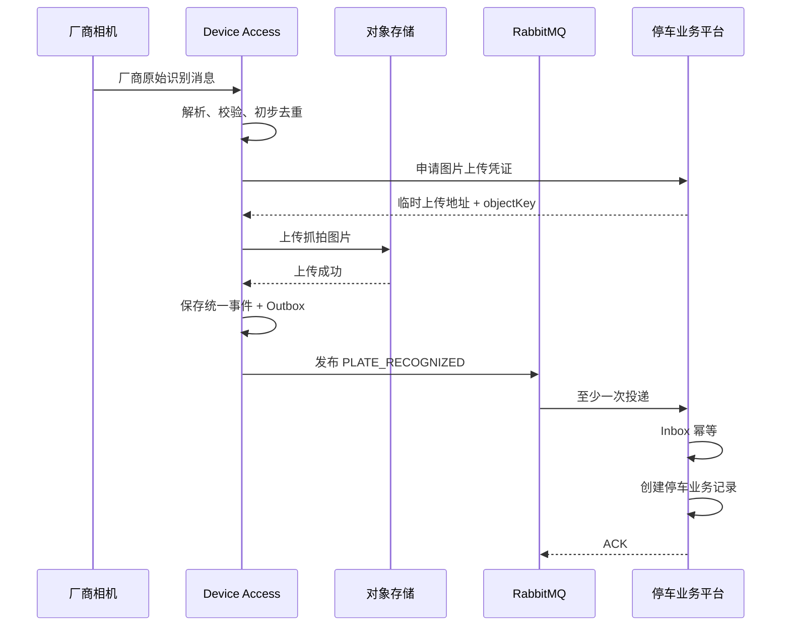
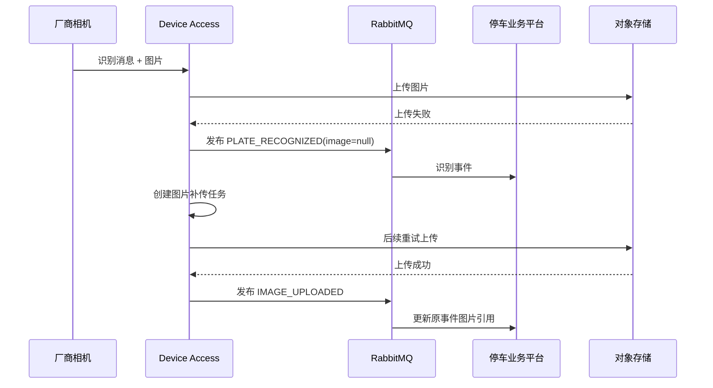
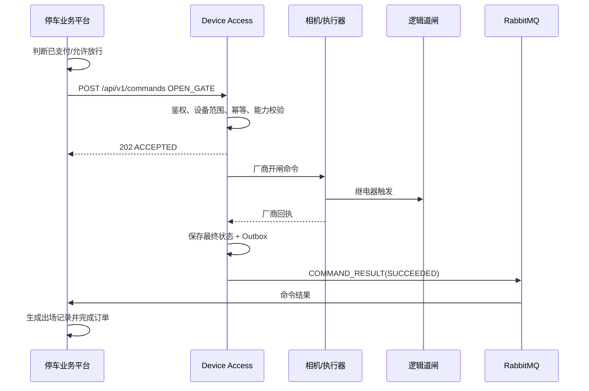
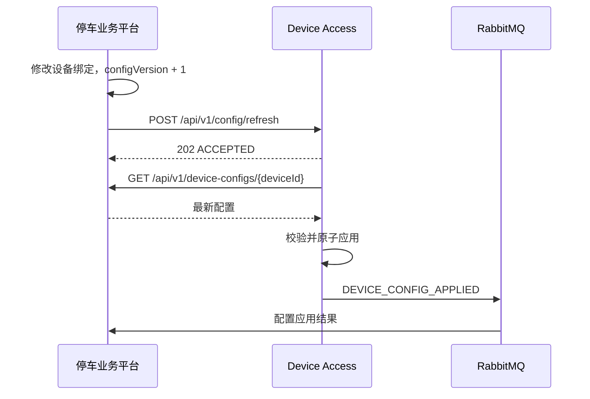

# 停车业务平台与 Device Access 接口规范

> 文档版本：V1.0  
> 接口主版本：v1  
> 文档状态：开发基线，待双方评审冻结  
> 适用系统：停车业务平台、Device Access 设备接入服务  
> 首期设备范围：臻识 C5H 车牌识别相机及其继电器控制的道闸  
> 后续扩展范围：信路通及其他厂商相机、独立道闸控制器  
> 编制日期：2026-07-10

---

## 目录

1. [文档目的](#1-文档目的)
2. [适用范围](#2-适用范围)
3. [术语与参与方](#3-术语与参与方)
4. [职责边界](#4-职责边界)
5. [总体架构](#5-总体架构)
6. [接口设计原则](#6-接口设计原则)
7. [版本与兼容策略](#7-版本与兼容策略)
8. [公共标识规则](#8-公共标识规则)
9. [公共数据规范](#9-公共数据规范)
10. [服务认证与安全规范](#10-服务认证与安全规范)
11. [HTTP 接口总览](#11-http-接口总览)
12. [平台向 Device Access 下发命令](#12-平台向-device-access-下发命令)
13. [查询命令执行状态](#13-查询命令执行状态)
14. [查询设备实时状态](#14-查询设备实时状态)
15. [通知 Device Access 刷新配置](#15-通知-device-access-刷新配置)
16. [Device Access 获取设备配置](#16-device-access-获取设备配置)
17. [Device Access 解析设备绑定关系](#17-device-access-解析设备绑定关系)
18. [申请图片上传凭证](#18-申请图片上传凭证)
19. [RabbitMQ 事件总览](#19-rabbitmq-事件总览)
20. [统一事件信封](#20-统一事件信封)
21. [车牌识别事件](#21-车牌识别事件)
22. [设备上线事件](#22-设备上线事件)
23. [设备离线事件](#23-设备离线事件)
24. [设备心跳事件](#24-设备心跳事件)
25. [道闸状态变更事件](#25-道闸状态变更事件)
26. [设备告警事件](#26-设备告警事件)
27. [命令执行结果事件](#27-命令执行结果事件)
28. [图片补传完成事件](#28-图片补传完成事件)
29. [配置应用结果事件](#29-配置应用结果事件)
30. [设备能力模型](#30-设备能力模型)
31. [相机与道闸建模](#31-相机与道闸建模)
32. [命令生命周期](#32-命令生命周期)
33. [事件幂等与命令幂等](#33-事件幂等与命令幂等)
34. [消息顺序、重试与死信](#34-消息顺序重试与死信)
35. [图片处理规范](#35-图片处理规范)
36. [配置同步规范](#36-配置同步规范)
37. [错误码规范](#37-错误码规范)
38. [超时、限流和容量约束](#38-超时限流和容量约束)
39. [日志、追踪与监控](#39-日志追踪与监控)
40. [数据安全与隐私](#40-数据安全与隐私)
41. [关键业务时序](#41-关键业务时序)
42. [联调环境要求](#42-联调环境要求)
43. [契约测试与验收用例](#43-契约测试与验收用例)
44. [双方开发任务拆分](#44-双方开发任务拆分)
45. [变更管理流程](#45-变更管理流程)
46. [第一阶段不包含的内容](#46-第一阶段不包含的内容)
47. [臻识协议映射附录](#47-臻识协议映射附录)
48. [信路通协议映射附录](#48-信路通协议映射附录)
49. [评审与签署](#49-评审与签署)

---

## 1. 文档目的

本文档用于定义停车业务平台与 Device Access 之间的稳定协作契约，包括：

- 双方职责边界；
- HTTP 接口；
- RabbitMQ 事件；
- 标识、状态和数据模型；
- 服务认证；
- 幂等、重试和顺序规则；
- 图片上传与补传；
- 配置同步；
- 错误码；
- 联调测试和验收标准。

本文档采用“契约优先”方式。双方在开始编码前确认本规范，后续分别实现停车业务平台和 Device Access。厂商协议差异仅在 Device Access 内部消化，不得向停车业务平台泄漏。

### 1.1 核心目标

停车业务平台只处理统一设备能力，不关心：

- 臻识、信路通或其他品牌名称；
- 相机使用 MQTT、HTTP、TCP 还是 SDK；
- 厂商原始 Topic；
- 厂商原始字段；
- 厂商错误码；
- 道闸是否通过相机继电器控制。

Device Access 不处理：

- 停车记录创建；
- 收费规则；
- 月卡、白名单、黑名单；
- 停车订单；
- 微信支付；
- 是否允许车辆放行的业务决策。

---

## 2. 适用范围

### 2.1 第一阶段范围

第一阶段支持：

- 公有云部署；
- Java 21 LTS；
- Spring Boot 3.5.x；
- HTTPS REST；
- RabbitMQ；
- EMQX；
- 臻识 C5H；
- 车牌识别；
- 设备心跳；
- 设备在线、离线；
- 通过相机继电器执行开闸；
- 远程关闸、常开、取消常开，具体以设备能力为准；
- 触发抓拍；
- 重启设备；
- 同步时间；
- 查询设备状态；
- 设备告警；
- 图片上传和补传；
- 离线事件补传；
- 命令执行结果回传。

### 2.2 设计容量

- 初期按约 10 个停车场设计；
- 预留扩展至 100 个停车场；
- 每个停车场可包含多个入口、出口、车道、相机和逻辑道闸；
- 第一阶段允许单实例部署，但契约和代码不得依赖单机内存状态。

### 2.3 不在本文档中定义的内容

- 厂商设备内部实现；
- 停车业务平台内部数据库表结构；
- Device Access 内部模块结构；
- 微信支付接口；
- 停车计费接口；
- 小程序接口；
- 运营端、总后台和岗亭端页面接口。

---

## 3. 术语与参与方

| 名称 | 定义 |
|---|---|
| 厂商设备 | 臻识、信路通等品牌的相机、道闸或相关硬件 |
| Device Access | 设备接入服务，负责厂商协议适配和实际设备控制 |
| 停车业务平台 | 负责停车场、车道、停车记录、计费、订单、支付和放行决策的系统 |
| 统一事件 | Device Access 将厂商原始报文标准化后的事件 |
| 统一命令 | 停车业务平台向 Device Access 下发的品牌无关控制命令 |
| 逻辑道闸 | 停车业务平台中的 GATE 设备对象，物理执行器可以是相机继电器 |
| 执行设备 | 真正向物理硬件下发指令的设备，例如相机 |
| 目标设备 | 业务上希望控制的设备，例如逻辑道闸 |
| 设备配置版本 | 停车业务平台生成的设备绑定和连接配置版本 |
| 离线补传 | 设备或 Device Access 在网络恢复后补发离线期间产生的事件 |
| Outbox | 发送方在本地事务中持久化待发送事件的可靠投递表 |
| Inbox | 消费方持久化已消费事件 ID 的幂等处理表 |

---

## 4. 职责边界

### 4.1 Device Access 职责

Device Access 负责：

1. 与厂商设备建立连接；
2. MQTT、HTTP、TCP、SDK 等通信维护；
3. 自动重连；
4. 厂商协议解析；
5. 厂商字段转换；
6. 厂商 Topic 路由；
7. 将原始识别结果转换为统一事件；
8. 接收统一命令；
9. 将统一命令转换为厂商命令；
10. 实际下发开闸、关闸、抓拍、重启和校时；
11. 识别设备心跳；
12. 检测在线和离线；
13. 设备侧初步重复消息过滤；
14. 设备告警检测；
15. 离线事件缓存；
16. 网络恢复后补传；
17. 命令执行结果回传；
18. 获取抓拍图片；
19. 上传对象存储；
20. 保存厂商原始报文和调试日志；
21. 保存命令幂等结果；
22. 保存事件可靠投递状态。

### 4.2 停车业务平台职责

停车业务平台负责：

1. 租户管理；
2. 停车场管理；
3. 入口、出口和车道管理；
4. 设备元数据管理；
5. 相机与逻辑道闸绑定；
6. 设备配置版本管理；
7. 接收统一事件；
8. 事件二次幂等；
9. 创建入场记录、出场记录和停车记录；
10. 判断月卡、白名单、黑名单；
11. 计算停车费；
12. 创建停车订单；
13. 处理支付；
14. 决定是否允许开闸；
15. 生成统一命令；
16. 保存业务命令记录；
17. 保存设备状态和告警；
18. 提供图片临时上传凭证；
19. 管理图片保留期限；
20. 向管理端、岗亭端和小程序展示数据。

### 4.3 明确禁止事项

Device Access 禁止：

- 自行判断月卡是否有效；
- 自行判断订单是否已支付；
- 自行计算停车费用；
- 未收到平台命令时根据业务规则主动放行；
- 直接写入停车业务平台数据库；
- 将厂商原始字段直接作为平台业务字段；
- 使用厂商序列号作为平台数据库主键。

停车业务平台禁止：

- 直接解析臻识或信路通原始协议；
- 直接连接厂商相机；
- 在业务代码中出现厂商 Topic；
- 根据厂商错误码直接控制业务状态；
- 绕过 Device Access 直接下发硬件命令。

---

## 5. 总体架构

```text
┌─────────────────────────────┐
│       停车业务平台           │
│ 停车记录 / 计费 / 订单 / 支付 │
└──────────────┬──────────────┘
               │
     HTTPS REST│命令、查询、配置
               │
               ▼
┌─────────────────────────────┐
│        Device Access         │
│ 厂商适配 / 连接 / 控制 / 事件 │
└──────────────┬──────────────┘
               │
 MQTT/HTTP/TCP/SDK
               │
               ▼
┌─────────────────────────────┐
│ 臻识 / 信路通相机与道闸       │
└─────────────────────────────┘

Device Access ──RabbitMQ──> 停车业务平台
Device Access ──对象存储──> 上传抓拍图片
```

### 5.1 通信方向

| 方向 | 协议 | 用途 |
|---|---|---|
| 停车业务平台 → Device Access | HTTPS REST | 下发命令、查询命令状态、查询设备状态、刷新配置 |
| Device Access → 停车业务平台 | RabbitMQ | 上报识别、状态、告警、命令结果、图片补传结果 |
| Device Access → 停车业务平台 | HTTPS REST | 拉取设备配置、解析设备绑定、申请图片上传凭证 |
| Device Access → 对象存储 | HTTPS | 上传图片 |
| Device Access ↔ 厂商设备 | MQTT/HTTP/TCP/SDK | 厂商协议通信 |

### 5.2 数据库隔离

- 停车业务平台和 Device Access 使用独立数据库或独立 Schema；
- 双方禁止直接访问对方数据库；
- Device Access 可以保存设备连接、原始消息、命令、Outbox 等设备接入数据；
- 停车业务平台是租户、停车场、车道、业务设备绑定关系的最终数据源。

---

## 6. 接口设计原则

1. 外部契约品牌中立；
2. 所有接口版本化；
3. 所有命令有唯一 `commandId`；
4. 所有事件有唯一 `eventId`；
5. HTTP 接口只返回受理结果，不将设备最终执行结果伪装为同步成功；
6. 最终设备执行结果通过 `COMMAND_RESULT` 事件上报；
7. RabbitMQ 采用至少一次投递；
8. 消费者必须幂等；
9. 图片不得以 Base64 形式进入 RabbitMQ；
10. 未知字段必须忽略；
11. 未知枚举必须降级为 `UNKNOWN`；
12. 厂商私有字段仅放入 `extensions`；
13. 平台业务逻辑不得依赖 `extensions`；
14. 时间必须包含时区；
15. 金额不属于本接口范围；
16. 车牌、图片等敏感数据必须脱敏记录日志；
17. 开闸类命令必须可审计；
18. 配置变更必须有版本号；
19. 设备离线补传必须保留原始发生时间；
20. 双方必须实现契约测试。

---

## 7. 版本与兼容策略

### 7.1 HTTP 版本

统一使用：

```text
/api/v1/...
```

### 7.2 事件协议版本

所有事件必须包含：

```json
{
  "protocolVersion": "1.0",
  "schemaVersion": "1.0.0"
}
```

### 7.3 兼容规则

以下变更允许在 v1 内进行：

- 新增可选字段；
- 新增事件类型；
- 新增命令类型；
- 新增枚举值，但消费者必须支持未知值降级；
- 扩充 `extensions`。

以下变更必须升级为 v2：

- 删除字段；
- 修改字段含义；
- 修改字段类型；
- 将可选字段改为必填；
- 修改命令的业务语义；
- 修改事件路由键的含义；
- 修改鉴权签名算法；
- 修改时间单位。

### 7.4 未知字段策略

- JSON 反序列化必须忽略未知字段；
- 不得因新增字段导致消费失败；
- 枚举无法识别时统一转换为 `UNKNOWN`；
- 不允许使用严格字段白名单阻断同一主版本内的兼容扩展。

---

## 8. 公共标识规则

| 字段 | 类型 | 生成方 | 是否可变 | 说明 |
|---|---|---|---|---|
| `tenantId` | string | 停车业务平台 | 否 | 租户唯一 ID |
| `parkingLotId` | string | 停车业务平台 | 否 | 停车场唯一 ID |
| `laneId` | string | 停车业务平台 | 否 | 车道唯一 ID |
| `deviceId` | string | 停车业务平台 | 否 | 平台内部设备唯一 ID |
| `deviceCode` | string | 停车业务平台 | 可修改 | 人类可读业务编号 |
| `deviceSn` | string | 厂商设备 | 通常不可修改 | 厂商原始序列号 |
| `vendor` | string | 双方约定 | 否 | `ZHENSHI`、`XINLUTONG` 等 |
| `eventId` | string | Device Access | 否 | 统一事件全局唯一 ID |
| `vendorEventId` | string | 厂商设备 | 否 | 厂商原始消息 ID，可为空 |
| `commandId` | string | 停车业务平台 | 否 | 统一命令全局唯一 ID |
| `traceId` | string | 调用链发起方 | 否 | 全链路追踪 ID |
| `requestId` | string | HTTP 请求发起方 | 否 | 单次 HTTP 请求 ID |
| `sequenceNo` | int64 | Device Access | 单设备递增 | 事件排序和缺口检测 |
| `configVersion` | int64 | 停车业务平台 | 递增 | 配置版本 |

### 8.1 ID 格式建议

推荐使用 ULID 或 UUIDv7：

```text
commandId: cmd_01JZ8R...
eventId:   evt_01JZ8S...
deviceId:  dev_01JZ8T...
laneId:    lane_01JZ8U...
```

### 8.2 deviceId 与 deviceSn

- `deviceId` 是平台主标识；
- `deviceSn` 是厂商标识；
- 一个 `deviceId` 在生命周期内只能关联一个当前 `deviceSn`；
- 更换硬件时建议创建新 `deviceId` 或保留明确的替换历史；
- 厂商 SN 不得直接作为业务主键。

### 8.3 eventId 生成

优先规则：

1. 厂商存在稳定唯一消息 ID时，使用 `vendor + deviceSn + vendorEventId` 计算确定性哈希；
2. 厂商没有唯一 ID 时，Device Access 生成 UUIDv7/ULID；
3. 相同厂商原始事件重复接收时，必须生成相同 `eventId`；
4. 离线补传不得重新生成新的 `eventId`。

---

## 9. 公共数据规范

### 9.1 字段命名

- JSON：`camelCase`；
- 数据库：由各系统自行决定，推荐 `snake_case`；
- 枚举：大写下划线；
- URL：小写中划线；
- HTTP Header：标准中划线形式。

### 9.2 时间格式

跨系统接口统一使用 ISO 8601：

```text
2026-07-10T15:30:20.123+08:00
```

规则：

- 必须包含时区；
- 精度至少毫秒；
- 禁止使用无时区的 `yyyy-MM-dd HH:mm:ss` 作为跨系统时间；
- 厂商 Unix 秒、Unix 毫秒由 Device Access 转换；
- `occurredAt` 表示设备实际发生时间；
- `receivedAt` 表示 Device Access 接收时间；
- `publishedAt` 表示事件发送到 RabbitMQ 前的时间。

### 9.3 数值规范

- `confidence`：`0.00` 到 `100.00`；
- `sequenceNo`：64 位整数；
- 文件大小：字节；
- 超时时间：毫秒或秒，字段名必须带单位；
- 经纬度：十进制度，可选；
- 不允许使用字符串表达布尔值。

### 9.4 null 规则

- 必填字段不得为 null；
- 厂商无法提供的可选字段可以省略；
- 不建议显式传 `null`；
- 空字符串不等于 null；
- 车牌未知时不得传空车牌并伪装正常识别，应使用 `recognitionStatus`。

### 9.5 字符编码

- HTTP、RabbitMQ 消息统一 UTF-8；
- `Content-Type: application/json; charset=utf-8`；
- 车牌号保留原始中文字符；
- 厂商 GBK/GB2312 报文由 Device Access 转码。

### 9.6 HTTP 统一响应

```json
{
  "code": 200,
  "message": "success",
  "data": {},
  "requestId": "req_01JZ...",
  "timestamp": "2026-07-10T15:30:20.123+08:00"
}
```

| 字段 | 类型 | 必填 | 说明 |
|---|---|---|---|
| `code` | integer | 是 | 业务状态码 |
| `message` | string | 是 | 人类可读信息 |
| `data` | object | 否 | 响应数据 |
| `requestId` | string | 是 | 请求 ID |
| `timestamp` | string | 是 | 响应时间 |

---

## 10. 服务认证与安全规范

### 10.1 适用范围

以下 HTTP 调用必须使用服务间认证：

- 停车业务平台调用 Device Access；
- Device Access 调用停车业务平台；
- 图片上传凭证申请；
- 配置拉取；
- 命令状态查询。

不得使用普通用户 Sa-Token 作为服务间认证凭证。

### 10.2 传输安全

生产环境必须：

- 使用 HTTPS；
- TLS 1.2 或以上；
- 禁止明文 HTTP；
- RabbitMQ 使用 TLS；
- EMQX 优先使用 MQTTS；
- 证书过期必须监控。

### 10.3 请求头

```text
X-Client-Id: platform-service
X-Timestamp: 1783678220123
X-Nonce: 1f7e9e8f-...
X-Signature: BASE64URL(...)
X-Request-Id: req_01JZ...
X-Trace-Id: trace_01JZ...
```

### 10.4 签名算法

使用：

```text
HMAC-SHA256
```

规范化字符串：

```text
HTTP_METHOD\n
NORMALIZED_PATH_AND_QUERY\n
X_TIMESTAMP\n
X_NONCE\n
SHA256_HEX(REQUEST_BODY)
```

示例：

```text
POST
/api/v1/commands
1783678220123
1f7e9e8f-xxxx
8f14e45fceea167a5a36dedd4bea2543...
```

签名：

```text
Base64Url(HMAC_SHA256(clientSecret, canonicalString))
```

### 10.5 验证规则

1. `X-Client-Id` 必须存在且启用；
2. 时间戳允许误差 ±5 分钟；
3. `Nonce` 有效期 10 分钟；
4. 同一 `ClientId + Nonce` 只能使用一次；
5. 请求体摘要必须匹配；
6. 签名使用常量时间比较；
7. 验证失败不得进入业务处理；
8. 验证失败日志不得输出 Secret；
9. 认证失败应返回统一错误码；
10. 连续失败应触发限流和告警。

### 10.6 密钥管理

- Secret 不得写入 Git；
- 使用环境变量、Docker Secret 或密钥管理服务；
- 支持双密钥轮换；
- 每个服务独立 ClientId；
- 测试、预生产、生产使用不同密钥；
- 离职或泄露后立即吊销；
- 密钥至少每 180 天轮换一次。

### 10.7 RabbitMQ 权限

推荐 vhost：

```text
/device-access
```

账号权限：

- Device Access：只允许发布 `device.events.v1`；
- 停车业务平台：只允许消费平台队列；
- 禁止使用 RabbitMQ 管理员账号运行应用；
- 禁止跨环境共用 vhost；
- 使用 TLS 和强密码；
- 生产环境禁止 guest 远程登录。

---

## 11. HTTP 接口总览

### 11.1 Device Access 暴露的接口

| 方法 | 路径 | 说明 |
|---|---|---|
| POST | `/api/v1/commands` | 下发统一设备命令 |
| GET | `/api/v1/commands/{commandId}` | 查询命令状态 |
| GET | `/api/v1/devices/{deviceId}/status` | 查询设备实时状态 |
| POST | `/api/v1/config/refresh` | 通知刷新配置 |
| GET | `/actuator/health/liveness` | 存活检查 |
| GET | `/actuator/health/readiness` | 就绪检查 |

### 11.2 停车业务平台暴露的接口

| 方法 | 路径 | 说明 |
|---|---|---|
| GET | `/api/v1/device-configs/{deviceId}` | 获取指定设备配置 |
| POST | `/api/v1/device-configs/resolve` | 按厂商 SN 解析平台绑定 |
| POST | `/api/v1/device-configs/batch` | 批量获取配置 |
| POST | `/api/v1/storage/upload-tickets` | 获取图片临时上传凭证 |
| POST | `/api/v1/device-configs/{deviceId}/ack` | 确认配置应用结果 |

---

## 12. 平台向 Device Access 下发命令

### 12.1 接口

```http
POST /api/v1/commands
```

### 12.2 请求头

除公共认证头外：

```text
Content-Type: application/json
```

### 12.3 请求体

```json
{
  "commandId": "cmd_01JZ8RXX4DDM9K0G6J1FZZZZZZ",
  "commandType": "OPEN_GATE",
  "targetDeviceId": "dev_gate_001",
  "executorDeviceId": "dev_camera_001",
  "tenantId": "tenant_001",
  "parkingLotId": "park_001",
  "laneId": "lane_exit_001",
  "requestedAt": "2026-07-10T15:30:20.123+08:00",
  "expireAt": "2026-07-10T15:30:30.123+08:00",
  "priority": "NORMAL",
  "reasonCode": "PAID_EXIT",
  "businessRef": {
    "parkingRecordId": "record_001",
    "orderId": "order_001",
    "operatorId": null
  },
  "parameters": {
    "relayChannel": 1,
    "pulseDurationMs": 500
  }
}
```

### 12.4 字段定义

| 字段 | 类型 | 必填 | 说明 |
|---|---|---|---|
| `commandId` | string | 是 | 平台生成，命令幂等键 |
| `commandType` | enum | 是 | 命令类型 |
| `targetDeviceId` | string | 是 | 业务目标设备 |
| `executorDeviceId` | string | 否 | 实际执行设备；相机继电器控制道闸时必填 |
| `tenantId` | string | 是 | 租户 ID |
| `parkingLotId` | string | 是 | 停车场 ID |
| `laneId` | string | 否 | 车道 ID |
| `requestedAt` | string | 是 | 请求时间 |
| `expireAt` | string | 是 | 过期时间 |
| `priority` | enum | 是 | `LOW/NORMAL/HIGH/EMERGENCY` |
| `reasonCode` | enum | 是 | 命令原因 |
| `businessRef` | object | 否 | 业务关联对象，Device Access 仅透传和审计 |
| `parameters` | object | 否 | 命令参数 |

### 12.5 命令类型

| commandType | 说明 | 目标设备类型 |
|---|---|---|
| `OPEN_GATE` | 开闸 | GATE |
| `CLOSE_GATE` | 关闸 | GATE |
| `KEEP_GATE_OPEN` | 常开 | GATE |
| `CANCEL_GATE_OPEN` | 取消常开 | GATE |
| `CAPTURE` | 触发抓拍 | CAMERA |
| `REBOOT` | 重启设备 | CAMERA/GATE |
| `SYNC_TIME` | 同步设备时间 | CAMERA/GATE |
| `QUERY_STATUS` | 查询状态 | CAMERA/GATE |
| `UPDATE_CONFIG` | 应用指定配置版本 | CAMERA/GATE |

### 12.6 reasonCode

| reasonCode | 说明 |
|---|---|
| `PAID_EXIT` | 已支付车辆出场 |
| `MONTH_CARD` | 月卡车辆 |
| `WHITELIST` | 白名单车辆 |
| `MANUAL_RELEASE` | 岗亭人工放行 |
| `TEST` | 联调测试 |
| `EMERGENCY` | 紧急放行 |
| `DEVICE_MAINTENANCE` | 设备维护 |
| `OTHER` | 其他 |

### 12.7 命令参数

#### OPEN_GATE

```json
{
  "relayChannel": 1,
  "pulseDurationMs": 500
}
```

| 字段 | 类型 | 必填 | 默认值 | 说明 |
|---|---|---|---|---|
| `relayChannel` | integer | 否 | 设备配置值 | 继电器通道 |
| `pulseDurationMs` | integer | 否 | 500 | 脉冲持续时间，范围 100~5000 |

#### CLOSE_GATE

```json
{
  "relayChannel": 1
}
```

#### KEEP_GATE_OPEN

```json
{
  "durationSeconds": 3600
}
```

- `durationSeconds` 为空表示持续常开，直到收到取消常开；
- Device Access 必须根据能力判断是否支持。

#### CAPTURE

```json
{
  "imageType": "FULL",
  "uploadRequired": true
}
```

#### REBOOT

```json
{
  "delaySeconds": 0
}
```

#### SYNC_TIME

```json
{
  "targetTime": "2026-07-10T15:30:20.123+08:00",
  "timezone": "Asia/Shanghai"
}
```

#### QUERY_STATUS

```json
{
  "scopes": ["CONNECTIVITY", "GATE", "FIRMWARE"]
}
```

### 12.8 成功受理响应

HTTP 状态：`202 Accepted`

```json
{
  "code": 202,
  "message": "accepted",
  "data": {
    "commandId": "cmd_01JZ8RXX4DDM9K0G6J1FZZZZZZ",
    "status": "ACCEPTED",
    "acceptedAt": "2026-07-10T15:30:20.220+08:00"
  },
  "requestId": "req_01JZ...",
  "timestamp": "2026-07-10T15:30:20.220+08:00"
}
```

### 12.9 同 commandId 重复请求

#### 请求体完全一致

返回历史状态，不重复执行：

```json
{
  "code": 200,
  "message": "duplicate command, historical result returned",
  "data": {
    "commandId": "cmd_01JZ...",
    "status": "SUCCEEDED",
    "duplicate": true
  },
  "requestId": "req_01JZ...",
  "timestamp": "2026-07-10T15:31:00.000+08:00"
}
```

#### 请求体不一致

HTTP 状态：`409 Conflict`

业务码：`409001`

### 12.10 受理语义

`202 Accepted` 仅表示：

- 请求通过认证；
- 参数合法；
- 命令已持久化；
- Device Access 将执行或排队执行。

`202` 不表示物理设备已经完成动作。最终结果以 `COMMAND_RESULT` 事件为准。

### 12.11 命令有效期

- Device Access 收到命令时如果 `expireAt` 已过期，必须拒绝；
- 已排队命令在执行前再次检查 `expireAt`；
- 过期命令状态为 `REJECTED`；
- 过期命令不得发送到设备。

---

## 13. 查询命令执行状态

### 13.1 接口

```http
GET /api/v1/commands/{commandId}
```

### 13.2 响应

```json
{
  "code": 200,
  "message": "success",
  "data": {
    "commandId": "cmd_01JZ...",
    "commandType": "OPEN_GATE",
    "status": "SUCCEEDED",
    "targetDeviceId": "dev_gate_001",
    "executorDeviceId": "dev_camera_001",
    "acceptedAt": "2026-07-10T15:30:20.220+08:00",
    "startedAt": "2026-07-10T15:30:20.300+08:00",
    "completedAt": "2026-07-10T15:30:21.100+08:00",
    "retryCount": 0,
    "vendorCode": "200",
    "vendorMessage": "success",
    "lastError": null
  },
  "requestId": "req_01JZ...",
  "timestamp": "2026-07-10T15:30:21.200+08:00"
}
```

### 13.3 查询一致性

- 该接口用于补偿查询；
- 平台正常流程仍以 RabbitMQ `COMMAND_RESULT` 为准；
- 如果事件丢失或平台重启，可主动查询；
- 命令记录至少保留 90 天。

---

## 14. 查询设备实时状态

### 14.1 接口

```http
GET /api/v1/devices/{deviceId}/status
```

### 14.2 响应

```json
{
  "code": 200,
  "message": "success",
  "data": {
    "deviceId": "dev_camera_001",
    "deviceCode": "CAMERA-001",
    "deviceSn": "C5H-SN-001",
    "deviceType": "CAMERA",
    "vendor": "ZHENSHI",
    "onlineStatus": "ONLINE",
    "gateStatus": "CLOSED",
    "lastHeartbeatAt": "2026-07-10T15:30:10.000+08:00",
    "lastEventAt": "2026-07-10T15:30:20.123+08:00",
    "statusObservedAt": "2026-07-10T15:30:21.000+08:00",
    "firmwareVersion": "TBD",
    "networkLatencyMs": 42,
    "capabilities": [
      "PLATE_RECOGNITION",
      "GATE_OPEN",
      "CAPTURE",
      "REBOOT",
      "TIME_SYNC"
    ],
    "lastError": null
  },
  "requestId": "req_01JZ...",
  "timestamp": "2026-07-10T15:30:21.100+08:00"
}
```

### 14.3 状态新鲜度

- `statusObservedAt` 距当前时间超过配置阈值时，平台应显示“状态可能过期”；
- Device Access 不得将历史缓存状态伪装为实时状态；
- 心跳超时阈值由设备配置给出；
- 未收到心跳但 MQTT 连接存在时，可以返回 `DEGRADED`。

---

## 15. 通知 Device Access 刷新配置

### 15.1 接口

```http
POST /api/v1/config/refresh
```

### 15.2 请求

```json
{
  "requestId": "cfg_req_01JZ...",
  "reason": "DEVICE_BINDING_CHANGED",
  "deviceIds": ["dev_camera_001", "dev_gate_001"],
  "expectedConfigVersion": 18,
  "requestedAt": "2026-07-10T15:30:20.123+08:00"
}
```

### 15.3 响应

HTTP 状态：`202 Accepted`

```json
{
  "code": 202,
  "message": "refresh accepted",
  "data": {
    "requestId": "cfg_req_01JZ...",
    "acceptedDeviceIds": ["dev_camera_001", "dev_gate_001"],
    "rejected": []
  },
  "requestId": "req_01JZ...",
  "timestamp": "2026-07-10T15:30:20.300+08:00"
}
```

### 15.4 处理流程

1. Device Access 接收刷新请求；
2. 持久化刷新任务；
3. 调用平台配置接口拉取最新配置；
4. 校验配置版本；
5. 应用配置；
6. 发布 `DEVICE_CONFIG_APPLIED` 事件；
7. 失败时记录并重试。

---

## 16. Device Access 获取设备配置

### 16.1 接口

停车业务平台暴露：

```http
GET /api/v1/device-configs/{deviceId}
```

### 16.2 响应

```json
{
  "code": 200,
  "message": "success",
  "data": {
    "configVersion": 18,
    "effectiveAt": "2026-07-10T15:00:00.000+08:00",
    "tenantId": "tenant_001",
    "parkingLotId": "park_001",
    "laneId": "lane_exit_001",
    "deviceId": "dev_camera_001",
    "deviceCode": "CAMERA-001",
    "deviceSn": "C5H-SN-001",
    "deviceType": "CAMERA",
    "vendor": "ZHENSHI",
    "model": "C5H",
    "direction": "EXIT",
    "enabled": true,
    "critical": true,
    "executorDeviceId": null,
    "capabilities": [
      "PLATE_RECOGNITION",
      "GATE_OPEN",
      "CAPTURE",
      "REBOOT",
      "TIME_SYNC"
    ],
    "connection": {
      "protocol": "MQTT",
      "brokerRef": "emqx-primary",
      "upstreamTopicPatterns": [
        "TBD_BY_VENDOR_MAPPING"
      ],
      "downstreamTopicPatterns": [
        "TBD_BY_VENDOR_MAPPING"
      ],
      "credentialRef": "secret/device/C5H-SN-001"
    },
    "heartbeat": {
      "enabled": true,
      "intervalSeconds": 60,
      "offlineThresholdSeconds": 180
    },
    "imagePolicy": {
      "uploadEnabled": true,
      "maxSizeBytes": 10485760,
      "allowedContentTypes": ["image/jpeg"]
    },
    "vendorOptions": {}
  },
  "requestId": "req_01JZ...",
  "timestamp": "2026-07-10T15:30:20.200+08:00"
}
```

### 16.3 配置字段说明

| 字段 | 说明 |
|---|---|
| `configVersion` | 平台递增配置版本 |
| `effectiveAt` | 配置生效时间 |
| `critical` | 是否为停车场关键设备 |
| `capabilities` | 平台允许使用的能力集合 |
| `connection.protocol` | 厂商通信协议 |
| `credentialRef` | 凭证引用，不直接返回明文 Secret |
| `vendorOptions` | 厂商私有配置，平台业务不得读取 |

### 16.4 凭证规则

- 配置接口不返回对象存储主密钥；
- 不建议返回厂商明文密码；
- `credentialRef` 由 Device Access 在安全存储中解析；
- 若必须在线下发敏感凭证，应使用独立加密配置接口，不在 V1 普通响应中返回。

---

## 17. Device Access 解析设备绑定关系

### 17.1 使用场景

当 Device Access 首次收到未知 `deviceSn` 的厂商消息时，调用平台接口解析绑定关系。

### 17.2 接口

```http
POST /api/v1/device-configs/resolve
```

### 17.3 请求

```json
{
  "vendor": "ZHENSHI",
  "deviceSn": "C5H-SN-001",
  "model": "C5H",
  "sourceProtocol": "MQTT",
  "observedAt": "2026-07-10T15:30:20.123+08:00"
}
```

### 17.4 成功响应

```json
{
  "code": 200,
  "message": "success",
  "data": {
    "registered": true,
    "enabled": true,
    "deviceId": "dev_camera_001",
    "deviceCode": "CAMERA-001",
    "tenantId": "tenant_001",
    "parkingLotId": "park_001",
    "laneId": "lane_entry_001",
    "configVersion": 18
  },
  "requestId": "req_01JZ...",
  "timestamp": "2026-07-10T15:30:20.200+08:00"
}
```

### 17.5 未注册设备

HTTP 状态：`404 Not Found`

业务码：`404001`

Device Access 行为：

- 不生成停车业务事件；
- 保存厂商原始消息；
- 记录“未知设备”告警；
- 不自动创建平台设备；
- 不执行来自该设备的控制请求。

---

## 18. 申请图片上传凭证

### 18.1 接口

```http
POST /api/v1/storage/upload-tickets
```

### 18.2 请求

```json
{
  "eventId": "evt_01JZ...",
  "deviceId": "dev_camera_001",
  "tenantId": "tenant_001",
  "parkingLotId": "park_001",
  "fileName": "capture.jpg",
  "contentType": "image/jpeg",
  "sizeBytes": 328192,
  "sha256": "4b227777d4dd1fc61c6f884f48641d02..."
}
```

### 18.3 响应

```json
{
  "code": 200,
  "message": "success",
  "data": {
    "uploadMethod": "PUT",
    "uploadUrl": "https://object-storage.example.com/...signed...",
    "objectKey": "parking/tenant_001/park_001/2026/07/10/evt_01JZ.jpg",
    "headers": {
      "Content-Type": "image/jpeg"
    },
    "expiresAt": "2026-07-10T15:35:20.000+08:00"
  },
  "requestId": "req_01JZ...",
  "timestamp": "2026-07-10T15:30:20.200+08:00"
}
```

### 18.4 约束

- 上传凭证有效期建议 5 分钟；
- 仅允许上传指定 objectKey；
- 最大文件 10MB；
- 第一阶段仅允许 JPEG；
- `sha256` 必须在上传前计算；
- 平台不得返回对象存储主账号密钥；
- 上传失败不阻塞车牌事件发送。

---

## 19. RabbitMQ 事件总览

### 19.1 Exchange

```text
device.events.v1
```

类型：`topic`

属性：

- durable：true；
- autoDelete：false；
- internal：false。

### 19.2 Routing Key

| 事件 | Routing Key |
|---|---|
| 车牌识别 | `device.plate.recognized` |
| 设备上线 | `device.status.online` |
| 设备离线 | `device.status.offline` |
| 设备心跳 | `device.status.heartbeat` |
| 道闸状态 | `device.gate.status-changed` |
| 设备告警 | `device.alarm` |
| 命令结果 | `device.command.result` |
| 图片补传完成 | `device.image.uploaded` |
| 配置应用结果 | `device.config.applied` |

### 19.3 平台队列建议

```text
parking.device.plate-recognized.v1
parking.device.status.v1
parking.device.gate-status.v1
parking.device.alarm.v1
parking.device.command-result.v1
parking.device.image-uploaded.v1
parking.device.config-applied.v1
```

### 19.4 RabbitMQ 消息属性

| 属性 | 值 |
|---|---|
| `contentType` | `application/json` |
| `contentEncoding` | `utf-8` |
| `deliveryMode` | `2`，持久化 |
| `messageId` | `eventId` |
| `type` | `eventType` |
| `correlationId` | `commandId` 或 `traceId` |
| `timestamp` | `publishedAt` |

推荐 Header：

```text
x-protocol-version: 1.0
x-schema-version: 1.0.0
x-device-id: dev_camera_001
x-tenant-id: tenant_001
x-parking-lot-id: park_001
x-trace-id: trace_01JZ...
```

### 19.5 投递语义

- 至少一次投递；
- 不保证全局顺序；
- 同设备事件尽量按发送顺序发布；
- 可能重复；
- 可能延迟；
- 可能乱序；
- 平台消费者必须使用 `eventId` 幂等；
- 平台不得将 RabbitMQ ACK 当作业务处理成功的唯一证据。

---

## 20. 统一事件信封

所有事件采用统一信封：

```json
{
  "eventId": "evt_01JZ...",
  "eventType": "PLATE_RECOGNIZED",
  "protocolVersion": "1.0",
  "schemaVersion": "1.0.0",
  "tenantId": "tenant_001",
  "parkingLotId": "park_001",
  "laneId": "lane_entry_001",
  "deviceId": "dev_camera_001",
  "deviceCode": "CAMERA-001",
  "deviceSn": "C5H-SN-001",
  "deviceType": "CAMERA",
  "vendor": "ZHENSHI",
  "vendorEventId": "vendor-msg-001",
  "occurredAt": "2026-07-10T15:30:20.123+08:00",
  "receivedAt": "2026-07-10T15:30:20.220+08:00",
  "publishedAt": "2026-07-10T15:30:20.300+08:00",
  "sequenceNo": 10001,
  "offline": false,
  "traceId": "trace_01JZ...",
  "payload": {},
  "extensions": {}
}
```

### 20.1 必填字段

除 `laneId`、`vendorEventId` 和 `extensions` 外，其他公共字段原则上必填。

### 20.2 extensions

- 用于携带厂商私有字段；
- 最大 16KB；
- 不得放置图片 Base64；
- 不得放置密钥；
- 停车业务平台核心逻辑不得依赖；
- 仅用于排障、审计和未来映射。

---

## 21. 车牌识别事件

### 21.1 Routing Key

```text
device.plate.recognized
```

### 21.2 eventType

```text
PLATE_RECOGNIZED
```

### 21.3 完整示例

```json
{
  "eventId": "evt_01JZ8S2V3K7FX2W8JZQZZZZZZZ",
  "eventType": "PLATE_RECOGNIZED",
  "protocolVersion": "1.0",
  "schemaVersion": "1.0.0",
  "tenantId": "tenant_001",
  "parkingLotId": "park_001",
  "laneId": "lane_entry_001",
  "deviceId": "dev_camera_001",
  "deviceCode": "CAMERA-001",
  "deviceSn": "C5H-SN-001",
  "deviceType": "CAMERA",
  "vendor": "ZHENSHI",
  "vendorEventId": "a1b2c3d4-e5f6-7890-abcd-ef1234567890",
  "occurredAt": "2026-07-10T15:30:20.123+08:00",
  "receivedAt": "2026-07-10T15:30:20.220+08:00",
  "publishedAt": "2026-07-10T15:30:20.300+08:00",
  "sequenceNo": 10001,
  "offline": false,
  "traceId": "trace_01JZ...",
  "payload": {
    "recognitionStatus": "SUCCESS",
    "plateNo": "鲁Q12345",
    "normalizedPlateNo": "鲁Q12345",
    "plateColor": "BLUE",
    "vehicleType": "SMALL",
    "energyType": "FUEL",
    "direction": "ENTRY",
    "confidence": 98.5,
    "triggerType": "AUTO",
    "image": {
      "objectKey": "parking/tenant_001/park_001/2026/07/10/evt_01JZ.jpg",
      "contentType": "image/jpeg",
      "sizeBytes": 328192,
      "sha256": "4b227777d4dd1fc61c6f884f48641d02..."
    }
  },
  "extensions": {
    "vendorPlateType": "TBD"
  }
}
```

### 21.4 payload 字段

| 字段 | 类型 | 必填 | 说明 |
|---|---|---|---|
| `recognitionStatus` | enum | 是 | 识别状态 |
| `plateNo` | string | 条件必填 | 原始车牌号 |
| `normalizedPlateNo` | string | 条件必填 | 标准化车牌号 |
| `plateColor` | enum | 是 | 车牌颜色，未知传 UNKNOWN |
| `vehicleType` | enum | 是 | 车辆类型，未知传 UNKNOWN |
| `energyType` | enum | 否 | 能源类型 |
| `direction` | enum | 是 | ENTRY/EXIT/UNKNOWN |
| `confidence` | decimal | 否 | 0~100 |
| `triggerType` | enum | 是 | AUTO/MANUAL/RETRY/OFFLINE_UPLOAD |
| `image` | object | 否 | 图片引用 |

### 21.5 recognitionStatus

| 值 | 说明 |
|---|---|
| `SUCCESS` | 正常识别到车牌 |
| `NO_PLATE` | 检测到车辆但无车牌 |
| `FAILED` | 识别失败 |
| `LOW_CONFIDENCE` | 识别结果低于阈值 |
| `UNKNOWN` | 无法判断 |

### 21.6 plateColor

```text
BLUE
GREEN
YELLOW
WHITE
BLACK
GRADIENT_GREEN
YELLOW_GREEN
OTHER
UNKNOWN
```

### 21.7 vehicleType

```text
SMALL
MEDIUM
LARGE
MOTORCYCLE
OTHER
UNKNOWN
```

### 21.8 energyType

```text
FUEL
NEW_ENERGY
HYBRID
OTHER
UNKNOWN
```

### 21.9 车牌标准化

Device Access 必须：

- 去除首尾空格；
- 英文字母转大写；
- 保留中文省份简称；
- 不擅自纠正疑似错牌；
- 原值放 `plateNo`；
- 标准化值放 `normalizedPlateNo`；
- 无法识别时不得构造虚假车牌。

### 21.10 图片缺失

图片上传失败时：

```json
{
  "image": null
}
```

识别事件仍正常发布。后续成功上传后发送 `IMAGE_UPLOADED`。

### 21.11 离线补传

- `offline=true`；
- `triggerType=OFFLINE_UPLOAD`；
- `occurredAt` 保留真实识别时间；
- `receivedAt` 为 Device Access 实际接收时间；
- `sequenceNo` 用于排序；
- 平台按 `eventId` 幂等，不得重复创建停车记录。

---

## 22. 设备上线事件

### 22.1 Routing Key

```text
device.status.online
```

### 22.2 eventType

```text
DEVICE_ONLINE
```

### 22.3 payload

```json
{
  "previousStatus": "OFFLINE",
  "currentStatus": "ONLINE",
  "reason": "MQTT_CONNECTED",
  "firmwareVersion": "TBD",
  "ipAddress": "10.0.0.10",
  "connectionProtocol": "MQTT",
  "connectedAt": "2026-07-10T15:30:20.123+08:00"
}
```

### 22.4 规则

- 状态无变化时不重复发布上线事件；
- 服务重启后首次确认在线可发布；
- 厂商没有独立上线消息时，可由连接或心跳推导；
- 推导原因必须明确。

---

## 23. 设备离线事件

### 23.1 Routing Key

```text
device.status.offline
```

### 23.2 eventType

```text
DEVICE_OFFLINE
```

### 23.3 payload

```json
{
  "previousStatus": "ONLINE",
  "currentStatus": "OFFLINE",
  "reason": "HEARTBEAT_TIMEOUT",
  "lastHeartbeatAt": "2026-07-10T15:27:00.000+08:00",
  "offlineDetectedAt": "2026-07-10T15:30:20.123+08:00",
  "detail": "No heartbeat for 180 seconds"
}
```

### 23.4 reason

```text
HEARTBEAT_TIMEOUT
MQTT_DISCONNECTED
TCP_DISCONNECTED
HTTP_UNREACHABLE
DEVICE_WILL_MESSAGE
MANUAL_DISABLED
AUTH_FAILED
UNKNOWN
```

### 23.5 规则

- 离线事件只在状态变化时发布；
- 设备恢复后发布上线事件；
- Device Access 负责检测，平台负责保存和展示；
- 设备恢复后平台可自动关闭对应离线告警。

---

## 24. 设备心跳事件

### 24.1 Routing Key

```text
device.status.heartbeat
```

### 24.2 eventType

```text
DEVICE_HEARTBEAT
```

### 24.3 payload

```json
{
  "onlineStatus": "ONLINE",
  "heartbeatAt": "2026-07-10T15:30:20.123+08:00",
  "uptimeSeconds": 86400,
  "firmwareVersion": "TBD",
  "temperatureCelsius": null,
  "networkLatencyMs": 42,
  "vendorStatus": "NORMAL"
}
```

### 24.4 频率

- Device Access 可以接收每次厂商心跳；
- 对平台发布频率可限流，例如最多每 30 秒或 60 秒一次；
- 在线、离线状态变化不得因限流而延迟；
- 高频心跳可只更新 Redis，再按周期汇总发布。

---

## 25. 道闸状态变更事件

### 25.1 Routing Key

```text
device.gate.status-changed
```

### 25.2 eventType

```text
GATE_STATUS_CHANGED
```

### 25.3 payload

```json
{
  "gateDeviceId": "dev_gate_001",
  "executorDeviceId": "dev_camera_001",
  "previousStatus": "CLOSED",
  "currentStatus": "OPEN",
  "source": "DEVICE_REPORT",
  "changedAt": "2026-07-10T15:30:21.000+08:00"
}
```

### 25.4 gateStatus

```text
OPEN
CLOSED
OPENING
CLOSING
KEEP_OPEN
FAULT
UNKNOWN
```

### 25.5 规则

- 厂商无法提供实际闸杆状态时，不得根据“命令发送成功”伪造 OPEN；
- 无实际状态反馈时使用 `UNKNOWN`；
- 命令结果与闸杆状态是两个不同概念；
- 停车订单完成条件由业务平台决定，不由 Device Access 决定。

---

## 26. 设备告警事件

### 26.1 Routing Key

```text
device.alarm
```

### 26.2 eventType

```text
DEVICE_ALARM
```

### 26.3 payload

```json
{
  "alarmId": "alarm_01JZ...",
  "alarmCode": "DEVICE_OFFLINE",
  "severity": "ERROR",
  "title": "设备离线",
  "message": "相机连续 180 秒未收到心跳",
  "recoverable": true,
  "recovered": false,
  "vendorCode": null,
  "firstOccurredAt": "2026-07-10T15:30:20.123+08:00",
  "lastOccurredAt": "2026-07-10T15:30:20.123+08:00",
  "occurrenceCount": 1
}
```

### 26.4 severity

```text
INFO
WARNING
ERROR
CRITICAL
```

### 26.5 第一阶段告警码

```text
DEVICE_OFFLINE
HEARTBEAT_TIMEOUT
MQTT_DISCONNECTED
DEVICE_AUTH_FAILED
COMMAND_FAILED
COMMAND_TIMEOUT
IMAGE_UPLOAD_FAILED
CONFIG_APPLY_FAILED
TIME_DRIFT
UNKNOWN_DEVICE
VENDOR_PROTOCOL_ERROR
```

### 26.6 告警恢复

设备恢复时可发布：

```json
{
  "alarmId": "alarm_01JZ...",
  "alarmCode": "DEVICE_OFFLINE",
  "recovered": true,
  "recoveredAt": "2026-07-10T15:35:20.123+08:00"
}
```

停车业务平台自动将对应告警标记为已恢复并关闭，保留历史记录。

---

## 27. 命令执行结果事件

### 27.1 Routing Key

```text
device.command.result
```

### 27.2 eventType

```text
COMMAND_RESULT
```

### 27.3 payload

```json
{
  "commandId": "cmd_01JZ...",
  "commandType": "OPEN_GATE",
  "targetDeviceId": "dev_gate_001",
  "executorDeviceId": "dev_camera_001",
  "status": "SUCCEEDED",
  "acceptedAt": "2026-07-10T15:30:20.220+08:00",
  "startedAt": "2026-07-10T15:30:20.300+08:00",
  "completedAt": "2026-07-10T15:30:21.100+08:00",
  "retryCount": 0,
  "vendorCode": "200",
  "vendorMessage": "success",
  "resultData": {
    "relayChannel": 1
  },
  "error": null
}
```

### 27.4 status

```text
ACCEPTED
EXECUTING
SUCCEEDED
FAILED
TIMEOUT
REJECTED
```

第一阶段至少发送最终状态：

- `SUCCEEDED`；
- `FAILED`；
- `TIMEOUT`；
- `REJECTED`。

### 27.5 error

失败示例：

```json
{
  "code": "VENDOR_TIMEOUT",
  "message": "device did not reply within 5 seconds",
  "retryable": true,
  "detail": "vendor request id xxx"
}
```

### 27.6 规则

- 相同命令只允许一个最终状态；
- 最终状态发布失败必须通过 Outbox 重试；
- 同一个最终事件可重复投递，平台必须幂等；
- 平台收到 `SUCCEEDED` 后仍需按业务规则生成出场记录；
- HTTP `202` 不能替代该事件；
- 厂商回执不明确时不得返回 `SUCCEEDED`。

---

## 28. 图片补传完成事件

### 28.1 Routing Key

```text
device.image.uploaded
```

### 28.2 eventType

```text
IMAGE_UPLOADED
```

### 28.3 payload

```json
{
  "sourceEventId": "evt_plate_001",
  "image": {
    "objectKey": "parking/tenant_001/park_001/2026/07/10/evt_plate_001.jpg",
    "contentType": "image/jpeg",
    "sizeBytes": 328192,
    "sha256": "4b227777d4dd1fc61c6f884f48641d02..."
  },
  "uploadedAt": "2026-07-10T15:35:20.123+08:00",
  "retryCount": 2
}
```

### 28.4 规则

- `sourceEventId` 必须指向原车牌识别事件；
- 平台根据 `sourceEventId` 更新图片引用；
- 找不到原事件时进入异常队列；
- 相同 objectKey 重复事件应幂等更新。

---

## 29. 配置应用结果事件

### 29.1 Routing Key

```text
device.config.applied
```

### 29.2 eventType

```text
DEVICE_CONFIG_APPLIED
```

### 29.3 payload

```json
{
  "requestId": "cfg_req_01JZ...",
  "deviceId": "dev_camera_001",
  "configVersion": 18,
  "status": "SUCCEEDED",
  "appliedAt": "2026-07-10T15:30:25.123+08:00",
  "error": null
}
```

### 29.4 status

```text
SUCCEEDED
FAILED
IGNORED_OLDER_VERSION
```

### 29.5 规则

- 旧配置版本不得覆盖新版本；
- 配置应用必须原子化；
- 应用失败时保留上一可用版本；
- 失败应产生告警；
- Device Access 重启后必须恢复最后成功版本。

---

## 30. 设备能力模型

### 30.1 能力枚举

```text
PLATE_RECOGNITION
GATE_OPEN
GATE_CLOSE
GATE_KEEP_OPEN
CAPTURE
REBOOT
TIME_SYNC
STATUS_QUERY
OFFLINE_UPLOAD
IMAGE_UPLOAD
GATE_STATUS_REPORT
DEVICE_ALARM
```

### 30.2 能力校验

- 停车业务平台应根据配置控制 UI 和命令入口；
- Device Access 必须再次校验；
- 不支持的命令返回 `422002 CAPABILITY_UNSUPPORTED`；
- 能力由平台配置和 Device Access 实际探测共同决定；
- 实际探测结果可以比平台配置少，不能比平台授权多。

### 30.3 动态能力变化

固件升级或配置变化后能力发生变化时：

- Device Access 更新状态；
- 发布配置应用结果或告警；
- 平台刷新设备能力展示；
- 不允许静默执行未授权能力。

---

## 31. 相机与道闸建模

### 31.1 逻辑模型

相机和道闸在平台中建成两个逻辑设备：

```text
CAMERA
- deviceId: dev_camera_001
- deviceSn: C5H-SN-001
- capabilities: PLATE_RECOGNITION, CAPTURE, GATE_OPEN

GATE
- deviceId: dev_gate_001
- executorDeviceId: dev_camera_001
- relayChannel: 1
- capabilities: GATE_OPEN, GATE_CLOSE
```

### 31.2 命令关系

```json
{
  "targetDeviceId": "dev_gate_001",
  "executorDeviceId": "dev_camera_001",
  "commandType": "OPEN_GATE"
}
```

### 31.3 原因

该模型支持：

- 当前相机继电器控制道闸；
- 后续独立道闸控制器；
- 一个相机控制多个继电器通道；
- 更换相机而保留逻辑道闸；
- 清晰区分业务目标和物理执行器。

### 31.4 禁止建模

禁止将相机和道闸永远视为同一个不可拆分设备，否则后续无法兼容独立道闸控制器。

---

## 32. 命令生命周期

```text
RECEIVED
   ↓ 参数、鉴权、设备归属校验
ACCEPTED
   ↓ 排队和下发
EXECUTING
   ↓
SUCCEEDED / FAILED / TIMEOUT

参数或能力不合法：REJECTED
```

### 32.1 状态定义

| 状态 | 说明 | 是否最终状态 |
|---|---|---|
| `RECEIVED` | 已接收，内部状态 | 否 |
| `ACCEPTED` | 已持久化并受理 | 否 |
| `EXECUTING` | 已开始下发或等待回执 | 否 |
| `SUCCEEDED` | 有明确成功证据 | 是 |
| `FAILED` | 有明确失败结果 | 是 |
| `TIMEOUT` | 在超时时间内未获得明确结果 | 是 |
| `REJECTED` | 参数、权限、能力或状态不允许 | 是 |

### 32.2 最终状态不可逆

- 命令进入最终状态后不得改为其他最终状态；
- 如晚到设备回执与已记录状态冲突，记录异常，不覆盖；
- 需要重新执行时必须生成新的 `commandId`；
- 同一业务操作可关联多次命令尝试，但每次命令 ID 独立。

### 32.3 开闸重试安全

- 相同 `commandId` 的物理操作原则上至多执行一次；
- 仅在确认消息未发送到设备时允许传输层重试；
- 设备已接收但回执丢失时不得盲目重复触发；
- 厂商协议明确支持幂等时，可在适配器内部安全重试；
- 平台需要再次开闸时生成新 `commandId` 并记录原因。

---

## 33. 事件幂等与命令幂等

### 33.1 事件幂等

停车业务平台必须建立 Inbox：

```text
unique(event_id)
```

消费流程：

1. 开启数据库事务；
2. 尝试插入 `eventId`；
3. 已存在则直接 ACK，不重复业务处理；
4. 不存在则处理业务；
5. 提交事务；
6. 成功后 ACK RabbitMQ。

### 33.2 命令幂等

Device Access 必须建立命令表：

```text
unique(command_id)
```

规则：

- 首次请求保存完整请求摘要；
- 重复 `commandId` 且摘要一致，返回历史结果；
- 重复 `commandId` 且摘要不一致，返回 `409001`；
- 服务重启后幂等记录仍有效；
- 命令记录保留至少 90 天。

### 33.3 业务幂等

平台不能只依赖短时间车牌去重，应同时使用：

- `eventId`；
- 设备 ID；
- 发生时间；
- 车牌号；
- 车道；
- 当前未完成停车记录。

Device Access 的短时间去重只是初步过滤，不替代平台业务幂等。

### 33.4 Outbox

Device Access 生成统一事件时：

1. 保存标准事件；
2. 保存 Outbox；
3. 两者同一事务提交；
4. 发布器发送 RabbitMQ；
5. Broker Confirm 成功后标记已发送；
6. 失败后重试。

---

## 34. 消息顺序、重试与死信

### 34.1 顺序

- 不保证跨设备顺序；
- 同一设备尽量按 `sequenceNo` 递增发布；
- 平台以 `occurredAt + sequenceNo` 处理离线补传；
- 平台不得使用 `receivedAt` 替代实际发生时间；
- 检测到序号缺口时记录监控指标，不阻塞全部消费。

### 34.2 RabbitMQ 重试

建议三级重试：

| 次数 | 延迟 |
|---|---|
| 第 1 次 | 5 秒 |
| 第 2 次 | 30 秒 |
| 第 3 次 | 5 分钟 |

超过最大次数进入死信队列：

```text
device.events.dlq.v1
```

### 34.3 死信处理

- 不得自动删除；
- 总后台或运维后台可查看；
- 支持人工重放；
- 重放保留原 `eventId`；
- 重放操作需要审计；
- 重放前检查失败原因是否已修复。

### 34.4 HTTP 重试

Device Access 调用平台配置和上传凭证接口：

- 连接超时：3 秒；
- 读取超时：5 秒；
- 最大尝试：3 次；
- 指数退避：1 秒、3 秒、10 秒；
- 只对网络异常、502、503、504 重试；
- 4xx 不自动重试，除 408、429；
- 429 按 `Retry-After` 处理。

### 34.5 离线缓存

第一阶段建议：

- 至少支持 24 小时；或
- 至少 10 万条事件；
- 取先达到者作为最低要求。

缓存满时：

1. 优先保留车牌识别事件和命令结果；
2. 心跳可丢弃或聚合；
3. 不得无日志静默覆盖；
4. 产生 `LOCAL_CACHE_FULL` 告警；
5. 淘汰策略必须可配置。

---

## 35. 图片处理规范

### 35.1 职责

- Device Access：获取图片、申请上传凭证、上传、计算哈希、补传；
- 停车业务平台：授权上传、保存 objectKey、生成临时访问地址、生命周期管理；
- 对象存储：保存实际文件。

### 35.2 禁止事项

- RabbitMQ 传 Base64；
- 数据库存图片二进制；
- 使用永久公开 URL；
- Device Access 保存对象存储主密钥；
- 在普通日志输出完整图片 URL 签名参数。

### 35.3 图片引用

```json
{
  "objectKey": "parking/tenant_001/park_001/2026/07/10/evt_001.jpg",
  "contentType": "image/jpeg",
  "sizeBytes": 328192,
  "sha256": "..."
}
```

### 35.4 图片上传失败

- 识别事件先发送；
- `image` 为空；
- Device Access 创建补传任务；
- 最多立即重试 5 次；
- 后续周期性补传；
- 成功后发送 `IMAGE_UPLOADED`；
- 长期失败产生告警。

### 35.5 保存期限

- 具体期限由停车场配置；
- 不得超过平台最大期限；
- Device Access 不负责长期清理平台对象存储；
- 平台删除图片后保留通行记录，并标记图片已删除。

---

## 36. 配置同步规范

### 36.1 数据所有权

停车业务平台是以下数据的最终数据源：

- tenantId；
- parkingLotId；
- laneId；
- deviceId；
- deviceCode；
- deviceSn 绑定；
- 设备启用状态；
- 方向；
- 逻辑道闸执行器映射；
- 允许能力；
- 心跳阈值；
- 图片策略。

### 36.2 Device Access 本地缓存

Device Access 可以缓存配置，但必须：

- 持久化最后成功版本；
- 启动时加载；
- 启动后主动校验最新版本；
- 收到刷新通知后拉取；
- 不使用低版本覆盖高版本；
- 配置损坏时回退上一可用版本。

### 36.3 配置版本

- `configVersion` 为单调递增 int64；
- 平台每次影响设备接入的变更都递增；
- 同一设备版本独立或停车场统一版本均可，但接口必须返回设备适用版本；
- Device Access 记录当前应用版本。

### 36.4 禁用设备

平台将设备设置为禁用后：

- Device Access 停止生成业务事件；
- 保留连接诊断数据；
- 拒绝控制命令；
- 已在执行的高风险命令根据安全策略终止或完成；
- 发布配置应用结果；
- 记录审计日志。

---

## 37. 错误码规范

### 37.1 成功码

| code | HTTP | 说明 |
|---|---|---|
| 200 | 200 | 成功 |
| 202 | 202 | 已受理，异步处理中 |

### 37.2 请求错误

| code | HTTP | 标识 | 说明 |
|---|---|---|---|
| 400001 | 400 | `INVALID_PARAMETER` | 参数错误 |
| 400002 | 400 | `MISSING_REQUIRED_FIELD` | 缺少必填字段 |
| 400003 | 400 | `INVALID_ENUM_VALUE` | 枚举值非法 |
| 400004 | 400 | `INVALID_TIME_RANGE` | 时间范围非法 |
| 400005 | 400 | `COMMAND_EXPIRED` | 命令已过期 |

### 37.3 认证错误

| code | HTTP | 标识 | 说明 |
|---|---|---|---|
| 401001 | 401 | `AUTH_HEADER_MISSING` | 缺少认证头 |
| 401002 | 401 | `CLIENT_NOT_FOUND` | ClientId 不存在 |
| 401003 | 401 | `SIGNATURE_INVALID` | 签名错误 |
| 401004 | 401 | `TIMESTAMP_EXPIRED` | 时间戳超出允许范围 |
| 401005 | 401 | `NONCE_REPLAYED` | Nonce 重放 |
| 401006 | 401 | `CLIENT_DISABLED` | 服务凭证已禁用 |

### 37.4 权限和资源错误

| code | HTTP | 标识 | 说明 |
|---|---|---|---|
| 403001 | 403 | `DEVICE_ACCESS_FORBIDDEN` | 无权访问该设备 |
| 403002 | 403 | `TENANT_SCOPE_MISMATCH` | 租户范围不一致 |
| 403003 | 403 | `PARKING_LOT_SCOPE_MISMATCH` | 停车场范围不一致 |
| 404001 | 404 | `DEVICE_NOT_FOUND` | 设备不存在 |
| 404002 | 404 | `COMMAND_NOT_FOUND` | 命令不存在 |
| 404003 | 404 | `CONFIG_NOT_FOUND` | 配置不存在 |

### 37.5 冲突错误

| code | HTTP | 标识 | 说明 |
|---|---|---|---|
| 409001 | 409 | `COMMAND_ID_CONFLICT` | 相同 commandId 但请求内容不同 |
| 409002 | 409 | `CONFIG_VERSION_CONFLICT` | 配置版本冲突 |
| 409003 | 409 | `DEVICE_SN_ALREADY_BOUND` | SN 已绑定其他设备 |

### 37.6 设备和能力错误

| code | HTTP | 标识 | 说明 |
|---|---|---|---|
| 422001 | 422 | `DEVICE_DISABLED` | 设备已禁用 |
| 422002 | 422 | `CAPABILITY_UNSUPPORTED` | 设备不支持该能力 |
| 422003 | 422 | `DEVICE_OFFLINE` | 设备离线 |
| 422004 | 422 | `DEVICE_STATE_NOT_ALLOWED` | 当前状态不允许执行 |
| 422005 | 422 | `EXECUTOR_DEVICE_MISSING` | 缺少实际执行设备 |
| 422006 | 422 | `EXECUTOR_MAPPING_INVALID` | 执行器映射无效 |

### 37.7 限流和系统错误

| code | HTTP | 标识 | 说明 |
|---|---|---|---|
| 429001 | 429 | `RATE_LIMITED` | 请求过多 |
| 500001 | 500 | `INTERNAL_ERROR` | 内部错误 |
| 500002 | 500 | `PERSISTENCE_ERROR` | 持久化失败 |
| 502001 | 502 | `VENDOR_COMMUNICATION_FAILED` | 厂商通信失败 |
| 503001 | 503 | `MQTT_UNAVAILABLE` | MQTT 不可用 |
| 503002 | 503 | `RABBITMQ_UNAVAILABLE` | RabbitMQ 不可用 |
| 503003 | 503 | `DEPENDENCY_UNAVAILABLE` | 外部依赖不可用 |
| 504001 | 504 | `DEVICE_TIMEOUT` | 设备响应超时 |

### 37.8 错误响应示例

```json
{
  "code": 422002,
  "message": "device does not support command CAPTURE",
  "data": {
    "deviceId": "dev_camera_001",
    "commandType": "CAPTURE"
  },
  "requestId": "req_01JZ...",
  "timestamp": "2026-07-10T15:30:20.123+08:00"
}
```

---

## 38. 超时、限流和容量约束

### 38.1 HTTP 超时

| 场景 | 建议超时 |
|---|---|
| 命令受理接口 | 3 秒 |
| 查询状态接口 | 3 秒 |
| 配置接口 | 5 秒 |
| 上传凭证接口 | 5 秒 |
| Device Access 调厂商接口 | 按厂商能力，默认 5 秒 |

### 38.2 命令执行超时

| 命令 | 默认超时 |
|---|---|
| OPEN_GATE | 5 秒 |
| CLOSE_GATE | 5 秒 |
| CAPTURE | 10 秒 |
| REBOOT | 30 秒受理，重启完成可更长 |
| SYNC_TIME | 10 秒 |
| QUERY_STATUS | 5 秒 |

### 38.3 限流

建议：

- 服务级命令接口：100 请求/秒；
- 单设备：5 请求/秒；
- 单道闸开闸：2 请求/秒；
- 配置查询：200 请求/秒；
- 上传凭证：50 请求/秒；
- 超限返回 429。

### 38.4 消息大小

- RabbitMQ 单事件最大 256KB；
- `extensions` 最大 16KB；
- 图片不进入事件正文；
- HTTP 请求正文建议不超过 1MB；
- 图片第一阶段最大 10MB。

### 38.5 并发设计

- 不允许使用全局锁串行所有设备；
- 命令按设备维度串行或受控并行；
- 同一继电器通道的高风险命令建议串行；
- 不同设备可并行；
- 单实例代码需支持后续横向扩展；
- 定时任务需使用分布式锁。

---

## 39. 日志、追踪与监控

### 39.1 TraceId

- HTTP 请求必须携带 `X-Trace-Id`；
- 未携带时由入口服务生成；
- RabbitMQ 事件必须带 `traceId`；
- 命令结果沿用原命令 `traceId`；
- 日志 MDC 必须包含 traceId、deviceId、eventId 或 commandId。

### 39.2 日志字段

结构化日志至少包含：

```text
timestamp
level
service
environment
traceId
requestId
eventId
commandId
deviceId
deviceSn
vendor
message
errorCode
```

### 39.3 日志脱敏

- 车牌日志默认展示 `鲁Q***45`；
- 手机号不属于 Device Access 接口；
- 不输出 AccessKey Secret；
- 不输出对象存储签名 URL；
- 不输出 MQTT 密码；
- 厂商原始报文如含敏感数据需脱敏存储。

### 39.4 Prometheus 指标建议

```text
device_access_device_online_total
device_access_device_offline_total
device_access_events_received_total
device_access_events_published_total
device_access_event_publish_failures_total
device_access_commands_total
device_access_command_success_total
device_access_command_failure_total
device_access_command_timeout_total
device_access_mqtt_connected
device_access_rabbitmq_connected
device_access_outbox_pending
device_access_local_cache_size
device_access_image_upload_failures_total
```

### 39.5 健康检查

Readiness 至少检查：

- 数据库；
- Redis；
- RabbitMQ；
- EMQX/MQTT；
- 对象存储凭证申请接口；
- 配置接口。

Liveness 只检查进程是否存活，不应因单个外部依赖短暂失败立即重启进程。

---

## 40. 数据安全与隐私

### 40.1 敏感数据

以下属于敏感数据：

- 车牌号；
- 车辆抓拍图片；
- 厂商设备凭证；
- 服务间 Secret；
- 对象存储临时签名地址。

### 40.2 存储要求

- 生产数据库磁盘加密；
- Secret 不明文入库；
- 图片私有读；
- 图片访问使用短时签名 URL；
- 原始厂商报文设置保留期限；
- 审计日志不可随意删除。

### 40.3 访问控制

- Device Access 只可获取其负责设备的配置；
- 平台校验 tenantId、parkingLotId、deviceId 一致性；
- 不信任调用方传入的租户范围；
- 设备禁用后拒绝命令；
- 未注册设备不生成业务事件。

---

## 41. 关键业务时序

### 41.1 车辆识别上报



### 41.2 图片上传失败



### 41.3 平台下发开闸



### 41.4 配置同步



---

## 42. 联调环境要求

### 42.1 环境

至少准备：

- 开发环境；
- 联调环境；
- 预生产环境；
- 生产环境。

禁止开发环境设备直接连接生产 RabbitMQ、EMQX 和数据库。

### 42.2 联调配置

双方需共享：

```text
停车业务平台联调地址
Device Access 联调地址
RabbitMQ vhost
RabbitMQ Exchange
RabbitMQ 平台队列
ClientId
测试 Secret
测试 tenantId
测试 parkingLotId
测试 laneId
测试 deviceId
测试 deviceSn
测试 commandId 生成规则
对象存储测试桶
```

### 42.3 真机资料

真机到位后必须补齐：

- 臻识 C5H 固件版本；
- 完整上行 Topic；
- 完整下行 Topic；
- 真实蓝牌识别报文；
- 真实新能源牌报文；
- 真实心跳报文；
- 开闸成功回执；
- 开闸失败回执；
- 图片实际获取方式；
- 断网补传行为；
- 厂商错误码。

---

## 43. 契约测试与验收用例

### 43.1 HTTP 契约测试

| 编号 | 场景 | 预期 |
|---|---|---|
| H01 | 合法 OPEN_GATE | 返回 202 和 ACCEPTED |
| H02 | 缺少 commandId | 400002 |
| H03 | commandId 重复且内容相同 | 返回历史结果，不重复执行 |
| H04 | commandId 重复但内容不同 | 409001 |
| H05 | 设备不存在 | 404001 |
| H06 | 设备禁用 | 422001 |
| H07 | 设备不支持 CAPTURE | 422002 |
| H08 | 设备离线 | 422003 或按策略受理后失败 |
| H09 | 命令已过期 | 400005 |
| H10 | 签名错误 | 401003 |
| H11 | 时间戳过期 | 401004 |
| H12 | Nonce 重放 | 401005 |
| H13 | 租户范围不一致 | 403002 |
| H14 | 停车场范围不一致 | 403003 |
| H15 | 查询不存在命令 | 404002 |

### 43.2 RabbitMQ 契约测试

| 编号 | 场景 | 预期 |
|---|---|---|
| M01 | 正常车牌识别 | 平台成功消费并创建一次业务记录 |
| M02 | 同 eventId 重复投递 | 只处理一次 |
| M03 | 新增未知字段 | 消费不失败 |
| M04 | 未知枚举 | 转 UNKNOWN，不丢消息 |
| M05 | 图片为空 | 识别业务仍成功 |
| M06 | 图片后续补传 | 原记录更新 objectKey |
| M07 | 离线补传 | 使用 occurredAt 处理 |
| M08 | 消费业务异常 | 进入重试队列 |
| M09 | 重试仍失败 | 进入 DLQ |
| M10 | DLQ 人工重放 | 保留原 eventId，幂等处理 |

### 43.3 设备状态测试

| 编号 | 场景 | 预期 |
|---|---|---|
| S01 | 首次心跳 | 状态更新为 ONLINE |
| S02 | 重复心跳 | 不重复产生上线事件 |
| S03 | 心跳超时 | 发布 OFFLINE 和告警 |
| S04 | 恢复心跳 | 发布 ONLINE，告警自动恢复 |
| S05 | Device Access 重启 | 恢复最后状态并重新校验 |
| S06 | 未知设备上报 | 不生成业务事件，产生告警 |

### 43.4 命令结果测试

| 编号 | 场景 | 预期 |
|---|---|---|
| C01 | 开闸成功 | 发布 SUCCEEDED |
| C02 | 厂商明确失败 | 发布 FAILED |
| C03 | 无回执超时 | 发布 TIMEOUT |
| C04 | 相同 commandId 重试 | 不重复物理执行 |
| C05 | 服务重启后重复 commandId | 返回历史结果 |
| C06 | 厂商晚到回执 | 不覆盖已确定最终状态，记录异常 |
| C07 | 执行器映射无效 | REJECTED，422006 |

### 43.5 图片测试

| 编号 | 场景 | 预期 |
|---|---|---|
| I01 | 正常 JPEG | 上传成功，事件带 objectKey |
| I02 | 文件超过 10MB | 拒绝或压缩，产生明确错误 |
| I03 | 非 JPEG | 第一阶段拒绝 |
| I04 | 上传 URL 过期 | 重新申请凭证 |
| I05 | 上传失败 | 识别事件先发送，创建补传任务 |
| I06 | 哈希不匹配 | 标记失败并告警 |

### 43.6 配置测试

| 编号 | 场景 | 预期 |
|---|---|---|
| F01 | 正常刷新配置 | 应用新版本并发结果事件 |
| F02 | 收到旧版本 | IGNORED_OLDER_VERSION |
| F03 | 配置非法 | 保留旧版本并告警 |
| F04 | 设备禁用 | 停止业务事件和命令 |
| F05 | SN 绑定冲突 | 409003 |
| F06 | 服务重启 | 加载最后成功配置 |

### 43.7 安全测试

| 编号 | 场景 | 预期 |
|---|---|---|
| SEC01 | 明文 HTTP | 生产环境拒绝 |
| SEC02 | 错误 Secret | 401003 |
| SEC03 | 重放请求 | 401005 |
| SEC04 | 跨租户 deviceId | 403002 |
| SEC05 | RabbitMQ 账号尝试写未授权 Exchange | Broker 拒绝 |
| SEC06 | 日志检查 | 无 Secret、完整车牌和签名 URL |

### 43.8 性能测试

最低建议：

- 100 个设备同时在线；
- 每秒 100 条识别事件持续 10 分钟；
- 事件重复率 10%；
- RabbitMQ 暂停 5 分钟后恢复；
- Device Access Outbox 无数据丢失；
- 平台 Inbox 无重复业务记录；
- 设备命令 P95 受理时间小于 500ms；
- 正常网络下识别事件到平台 P95 小于 2 秒。

---

## 44. 双方开发任务拆分

### 44.1 停车业务平台任务

1. 定义并生成统一 DTO；
2. 实现服务间 HMAC 验证和签名客户端；
3. 实现 Device Access HTTP 客户端；
4. 实现命令记录；
5. 生成 commandId；
6. 实现 RabbitMQ 队列和消费者；
7. 实现 Inbox 幂等；
8. 实现统一事件反序列化；
9. 实现设备状态保存；
10. 实现设备告警保存；
11. 实现命令结果处理；
12. 实现设备配置接口；
13. 实现设备绑定解析接口；
14. 实现上传凭证接口；
15. 实现 objectKey 访问控制；
16. 实现联调模拟事件生产器；
17. 实现契约测试；
18. 实现 DLQ 查看和重放。

### 44.2 Device Access 任务

1. 实现服务间 HMAC 验证和签名客户端；
2. 实现统一命令接口；
3. 实现命令持久化；
4. 实现 commandId 幂等；
5. 实现命令生命周期；
6. 实现设备状态接口；
7. 实现配置刷新；
8. 实现配置拉取和版本控制；
9. 实现臻识 MQTT 接入；
10. 实现厂商消息解析；
11. 实现统一事件模型；
12. 实现 Outbox；
13. 实现 RabbitMQ 发布；
14. 实现图片上传和补传；
15. 实现设备在线、离线检测；
16. 实现告警；
17. 实现原始报文保留；
18. 实现真机适配测试；
19. 后续实现信路通适配。

### 44.3 双方共享任务

- 冻结 JSON Schema；
- 冻结 OpenAPI；
- 冻结 RabbitMQ Routing Key；
- 建立联调环境；
- 维护变更记录；
- 执行契约测试；
- 执行真机测试；
- 评审上线清单。

---

## 45. 变更管理流程

### 45.1 变更申请内容

任何接口变更必须说明：

- 变更原因；
- 影响接口或事件；
- 是否兼容；
- 平台改动；
- Device Access 改动；
- 数据迁移；
- 联调计划；
- 回滚方案；
- 上线顺序。

### 45.2 冻结规则

文档双方签署后：

- 可新增可选字段；
- 不得直接重命名字段；
- 不得改变已有字段语义；
- 不得删除旧 Routing Key；
- 破坏性变更必须新建 v2；
- 新旧版本需要提供过渡期。

### 45.3 推荐仓库结构

```text
docs/device-contract/
├── 平台与DeviceAccess接口规范.md
├── openapi.yaml
├── asyncapi.yaml
├── schemas/
│   ├── command-request.schema.json
│   ├── plate-recognized-event.schema.json
│   ├── command-result-event.schema.json
│   ├── device-status-event.schema.json
│   └── device-alarm-event.schema.json
├── vendor/
│   ├── zhenshi-mapping.md
│   └── xinlutong-mapping.md
└── CHANGELOG.md
```

---

## 46. 第一阶段不包含的内容

第一阶段不实现：

- 设备固件升级；
- 视频流；
- 人脸识别；
- 车位检测器；
- 显示屏；
- 语音播报；
- 独立道闸控制器直连；
- Device Access 内部停车计费；
- 完整边缘离线计费；
- 自动注册未知设备；
- RabbitMQ 双向命令通道；
- 厂商 SDK 热加载；
- 多区域容灾；
- Kubernetes；
- 信路通正式生产适配，保留接口和映射位置。

---

## 47. 臻识协议映射附录

> 本附录属于厂商实现映射，不改变平台统一契约。真机到位后补齐实际字段和 Topic。

### 47.1 已知通用消息信封

```json
{
  "id": "uuid-xxxx",
  "bv": 1,
  "sn": "设备序列号",
  "name": "消息类型",
  "version": "1.0",
  "timestamp": 1752137420,
  "code": 200,
  "payload": {}
}
```

### 47.2 已知字段映射

| 臻识字段 | 统一字段 | 规则 |
|---|---|---|
| `id` | `vendorEventId` | 原样保存 |
| `sn` | `deviceSn` | 通过平台配置解析 deviceId |
| `name` | `eventType/commandType` | 由适配器映射 |
| `timestamp` | `occurredAt` | 确认是秒后转换为带时区时间 |
| `code` | `vendorCode` | 仅用于命令结果，不直接作为平台业务状态 |
| `payload` | `payload/extensions` | 提取统一字段，剩余进入 extensions |

### 47.3 已知回复规则

```text
{requestTopic}/reply
```

### 47.4 待真机确认

```text
车牌识别 Topic：TBD
快速识别 Topic：TBD
离线记录 Topic：TBD
心跳 Topic：TBD
道闸状态 Topic：TBD
开闸下发 Topic：TBD
关闸下发 Topic：TBD
抓拍 Topic：TBD
重启 Topic：TBD
同步时间 Topic：TBD
```

### 47.5 必须采集的真实报文

- 正常蓝牌；
- 新能源绿牌；
- 无牌车；
- 模糊识别；
- 重复识别；
- 心跳；
- 上线、离线；
- 开闸成功；
- 开闸失败；
- 抓拍；
- 重启；
- 同步时间；
- 告警；
- 离线补传。

### 47.6 映射原则

- 臻识原始字段只在适配器内出现；
- 平台事件不得出现 `ivs_result` 等厂商消息名；
- 厂商字段缺失时使用统一默认值或 UNKNOWN；
- 厂商报文异常不得导致 MQTT 消费线程退出；
- 解析失败必须保留原始报文并产生告警。

---

## 48. 信路通协议映射附录

> 信路通资料未到位，本附录保留结构，不阻塞 v1 统一契约。

### 48.1 待确认信息

```text
设备型号：TBD
固件版本：TBD
通信方式：TBD
认证方式：TBD
车牌识别消息：TBD
开闸命令：TBD
命令回执：TBD
心跳：TBD
图片传输：TBD
错误码：TBD
```

### 48.2 接入要求

无论信路通采用 HTTP、TCP、MQTT 或 SDK，都必须转换为本文档定义的：

- `PLATE_RECOGNIZED`；
- `DEVICE_ONLINE`；
- `DEVICE_OFFLINE`；
- `DEVICE_HEARTBEAT`；
- `DEVICE_ALARM`；
- `COMMAND_RESULT`；
- `IMAGE_UPLOADED`。

停车业务平台不得因接入信路通修改核心业务接口。

---

## 49. 评审与签署

### 49.1 评审检查项

- [ ] 双方认可职责边界；
- [ ] 双方认可 HTTPS + RabbitMQ 方案；
- [ ] 双方认可标识规则；
- [ ] 双方认可相机和道闸逻辑拆分；
- [ ] 双方认可命令异步结果；
- [ ] 双方认可 eventId/commandId 幂等；
- [ ] 双方认可图片 objectKey 方案；
- [ ] 双方认可 HMAC-SHA256；
- [ ] 双方认可错误码；
- [ ] 双方认可配置同步；
- [ ] 双方认可 RabbitMQ Exchange 和 Routing Key；
- [ ] 双方认可契约测试；
- [ ] 臻识真机映射待补齐但不阻塞编码；
- [ ] 信路通映射后续补齐。

### 49.2 签署表

| 角色 | 姓名 | 日期 | 结论 | 签名 |
|---|---|---|---|---|
| 停车业务平台负责人 |  |  | 同意 / 修改后同意 |  |
| Device Access 负责人 |  |  | 同意 / 修改后同意 |  |
| 项目负责人 |  |  | 冻结 / 暂不冻结 |  |

### 49.3 文档冻结结论

双方签署后，本文件成为 v1 开发基线。厂商真实 Topic、报文和错误码补充到厂商映射附录，不修改统一接口语义。

---

# 附录 A：最小开发基线

双方开始编码前至少共同确认：

```text
1. HTTP Base URL
2. RabbitMQ vhost
3. Exchange 和 Routing Key
4. ClientId 和测试 Secret
5. tenantId / parkingLotId / laneId / deviceId 样例
6. commandId 和 eventId 生成库
7. JSON Schema 版本
8. 联调对象存储桶
9. 测试相机 SN
10. 开闸联调安全时间段
```

# 附录 B：建议的默认配置

```yaml
contract:
  protocol-version: "1.0"
  schema-version: "1.0.0"

security:
  timestamp-skew-seconds: 300
  nonce-ttl-seconds: 600

http:
  connect-timeout-ms: 3000
  read-timeout-ms: 5000

command:
  retention-days: 90
  default-expire-seconds: 10

heartbeat:
  publish-interval-seconds: 60
  offline-threshold-seconds: 180

image:
  max-size-bytes: 10485760
  allowed-content-types:
    - image/jpeg
  upload-ticket-ttl-seconds: 300

rabbitmq:
  vhost: /device-access
  exchange: device.events.v1
  dlq: device.events.dlq.v1
  retry-delays-seconds:
    - 5
    - 30
    - 300
```

# 附录 C：双方必须生成的配套机器可读文件

本 Markdown 评审通过后，应基于本规范同步生成：

1. `openapi.yaml`：HTTP 接口；
2. `asyncapi.yaml`：RabbitMQ 事件；
3. `command-request.schema.json`；
4. `plate-recognized-event.schema.json`；
5. `command-result-event.schema.json`；
6. `device-status-event.schema.json`；
7. `device-alarm-event.schema.json`；
8. `config.schema.json`；
9. `error-codes.json`。

机器可读文件与本 Markdown 冲突时，在文档冻结前以本 Markdown 为准；冻结后必须同时更新并经过双方评审。
